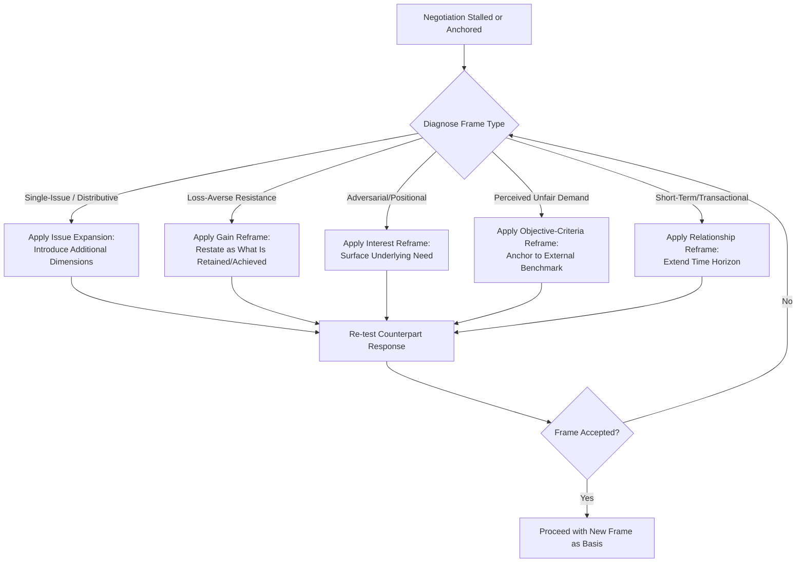

## Framing and Reframing Proposals

### Overview

Framing and reframing refer to the deliberate structuring of how a proposal, issue, or outcome is presented and interpreted, independent of its underlying substantive content. Framing theory holds that identical objective terms can produce materially different acceptance rates, perceived fairness, and negotiated outcomes depending on how they are linguistically and conceptually packaged. Reframing is the active, mid-negotiation technique of shifting an established frame — either one's own initial framing or a counterpart's imposed frame — to unlock movement when a negotiation has stalled around a particular interpretation of the issue.

### Theoretical Foundations

**Prospect Theory (Kahneman & Tversky, 1979)**

Prospect theory is the foundational behavioral-economic basis for framing effects in negotiation. Its central finding is that people evaluate outcomes relative to a reference point as gains or losses, rather than in terms of absolute final states, and that **losses loom larger than equivalent gains** (loss aversion, typically estimated at a ratio of roughly 2:1 to 2.5:1 in magnitude of psychological impact). Consequently, an identical outcome framed as a "loss" relative to a reference point generates more resistance and risk-seeking behavior than the same outcome framed as a "gain."

**The Asian Disease Problem (Tversky & Kahneman, 1981)** is the canonical experimental demonstration: identical mortality outcomes framed in terms of lives "saved" (gain frame) versus lives "lost" (loss frame) produced sharply different risk preferences among respondents, despite mathematically identical expected outcomes. This result generalizes directly to negotiation: framing a concession as "you keep 90% of X" versus "you give up 10% of X" can produce different acceptance rates for the mathematically identical term.

**Reference Point Dependence**

Because gain/loss evaluation depends on a reference point, negotiators can strategically shape which reference point a counterpart uses. Common reference points include: the status quo, a prior offer, an industry benchmark, the counterpart's own initial anchor, or a hypothetical "worst case." Shifting the salient reference point is one of the core mechanisms of reframing.

**Frame Types Relevant to Negotiation**

| Frame Dimension | Poles | Effect |
| --- | --- | --- |
| Gain vs. Loss | "You gain X" vs. "You avoid losing X" | Loss frames typically increase risk-seeking/resistance; gain frames increase risk-aversion/acceptance |
| Individual vs. Relational | "What's best for you" vs. "What's best for our partnership" | Shifts perceived stakes and time horizon |
| Positional vs. Interest-based | "I want $X" vs. "I need to cover cost Y" | Shifts conversation from zero-sum to problem-solving |
| Competitive vs. Collaborative | "Win/lose" vs. "Joint problem-solving" | Shifts negotiator behavior toward distributive vs. integrative tactics |
| Short-term vs. Long-term | "This deal" vs. "Our multi-year relationship" | Changes weight given to immediate concessions vs. relationship capital |
| Absolute vs. Comparative | "$50,000" vs. "20% below market rate" | Changes perceived fairness via anchoring to an external benchmark |

### Framing Mechanisms

**1. Attribute Framing**

Describing a single attribute of an option in either positive or negative terms.

**Example**

> "This contract has a 95% on-time delivery rate" vs. "This contract has a 5% late-delivery rate" — mathematically identical, but the positive-attribute frame generally produces more favorable evaluations.

**2. Goal Framing**

Describing the consequence of an action/inaction in terms of the goal achieved or the goal forfeited.

**Example**

> "Signing today locks in this rate" (gain/achievement frame) vs. "If you don't sign today, you lose this rate" (loss/forfeiture frame).

**3. Risky-Choice Framing**

Framing an option's risk profile in terms of what stands to be gained or lost relative to a certain alternative, directly invoking prospect theory's core mechanism.

**4. Contractive vs. Expansive Framing**

Contractive framing narrows the issue to a single dimension (typically price), which tends to produce distributive, zero-sum dynamics. Expansive framing broadens the issue to include multiple dimensions (price, timeline, service level, relationship value), which creates room for integrative trade-offs.

### Reframing as a Tactical Intervention

Reframing is invoked specifically when a negotiation has become anchored to an unproductive frame — commonly a purely distributive, single-issue (usually price-only) frame, or an adversarial frame that has triggered defensive positioning.

**Common Reframing Techniques**

- **Issue Expansion**: Converting a single-issue negotiation into a multi-issue one to enable trade-offs (logrolling). "Rather than just discussing price, let's also look at delivery timeline and payment terms together."
- **Interest Reframing**: Restating a stated position in terms of the underlying interest it serves, often used in conjunction with active listening/labeling techniques. "It sounds like the real concern is cash flow timing, not the total contract value."
- **Time-Horizon Reframing**: Shifting the frame from a single transaction to an ongoing relationship. "If we think about this as the first of several projects together rather than a one-off, does the calculus change?"
- **Fairness/Norm Reframing**: Introducing an external, legitimate benchmark or standard to reframe a number from "arbitrary demand" to "objective criterion" (a core technique in Fisher & Ury's principled negotiation — "insist on objective criteria").
- **Cost-of-Delay Reframing**: Converting an abstract deadline into a concrete loss frame. "Every week this slips costs approximately $X in delayed revenue" — this leverages loss aversion to increase urgency.
- **Reciprocity Reframing**: Recasting a request as part of a mutual exchange rather than a unilateral demand. "If we can move on the delivery date, would you be able to move on the payment terms?"

**Reframing Decision Flow**

### Framing Effects Diagram (svg_diagram)

<svg viewBox="0 0 700 380" xmlns="http://www.w3.org/2000/svg">
<text x="350" y="30" font-family="Arial, sans-serif" font-size="17" font-weight="bold" text-anchor="middle" fill="#1a1a2e">Gain vs. Loss Framing of an Identical Outcome (svg_diagram)</text>
<line x1="100" y1="330" x2="600" y2="330" stroke="#333333" stroke-width="2"/>
<text x="350" y="355" font-family="Arial, sans-serif" font-size="12" text-anchor="middle" fill="#333333">Reference Point (Status Quo)</text>
<!-- Gain frame side -->
<rect x="120" y="150" width="200" height="70" rx="8" fill="#3f7a4f"/>
<text x="220" y="180" font-family="Arial, sans-serif" font-size="13" font-weight="bold" text-anchor="middle" fill="#ffffff">Gain Frame</text>
<text x="220" y="198" font-family="Arial, sans-serif" font-size="11" text-anchor="middle" fill="#ffffff">"You retain 90% of budget"</text>
<line x1="220" y1="220" x2="220" y2="330" stroke="#3f7a4f" stroke-width="3" stroke-dasharray="4,3"/>
<text x="220" y="270" font-family="Arial, sans-serif" font-size="20" text-anchor="middle" fill="#3f7a4f">↓</text>
<text x="220" y="300" font-family="Arial, sans-serif" font-size="11" text-anchor="middle" fill="#3f7a4f">Higher acceptance,</text>
<text x="220" y="315" font-family="Arial, sans-serif" font-size="11" text-anchor="middle" fill="#3f7a4f">risk-averse response</text>
<!-- Loss frame side -->
<rect x="380" y="150" width="200" height="70" rx="8" fill="#a13f3f"/>
<text x="480" y="180" font-family="Arial, sans-serif" font-size="13" font-weight="bold" text-anchor="middle" fill="#ffffff">Loss Frame</text>
<text x="480" y="198" font-family="Arial, sans-serif" font-size="11" text-anchor="middle" fill="#ffffff">"You give up 10% of budget"</text>
<line x1="480" y1="220" x2="480" y2="330" stroke="#a13f3f" stroke-width="3" stroke-dasharray="4,3"/>
<text x="480" y="270" font-family="Arial, sans-serif" font-size="20" text-anchor="middle" fill="#a13f3f">↓</text>
<text x="480" y="300" font-family="Arial, sans-serif" font-size="11" text-anchor="middle" fill="#a13f3f">Higher resistance,</text>
<text x="480" y="315" font-family="Arial, sans-serif" font-size="11" text-anchor="middle" fill="#a13f3f">risk-seeking response</text>

<text x="350" y="100" font-family="Arial, sans-serif" font-size="12" font-style="italic" text-anchor="middle" fill="`#555555`">Mathematically identical outcome — divergent behavioral response</text>

<text x="350" y="120" font-family="Arial, sans-serif" font-size="11" text-anchor="middle" fill="`#555555`">(per Prospect Theory, Kahneman & Tversky, 1979)</text>

</svg>

### Framing and Anchoring Interaction

Framing interacts closely with anchoring effects (Galinsky & Mussweiler, 2001): the frame in which a first offer is presented affects not only its numerical anchoring power but also its perceived legitimacy and the counterpart's emotional response to it. A first offer framed with objective justification ("This figure reflects the current market rate per the attached industry report") tends to be perceived as more legitimate than an unjustified identical figure, potentially increasing both its anchoring effect and the counterpart's willingness to engage constructively rather than react defensively.

### Common Pitfalls

- **Over-framing / manipulation perception**: Excessive or transparent reframing can be perceived as manipulative rather than genuinely collaborative, damaging trust and triggering reactance (a psychological tendency to resist perceived persuasion attempts).
- **Frame mismatch with counterpart values**: A relationship-based reframe will not land with a counterpart who is structurally transactional (e.g., a one-time procurement decision with no repeat-business prospect) — frame selection should be diagnosed against the counterpart's actual context, not applied formulaically.
- **Ignoring an established counter-frame**: Failing to explicitly address a counterpart's dominant frame before introducing a new one can result in the new frame being dismissed as irrelevant; effective reframing typically first acknowledges the existing frame before pivoting.
- **Conflating reframing with dishonesty**: Reframing should alter the presentation and salient reference point of true information, not misrepresent facts; using it to obscure materially relevant information raises both ethical and, in many contexts, legal concerns (e.g., misrepresentation in contract law). [Inference — the line between legitimate persuasive framing and impermissible misrepresentation is context- and jurisdiction-dependent, and negotiators should exercise judgment rather than treat all framing as costlessly permissible]

### Integration with Broader Negotiation Strategy

- **Active Listening**: Diagnostic questioning and labeling (see *Active Listening and Diagnostic Questioning*) are typically used to identify which frame a counterpart currently holds before attempting a reframe.
- **Integrative Bargaining**: Issue-expansion reframing is a direct enabler of logrolling and value-creation, converting single-issue distributive negotiations into multi-issue integrative ones.
- **Objective Criteria (Principled Negotiation)**: Fairness/norm reframing operationalizes Fisher and Ury's prescription to "insist on objective criteria" as a means of depersonalizing distributive conflict.
- **Concession Strategy**: The framing of concessions (e.g., presenting a concession as a reciprocal exchange rather than unilateral capitulation) affects the counterpart's perceived obligation to reciprocate, linking framing to reciprocity norms studied in social psychology (Cialdini's principles of influence).

### Practical Application Framework

1. **Diagnose the current frame**: Identify whether the negotiation is currently anchored on a single issue, an adversarial stance, a short time horizon, or a loss-salient reference point.
2. **Select a reframing technique** matched to the diagnosed frame (issue expansion for single-issue stalls, gain reframing for loss-averse resistance, relationship reframing for transactional rigidity).
3. **Acknowledge before pivoting**: Explicitly validate the counterpart's existing frame before introducing the alternative, to avoid the appearance of dismissiveness.
4. **Introduce the new frame using calibrated, non-confrontational language**, often paired with an open-ended question to invite the counterpart's engagement with the new frame rather than imposing it unilaterally.
5. **Test and iterate**: Gauge the counterpart's response; if the new frame is rejected, return to diagnosis rather than repeating the same reframe with greater force.

**Related Topics**

- Prospect Theory and Loss Aversion in Negotiation
- Anchoring and First-Offer Strategy
- Verbal and Nonverbal Signals in Negotiation
- Active Listening and Diagnostic Questioning
- Integrative Bargaining and Logrolling
- Principled Negotiation and Objective Criteria
- Reciprocity and Influence Principles (Cialdini)
- Concession Strategy and Sequencing