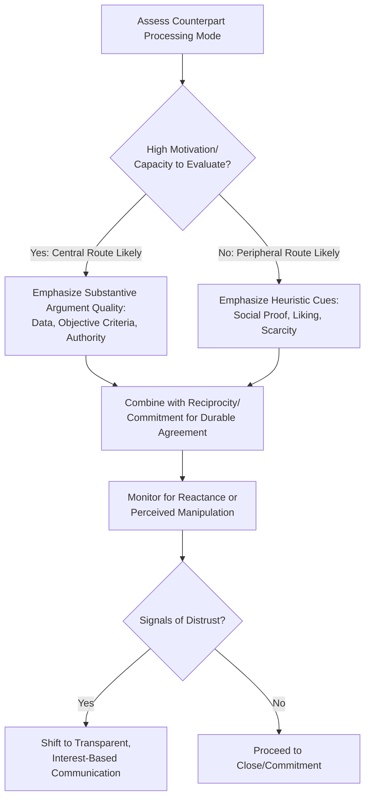

## Principles of Persuasion and Social Influence

### Overview

Persuasion and social influence constitute the body of psychological mechanisms by which one party shifts another's beliefs, attitudes, or behavior without recourse to coercion. In negotiation, these mechanisms operate alongside substantive bargaining (offers, concessions, trade-offs) as a parallel influence channel that shapes how proposals are received, how much resistance they generate, and how durable any resulting agreement is. This domain draws primarily from social psychology — most centrally Robert Cialdini's empirically derived principles of influence — as well as dual-process theories of persuasion (the Elaboration Likelihood Model) that explain when persuasive appeals succeed via careful reasoning versus superficial cues.

### Theoretical Foundations

**Dual-Process Persuasion: The Elaboration Likelihood Model (ELM)**

Petty and Cacioppo's Elaboration Likelihood Model (1986) proposes two distinct routes to attitude change:

- **Central route**: Persuasion via careful, effortful evaluation of argument quality and evidence. Attitude change via this route tends to be more durable and more predictive of behavior, but requires the audience to have both the motivation and cognitive capacity to engage in effortful processing.
- **Peripheral route**: Persuasion via superficial cues unrelated to argument substance — source credibility, likability, emotional appeal, or simple heuristics (e.g., "expensive things are good"). Attitude change via this route is faster to induce but generally less stable and more susceptible to reversal.

**Negotiation implication**: A counterpart under time pressure, high cognitive load, or low personal stake is more likely to process persuasive appeals peripherally, making Cialdini-style heuristic influence techniques more effective; a highly engaged, analytically-oriented counterpart evaluating a high-stakes decision is more likely to require central-route argumentation grounded in substantive evidence and objective criteria.

**Social Proof and Norm-Based Reasoning**

Much of social influence theory rests on the premise that individuals use the behavior and judgments of others as a heuristic shortcut for correct action, particularly under uncertainty (informational social influence, per Deutsch & Gerard, 1955) — a mechanism directly exploited by several of Cialdini's principles below.

### Cialdini's Six (Plus One) Principles of Influence

Robert Cialdini's *Influence: The Psychology of Persuasion* (1984, updated editions through 2021 adding a seventh principle) identifies the following empirically-supported influence principles, each directly applicable to negotiation contexts:

| Principle | Mechanism | Negotiation Application |
| --- | --- | --- |
| Reciprocity | Obligation to return a favor/concession | Making a modest first concession to trigger reciprocal movement |
| Commitment & Consistency | Desire to act consistently with prior stated commitments | Securing small agreements early to build toward larger ones |
| Social Proof | Inferring correct action from others' behavior | Citing comparable deals/precedents ("Most clients in your position choose...") |
| Liking | Greater influence from people we like/relate to | Rapport-building, finding genuine similarity, sincere compliments |
| Authority | Deference to perceived expertise/legitimacy | Citing credentials, data sources, or objective third-party standards |
| Scarcity | Higher perceived value for limited availability | "This pricing is only available if we finalize by end of quarter" |
| Unity (added 2016/2021) | Influence increases with shared identity ("we-ness") | Framing counterpart as part of the same in-group ("we're both trying to solve this") |

**1. Reciprocity**

The norm of reciprocity is one of the most robust findings in social psychology: receiving something (a gift, concession, favor, or piece of information) creates a felt obligation to return comparable value. In negotiation, this underlies the **door-in-the-face technique** (an initial large request, followed by a smaller "concession" request that appears more reasonable by contrast and reciprocity) and the practice of making an early, modest unilateral concession to invite reciprocal movement from the counterpart.

[Inference — reciprocity-based tactics can backfire if the initial "concession" is perceived as manufactured or insincere rather than genuine, triggering reactance instead of obligation]

**2. Commitment and Consistency**

People experience psychological pressure to behave consistently with commitments they have previously made, especially public or written ones (per Cialdini's research and the earlier foot-in-the-door literature, Freedman & Fraser, 1966). In negotiation, this underlies the practice of securing small, low-stakes agreements early (e.g., agreement on process, agenda, or minor terms) to build momentum toward larger substantive agreement, and the technique of restating a counterpart's own prior stated goals back to them when proposing a solution aligned with those goals.

**3. Social Proof**

Individuals are more likely to accept a proposal if they believe similar others have accepted comparable terms, particularly under ambiguity about what constitutes a "fair" or "normal" outcome. In negotiation, this is operationalized through references to industry benchmarks, comparable transactions, or common practice ("This payment structure is standard for contracts of this size").

**4. Liking**

Influence increases with rapport, perceived similarity, and genuine positive affect between parties. Documented antecedents of liking include physical/behavioral similarity, cooperation toward shared goals, genuine (non-manipulative) compliments, and increased contact/familiarity (mere-exposure effect, Zajonc, 1968). In negotiation, rapport-building in early relationship-establishment phases functions partly through this mechanism.

**5. Authority**

Deference to perceived legitimate expertise or credentialed sources increases persuasive impact independent of the underlying argument quality (demonstrated experimentally, notably in Milgram's obedience studies, though that research addressed a different — more extreme — behavioral domain). In negotiation, this underlies the strategic use of third-party data, expert citations, and objective benchmarks (which also serves the "objective criteria" function in principled negotiation).

**6. Scarcity**

Perceived value increases when availability is perceived as limited, time-bound, or exclusive — a mechanism linked to loss aversion (prospect theory) since scarcity frames an opportunity in terms of a potential future loss (missing the window) rather than a gain. In negotiation, this underlies deadline-based tactics ("this offer expires Friday") and exclusivity framing ("we're only presenting this to two vendors").

[Unverified as an ethically-neutral tactic in all applications — artificially manufactured scarcity claims that are factually false constitute misrepresentation in many jurisdictions and raise distinct ethical concerns from genuine scarcity constraints]

**7. Unity**

Added in Cialdini's later work, unity is distinguished from mere liking by invoking shared identity ("we") rather than mere similarity or affinity — e.g., shared membership in a family, community, team, or organization. In negotiation, framing the counterpart and negotiator as jointly facing a shared problem (rather than opposing each other) invokes unity to reduce adversarial framing, closely related to relational reframing techniques.

### Influence Principle Application Flow

### Ethical Boundaries in Persuasive Influence

The line between legitimate persuasion and manipulation is a recurring concern in negotiation ethics literature:

- **Legitimate influence**: Uses accurate information, genuine rapport, real scarcity/deadlines, and authentic reciprocal exchange to help a counterpart arrive at a decision aligned with their own interests once fully informed.
- **Manipulative influence**: Uses fabricated scarcity, false authority claims, manufactured urgency, or insincere reciprocity to induce agreement that would not survive full information disclosure.
- **Practical heuristic**: A commonly cited test in negotiation ethics is whether the tactic would remain effective, and whether the negotiator would be comfortable using it, if the counterpart were fully aware the tactic was being deployed — genuine influence principles generally pass this test; deceptive applications generally do not. [Inference — this transparency heuristic is a widely-used ethical guideline in negotiation training but is not a formal legal standard, and actual legal exposure for misrepresentation varies by jurisdiction and contract type]

### Common Pitfalls

- **Overuse triggering reactance**: Heavy-handed or repeated application of a single influence principle (especially scarcity or authority) can trigger psychological reactance — an oppositional response to perceived persuasion attempts — reducing rather than increasing compliance.
- **Principle misapplication by processing mode**: Applying peripheral-route tactics (e.g., simple social proof claims) to a highly analytical, high-stakes counterpart who is processing centrally can appear unsubstantive or even insulting, undermining credibility.
- **False scarcity/authority erosion**: Fabricated urgency or unsubstantiated authority claims that are later discovered severely damage trust and can permanently compromise a negotiating relationship, particularly in repeated-game contexts.
- **Neglecting reciprocity calibration**: Concessions offered to invoke reciprocity that are too small to register, or too large and perceived as suspicious, both fail to produce the intended reciprocal response.
- **Conflating liking with agreement**: Building strong rapport does not guarantee substantive concessions; over-reliance on the liking principle without addressing underlying interests can produce a pleasant but substantively unproductive negotiation.

### Integration with Broader Negotiation Frameworks

- **Framing and Reframing**: Scarcity and loss-based framings directly leverage prospect theory's loss-aversion mechanism (see *Framing and Reframing Proposals*).
- **Active Listening**: Genuine rapport-building (liking, unity) is substantially reinforced by active listening techniques (labeling, paraphrasing), which demonstrate authentic engagement rather than superficial affinity-signaling.
- **Objective Criteria (Principled Negotiation)**: The authority principle operationalizes the use of legitimate, verifiable external standards, aligning influence tactics with Fisher and Ury's prescription for objective, defensible criteria rather than raw positional pressure.
- **Anchoring**: Authority and social-proof framing of a first offer (citing market data or comparable transactions) can increase both the offer's perceived legitimacy and its anchoring power (Galinsky & Mussweiler, 2001).

### Practical Application Framework

1. **Diagnose processing mode**: Assess whether the counterpart is likely to engage centrally (high-stakes, analytical, time-rich) or peripherally (time-pressured, lower personal stake, delegated decision authority).
2. **Select principle(s) matched to context**: Use authority/social proof for central-route audiences requiring substantive justification; use liking/scarcity/unity for peripheral-route contexts or relationship-building phases.
3. **Verify authenticity before deployment**: Confirm that any scarcity, authority, or reciprocity claim used is factually accurate — apply the transparency heuristic (would this tactic survive full disclosure?).
4. **Sequence principles deliberately**: Commonly, liking/unity establish the relational foundation early, authority/social proof support substantive positions mid-negotiation, and reciprocity/scarcity are deployed tactically near closing.
5. **Monitor for reactance signals**: Watch for verbal/nonverbal resistance cues (see *Verbal and Nonverbal Signals in Negotiation*) indicating a tactic has been perceived as manipulative, and pivot toward transparent, interest-based communication if detected.

**Related Topics**

- Framing and Reframing Proposals
- Verbal and Nonverbal Signals in Negotiation
- Active Listening and Diagnostic Questioning
- Anchoring and First-Offer Strategy
- Ethics and Manipulation in Negotiation Tactics
- Reciprocity Norms and Concession Exchange
- Elaboration Likelihood Model and Argument Processing
- Trust-Building in Repeated Negotiation Contexts