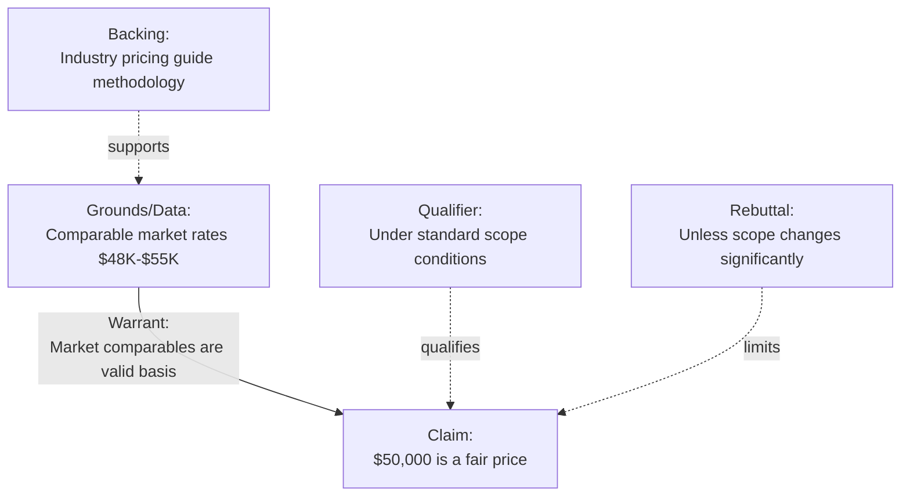
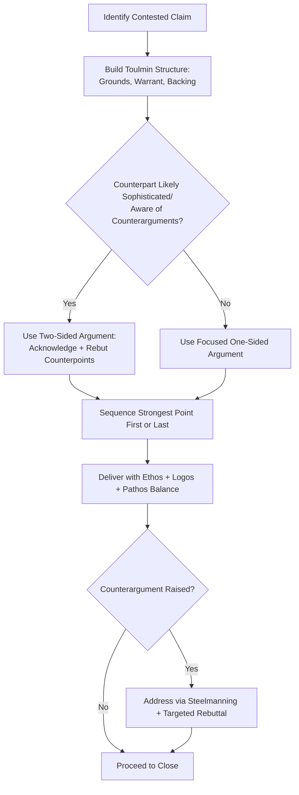

## Rhetorical and Argumentation Strategies

### Overview

Rhetorical and argumentation strategies concern the structural and stylistic construction of persuasive arguments in negotiation — distinct from the psychological influence principles covered under social influence (Cialdini-style heuristics), this domain focuses on the logical and rhetorical architecture of the argument itself: how claims are supported, sequenced, and defended, and how counterarguments are anticipated and neutralized. The foundational framework draws from classical rhetoric (Aristotle's modes of persuasion) and modern argumentation theory (Toulmin's model of argument structure), applied to the specific adversarial-collaborative context of negotiation.

### Theoretical Foundations

**Aristotelian Modes of Persuasion**

Aristotle's *Rhetoric* identifies three appeals that jointly constitute persuasive argument, all directly transferable to negotiation argumentation:

- **Ethos** (credibility/character): Persuasive force derived from the perceived trustworthiness, expertise, or authority of the speaker. In negotiation, ethos is built through demonstrated expertise, consistent track record, transparent dealing, and credible sourcing of claims.
- **Pathos** (emotional appeal): Persuasive force derived from engaging the audience's emotions or values. In negotiation, pathos operates through framing (see *Framing and Reframing Proposals*), narrative/storytelling, and appeals to shared values or relationship stakes.
- **Logos** (logical appeal): Persuasive force derived from the argument's internal logical structure and evidentiary support. In negotiation, logos operates through structured argumentation, data, objective criteria, and demonstrable cause-effect reasoning.

Effective negotiation argumentation typically integrates all three; over-reliance on logos alone (pure data/logic) can fail to move a counterpart whose resistance is emotionally or relationally grounded, while pathos or ethos alone without logical substantiation is vulnerable to being perceived as unsubstantiated pressure.

**Toulmin's Model of Argument**

Stephen Toulmin's model (*The Uses of Argument*, 1958) decomposes an argument into six interrelated components, providing a structural framework for constructing and stress-testing negotiation arguments:

| Component | Function | Negotiation Example |
| --- | --- | --- |
| Claim | The assertion being argued for | "Our price of $50,000 is fair for this scope" |
| Grounds (Data) | Evidence supporting the claim | "Comparable projects in this market range from $48,000–$55,000" |
| Warrant | The logical link connecting grounds to claim | "Market comparables are a valid basis for fair pricing" |
| Backing | Support for the warrant itself | "This is standard practice per industry pricing guides" |
| Qualifier | Degree of certainty attached to the claim | "In most cases," "typically," "under standard conditions" |
| Rebuttal | Conditions under which the claim would not hold | "Unless the scope changes significantly" |

**Toulmin Argument Structure**

Constructing negotiation arguments explicitly against this structure helps identify weak points before presentation: a claim with strong grounds but an unstated or weak warrant is vulnerable to a counterpart simply challenging the underlying logical connection rather than the data itself.

### Argumentation Strategies in Negotiation

**1. Building the Case (Constructive Argumentation)**

- **Evidence-first sequencing**: Presenting grounds/data before stating the claim explicitly, allowing the counterpart to arrive at (or feel they arrived at) the conclusion independently — generally perceived as less confrontational than claim-first assertion.
- **Multiple independent grounds**: Supporting a single claim with several independent lines of evidence (e.g., market data, cost analysis, and precedent) increases robustness, since a counterpart challenging one line of support does not undermine the claim entirely.
- **Objective criteria anchoring**: Explicitly grounding claims in externally verifiable standards (Fisher & Ury's "insist on objective criteria") shifts the discussion from a battle of wills to a joint evaluation of legitimate benchmarks, reducing positional entrenchment.

**2. Anticipating and Neutralizing Counterarguments**

- **Inoculation strategy**: Proactively raising and addressing the strongest anticipated counterargument before the counterpart raises it, which research on persuasion (McGuire's inoculation theory, 1961) suggests can strengthen resistance to the counterargument when it's later encountered from another source, and demonstrates confidence and thoroughness.
- **Steelmanning**: Explicitly articulating the counterpart's position in its strongest form before responding to it, which both demonstrates genuine understanding (supporting ethos) and forces rigor in the negotiator's own rebuttal.
- **Conditional rebuttal framing**: Building the rebuttal/qualifier component of the argument explicitly ("this holds unless X") rather than presenting the claim as unconditionally true, which increases perceived intellectual honesty and reduces the risk of the entire argument being dismissed if a single edge case is identified.

**3. Sequencing Strategies**

- **Foot-in-the-door argumentation**: Establishing agreement on smaller, less contested claims before building toward the primary contested claim, leveraging the consistency principle (see *Principles of Persuasion and Social Influence*).
- **Primacy and recency effects**: Argumentation and memory research suggests that information presented first (primacy) and last (recency) in a sequence is generally retained and weighted more heavily than information presented in the middle (serial position effect, originally documented by Murdock, 1962) — implying that the strongest argument should typically be placed either first or last in a multi-point case, not buried in the middle.
- **One-sided vs. two-sided arguments**: Research on message sidedness (Hovland, Lumsdaine & Sheffield, 1949) indicates that two-sided arguments (acknowledging counterpoints before rebutting them) are generally more persuasive to audiences who are already aware of counterarguments or are more sophisticated/skeptical, while one-sided arguments can be more effective with audiences less likely to encounter counterarguments elsewhere. [Inference — the relative effectiveness depends substantially on audience sophistication and prior exposure to counter-positions, and negotiators should calibrate to the specific counterpart rather than defaulting to one approach universally]

**4. Logical Fallacies to Recognize and Avoid**

| Fallacy | Description | Negotiation Manifestation |
| --- | --- | --- |
| False dichotomy | Presenting only two options when others exist | "Either you accept this price or we walk away" |
| Ad hominem | Attacking the person rather than the argument | Dismissing a counterpart's proposal by questioning their competence rather than its merits |
| Appeal to tradition | Arguing a practice is correct because it's customary | "We've always structured deals this way" without substantive justification |
| Slippery slope | Asserting an extreme consequence follows from a modest step | "If we agree to this exception, every future client will demand the same" without evidentiary support |
| Anchoring fallacy (irrelevant anchor) | Using an arbitrary, unjustified figure as if it carries evidentiary weight | Citing an inflated "list price" with no market basis purely to shift perception |
| Hasty generalization | Drawing broad conclusions from insufficient data | Generalizing counterpart behavior in one exchange to their entire negotiating character |

Recognizing these fallacies serves a dual purpose: avoiding their use (which can damage credibility/ethos if detected) and identifying their use by a counterpart (enabling a targeted, specific rebuttal rather than a vague or purely emotional pushback).

### Argumentation Strategy Selection Flow

### Common Pitfalls

- **Logos-only argumentation**: Relying exclusively on data and logical structure while ignoring relational or emotional dimensions of resistance, which can fail to move a counterpart whose objection is not primarily fact-based.
- **Overloading with grounds**: Presenting excessive volumes of supporting data can dilute the argument's clarity and invite the counterpart to focus on minor, tangential points rather than the core claim.
- **Unstated warrants**: Failing to make explicit the logical link between grounds and claim leaves the argument vulnerable to a counterpart simply rejecting the implicit connection, especially across differing cultural or professional reasoning norms.
- **Weaponized fallacies**: Deploying false dichotomies or slippery-slope arguments for short-term tactical advantage can succeed in a single exchange but tends to damage long-term credibility once identified, particularly costly in repeated-negotiation or relationship-preserving contexts.
- **Ignoring qualifier/rebuttal components**: Presenting claims as universally and unconditionally true invites easy refutation via a single counterexample; explicitly scoping claims (qualifiers) pre-empts this vulnerability.

### Integration with Broader Negotiation Frameworks

- **Framing and Reframing**: Pathos-based argumentation frequently operates through the framing mechanisms covered separately (gain/loss framing, relationship framing); rhetorical strategy and framing strategy are complementary rather than independent tools.
- **Principles of Persuasion**: Ethos-building overlaps substantially with Cialdini's authority and liking principles; logos-based argumentation overlaps with the "central route" of the Elaboration Likelihood Model.
- **Active Listening**: Steelmanning a counterpart's position draws directly on active listening and paraphrasing skill to ensure the represented position is accurate before rebuttal.
- **Objective Criteria (Principled Negotiation)**: Toulmin's backing and warrant components operationalize the rigor required to make an "objective criteria" claim substantively defensible rather than merely asserted.

### Practical Application Framework

1. **Decompose the core claim** into Toulmin components (grounds, warrant, backing, qualifier, rebuttal) before presenting it, to identify and shore up weak links in advance.
2. **Diagnose counterpart sophistication and likely counterarguments**; select one-sided or two-sided argument structure accordingly.
3. **Sequence supporting points** with the strongest argument placed first or last, leveraging serial position effects.
4. **Balance ethos, pathos, and logos** deliberately rather than defaulting to a single mode, calibrated to the counterpart's apparent decision style (analytical vs. relational).
5. **Prepare for anticipated rebuttals** via inoculation (proactively addressing the strongest counterargument) and steelmanning (representing the counterpart's position accurately before responding).

**Related Topics**

- Framing and Reframing Proposals
- Principles of Persuasion and Social Influence
- Active Listening and Diagnostic Questioning
- Principled Negotiation and Objective Criteria
- Verbal and Nonverbal Signals in Negotiation
- Logical Fallacies in Adversarial Communication
- Anchoring and First-Offer Strategy
- Ethics and Manipulation in Negotiation Tactics