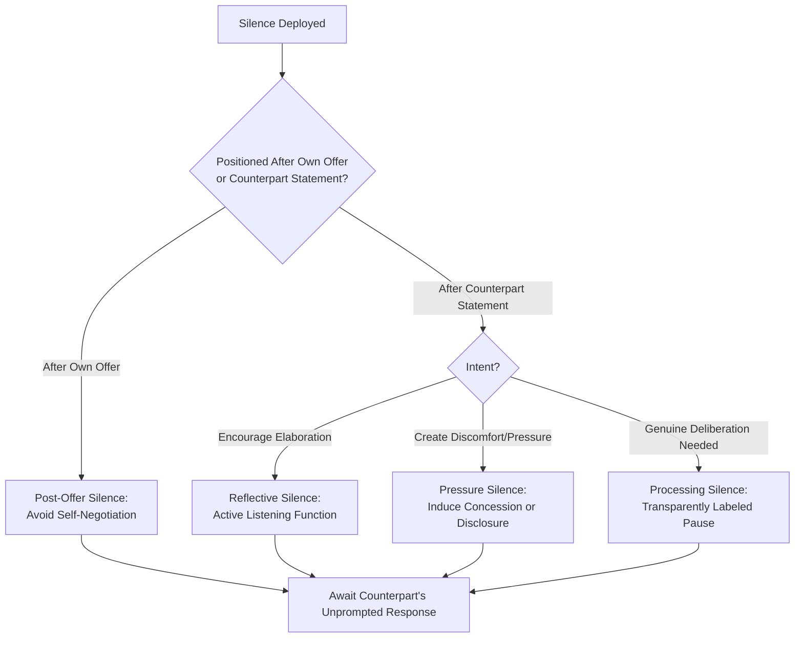

## The Strategic Use of Silence and Pacing

### Overview

Silence and pacing refer to the deliberate management of conversational timing — the presence or absence of speech, the duration of pauses, and the tempo at which a negotiation proceeds — as active tactical instruments rather than incidental byproducts of conversation. While briefly touched on as a component of verbal signaling and active listening in earlier topics, this domain treats timing itself as a primary lever: silence and pacing can extract information, exert psychological pressure, regulate emotional escalation, and shape the overall rhythm of concession-making across a negotiation.

### Theoretical Foundations

**Conversational Norms and the Discomfort of Silence**

Sociolinguistic research on turn-taking (notably Sacks, Schegloff & Jefferson's conversation analysis framework, 1974) establishes that conversation is governed by tightly-timed turn-taking norms, with typical response latencies in ordinary conversation on the order of a few hundred milliseconds to roughly a second across studied languages. Silences exceeding this expected window are experienced as socially marked and often uncomfortable — a phenomenon negotiators can exploit, since the party less tolerant of the discomfort is more likely to break the silence, often by volunteering additional information or a concession.

**Cognitive Load and Pacing**

Pacing affects the cognitive resources available for careful (central-route) processing of an offer. Rapid pacing (fast sequential offers, quick demands for response) increases cognitive load and time pressure, which behavioral decision research links to increased reliance on heuristic (peripheral-route) processing and, in some conditions, more concessive or risk-averse responses under pressure. Slower, deliberate pacing allows fuller cognitive engagement, which tends to produce more stable and carefully-reasoned commitments, at the cost of potentially longer negotiation duration.

**Silence as an Information-Extraction Mechanism**

As introduced under active listening, reflective silence following a counterpart's statement frequently prompts continued disclosure — a phenomenon attributable to the conversational norm that a pause implicitly signals "more is expected" or invites elaboration, particularly when the listener has otherwise demonstrated attentive engagement (attending behavior).

### Functions of Silence in Negotiation

**1. Post-Offer Silence**

Deliberately withholding verbal response immediately after presenting or receiving an offer.

**Example**

> Negotiator states: "Our offer is $85,000, inclusive of installation and a 12-month warranty." [Deliberate pause, no immediate elaboration or justification added]

Function: avoids the common tendency to "negotiate against oneself" by nervously qualifying or justifying an offer before the counterpart has responded — a well-documented pitfall where a negotiator, uncomfortable with silence, adds unsolicited concessions before the counterpart has even reacted.

**2. Reflective Silence (Listening-Oriented)**

Pausing after a counterpart finishes speaking, before responding, signals that their statement is being genuinely considered rather than met with a pre-formed rebuttal — supporting the active-listening functions of encouraging elaboration and demonstrating engagement (see *Active Listening and Diagnostic Questioning*).

**3. Pressure Silence**

Extended silence following a demand or an aggressive statement, used to create social discomfort that the counterpart may resolve by softening their position, elaborating their reasoning (yielding diagnostic information), or offering a concession preemptively.

[Inference — the effectiveness of pressure silence is highly dependent on cultural context and individual tolerance for silence; in high-context cultures where silence carries different conventional meaning (e.g., signaling respect or contemplation rather than discomfort), this tactic may not produce the intended pressure effect and could be misread entirely]

**4. Processing Silence**

A pause explicitly framed as needed time for genuine consideration ("Let me think about that for a moment") — distinct from pressure silence in that it is transparently labeled, reducing the risk of being perceived as a manipulative tactic while still providing the cognitive-load benefits of slower pacing.

### Silence Function Map

### Pacing Strategies

**1. Deliberate Slowing**

Extending the overall tempo of the negotiation — longer intervals between offers, explicit requests for time to consult or review, scheduled breaks — to reduce time pressure, allow fuller information processing, and de-escalate emotional arousal in tense moments.

**Applications**:

- Requesting a recess after receiving an unexpectedly aggressive counteroffer, allowing emotional regulation before responding (directly supporting the self-management component of signal management, see *Verbal and Nonverbal Signals in Negotiation*).
- Introducing structured multi-session negotiation formats for complex, high-stakes deals rather than compressing decision-making into a single session.

**2. Deliberate Acceleration**

Compressing available response time to increase pressure and reduce a counterpart's opportunity for careful deliberation or external consultation.

**Applications and risks**:

- Time-limited offers ("this price holds until end of day") leverage both pacing pressure and the scarcity principle of influence (see *Principles of Persuasion and Social Influence*).
- [Unverified as reliably beneficial to negotiation quality — while acceleration can increase short-term compliance, research on decision-making under time pressure suggests it can also produce lower-quality, less durable agreements, buyer's/seller's remorse, and damaged trust if the counterpart perceives the pressure as manufactured or unfair]

**3. Rhythmic Concession Pacing**

The tempo and spacing at which sequential concessions are made carries signal value independent of their magnitude (related to concession-pattern signaling in distributive bargaining): rapid, closely-spaced concessions tend to signal weak resolve or an inflated initial anchor, while slow, evenly-spaced, diminishing concessions tend to signal a negotiator approaching a genuine limit.

**Concession Pacing Signal Comparison**

<svg xmlns="http://www.w3.org/2000/svg" viewBox="0 0 700 380">
<text x="350" y="30" font-family="Arial, sans-serif" font-size="16" font-weight="bold" text-anchor="middle" fill="#1a1a2e">Concession Pacing Patterns and Signal Value (svg_diagram)</text>
<line x1="80" y1="330" x2="650" y2="330" stroke="#333333" stroke-width="1.5" />
<line x1="80" y1="330" x2="80" y2="80" stroke="#333333" stroke-width="1.5" />
<text x="40" y="90" font-family="Arial, sans-serif" font-size="11" fill="#333333">Price</text>
<text x="360" y="360" font-family="Arial, sans-serif" font-size="11" fill="#333333">Successive Rounds →</text>

<polyline points="100,120 200,180 300,230 400,260" fill="none" stroke="#a13f3f" stroke-width="3" />
<circle cx="100" cy="120" r="4" fill="#a13f3f" />
<circle cx="200" cy="180" r="4" fill="#a13f3f" />
<circle cx="300" cy="230" r="4" fill="#a13f3f" />
<circle cx="400" cy="260" r="4" fill="#a13f3f" />
<text x="420" y="255" font-family="Arial, sans-serif" font-size="11" fill="#a13f3f">Rapid, large steps —</text>
<text x="420" y="270" font-family="Arial, sans-serif" font-size="11" fill="#a13f3f">signals weak resolve</text>

<polyline points="100,140 250,175 400,195 550,205" fill="none" stroke="#3f7a4f" stroke-width="3" />
<circle cx="100" cy="140" r="4" fill="#3f7a4f" />
<circle cx="250" cy="175" r="4" fill="#3f7a4f" />
<circle cx="400" cy="195" r="4" fill="#3f7a4f" />
<circle cx="550" cy="205" r="4" fill="#3f7a4f" />
<text x="470" y="190" font-family="Arial, sans-serif" font-size="11" fill="#3f7a4f">Slow, diminishing steps —</text>
<text x="470" y="205" font-family="Arial, sans-serif" font-size="11" fill="#3f7a4f">signals approaching true limit</text>

<text x="350" y="70" font-family="Arial, sans-serif" font-size="11" font-style="italic" text-anchor="middle" fill="`#555555`">Same total concession magnitude, different pacing — different inferred resolve</text>

</svg>

### Silence and Pacing in Cross-Cultural Context

As with nonverbal signaling generally, the conventional meaning and comfort threshold for silence varies substantially by culture:

- In several East Asian negotiation traditions, extended silence during deliberation is a normative, expected part of respectful consideration rather than a tactical pressure device or a sign of discomfort/impasse.
- In many North American and Western European business contexts, silence beyond a brief pause is more frequently interpreted as awkward, unresolved tension, or an implicit prompt requiring a verbal response.
- **Practical implication**: negotiators should calibrate their interpretation of a counterpart's silence, and their expectations for how their own silence will be read, against the counterpart's cultural context rather than assuming a universal convention. [Inference — this is a widely-cited caution in cross-cultural negotiation training, though the degree of variation for any specific individual counterpart cannot be assumed from cultural background alone and should be validated through direct observation]

### Common Pitfalls

- **Self-negotiation via discomfort with silence**: Filling a post-offer silence with unsolicited justification, hedging, or a premature additional concession before the counterpart has responded — one of the most commonly cited tactical errors in negotiation training.
- **Misreading cultural silence as impasse**: Interpreting a counterpart's culturally-normative deliberative silence as rejection or disengagement, and consequently making an unnecessary unilateral concession to "rescue" the negotiation.
- **Overuse of pressure silence**: Repeated or prolonged use of pressure silence can shift from productive tension into perceived hostility or gamesmanship, risking relationship damage, particularly if detected as a deliberate tactic rather than natural conversational rhythm.
- **Accelerated pacing producing regret**: Rushing a counterpart to decision under artificial time pressure can produce agreement that is later regretted or contested, undermining durability and trust in repeated-negotiation contexts.
- **Ignoring one's own pacing needs**: Failing to request a pause or recess when experiencing emotional escalation, leading to reactive, poorly-considered responses under arousal — a risk directly connected to the emotional-regulation component of signal management.

### Integration with Broader Negotiation Frameworks

- **Active Listening**: Reflective silence is one of the core techniques within the active-listening toolkit, directly supporting elaboration and disclosure (see *Active Listening and Diagnostic Questioning*).
- **Verbal and Nonverbal Signals**: Pause duration and response latency are themselves paralinguistic signals subject to the same congruence/incongruence analysis applied to other nonverbal channels.
- **Principles of Persuasion**: Deliberate acceleration and time-limited offers directly operationalize the scarcity principle of influence.
- **Concession Strategy**: Pacing of sequential concessions is a core input to a counterpart's inference about a negotiator's resolve and proximity to their reservation price, linking directly to distributive bargaining signal theory.

### Practical Application Framework

1. **Pre-commit to silence discipline**: Before high-stakes offers, deliberately plan to remain silent after stating the offer, resisting the urge to add unsolicited justification.
2. **Calibrate pacing to counterpart cultural and individual norms**: Observe early interactions to gauge the counterpart's baseline conversational tempo and silence tolerance before deploying pressure silence tactically.
3. **Use labeled processing pauses** when genuine deliberation time is needed, to capture pacing benefits without ambiguity about intent.
4. **Design concession pacing deliberately**: Plan the sequence and spacing of anticipated concessions in advance so that pacing signals the intended resolve level rather than emerging reactively.
5. **Build in recess options**: Establish in advance (where appropriate) the ability to call a break during high-arousal moments, supporting emotional regulation and preventing reactive pacing errors.

**Related Topics**

- Verbal and Nonverbal Signals in Negotiation
- Active Listening and Diagnostic Questioning
- Principles of Persuasion and Social Influence
- Concession Strategy and Sequencing
- Distributive Bargaining and Signal Theory
- Cross-Cultural Negotiation Frameworks
- Emotional Regulation in High-Stakes Negotiation
- Anchoring and First-Offer Strategy