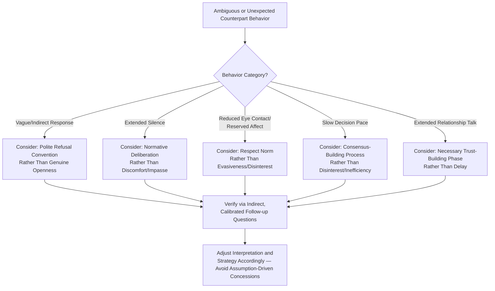

## Cross-Cultural Communication Pitfalls

### Overview

Cross-cultural communication pitfalls encompass the systematic misunderstandings and negotiation failures that arise when negotiators apply culturally-specific communication norms, assumptions, and interpretive frameworks to counterparts operating under different cultural conventions. This topic synthesizes and extends themes introduced across prior sections (nonverbal signal interpretation, silence conventions, framing) into a dedicated risk-management framework, drawing primarily on cross-cultural psychology (Hofstede's cultural dimensions, Hall's context theory) and international negotiation research.

### Theoretical Foundations

**Hofstede's Cultural Dimensions Theory**

Geert Hofstede's empirical research (originally derived from IBM employee surveys across dozens of countries, later extended) identifies dimensions along which national cultures systematically differ, several of which map directly onto negotiation-relevant behavior:

| Dimension | Description | Negotiation Relevance |
| --- | --- | --- |
| Power Distance | Acceptance of unequal power distribution | Affects who has authority to make binding commitments, deference to hierarchy in the room |
| Individualism vs. Collectivism | Priority on individual vs. group goals | Affects decision-making speed (individual authority vs. group consensus), framing effectiveness (personal vs. relational appeals) |
| Uncertainty Avoidance | Tolerance for ambiguity and risk | Affects preference for detailed contracts vs. relational trust, pace of decision-making |
| Masculinity vs. Femininity | Competitive/assertive vs. cooperative/consensus-oriented value orientation | Affects preferred negotiation style (distributive/competitive vs. integrative/cooperative) |
| Long-Term vs. Short-Term Orientation | Value placed on long-term relationship vs. immediate outcome | Affects willingness to accept short-term suboptimal terms for long-term relationship value |

[Inference — Hofstede's dimensions describe statistical tendencies at the national/aggregate level and carry substantial within-country variance; applying dimension scores as a deterministic prediction of any specific individual counterpart's behavior is a well-documented overgeneralization risk, sometimes termed the "ecological fallacy" in cross-cultural research criticism]

**Hall's High-Context vs. Low-Context Framework**

Edward T. Hall's distinction (*Beyond Culture*, 1976) categorizes cultures by their reliance on explicit verbal communication versus shared context, relationship history, and nonverbal cues:

- **High-context cultures** (commonly cited examples include many East Asian, Middle Eastern, and Latin American business contexts): meaning is substantially conveyed through context, relationship, tone, and nonverbal cues; direct verbal refusal or disagreement is often avoided in favor of indirect signaling.
- **Low-context cultures** (commonly cited examples include the United States, Germany, and Scandinavian countries): meaning is conveyed primarily through explicit, direct verbal statements; ambiguity is generally minimized rather than relied upon.

[Unverified as a strict binary — most cross-cultural communication scholars treat high/low context as a continuum rather than a discrete categorization, and many cultures exhibit substantial internal variation across regions, industries, and generational cohorts]

### Category 1: Directness and Refusal Pitfalls

**The Problem**: In many high-context cultures, an explicit verbal "no" is considered impolite or relationship-damaging; refusal is instead communicated through indirect signals — vague affirmation ("I will consider it," "this is difficult"), delayed response, or a change of subject.

**Common Pitfall**: A negotiator from a low-context background interprets an indirect, hedged, or delayed response as genuine openness or continued interest, when it functions conventionally as a polite refusal — leading to wasted follow-up effort, misjudged deal probability, or a perceived breach of trust when the "yes" never materializes.

**Example**

> Counterpart: "This will be difficult, but let us think about it further."
>
> Low-context misinterpretation: Genuine ongoing consideration, likely to result in agreement with further pushing.
>
> High-context conventional meaning (in many such contexts): A polite decline that avoids direct confrontation.

**Mitigation**: Calibrated, non-direct probing questions ("What would need to change for this to become easier?") rather than direct requests for a yes/no answer, allowing the counterpart to reveal position without violating politeness norms around direct refusal.

### Category 2: Silence and Pacing Misreading

As introduced under *The Strategic Use of Silence and Pacing*, silence duration and meaning vary substantially by culture.

**Common Pitfall**: A negotiator accustomed to low silence-tolerance norms interprets a counterpart's extended contemplative silence as discomfort, disagreement, or an impasse signal, and responds by unilaterally offering a concession to "break the tension" — when the counterpart's silence was in fact a normative, unhurried deliberation process carrying no negative signal at all.

**Mitigation**: Establish, ideally through preparation/research into the counterpart's cultural context (or direct early observation), the baseline conversational pacing and silence norms before attributing meaning to specific pauses.

### Category 3: Nonverbal Cue Misattribution

As introduced under *Verbal and Nonverbal Signals in Negotiation*, gestures, eye contact, and physical proximity norms vary substantially across cultures.

**Common Pitfalls**:

- Interpreting a counterpart's lack of sustained eye contact as evasiveness or dishonesty, when in the counterpart's cultural context, direct sustained eye contact with a senior counterpart or elder may be considered disrespectful.
- Misjudging appropriate interpersonal physical distance, causing a counterpart to unconsciously retreat (perceived as coldness) or feel crowded (perceived as aggression), depending on the mismatch direction.
- Misreading emotional expressiveness norms — cultures with more reserved public emotional display norms may be misjudged as disengaged or uninterested, while cultures with more expressive norms may be misjudged as being either enthusiastic-to-the-point-of-certain, or excessively emotional/unstable.

### Category 4: Decision-Making Authority and Pace Mismatches

**The Problem**: Power distance and individualism/collectivism dimensions affect who holds actual decision authority in the room and how quickly binding commitments can be made.

**Common Pitfalls**:

- A negotiator from a low power-distance, individualist context assumes the most vocal or senior-seeming counterpart present has full authority to conclude an agreement, when actual authority may rest with an absent, more senior figure, or require group consensus not achievable within the room.
- Impatience with what appears to be unnecessarily slow decision-making in collectivist/consensus-oriented contexts, leading to pressure tactics (accelerated pacing, deadline framing) that are perceived as disrespectful of legitimate group deliberation processes rather than as reasonable urgency.
- Underestimating the time required for internal consensus-building in hierarchical or collectivist organizational cultures, leading to unrealistic timeline expectations set at the outset of the negotiation.

**Mitigation**: Early, direct (but respectfully framed) diagnostic questioning about decision-making process and authority structure ("Who else will be involved in finalizing this?", "What does your typical approval process look like?") before assuming a given counterpart's unilateral authority.

### Category 5: Relationship-Building vs. Task-Orientation Mismatches

**The Problem**: Cultures vary in the expected proportion of interaction time devoted to relationship-building (rapport, social conversation, shared meals) versus direct task-focused negotiation.

**Common Pitfall**: A task-oriented negotiator perceives extended relationship-building time as inefficient delay from "real" negotiation, and attempts to accelerate directly to substantive terms — which, in relationship-emphasizing cultural contexts, can be perceived as disrespectful or transactionally cold, potentially undermining the trust foundation necessary for the counterpart to negotiate in good faith at all.

**Mitigation**: Building explicit time buffer for relationship establishment into negotiation planning and timeline expectations when operating in relationship-emphasizing cultural contexts, treating this time as a legitimate and necessary phase rather than overhead to be minimized.

### Cross-Cultural Pitfall Diagnostic Flow

### Common Meta-Pitfalls (Errors About the Errors)

- **Overgeneralization from cultural dimension scores**: Treating national-level cultural dimension data as a deterministic predictor of an individual counterpart's behavior, ignoring substantial within-culture variation across region, generation, industry, organizational culture, and individual personality. [Inference — this overgeneralization risk is well-documented in cross-cultural management research criticism of dimension-based frameworks, though the frameworks retain value as a starting hypothesis to be validated through direct observation]
- **Stereotyping under the guise of cultural competence**: Using cultural generalizations to justify reductive assumptions about a specific individual, which can itself create relationship damage independent of the negotiation's substance.
- **Ignoring within-counterpart adaptation**: Assuming a counterpart with substantial international business experience will exhibit "textbook" home-culture behavior, when many experienced international negotiators consciously adapt their communication style to match perceived counterpart norms.
- **Single-cue overreliance**: Drawing firm conclusions from a single observed behavior (e.g., one instance of indirect language) without corroborating pattern evidence, echoing the general congruence-analysis caution from nonverbal signal reading.
- **Failure to clarify rather than assume**: In cross-cultural contexts specifically, the cost of an incorrect assumption is often higher than the mild social cost of a respectfully-framed clarifying question; negotiators who default to assumption over verification are more exposed to the pitfalls above.

### Integration with Broader Negotiation Frameworks

- **Verbal and Nonverbal Signals**: Cross-cultural pitfalls are largely a specific risk case within the broader signal-reading framework — the same signal categories (kinesics, oculesics, paralanguage) apply, but their interpretive mapping to underlying meaning shifts by cultural context.
- **Active Listening and Diagnostic Questioning**: Calibrated, open-ended questioning is the primary corrective tool for cross-cultural ambiguity, allowing verification of interpretation rather than reliance on assumption.
- **Framing and Reframing**: Effective frame selection (e.g., relationship-based vs. transactional framing) should be calibrated against the counterpart's cultural orientation on individualism/collectivism and long-term/short-term dimensions.
- **Principles of Persuasion**: The relative effectiveness of specific influence principles (e.g., authority deference correlating with power-distance orientation, unity/liking correlating with collectivist orientation) is itself culturally moderated.

### Practical Application Framework

1. **Pre-negotiation cultural research**: Gather baseline expectations regarding directness norms, silence conventions, decision-authority structures, and relationship-building expectations for the counterpart's cultural context, while treating this as a hypothesis rather than a fixed prediction.
2. **Early calibration observation**: Use initial interactions to observe the specific counterpart's actual communication style, adjusting initial assumptions based on direct evidence rather than cultural priors alone.
3. **Default to clarifying questions over assumption**: When behavior is ambiguous, use calibrated open-ended questions to verify interpretation rather than acting on an unverified cultural assumption.
4. **Build timeline flexibility**: Avoid rigid timeline expectations that assume a single culturally-specific pace of relationship-building or decision-making.
5. **Debrief and document**: After cross-cultural negotiations, document observed communication patterns (with appropriate caution against overgeneralizing from a single counterpart) to refine future preparation.

**Related Topics**

- Verbal and Nonverbal Signals in Negotiation
- The Strategic Use of Silence and Pacing
- Framing and Reframing Proposals
- Active Listening and Diagnostic Questioning
- Principles of Persuasion and Social Influence
- Hofstede's Cultural Dimensions in Business Contexts
- Trust-Building in Repeated Negotiation Contexts
- International and Cross-Border Negotiation Strategy