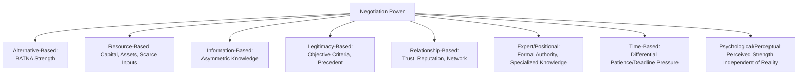

## Sources and Bases of Negotiation Power

### Overview

Negotiation power refers to a party's capacity to influence outcomes in their favor, independent of persuasive skill or communication technique. Unlike the communication-focused topics addressed under framing and persuasion, power is fundamentally structural — it derives from the objective and perceived balance of alternatives, resources, information, and relational position between negotiating parties. This topic establishes the foundational taxonomy of power sources that underlies subsequent leverage-related topics (BATNA, coalition-building, power-balancing tactics).

### Theoretical Foundations

**French and Raven's Bases of Social Power**

John French and Bertram Raven's classic framework (1959, later extended) identifies distinct bases of social power applicable well beyond negotiation, but foundational to negotiation power analysis:

| Base | Description | Negotiation Manifestation |
| --- | --- | --- |
| Reward Power | Capacity to provide valued benefits | Ability to offer favorable terms, future business, referrals |
| Coercive Power | Capacity to impose costs or penalties | Ability to withhold business, pursue legal action, damage reputation |
| Legitimate Power | Power derived from position, role, or authority | Formal decision-making authority, contractual rights |
| Expert Power | Power derived from specialized knowledge | Technical expertise that the counterpart depends on or cannot easily verify independently |
| Referent Power | Power derived from being liked, respected, or identified with | Relationship capital, reputation, personal credibility |
| Informational Power | Power derived from possessing valuable information (added later) | Superior market knowledge, data the counterpart lacks |

**BATNA as the Central Negotiation-Specific Power Source**

While French and Raven's framework is general to social influence, negotiation theory (principally Fisher & Ury's *Getting to Yes* and subsequent work by Howard Raiffa) identifies the **Best Alternative to a Negotiated Agreement (BATNA)** as the single most negotiation-specific and often most decisive power variable: a party's power in a given negotiation is fundamentally bounded by what happens if no agreement is reached. A party with an attractive BATNA can credibly walk away, which structurally constrains how much the other party can extract, regardless of rhetorical skill, rank, or apparent confidence.

$$\text{Negotiating Power} \propto \frac{1}{\text{Dependence on Reaching Agreement}}$$

This inverse relationship (a widely-used conceptual — not strictly quantitative — heuristic in negotiation pedagogy) captures the core insight of dependence theory: power in a negotiation is relational and derives substantially from each party's relative need for the deal, not solely from external resources. [Inference — this formulation is a pedagogical simplification; actual negotiated outcomes depend on numerous interacting factors including skill, information asymmetry, and risk tolerance, not dependence alone]

### Categories of Negotiation Power

**1. Alternative-Based Power (BATNA Strength)**

The most emphasized power source in modern negotiation theory. A party's power increases with:

- The number and quality of viable alternatives if the current negotiation fails
- The cost/difficulty for the counterpart to find alternative counterparts
- The credibility of the party's willingness to actually pursue their BATNA if needed

**2. Resource-Based Power**

Power derived from control over resources the counterpart needs or values — financial capital, physical assets, exclusive access to distribution channels, proprietary technology, or scarce inputs. This closely maps to French and Raven's reward and coercive power bases.

**3. Information-Based Power**

Power derived from asymmetric access to relevant information — market pricing data, the counterpart's cost structure, competitive alternatives, or regulatory/legal considerations unknown to the other party. Information asymmetry is a central concept in economic theory of negotiation (related to Akerlof's work on asymmetric information markets) — the party with superior information can often extract better terms simply because the less-informed party cannot fully evaluate the fairness of a given proposal.

**4. Legitimacy-Based Power**

Power derived from perceived rightful authority, established norms, precedent, or objective external standards. This power source is central to Fisher and Ury's "insist on objective criteria" principle — a position framed as consistent with an independently legitimate standard (market rate, legal precedent, industry norm) carries persuasive and structural weight that a purely self-interested demand does not.

**5. Relationship-Based Power**

Power derived from the strength, history, and future value of the relationship between parties — includes reputational capital, trust accumulated over repeated interactions, and network position (e.g., a counterpart's dependence on maintaining goodwill for future dealings or referrals within a professional network).

**6. Expert/Positional Power**

Power derived from specialized expertise, formal role authority, or structural position within a decision-making hierarchy — closely mapping to French and Raven's expert and legitimate power bases. A negotiator representing an organization with formal authority to bind that organization has structurally different power than one who must seek approval from an absent principal.

**7. Time-Based Power**

Power derived from differential time pressure or patience between parties — a party who is not constrained by an approaching deadline typically holds more power than a counterpart under significant time pressure, since the patient party can credibly wait out unfavorable terms.

**8. Psychological/Perceptual Power**

Power that exists based on perception rather than objective structural reality — a party perceived (accurately or not) as having a strong BATNA, significant resources, or high resolve may extract concessions functionally equivalent to a party who objectively possesses those attributes, at least until the perception is tested or revealed. This links directly to signal management concepts covered in *Verbal and Nonverbal Signals in Negotiation*.

### Power Source Taxonomy Diagram

### Power Asymmetry and Its Effects on Negotiation Dynamics

**Example**

A sole-source supplier negotiating with a buyer who has no viable alternative vendor holds substantial resource-based and alternative-based power. Even if the buyer possesses stronger rhetorical or persuasive skill (per the communication-focused topics), the buyer's lack of a viable BATNA structurally limits their ability to resist unfavorable terms — illustrating that structural power often dominates communicative skill when the asymmetry is severe.

Research on power asymmetry in negotiation (e.g., work building on social exchange theory, Emerson 1962) suggests that:

- High-power parties tend toward more assertive, less concession-prone behavior and are less attentive to the low-power party's interests absent other incentives (e.g., long-term relationship value).
- Low-power parties benefit disproportionately from improving their BATNA, building coalitions (aggregating individually weak positions into collective leverage), or introducing legitimacy-based arguments (objective criteria) that constrain the high-power party's ability to extract maximally self-interested terms without reputational cost.

### Common Pitfalls in Power Assessment

- **Conflating apparent power with actual power**: Overestimating a counterpart's power based on superficial cues (confidence, organizational size, formal title) without verifying the underlying BATNA or resource reality — a party may project power they do not structurally possess (see psychological/perceptual power above), and can be over-credited if this projection is not tested.
- **Underestimating one's own power**: Failing to accurately assess and articulate one's own BATNA, resources, or legitimacy basis, leading to unnecessary concessions driven by perceived (rather than actual) weakness.
- **Static power assumption**: Treating power as fixed for the duration of a negotiation, when BATNAs, information, and time pressure can shift materially as a negotiation progresses (e.g., a counterpart's alternative deal falling through mid-negotiation).
- **Single-source power reliance**: Focusing exclusively on one power source (e.g., resource-based) while neglecting others (e.g., legitimacy or relationship-based) that may be more decisive or more sustainable in a given context, particularly in relationships intended to be long-term rather than one-off.
- **Coercive overreach**: Overusing coercive power sources in ways that damage relationship-based power and legitimacy, which can be costly in repeated-game or reputation-sensitive contexts even when short-term leverage is available.

### Integration with Broader Negotiation Frameworks

- **BATNA Analysis**: Alternative-based power is operationalized through structured BATNA development and improvement, a dedicated technical process covered separately in leverage-focused topics.
- **Principles of Persuasion**: Authority (French and Raven's legitimate/expert power) and scarcity (time-based/resource-based power) principles of influence directly draw upon underlying structural power sources.
- **Framing and Reframing**: Legitimacy-based power is operationalized rhetorically through objective-criteria framing and fairness-norm reframing.
- **Verbal and Nonverbal Signals**: Psychological/perceptual power is projected and detected through the signal channels covered in earlier communication-focused topics; accurately distinguishing genuine from projected power is a core signal-reading application.

### Practical Application Framework

1. **Map all applicable power sources** for both parties systematically (alternative, resource, information, legitimacy, relationship, positional, time, perceptual) rather than relying on an intuitive single-factor assessment.
2. **Verify rather than assume counterpart power**, particularly regarding BATNA strength and resource claims, through diagnostic questioning and independent research where feasible.
3. **Identify and strengthen your own weakest power sources** before entering a negotiation — commonly through BATNA improvement, information-gathering, or securing objective-criteria support for your position.
4. **Select power sources appropriate to the relationship context**: favor legitimacy- and relationship-based power in long-term, repeated-interaction contexts to preserve durability and trust; resource/coercive power carries higher relationship risk and is more appropriate to one-off, low-relationship-value transactions.
5. **Reassess power dynamically**: Treat power balance as subject to change throughout the negotiation and update strategy as new information emerges about either party's alternatives, resources, or time constraints.

**Related Topics**

- BATNA and Reservation Price Analysis
- Principled Negotiation and Objective Criteria
- Coalition-Building and Aggregated Leverage
- Principles of Persuasion and Social Influence
- Verbal and Nonverbal Signals in Negotiation
- Framing and Reframing Proposals
- Power Asymmetry and Distributive Bargaining Dynamics
- Time Pressure and Deadline Tactics