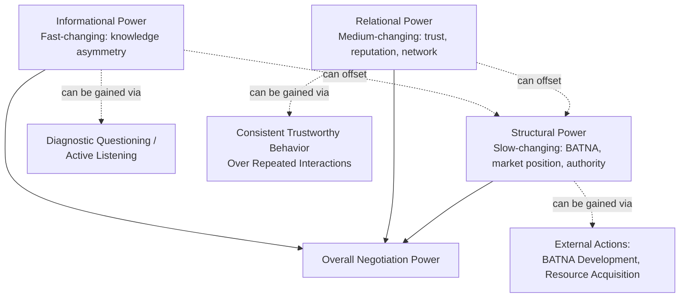

## Structural, Relational, and Informational Power

### Overview

This topic develops a three-way analytical decomposition of negotiation power — structural, relational, and informational — as a lens for diagnosing power dynamics with greater precision than the general power taxonomy introduced previously. Whereas *Sources and Bases of Negotiation Power* enumerated the full range of power sources, this framework groups those sources into three functionally distinct categories that behave differently over time, respond to different intervention strategies, and interact with each other in identifiable patterns.

### Theoretical Foundations

**Why a Three-Category Decomposition**

Negotiation and organizational-behavior scholarship (drawing on power-dependence theory, Emerson 1962, and subsequent negotiation-specific extensions) distinguishes power sources by their **origin and mutability**:

- **Structural power** originates from the objective architecture of the situation — market structure, number of alternatives, formal authority — and is typically the slowest and most resource-intensive to change within a single negotiation episode.
- **Relational power** originates from the interpersonal and reputational history between parties, and is built or eroded gradually over repeated interactions, but can shift meaningfully within a single episode through trust-building or trust-breaking behavior.
- **Informational power** originates from asymmetric knowledge, and is potentially the most volatile within a single negotiation episode — it can shift rapidly as parties exchange, discover, or disclose information during the negotiation itself.

This mutability gradient (structural: slow-changing; relational: medium-changing; informational: fast-changing) has direct tactical implications: a party facing structural disadvantage cannot easily correct it mid-negotiation, but has more room to shift relational and especially informational power within the same session.

### Structural Power

**Definition**: Power arising from the objective architecture of the negotiation situation — the number and quality of alternatives available to each party (BATNA strength), formal authority and legitimacy, market position, and resource control.

**Key Structural Power Determinants**

| Determinant | Description |
| --- | --- |
| Market Structure | Number of buyers/sellers, degree of competition, substitutability of the good/service |
| BATNA Quality | Strength of each party's alternative if negotiation fails |
| Formal Authority | Legal, contractual, or organizational rights and decision authority |
| Resource Control | Ownership or control of assets, capital, or scarce inputs the other party needs |
| Switching Costs | Cost/difficulty for either party to exit the relationship and find an alternative counterpart |

**Characteristics**: Structural power is largely exogenous to the negotiation conversation itself — it exists prior to and independent of how skillfully either party communicates. It changes primarily through external actions taken well outside the negotiating room: developing new supplier relationships (improving BATNA), consolidating market position, or securing new formal authority.

**Example**: A company that develops a second viable supplier relationship *before* entering a renewal negotiation with its incumbent supplier has structurally altered its BATNA and therefore its power position — this change cannot be replicated through rhetoric alone during the negotiation itself.

### Relational Power

**Definition**: Power arising from the interpersonal, reputational, and historical dimension of the relationship between negotiating parties — accumulated trust, goodwill, network position, and the perceived cost of damaging an ongoing or future relationship.

**Key Relational Power Determinants**

| Determinant | Description |
| --- | --- |
| Trust Capital | Accumulated credibility from prior consistent, honest dealing |
| Relationship Duration/Future Value | Expected value of continued interaction beyond the current negotiation |
| Network Position | Counterpart's dependence on the negotiator's goodwill for reputation within a shared professional network |
| Reciprocity History | Pattern of prior concessions and favors exchanged between the parties |
| Personal Rapport | Degree of genuine liking, respect, or personal connection established |

**Characteristics**: Relational power is more mutable than structural power but changes on a medium timescale — it typically requires sustained consistent behavior across multiple interactions to build meaningfully, though it can be damaged rapidly by a single significant breach of trust (a well-documented asymmetry in trust research: trust is generally slow to build and fast to destroy).

**Example**: A long-standing vendor with a strong track record of reliability and honest dealing may retain negotiating power in a difficult renewal even with a weaker current BATNA, because the buyer places substantial value on continuity and accumulated trust that a new, unproven vendor cannot immediately replicate — illustrating how relational power can partially offset structural disadvantage.

### Informational Power

**Definition**: Power arising from asymmetric access to information relevant to the negotiation's substance — market pricing, cost structures, competitive alternatives, regulatory considerations, or the counterpart's own priorities and constraints.

**Key Informational Power Determinants**

| Determinant | Description |
| --- | --- |
| Market Data Access | Knowledge of comparable pricing, industry benchmarks, or competitive terms |
| Cost Structure Knowledge | Understanding of the counterpart's (or one's own) true cost basis and margin flexibility |
| Interest/Priority Knowledge | Understanding of the counterpart's underlying interests, constraints, and relative priorities across issues |
| Alternative Awareness | Knowledge of the counterpart's actual (vs. claimed) BATNA |
| Regulatory/Legal Knowledge | Awareness of legal or regulatory factors affecting the deal that the counterpart may not have considered |

**Characteristics**: Informational power is the most dynamic of the three categories — it can shift substantially within a single negotiation session through diagnostic questioning (see *Active Listening and Diagnostic Questioning*), inadvertent disclosure, or deliberate strategic information-sharing. Because of this volatility, informational power is also the category most directly contested through communication tactics rather than external structural action.

**Example**: A negotiator who, through calibrated questioning, discovers that a counterpart's stated deadline is a soft internal preference rather than a hard external constraint has gained informational power that materially changes the negotiation's dynamics — without any change to the underlying structural or relational position.

### Interaction Between the Three Power Types

A key strategic insight from this framework is that **weakness in one category can be partially compensated by strength in another** within a single negotiation: a party with weak structural power (poor BATNA) may still achieve favorable outcomes through superior informational power (better market/interest knowledge) or strong relational power (accumulated trust and future relationship value) — though such compensation has limits and cannot fully substitute for severe structural disadvantage.

### Structural vs. Relational vs. Informational Power Comparison

<svg xmlns="http://www.w3.org/2000/svg" viewBox="0 0 720 380">
<text x="360" y="30" font-family="Arial, sans-serif" font-size="16" font-weight="bold" text-anchor="middle" fill="#1a1a2e">Power Type Mutability and Timescale (svg_diagram)</text>
<line x1="90" y1="330" x2="650" y2="330" stroke="#333333" stroke-width="1.5" />
<text x="370" y="360" font-family="Arial, sans-serif" font-size="11" text-anchor="middle" fill="#333333">Timescale of Change →</text>
<text x="60" y="200" font-family="Arial, sans-serif" font-size="11" text-anchor="middle" fill="#333333" transform="rotate(-90 60 200)">Mutability</text>

<rect x="120" y="270" width="140" height="40" rx="6" fill="#4a5b8c" />
<text x="190" y="295" font-family="Arial, sans-serif" font-size="12" font-weight="bold" text-anchor="middle" fill="#ffffff">Structural</text>
<text x="190" y="325" font-family="Arial, sans-serif" font-size="10" text-anchor="middle" fill="#4a5b8c">Slow / Pre-negotiation</text>

<rect x="300" y="200" width="140" height="40" rx="6" fill="#4a8c6b" />
<text x="370" y="225" font-family="Arial, sans-serif" font-size="12" font-weight="bold" text-anchor="middle" fill="#ffffff">Relational</text>
<text x="370" y="255" font-family="Arial, sans-serif" font-size="10" text-anchor="middle" fill="#4a8c6b">Medium / Cross-episode</text>

<rect x="480" y="110" width="140" height="40" rx="6" fill="#8c7a4a" />
<text x="550" y="135" font-family="Arial, sans-serif" font-size="12" font-weight="bold" text-anchor="middle" fill="#ffffff">Informational</text>
<text x="550" y="165" font-family="Arial, sans-serif" font-size="10" text-anchor="middle" fill="#8c7a4a">Fast / Within-episode</text>
<line x1="190" y1="270" x2="370" y2="200" stroke="#999999" stroke-width="1.5" stroke-dasharray="3,3" />
<line x1="370" y1="200" x2="550" y2="110" stroke="#999999" stroke-width="1.5" stroke-dasharray="3,3" />
</svg>

### Common Pitfalls

- **Treating all power as structural**: Assuming that a weak BATNA or resource position is fully determinative of negotiation outcome, neglecting the meaningful compensatory role of relational and informational power.
- **Neglecting informational power development**: Entering negotiations without adequate preparation on market data, counterpart cost structures, or likely priorities, forfeiting the most tractable and rapidly-improvable power category.
- **Underinvesting in relational power for long-term relationships**: Prioritizing short-term structural/informational leverage in a context where the relationship's long-term value would justify greater investment in trust-building, potentially winning a single negotiation at the cost of a valuable ongoing relationship.
- **Overestimating relational power durability**: Assuming that accumulated trust provides indefinite insulation from structural shifts — a single significant breach, or a sufficiently large structural change (e.g., counterpart securing a dramatically better BATNA), can override relational capital.
- **Failing to update informational power assessment dynamically**: Not recognizing when new information (disclosed inadvertently or through active diagnostic questioning) has shifted the informational balance mid-negotiation, and continuing to negotiate based on a stale information state.

### Integration with Broader Negotiation Frameworks

- **BATNA Analysis**: Structural power is substantially operationalized through BATNA strength, making BATNA development the primary lever for structural power improvement.
- **Active Listening and Diagnostic Questioning**: The primary tactical mechanism for shifting informational power within a single negotiation episode.
- **Trust-Building and Reciprocity**: Relational power accumulation draws directly on reciprocity norms (see *Principles of Persuasion and Social Influence*) and consistent, credible behavior over time.
- **Framing and Reframing**: Relationship-frame reframing (shifting from transactional to long-term relational framing) is a direct attempt to invoke relational power as a counterweight to structural or informational disadvantage.

### Practical Application Framework

1. **Diagnose power position separately across all three categories** rather than forming a single holistic power judgment, since intervention strategies differ substantially by category.
2. **Prioritize informational power development in immediate preparation**: Given its rapid mutability, thorough research and diagnostic questioning planning typically offer the highest near-term return on preparation effort.
3. **Plan structural power improvements well in advance**: Since structural power changes slowly, BATNA development and resource positioning should be pursued as an ongoing strategic activity, not a last-minute pre-negotiation task.
4. **Invest deliberately in relational power for high-value ongoing relationships**: Treat trust-building as a long-term power-investment strategy rather than a soft, non-strategic consideration.
5. **Reassess the three-category balance continuously during the negotiation**: Particularly monitor for informational shifts (new disclosures) that may alter optimal strategy mid-session, even when structural and relational positions remain constant.

**Related Topics**

- Sources and Bases of Negotiation Power
- BATNA and Reservation Price Analysis
- Active Listening and Diagnostic Questioning
- Principles of Persuasion and Social Influence
- Trust-Building in Repeated Negotiation Contexts
- Coalition-Building and Aggregated Leverage
- Framing and Reframing Proposals
- Power Asymmetry and Distributive Bargaining Dynamics