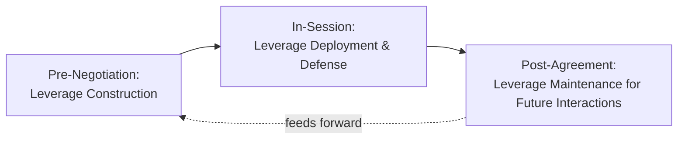

## Building and Sustaining Leverage

### Overview

Building and sustaining leverage concerns the active, deliberate practices by which a negotiator improves their power position before and during a negotiation, and maintains that advantage against erosion over time. Where prior topics established what power *is* and its underlying sources, this topic addresses the *process*: concrete methods for constructing leverage, common leverage-erosion risks, and the maintenance discipline required to prevent an initially strong position from deteriorating over the course of a negotiation or relationship.

### Theoretical Foundations

**Leverage as a Managed, Not Fixed, Asset**

A recurring theme across negotiation literature (Raiffa's analytical framework, Lax and Sebenius's work on value creation and claiming) is that leverage is not a static endowment but an asset requiring active management — it can be built through deliberate preparatory action, can decay through neglect or poor tactical choices, and can be actively eroded by a sophisticated counterpart. This reframes power analysis from a one-time diagnostic exercise (as in prior topics) into an ongoing strategic discipline spanning pre-negotiation preparation, in-session tactics, and post-agreement relationship management.

**The Leverage Lifecycle**

Leverage can usefully be analyzed across three temporal phases:

### Phase 1: Building Leverage (Pre-Negotiation)

**1. BATNA Development**

The single most emphasized leverage-building activity in negotiation theory (Fisher & Ury; Raiffa). Concrete methods include:

- Actively cultivating multiple genuine alternative counterparts or options before entering a negotiation, rather than treating the current counterpart as the only viable path.
- Converting a hypothetical alternative into a concrete, credible one — e.g., obtaining an actual competing offer rather than an assumed market estimate, which substantially increases both real leverage and the credibility of any claim about it.
- Continuously reassessing and updating BATNA as market conditions or available options change, rather than treating it as fixed at the outset of a relationship.

**2. Information Gathering**

Since informational power is the most rapidly actionable power category (see *Structural, Relational, and Informational Power*), pre-negotiation research is a direct leverage-building activity:

- Researching market benchmarks, comparable transaction terms, and industry-standard practices to support objective-criteria argumentation.
- Investigating the counterpart's likely constraints, priorities, and alternatives where ethically and legally permissible (e.g., public financial disclosures, industry reporting, prior negotiation history).
- Identifying the counterpart's likely decision-making process and actual authority structure in advance (see *Cross-Cultural Communication Pitfalls* for authority-related diagnostic considerations).

**3. Coalition-Building**

Aggregating individually weaker positions into collective leverage — a well-documented mechanism in labor negotiation (union collective bargaining), multi-party business negotiations (buying consortiums), and diplomatic contexts (voting blocs). Coalition-building converts what would be several individually low-power negotiations into a single higher-power negotiation, though it introduces internal coordination costs and the risk of defection by coalition members if their individual interests diverge from the group's.

**4. Relationship and Reputation Investment**

Building relational power (see prior topic) ahead of a specific negotiation through consistent, reliable prior dealings, which can be "drawn upon" as leverage in a subsequent negotiation — particularly valuable when structural power is weak, since a strong reputation can substitute for or supplement structural leverage.

**5. Structural Repositioning**

Longer-horizon actions that alter the fundamental market or organizational structure underlying a negotiation — e.g., diversifying a supplier base to reduce switching costs, securing exclusive access to a resource, or obtaining formal authority/mandate that removes ambiguity about decision-making power.

### Phase 2: Deploying and Defending Leverage (In-Session)

**1. Credible Signaling**

Leverage that exists but is not credibly communicated provides limited tactical benefit — a genuine alternative option is only useful as leverage if the counterpart believes it is real and would actually be exercised. Effective signaling avoids both underclaiming (failing to reference genuine leverage at all) and overclaiming (bluffing leverage that does not exist, which risks costly exposure if tested).

**2. Avoiding Premature Disclosure**

A common leverage-erosion pattern is revealing the full extent of one's constraints, deadlines, or lack of alternatives too early or too readily under diagnostic questioning from the counterpart — directly connecting to the informational-power volatility discussed previously. Maintaining appropriate discretion about one's own weak points, while still engaging honestly in interest-based dialogue, protects leverage during the session.

**3. Resisting Leverage-Testing Tactics**

Sophisticated counterparts will often probe to test whether claimed leverage (e.g., "we have other options") is genuine, through direct questioning, deadline pressure, or by making an offer calibrated to see whether the negotiator actually walks away. Maintaining consistency between claimed leverage and observable behavior (willingness to pause, walk away, or take time) is necessary to sustain leverage credibility once it has been asserted.

**4. Preventing Anchoring Erosion**

Leverage can be eroded through poor anchoring choices — e.g., a strong BATNA position undermined by an anchor set too low relative to the negotiator's actual power, effectively "giving away" leverage value before the counterpart even had to contest it (connecting to *Framing and Reframing Proposals* and anchoring theory).

### Phase 3: Sustaining Leverage (Post-Agreement / Ongoing Relationship)

**1. Reputation Consistency**

Leverage built through demonstrated reliability, honesty, and fair dealing in one negotiation carries forward as relational power into future negotiations, but only if behavior remains consistent — a single instance of perceived bad-faith dealing can disproportionately damage accumulated reputational leverage (echoing the asymmetric trust-building/trust-destruction dynamic noted in relational power).

**2. Continuous BATNA Maintenance**

Leverage gained through a strong BATNA at one point in time is not permanent; markets shift, alternative counterparts' circumstances change, and switching costs evolve. Sustained leverage requires ongoing reassessment and, where needed, active reinvestment in maintaining viable alternatives rather than allowing a previously-strong BATNA to atrophy through inattention.

**3. Contractual and Structural Lock-In Management**

In multi-period or repeated-negotiation relationships (e.g., long-term supply contracts, ongoing employment relationships), the terms agreed in one negotiation can structurally affect leverage in subsequent negotiations — for example, exclusivity clauses, most-favored-nation clauses, or automatic renewal terms can either preserve or erode a party's future leverage. Careful attention to how current agreement terms affect future negotiating position is a distinct leverage-sustaining discipline.

### Leverage-Erosion Risk Map

| Erosion Risk | Mechanism | Mitigation |
| --- | --- | --- |
| Premature disclosure | Revealing weak BATNA or deadline pressure too early | Discretion in diagnostic exchanges; calibrated, non-defensive responses |
| Unrenewed BATNA | Allowing alternatives to lapse or become stale | Ongoing market monitoring and relationship maintenance with alternative counterparts |
| Reputation damage | Single bad-faith incident or broken commitment | Consistency discipline; proactive repair if a breach occurs |
| Bluff exposure | Claiming leverage that does not exist and being tested | Avoid overclaiming; ensure claimed leverage is genuine or appropriately hedged |
| Coalition defection | Coalition members pursuing individual side-deals | Clear coalition governance and aligned incentive structures |
| Structural lock-in | Agreeing to contract terms that reduce future flexibility | Careful contract review for exclusivity/renewal clauses affecting future leverage |

### Common Pitfalls

- **Treating leverage-building as a one-time pre-negotiation task**: Neglecting the ongoing maintenance phase, resulting in leverage that was accurate at the negotiation's outset but stale or incorrect by its later stages or in subsequent negotiations.
- **Overclaiming leverage without willingness to exercise it**: Asserting a BATNA or resolve that the negotiator is not actually prepared to act on, risking severe leverage collapse if the counterpart calls the bluff (a well-documented risk in bluffing/deception literature within negotiation).
- **Neglecting relational leverage in favor of purely structural tactics**: Over-optimizing for short-term structural/informational advantage at the expense of the relational leverage that would benefit a long-term relationship, a particular risk in negotiations mistakenly treated as one-off when they are actually part of a repeated-game context.
- **Coalition mismanagement**: Building a coalition for aggregated leverage without adequate attention to internal incentive alignment, risking defection at a critical moment that undermines the entire coalition's bargaining position.
- **Ignoring contractual leverage implications**: Focusing exclusively on the immediate deal terms while overlooking clauses that materially affect leverage in future negotiations (e.g., automatic renewal terms that reduce future BATNA optionality).

### Integration with Broader Negotiation Frameworks

- **Sources and Bases of Negotiation Power / Structural, Relational, Informational Power**: This topic operationalizes the prior power taxonomies into concrete, actionable building and defense practices.
- **Active Listening and Diagnostic Questioning**: Both a tool for building informational leverage (extracting counterpart information) and a risk vector for leverage erosion (if the negotiator discloses too much under the counterpart's diagnostic questioning).
- **Verbal and Nonverbal Signals**: Credible leverage signaling depends on congruence between verbal claims and nonverbal delivery discussed in earlier communication-focused topics.
- **Principles of Persuasion**: Scarcity and authority influence principles are direct rhetorical expressions of underlying structural leverage (genuine alternatives, legitimate expertise).

### Practical Application Framework

1. **Conduct leverage audits before major negotiations**: Systematically assess BATNA currency, informational preparedness, relational capital, and structural position rather than assuming a prior assessment remains valid.
2. **Invest in BATNA development as an ongoing discipline**, not a pre-negotiation checklist item, particularly for recurring or high-stakes counterparties.
3. **Calibrate leverage signaling to actual willingness to act**: Only assert leverage claims the negotiator is genuinely prepared to exercise if tested, to avoid catastrophic credibility loss.
4. **Guard informational discipline during diagnostic exchanges**: Engage genuinely and honestly in interest-based dialogue while maintaining appropriate discretion about specific weak points or deadline pressures.
5. **Review agreement terms for future leverage impact**: Before finalizing any agreement, explicitly assess how its terms (exclusivity, renewal, lock-in provisions) will affect leverage in subsequent negotiations within the same relationship.

**Related Topics**

- Sources and Bases of Negotiation Power
- Structural, Relational, and Informational Power
- BATNA and Reservation Price Analysis
- Coalition-Building and Aggregated Leverage
- Active Listening and Diagnostic Questioning
- Trust-Building in Repeated Negotiation Contexts
- Deception and Bluffing in Negotiation Ethics
- Contract Terms Affecting Future Negotiating Position