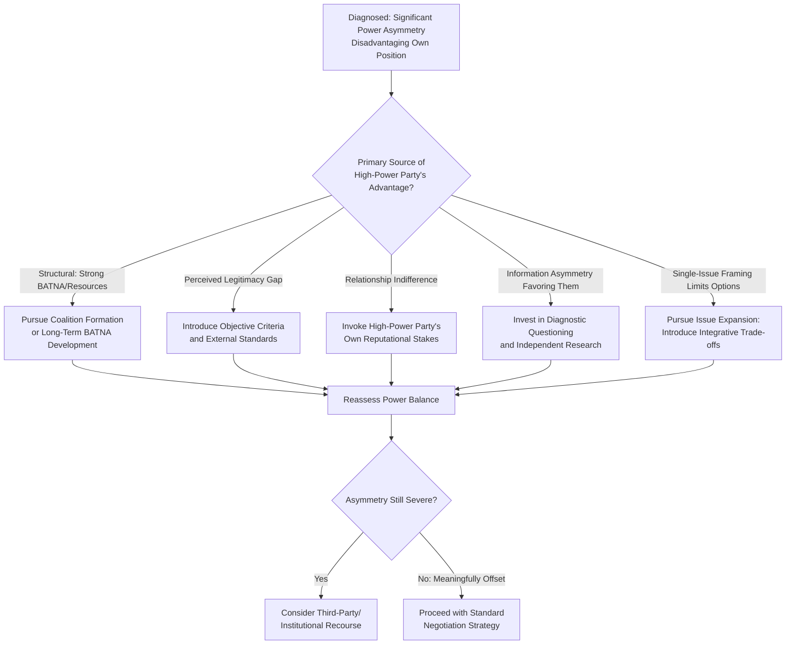

## Managing and Offsetting Power Asymmetries

### Overview

Power asymmetries occur when one negotiating party possesses substantially greater structural, relational, or informational power than the other. While earlier topics addressed power's sources and how to build leverage generally, this topic focuses specifically on the **low-power party's** strategic toolkit for managing, mitigating, and in some cases substantively offsetting a disadvantageous power position — a distinct analytical problem from general leverage-building, since it addresses negotiation under conditions where the underlying structural imbalance may not be fully correctable before the negotiation must occur.

### Theoretical Foundations

**Why Power Asymmetry Matters Beyond Simple Outcome Prediction**

Power-dependence theory (Emerson, 1962) and subsequent negotiation research establish that power asymmetry affects not only final outcomes but also **process** — high-power parties in asymmetric negotiations tend to exhibit less attentiveness to the low-power party's interests, greater use of positional/distributive tactics, and lower motivation to search for integrative, mutually beneficial trade-offs, since they can extract acceptable terms without needing to expand the pie. This has a direct implication: the low-power party often benefits from *actively working to change the high-power party's incentive structure* — not merely accepting the asymmetry as fixed and negotiating passively within it.

**Asymmetry Is Rarely Absolute**

A foundational premise of this domain is that few real-world negotiations feature total, one-dimensional power asymmetry. Per the *Structural, Relational, and Informational Power* framework, a party can be structurally weak while informationally or relationally strong (or vice versa), and even severe structural asymmetry typically leaves some room for tactical offsetting — though the framework does not claim offsetting can fully neutralize a sufficiently large structural gap. [Inference — the degree to which relational/informational strategies can offset structural weakness varies substantially by context and is not uniformly reliable; severe asymmetries (e.g., true monopsony/monopoly conditions) may leave limited room for offsetting regardless of tactical sophistication]

### Strategies for Offsetting Power Asymmetry

**1. Coalition Formation**

Aggregating with other similarly-positioned low-power parties converts an individually weak negotiation into a collectively stronger one. This is the mechanism underlying labor unions, buying cooperatives, trade associations, and voting blocs.

**Requirements for effective coalitions**:

- Sufficiently aligned interests among coalition members to avoid defection
- A credible enforcement or governance mechanism preventing individual members from side-dealing with the high-power party
- Clear internal agreement on how collective gains will be distributed among members

[Inference — coalition effectiveness depends heavily on internal cohesion; a poorly-governed coalition can be strategically exploited by a sophisticated high-power counterpart through targeted individual offers designed to induce defection]

**2. Introducing Objective Criteria and Legitimacy Standards**

As covered under *Sources and Bases of Negotiation Power*, legitimacy-based power is comparatively available to low-power parties: invoking external, objective, and broadly-recognized standards (market rate, legal precedent, regulatory requirement, industry norm) constrains a high-power party's ability to extract maximally self-interested terms without incurring reputational or relational cost, even absent a strong BATNA.

**Example**

> A small supplier negotiating with a dominant retail buyer may lack meaningful BATNA-based leverage, but can invoke industry-standard payment terms, published cost indices, or regulatory floor prices to anchor the discussion around externally defensible figures rather than the buyer's unilaterally preferred terms.

**3. Leveraging Relational and Reputational Capital**

Where structural power is weak, a low-power party can draw on accumulated trust and the high-power party's own interest in reputation (e.g., a large buyer's interest in being perceived as a fair dealer within its industry, which affects its ability to attract future suppliers or partners). This connects the low-power party's outcome not just to the immediate transaction's structural balance, but to the high-power party's broader relational incentives.

**4. Strategic Information Development**

Since informational power is the most rapidly actionable category, a low-power party can substantially improve its negotiating position through diligent preparation — securing accurate market data, understanding the high-power party's actual (not just claimed) constraints, and identifying areas where the high-power party has less genuine flexibility than its posture suggests. Diagnostic questioning (see *Active Listening and Diagnostic Questioning*) is a key tool for surfacing such gaps in real time.

**5. Issue Expansion and Integrative Trade-offs**

Converting a single-issue, purely distributive negotiation (where structural power dominates) into a multi-issue integrative one can benefit the low-power party by introducing dimensions where the power imbalance is less pronounced or where trade-offs can generate joint value the high-power party did not initially consider — directly connecting to reframing techniques in *Framing and Reframing Proposals*.

**6. Third-Party Intervention and Institutional Recourse**

In severely asymmetric contexts, low-power parties may access external mechanisms that rebalance the negotiation independent of the underlying private power structure: regulatory bodies, mediation/arbitration processes, industry ombudsmen, or legal recourse. These mechanisms function by introducing an external structural power source (institutional authority) that the private negotiation lacked.

**7. Patience and Time Management**

Where a low-power party is not under acute time pressure, deliberately extending the negotiation timeline (see *The Strategic Use of Silence and Pacing*) can reduce the effective power differential if the high-power party has any time-sensitivity of its own (e.g., a fiscal-year deadline, an internal target), converting a structural weakness (poor BATNA) into a partially offsetting time-based advantage.

### Power-Offsetting Strategy Selection Framework

### High-Power Party Considerations: Managing Asymmetry Responsibly

Power asymmetry management is not exclusively a low-power party concern; high-power parties in ongoing or reputation-sensitive relationships have documented strategic reasons to moderate the exercise of structural advantage:

- **Reputational risk**: Consistently extracting maximal terms from lower-power counterparts can generate reputational costs that reduce future counterparties' willingness to engage, particularly in industries with reputational visibility (e.g., via public review, trade press, or professional networks).
- **Relationship value forfeiture**: Full extraction of short-term advantage can foreclose longer-term value-creating relationships that would have generated greater cumulative value through integrative, trust-based dealing.
- **Regulatory/legal exposure**: Severe exploitation of power asymmetry can, in some jurisdictions and industries, trigger regulatory scrutiny (e.g., antitrust, unfair trade practice, or labor law considerations), representing a structural constraint on unrestrained power exercise. [Inference — the specific legal thresholds and regulatory exposure vary substantially by jurisdiction, industry, and the nature of the asymmetry, and should not be treated as a uniform constraint]

### Common Pitfalls

- **Passive acceptance of asymmetry**: Treating a disadvantageous structural position as fully determinative and negotiating purely reactively, without attempting available relational, informational, or legitimacy-based offsets.
- **Overreliance on a single offsetting strategy**: Depending exclusively on one mechanism (e.g., objective criteria alone) without combining multiple offsetting strategies, which are often more effective in combination than isolation.
- **Coalition overpromising**: Forming a coalition without adequate governance, resulting in defection at a critical moment that leaves remaining members in a worse position than if no coalition had been attempted.
- **Escalating conflict without an offsetting plan**: Adopting an aggressive, positional stance against a high-power counterpart without a credible underlying strategy to actually shift the power balance, which can trigger the high-power party's coercive power without corresponding benefit.
- **High-power overreach**: From the high-power party's side, excessive extraction of short-term advantage without regard to relational or reputational consequences, risking longer-term value destruction in repeated-game or reputation-visible contexts.

### Integration with Broader Negotiation Frameworks

- **Sources and Bases of Negotiation Power / Structural, Relational, Informational Power**: This topic directly operationalizes those taxonomies into asymmetry-specific offsetting tactics.
- **Building and Sustaining Leverage**: Many offsetting strategies (coalition-building, BATNA development, information-gathering) are specific applications of general leverage-building practice, tailored to asymmetric contexts.
- **Framing and Reframing / Principled Negotiation**: Objective-criteria invocation is a direct application of legitimacy-based reframing to counteract raw structural imbalance.
- **Cross-Cultural Communication Pitfalls**: Power distance (Hofstede) as a cultural dimension affects both parties' expectations regarding acceptable exercise and acknowledgment of power asymmetry, moderating which offsetting strategies will be perceived as legitimate versus confrontational in a given cultural context.

### Practical Application Framework

1. **Diagnose the specific source(s) of asymmetry** using the structural/relational/informational framework before selecting an offsetting strategy, since the appropriate response differs by source.
2. **Evaluate coalition feasibility early**, since coalition-building requires lead time and cannot typically be constructed reactively once a negotiation is underway.
3. **Prepare objective-criteria arguments in advance**, gathering externally verifiable benchmarks that can anchor the discussion regardless of the underlying structural imbalance.
4. **Invest disproportionately in informational preparation** when structural and relational offsets are limited, since informational power is the most accessible lever for a low-power party with limited lead time.
5. **Recognize the limits of offsetting strategies**: When structural asymmetry is severe and other offsets are unavailable or insufficient, consider whether third-party institutional recourse or walking away entirely (accepting a poor BATNA rather than a worse negotiated outcome) is the more rational course.

**Related Topics**

- Sources and Bases of Negotiation Power
- Structural, Relational, and Informational Power
- Building and Sustaining Leverage
- Coalition-Building and Aggregated Leverage
- Principled Negotiation and Objective Criteria
- Framing and Reframing Proposals
- Cross-Cultural Communication Pitfalls
- Distributive Bargaining and Power Asymmetry Dynamics