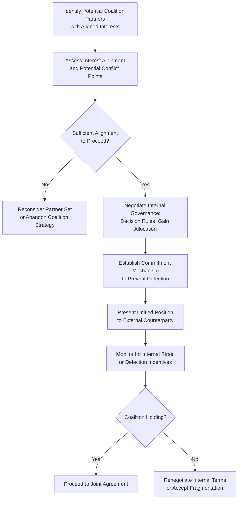

## Alliance and Coalition-Building for Advantage

### Overview

Alliance and coalition-building refers to the deliberate formation of cooperative groupings among two or more parties who aggregate individually limited resources, information, or bargaining positions into a combined force with substantially greater negotiating power than any member could achieve independently. This topic extends the coalition-building mechanism introduced briefly under prior leverage and power-asymmetry topics into a dedicated technical treatment, covering coalition types, formation dynamics, internal governance challenges, and the game-theoretic considerations that determine coalition stability.

### Theoretical Foundations

**Coalitional Game Theory**

The formal study of coalitions in negotiation draws substantially from cooperative game theory, particularly the framework developed by von Neumann and Morgenstern and later extended by Shapley (the Shapley value, 1953) for allocating the value generated by a coalition fairly among its members based on each member's marginal contribution. A coalition is only stable — meaning no subset of members has an incentive to defect and form a separate coalition or deal — if the allocation of joint gains satisfies certain fairness and marginal-contribution conditions; this concept, known as the **core** of a cooperative game, provides the theoretical basis for understanding when coalitions hold together versus fragment.

$$v(S) \geq \sum_{i \in S} x_i \quad \text{for all coalitions } S$$

This condition (informally: no subgroup $S$ can achieve more value $v(S)$ by breaking away than it receives under the current allocation $x_i$) captures the core stability requirement: a coalition allocation scheme that leaves any subgroup better off defecting is inherently unstable, regardless of the coalition's aggregate bargaining success against external parties.

**Why Coalitions Increase Power**

Per power-dependence theory (Emerson, 1962) and the structural power framework established earlier, coalitions increase power primarily by:

- Reducing the counterpart's number of viable alternative counterparts (if the coalition includes most or all relevant suppliers/buyers in a market)
- Increasing the aggregated resource base, information pool, and expertise available to the coalition
- Creating a credible, larger-scale BATNA or walk-away threat than any individual member could sustain alone
- Distributing the cost and risk of pursuing an aggressive negotiating stance (e.g., a prolonged standoff or litigation) across multiple parties

### Types of Coalitions in Negotiation Contexts

| Coalition Type | Description | Example Context |
| --- | --- | --- |
| Horizontal (Same-Side) Coalitions | Parties with similar interests on the same side of a negotiation combine forces | Labor unions, buying cooperatives, trade associations |
| Vertical (Cross-Level) Coalitions | Parties at different levels of a supply or decision chain align around a shared goal | Supplier-distributor alliances against a common negotiating counterpart |
| Issue-Based Coalitions | Temporary alignment around a specific shared issue, without broader ongoing alliance | Multiple stakeholders jointly opposing a specific contract term |
| Blocking Coalitions | Formed specifically to prevent an outcome rather than to achieve a positive joint outcome | Minority shareholders coordinating to block a proposed merger |
| Multi-Party Negotiation Coalitions | Sub-groupings that emerge organically within complex multi-party negotiations (e.g., international treaty negotiations) | Regional voting blocs in international climate negotiations |

### Coalition Formation Process

### Internal Governance Challenges

**1. Gain Allocation**

Perhaps the most consequential internal coalition challenge: how will the value generated by the coalition's aggregated leverage be distributed among members? Approaches range from equal division, to contribution-weighted division (e.g., Shapley value-based allocation reflecting each member's marginal contribution to the coalition's bargaining power), to negotiated ad hoc arrangements. Perceived unfairness in gain allocation is a primary driver of coalition instability and defection.

**2. Decision-Making Authority**

Coalitions must establish how internal decisions (e.g., whether to accept a counterparty's offer, when to escalate or de-escalate) will be made — unanimous consent, majority vote, or designated lead-negotiator authority each carry different tradeoffs between decision speed and member buy-in.

**3. Defection Risk and Side-Deals**

A persistent vulnerability in coalitions is the risk that the external counterparty will attempt to peel off individual members with side-deals more favorable than what the coalition could secure collectively — a classic prisoner's-dilemma-adjacent dynamic where each member's individually rational action (accepting a good side-deal) can undermine the coalition's collective interest.

**Mitigation approaches**:

- Formal or informal commitment devices (contractual non-circumvention agreements, reputational consequences for defection within a shared professional or industry network)
- Ensuring the coalition's internal gain allocation is perceived as fair enough that individual side-deals offer limited additional upside
- Maintaining transparent communication among coalition members about any approaches made by the external counterparty

**4. Heterogeneous Member Interests**

Coalition members rarely have perfectly identical interests; effective coalition governance requires identifying and managing the tension between the coalition's core shared interest (the basis for forming the alliance) and each member's individual, potentially divergent, secondary interests.

### Coalition Stability Analysis (svg_diagram)

<svg xmlns="http://www.w3.org/2000/svg" viewBox="0 0 720 380">
<text x="360" y="30" font-family="Arial, sans-serif" font-size="16" font-weight="bold" text-anchor="middle" fill="#1a1a2e">Coalition Stability: Allocation vs. Defection Incentive (svg_diagram)</text>
<line x1="90" y1="320" x2="650" y2="320" stroke="#333333" stroke-width="1.5" />
<line x1="90" y1="320" x2="90" y2="70" stroke="#333333" stroke-width="1.5" />
<text x="370" y="350" font-family="Arial, sans-serif" font-size="11" text-anchor="middle" fill="#333333">Perceived Fairness of Internal Gain Allocation →</text>
<text x="55" y="195" font-family="Arial, sans-serif" font-size="11" text-anchor="middle" fill="#333333" transform="rotate(-90 55 195)">Defection Risk</text>
<path d="M 110 90 Q 300 100 400 200 T 630 300" fill="none" stroke="#a13f3f" stroke-width="3" />
<rect x="110" y="75" width="150" height="40" rx="6" fill="#a13f3f" opacity="0.85" />
<text x="185" y="100" font-family="Arial, sans-serif" font-size="11" font-weight="bold" text-anchor="middle" fill="#ffffff">Unfair Allocation</text>
<text x="185" y="130" font-family="Arial, sans-serif" font-size="10" text-anchor="middle" fill="#a13f3f">High defection risk</text>
<rect x="470" y="270" width="150" height="40" rx="6" fill="#3f7a4f" opacity="0.85" />
<text x="545" y="295" font-family="Arial, sans-serif" font-size="11" font-weight="bold" text-anchor="middle" fill="#ffffff">Perceived Fair Allocation</text>
<text x="545" y="330" font-family="Arial, sans-serif" font-size="10" text-anchor="middle" fill="#3f7a4f">Stable coalition</text>
</svg>

### Coalitions in Multi-Party and International Negotiation

In complex multi-party negotiations — international trade agreements, environmental treaties, corporate consortium deals — coalition dynamics become substantially more intricate, with sub-coalitions frequently forming and reforming based on shifting issue-specific alignments. Negotiation research on multi-party contexts (e.g., work building on Raiffa's analysis of multi-party negotiation) emphasizes that:

- Coalitions in multi-party settings are often issue-specific rather than permanent, with the same parties potentially aligned on one issue and opposed on another within the same overall negotiation.
- The sequencing of coalition formation matters substantially — early-forming coalitions can shape the negotiation's agenda and framing before other parties have organized, providing a first-mover advantage.
- Coalition size involves a tradeoff: larger coalitions command greater aggregate leverage but face higher internal coordination costs and greater heterogeneity of member interests, creating an optimal coalition size that varies by context rather than a universal "bigger is always better" rule. [Inference — the existence of an optimal coalition size tradeoff is a well-established qualitative principle in coalition theory, but the specific optimal size is highly context-dependent and not derivable from a general formula]

### Common Pitfalls

- **Neglecting internal governance until after formation**: Forming a coalition around a shared external goal without first establishing clear gain-allocation and decision-making rules, leaving the coalition vulnerable to internal disputes precisely when unified action is most needed.
- **Ignoring heterogeneous member interests**: Assuming coalition members are interchangeable or perfectly aligned, missing early warning signs of divergent secondary interests that later manifest as defection.
- **Underestimating counterparty divide-and-conquer tactics**: Failing to anticipate that a sophisticated external counterparty will actively probe for coalition weak points and attempt targeted side-deals with individual members.
- **Overly rigid coalition structures in multi-issue contexts**: Treating a coalition as monolithic and permanent when multi-party negotiation contexts may benefit from more fluid, issue-specific alignment.
- **Excluding potential members over minor interest differences**: Being overly restrictive about coalition membership criteria, forfeiting aggregate leverage gains that could have been achieved with a larger, appropriately-governed coalition despite some interest heterogeneity.

### Integration with Broader Negotiation Frameworks

- **Building and Sustaining Leverage / Managing and Offsetting Power Asymmetries**: Coalition-building is one of the primary mechanisms introduced in both prior topics for aggregating individually weak positions into structural power.
- **Sources and Bases of Negotiation Power**: Coalitions primarily enhance alternative-based (BATNA) and resource-based power by aggregating what would otherwise be fragmented structural power sources.
- **Trust-Building and Reciprocity**: Internal coalition cohesion depends substantially on relational power dynamics among coalition members themselves, not just between the coalition and the external counterparty.
- **Framing and Reframing**: Presenting a unified coalition position often requires internal reframing work to reconcile heterogeneous member interests into a single coherent external narrative.

### Practical Application Framework

1. **Assess interest alignment rigorously before formation**: Identify not just the shared goal justifying the coalition, but also potential secondary interest divergences that could later create internal strain.
2. **Establish gain-allocation and decision rules explicitly and early**: Address the "who gets what" and "who decides" questions before presenting a unified external position, rather than deferring these as afterthoughts.
3. **Build commitment mechanisms against defection**: Use contractual, reputational, or transparency-based mechanisms to raise the cost of individual side-dealing with the external counterparty.
4. **Anticipate and prepare for divide-and-conquer tactics**: Establish clear internal communication protocols for reporting any separate approaches from the external counterparty to individual coalition members.
5. **Reassess coalition composition and structure dynamically** in extended or multi-issue negotiations, recognizing that optimal coalition alignment may shift as the negotiation's specific issues evolve.

**Related Topics**

- Building and Sustaining Leverage
- Managing and Offsetting Power Asymmetries
- Sources and Bases of Negotiation Power
- Structural, Relational, and Informational Power
- Multi-Party and Multilateral Negotiation Dynamics
- Trust-Building in Repeated Negotiation Contexts
- Game-Theoretic Approaches to Negotiation
- Framing and Reframing Proposals