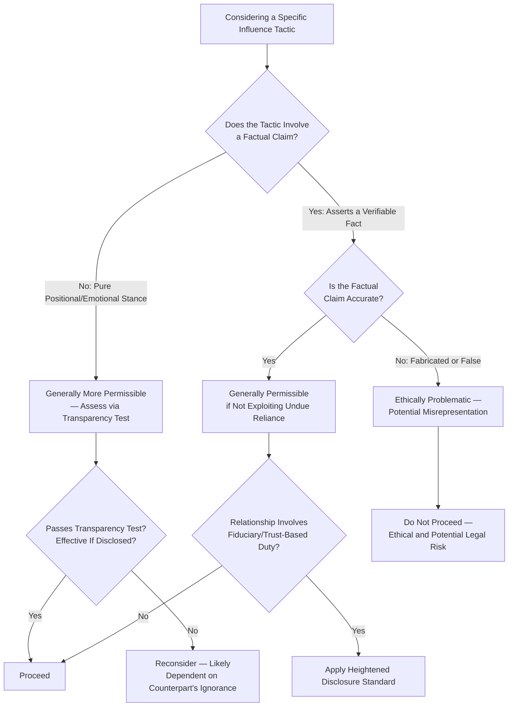

## Ethical Boundaries of Influence Tactics

### Overview

This topic addresses the normative and practical boundaries distinguishing legitimate persuasive and power-based influence from manipulative, deceptive, or exploitative negotiation conduct. Where earlier topics treated persuasion, framing, and power tactics primarily as descriptive/effectiveness-oriented tools, this topic applies an explicitly evaluative lens: what separates acceptable strategic behavior from conduct that is ethically problematic, reputationally damaging, or in some cases legally actionable. This synthesis draws on negotiation ethics scholarship (notably work by G. Richard Shell and Robert Bordone), legal doctrine on misrepresentation, and general ethical frameworks applied to bargaining contexts.

### Theoretical Foundations

**The Negotiator's Ethical Dilemma**

Negotiation ethics scholarship frames a persistent tension: negotiation inherently involves strategic non-disclosure and selective emphasis (a negotiator is not generally obligated to volunteer their reservation price or every weakness in their position), yet must operate within some ethical and legal boundary that prohibits affirmative deception. G. Richard Shell's *Bargaining for Advantage* frames this as a spectrum from "Poker School" ethics (bluffing and strategic misrepresentation of one's own position is a legitimate and expected part of the negotiation "game," analogous to bluffing in poker) to "Idealist School" ethics (negotiators bear an affirmative duty of honesty and fair dealing even regarding their own position, not merely factual claims about external matters).

**Legal Distinction: Opinion/Position vs. Fact**

Contract law in many jurisdictions distinguishes between:

- **Puffery and positional bluffing** (e.g., overstating one's enthusiasm for a deal, or one's willingness to walk away) — generally treated as an expected, non-actionable feature of negotiation.
- **Misrepresentation of material fact** (e.g., falsely claiming a competing offer exists, falsely describing a product's verifiable characteristics, or fabricating data) — generally treated as potentially actionable misrepresentation or fraud, depending on materiality, reliance, and jurisdiction-specific legal standards.

[Unverified in specific application — the precise legal boundary between permissible positional bluffing and actionable misrepresentation varies substantially by jurisdiction, contract type, and the specific facts of a case; this is a general doctrinal distinction, not a bright-line rule applicable without legal analysis in any specific situation]

### A Framework for Evaluating Influence Tactics

**1. The Transparency Test**

A widely-cited heuristic in negotiation ethics: would the tactic remain effective, and would the negotiator remain comfortable using it, if the counterpart were fully aware the tactic was being deployed? Tactics that depend on the counterpart's ignorance of the tactic itself (e.g., fabricated scarcity, false authority claims) generally fail this test; tactics that remain functional even when disclosed (e.g., genuine reciprocity, authentic rapport-building, legitimate objective-criteria argumentation) generally pass it.

**2. The Factual Accuracy Standard**

Distinguishes between:

- **Legitimate strategic ambiguity or non-disclosure**: Declining to volunteer one's reservation price, withholding assessment of one's own BATNA strength, or emphasizing favorable aspects of an offer while not dwelling on unfavorable ones.
- **Affirmative misrepresentation**: Making a false factual claim about verifiable matters — fabricated competing offers, false claims about product specifications, misrepresented authority to bind an organization, or falsified supporting data.

**3. The Reciprocal Relationship Test**

Assesses whether a tactic exploits a position of trust or reliance that the counterpart has reasonably placed in the negotiator (e.g., in fiduciary or advisory relationships, or in long-standing trust-based relationships), which raises the ethical bar beyond what might be acceptable in a purely arm's-length, one-off transactional context.

### Categorization of Common Tactics by Ethical Standing

| Tactic | Ethical Standing | Rationale |
| --- | --- | --- |
| Withholding one's reservation price | Generally accepted | Standard, expected feature of any negotiation; disclosure is not a default obligation |
| Emphasizing favorable terms, downplaying unfavorable ones | Generally accepted | Selective emphasis, not falsification, of accurate information |
| Genuine reciprocity/rapport-building | Generally accepted | Authentic influence mechanisms functional even when disclosed |
| Real deadline/scarcity framing | Generally accepted | Accurately conveys a genuine constraint |
| Bluffing about one's own resolve or walk-away willingness | Contested / context-dependent | "Poker School" treats as legitimate; "Idealist School" treats as a boundary violation; legal treatment generally more permissive than for factual claims |
| Fabricated competing offers or false BATNA claims | Widely regarded as unethical | Affirmative misrepresentation of a verifiable fact |
| False authority claims (misrepresenting capacity to bind) | Widely regarded as unethical, often legally actionable | Misrepresents a verifiable, material fact affecting the counterpart's reliance |
| Manufactured artificial scarcity presented as genuine | Widely regarded as unethical | Factually false claim designed to exploit loss aversion |
| Exploiting counterpart's known cognitive biases via deceptive framing (vs. legitimate framing of true information) | Contested, trending toward unethical when framing obscures material truth | Distinguishes fair emphasis from exploitation of predictable irrationality to obscure true terms |
| Exploiting information asymmetry the counterpart could not reasonably have discovered themselves regarding defects | Context-dependent, often legally constrained (e.g., disclosure duties in some contract types) | Duty to disclose varies by jurisdiction, contract type (e.g., real estate, securities), and relationship (fiduciary vs. arm's-length) |

### Ethical Boundary Decision Flow

### Reputational and Relational Consequences of Boundary Violations

Beyond the direct ethical and legal dimensions, boundary-violating tactics carry documented practical costs connected to earlier topics in this chapter:

- **Relational power destruction**: As established under *Structural, Relational, and Informational Power*, trust is asymmetric — slow to build, fast to destroy. A single discovered instance of factual misrepresentation can permanently eliminate relational power that took extended, consistent dealing to accumulate.
- **Leverage collapse upon exposure**: As noted under *Building and Sustaining Leverage*, bluffs and false claims that are tested and exposed produce a severe, often irreversible leverage collapse — the negotiator's future claims (even truthful ones) become substantially less credible.
- **Network/reputational contagion**: In industries or professional communities with meaningful reputational visibility, a single significant ethical violation can propagate beyond the immediate counterpart, affecting the negotiator's standing with future, unrelated counterparts.

### Cultural and Contextual Variation in Ethical Norms

As with communication norms generally (see *Cross-Cultural Communication Pitfalls*), the perceived ethical boundary for certain tactics (particularly positional bluffing about resolve or interest level) varies to some degree across cultural and industry contexts — what is considered a normal, expected feature of negotiation "gamesmanship" in one context may be viewed as a more serious integrity concern in another. [Inference — while some variation in norms around positional bluffing is documented in cross-cultural negotiation literature, this variation is generally understood to apply to bluffing about one's own position/resolve, not to fabrication of verifiable third-party facts, which is more consistently treated as impermissible across contexts]

### Common Pitfalls

- **Conflating all strategic behavior with unethical manipulation**: Overcorrecting toward excessive self-disclosure (e.g., volunteering one's full reservation price unprompted) based on a mistaken belief that any strategic non-disclosure is inherently unethical, when selective emphasis and non-disclosure of one's own position are standard, accepted negotiation features.
- **Underestimating the durability of reputational damage**: Treating a single instance of factual misrepresentation as a low-risk, isolated tactical choice, without accounting for the compounding relational and reputational costs documented in prior topics.
- **Ambiguity creep**: Gradually shifting from legitimate strategic ambiguity into effectively misleading implication (e.g., strongly implying a false fact without directly asserting it) — a category that raises similar ethical concerns to direct misrepresentation even though it may occupy a legally greyer area. [Inference — the legal and ethical treatment of misleading implication (as opposed to direct false statement) is a genuinely unsettled and jurisdiction-dependent area, distinct from the clearer case of direct factual misrepresentation]
- **Failing to distinguish relationship type**: Applying arm's-length transactional ethical norms in a context involving a fiduciary or heightened-trust relationship, where disclosure obligations may be legally and ethically more stringent.
- **Assuming legal permissibility equals ethical acceptability**: Treating "not illegal" as a sufficient ethical standard, when many negotiation ethics frameworks (and long-term relationship/reputational considerations) impose a higher bar than bare legal compliance.

### Integration with Broader Negotiation Frameworks

- **Principles of Persuasion and Social Influence**: The ethical framework here directly qualifies the application of Cialdini's principles — genuine scarcity, authority, and reciprocity are ethically distinct from fabricated versions of the same principles.
- **Building and Sustaining Leverage**: The leverage-erosion risks of bluff exposure (covered previously) are the practical, self-interested corollary of the ethical case against fabricated leverage claims.
- **Framing and Reframing Proposals**: The boundary between legitimate framing of true information and manipulative exploitation of cognitive bias is directly addressed by the factual-accuracy standard developed here.
- **Cross-Cultural Communication Pitfalls**: Ethical norm variation across cultural and industry contexts requires the same calibration discipline as other cross-cultural communication considerations.

### Practical Application Framework

1. **Apply the transparency test to any tactic under consideration**: If the tactic depends on the counterpart's ignorance that it is being used, treat it as a warning sign requiring further ethical scrutiny.
2. **Maintain a clear internal boundary between strategic non-disclosure and affirmative misrepresentation**: Withholding one's own position is standard; asserting false facts is not.
3. **Apply heightened standards in trust-based or fiduciary relationships**: Recognize that disclosure obligations and ethical expectations shift in relationships involving reasonable reliance beyond arm's-length dealing.
4. **Weigh short-term tactical gain against long-term relational and reputational cost**: Particularly in repeated-game or reputation-visible contexts, factor the asymmetric trust-destruction dynamic into any decision to use boundary-adjacent tactics.
5. **Seek jurisdiction-specific legal guidance for high-stakes ambiguous cases**: Where a tactic approaches the misrepresentation boundary in a significant transaction, treat this as a legal question requiring qualified counsel rather than a purely tactical judgment call.

**Related Topics**

- Principles of Persuasion and Social Influence
- Framing and Reframing Proposals
- Building and Sustaining Leverage
- Structural, Relational, and Informational Power
- Deception and Bluffing in Negotiation Theory
- Cross-Cultural Communication Pitfalls
- Trust-Building in Repeated Negotiation Contexts
- Legal Doctrines of Misrepresentation in Contract Formation