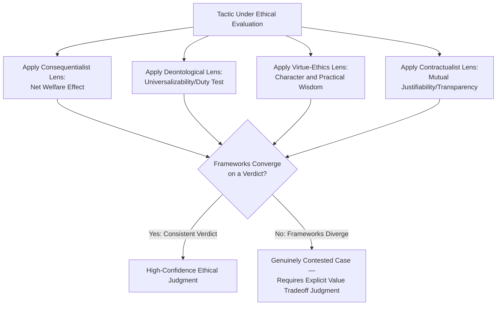

## Ethical Frameworks for Bargaining Behavior

### Overview

This topic establishes the major normative-ethical traditions that can be applied to evaluate bargaining conduct, providing the philosophical foundation underlying the more tactic-specific ethical analysis covered previously under *Ethical Boundaries of Influence Tactics*. Where that prior topic offered a practical framework (transparency test, factual-accuracy standard) for evaluating specific tactics, this topic surveys the broader ethical theories from moral philosophy that different practitioners, scholars, and legal systems draw upon — consequentialism, deontology, virtue ethics, and contractualism — and examines how each yields different (and sometimes conflicting) conclusions about acceptable negotiation conduct.

### Theoretical Foundations

**Why Multiple Frameworks Are Needed**

Negotiation ethics scholarship (notably work by Shell, Lewicki, and colleagues in this domain) observes that no single ethical framework provides a universally satisfying or complete answer to what counts as acceptable bargaining behavior — different frameworks emphasize different considerations (outcomes, duties, character, or mutual agreement), and applying multiple lenses to a given tactic often surfaces different, sometimes conflicting, verdicts. Understanding the major frameworks equips negotiators to recognize which values are actually at stake in a given ethical judgment, rather than relying on unexamined intuition alone.

### The Major Ethical Frameworks Applied to Negotiation

**1. Consequentialism (Outcome-Based Ethics)**

Evaluates the ethical status of a negotiation tactic based on its overall consequences — typically the aggregate welfare or utility produced across all affected parties, following the utilitarian tradition (Bentham, Mill).

**Application to negotiation**: A consequentialist evaluation of a tactic (e.g., withholding certain information, or a moderately aggressive anchoring strategy) asks whether its net effect — accounting for the negotiator's gain, the counterpart's loss, relationship damage, market efficiency effects, and any broader third-party impacts — produces better or worse aggregate outcomes than the alternative of not using the tactic.

**Strengths and limitations**: Consequentialism can justify some strategic non-disclosure or bluffing when it facilitates efficient deal-making without net harm, but faces difficulty establishing clear, generalizable rules, since outcome evaluation is highly context- and case-specific, and requires uncertain projections about downstream effects (e.g., long-term reputational consequences) at the time the tactic is deployed.

**2. Deontological Ethics (Duty-Based Ethics)**

Evaluates conduct based on adherence to moral duties and rules, independent of consequences, drawing on the Kantian tradition — notably the categorical imperative's requirement that one act only according to a maxim one could will to become a universal law, and its prohibition on treating persons merely as means to an end rather than as ends in themselves.

**Application to negotiation**: A deontological framework would evaluate a tactic like fabricating a competing offer by asking whether a rule permitting such fabrication could be universally willed (it plausibly could not, since universal permission to fabricate facts would undermine the very possibility of trust-based communication that negotiation depends on), and whether the tactic treats the counterpart merely as a means to extract value rather than as an autonomous agent entitled to accurate information relevant to their own consent.

**Strengths and limitations**: Provides clearer, more generalizable rules than consequentialism (e.g., "do not state false facts" is a workable universal rule), but can be criticized as insufficiently sensitive to context — a strict deontological reading might struggle to distinguish between the widely-accepted practice of withholding one's reservation price and more clearly problematic deception, without further refinement of which duties apply to which categories of claims.

**3. Virtue Ethics (Character-Based Ethics)**

Evaluates conduct based on whether it reflects and reinforces virtuous character traits — honesty, fairness, prudence, courage, temperance — drawing on the Aristotelian tradition, rather than focusing primarily on rules or outcomes.

**Application to negotiation**: A virtue-ethics lens asks not "does this tactic violate a rule" or "does this tactic produce good outcomes," but "what would a person of good character, exercising practical wisdom (phronesis), do in this situation, and does using this tactic align with or undermine the negotiator's own integrity and the kind of professional they aspire to be." This framework naturally accommodates the observation that identical tactics might be judged differently based on the manner and spirit in which they are deployed, not just their formal structure.

**Strengths and limitations**: Virtue ethics offers rich guidance sensitive to nuance and character, but provides less determinate, checklist-style guidance for specific edge cases, since it depends substantially on the practical judgment (phronesis) of the individual negotiator rather than a clear decision rule.

**4. Contractualism / Social Contract Ethics**

Evaluates conduct based on whether it could be justified to all affected parties under principles they could reasonably not reject, drawing on the tradition associated with Rawls and Scanlon.

**Application to negotiation**: This framework closely parallels the "transparency test" introduced in the prior topic — a tactic is contractualist-acceptable if it could be justified to the counterpart under principles of fair dealing that the counterpart could not reasonably reject even knowing the tactic would be used against them. It provides a strong theoretical grounding for why transparency-dependent tactics (those that only work because the counterpart doesn't know they're being used) are ethically suspect: such tactics could not be justified under principles the counterpart would accept if fully informed.

### Ethical Framework Comparison Table

| Framework | Core Question | Negotiation Application | Key Limitation |
| --- | --- | --- | --- |
| Consequentialism | Does this maximize net welfare? | Weigh aggregate gains/losses across all affected parties | Difficult to generalize; requires uncertain outcome projection |
| Deontology | Does this violate a universalizable duty? | Test whether the underlying maxim could be universally willed | Can be rigid; struggles with legitimate strategic ambiguity |
| Virtue Ethics | Does this reflect good character/practical wisdom? | Ask what a person of integrity would do in this specific context | Less determinate for specific edge-case rules |
| Contractualism | Could this be justified to the counterpart under fair principles? | Apply a mutual-justifiability/transparency standard | Requires judgment about what counts as "reasonable" rejection |

### Applying Multiple Frameworks to a Single Tactic

**Example: Positional Bluffing About Walk-Away Willingness**

> A negotiator states "I'm prepared to walk away from this deal entirely" while privately still highly motivated to reach agreement.

- **Consequentialist view**: Likely acceptable if it facilitates efficient bargaining without generating net harm — a common, expected feature of distributive bargaining that both parties implicitly understand may not reflect literal truth.
- **Deontological view**: More contested — asserting a false statement about one's own state of mind arguably violates a duty of honesty, though some deontological analyses distinguish statements about one's own subjective disposition (arguably a matter of strategic positioning rather than a "fact" in the relevant sense) from statements about external verifiable facts.
- **Virtue-ethics view**: Depends on manner and degree — an occasional, moderate overstatement of resolve within expected negotiation norms may not offend a virtuous character, while habitual, extreme, or manipulative overstatement might.
- **Contractualist view**: Plausibly acceptable under the transparency test, since experienced counterparts generally expect some degree of resolve-signaling exaggeration as a conventional feature of bargaining, meaning the practice could be justified under norms both parties implicitly understand and accept.

This convergence-with-caveats across frameworks (each yields a broadly similar but not identical verdict, with genuine areas of internal contestation) illustrates why positional bluffing about resolve occupies a genuinely contested middle ground in negotiation ethics, distinct from the clearer case of fabricating verifiable third-party facts (which fails more decisively across all four frameworks).

### Multi-Framework Ethical Evaluation Flow

### Common Pitfalls

- **Single-framework tunnel vision**: Relying exclusively on one ethical framework (most commonly an implicit, unexamined consequentialism — "it worked out fine, so it was fine") without considering how other frameworks might yield a different verdict.
- **Treating framework divergence as framework failure**: Assuming that because different ethical frameworks yield different conclusions on a contested case, ethical analysis is therefore useless or arbitrary — divergence on genuinely hard cases is an expected feature of moral philosophy, not evidence that the frameworks lack value on clearer cases.
- **Conflating personal comfort with ethical justification**: Treating one's own lack of discomfort with a tactic as sufficient ethical validation, without applying any of the more structured frameworks above.
- **Ignoring the virtue-ethics dimension of habitual practice**: Focusing exclusively on the ethical status of a single, isolated tactical decision while ignoring the character-forming effect of habitually using boundary-adjacent tactics over a career.
- **Assuming contractualist acceptability from silence**: Assuming a counterpart's failure to object to a tactic constitutes contractualist justification, when the counterpart may simply be unaware the tactic is being used (which is precisely the condition the transparency/contractualist test is designed to screen out).

### Integration with Broader Negotiation Frameworks

- **Ethical Boundaries of Influence Tactics**: This topic provides the underlying philosophical grounding for the practical transparency test and factual-accuracy standard introduced in that prior topic — the transparency test is, in substance, an applied contractualist heuristic.
- **Principles of Persuasion and Social Influence**: Each of the four frameworks yields a distinct evaluative lens on Cialdini-style influence principles, particularly regarding the boundary between genuine and fabricated scarcity/authority/social-proof claims.
- **Trust-Building in Repeated Negotiation Contexts**: Virtue ethics' emphasis on character and habitual practice connects directly to the long-term, cumulative nature of trust and reputation discussed under relational power.
- **Cross-Cultural Communication Pitfalls**: Different cultural and philosophical traditions may weight these four frameworks differently (e.g., relative emphasis on communal/consequentialist versus individual-duty-based reasoning varies across ethical traditions globally), adding a further layer of complexity to cross-cultural ethical judgment in negotiation.

### Practical Application Framework

1. **Apply multiple frameworks deliberately to contested tactics**, rather than defaulting to a single, often unexamined, ethical lens.
2. **Treat framework convergence as a stronger signal than any single framework's verdict alone**: when consequentialist, deontological, virtue, and contractualist analyses all point the same direction, confidence in the judgment increases substantially.
3. **Recognize genuinely contested cases explicitly**: When frameworks diverge, treat the decision as requiring an explicit value tradeoff (e.g., efficiency versus duty-based honesty) rather than searching for a false consensus.
4. **Consider the habitual, character-forming dimension of tactical choices**, not just the isolated-instance ethical status of a single negotiation decision.
5. **Calibrate for cross-cultural and professional-context variation** in which ethical framework(s) a given counterpart or industry implicitly prioritizes, without abandoning one's own ethical commitments.

**Related Topics**

- Ethical Boundaries of Influence Tactics
- Trust-Building in Repeated Negotiation Contexts
- Principles of Persuasion and Social Influence
- Cross-Cultural Communication Pitfalls
- Fairness Perceptions and Distributive Justice in Negotiation
- Legal Doctrines of Misrepresentation in Contract Formation
- Reputation and Long-Term Relationship Management
- Deception and Bluffing in Negotiation Theory