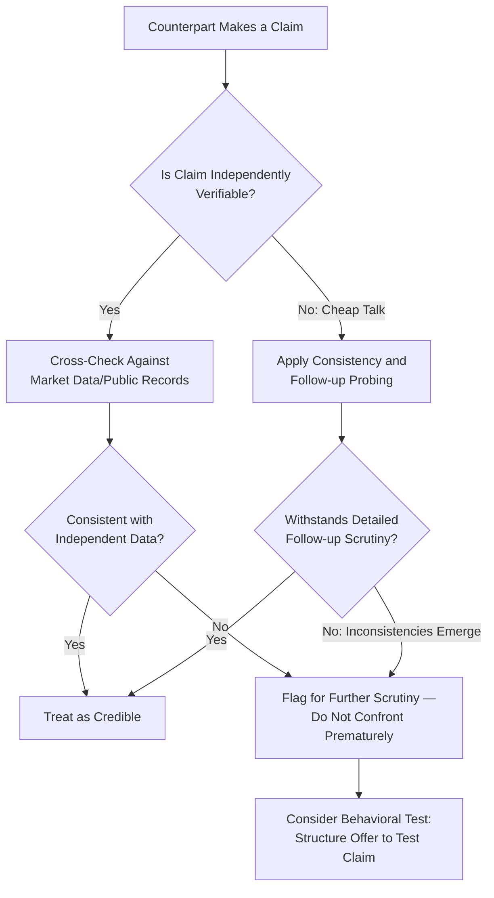

## Deception, Bluffing, and Strategic Misrepresentation

### Overview

This topic provides a focused technical treatment of deception and bluffing as a distinct negotiation phenomenon — building on the ethical frameworks and boundary-setting concepts developed in the two preceding topics, but centering specifically on the mechanics, taxonomy, detection, and strategic risk calculus of misrepresentation in bargaining. Deception in negotiation occupies a uniquely studied position in the literature because it sits at the intersection of game theory (strategic information transmission), psychology (detection and cognitive load), and ethics/law (permissibility boundaries), each contributing distinct analytical tools.

### Theoretical Foundations

**Game-Theoretic Basis: Cheap Talk and Costly Signaling**

As introduced under *Verbal and Nonverbal Signals in Negotiation*, negotiation is a game of incomplete information in which parties hold private information about reservation values and alternatives. Game theory distinguishes:

- **Cheap talk**: Costless, unverifiable statements (e.g., "our budget is fixed") that carry no inherent credibility because they cost nothing to make whether true or false. Rational counterparts should, in principle, substantially discount cheap talk absent other corroborating signals — though behavioral research shows real negotiators often under-discount cheap talk relative to this theoretical prediction. [Inference — the degree of underweighting of cheap-talk discounting in real negotiators is documented in behavioral experiments but varies by individual, context, and experience level]
- **Costly signaling**: Statements or actions that carry a genuine cost to the sender, making them credible because a party who did not hold the underlying true state would not rationally incur the cost (related to Spence's signaling theory, originally developed for labor market contexts). In negotiation, a costly signal might be a formal written commitment with contractual consequences, or a public statement that carries reputational cost if later proven false.

**Why Bluffing Can Be Rational (Descriptively) Under Game Theory**

In a purely strategic, repeated or one-shot game-theoretic model with no reputational or ethical constraints, some degree of strategic bluffing about one's own reservation value can be part of an equilibrium strategy, since fully truthful revelation of one's reservation price would eliminate any distributive bargaining advantage. This descriptive game-theoretic observation is distinct from — and should not be conflated with — a normative claim that such bluffing is therefore ethically unconstrained; the ethical frameworks covered in the prior topic apply independent of the game-theoretic rationality of the behavior.

### Taxonomy of Deceptive and Bluffing Behaviors

| Category | Description | Example |
| --- | --- | --- |
| Positional Bluffing | Misrepresenting one's resolve, walk-away willingness, or enthusiasm | "I'm completely indifferent to whether this deal happens" |
| Reservation Price Misrepresentation | Falsely stating a limit tighter or looser than the true reservation value | "My absolute maximum is $40,000" when the true maximum is $55,000 |
| False BATNA Claims | Fabricating or exaggerating the quality of one's alternatives | Claiming a competing offer exists when none does |
| Authority Misrepresentation | Falsely claiming or denying capacity to bind an organization to a deal | "I don't have authority to approve this" when authority in fact exists (used to extract further concessions) |
| Factual Misrepresentation | Falsifying verifiable facts about the subject of the negotiation | Misstating a product's specifications, condition, or performance history |
| Intentions Misrepresentation | Concealing a true intended future use or plan relevant to the deal | Concealing an intention to resell or repurpose an asset in a way that would affect the counterpart's willingness to sell |
| Strategic Silence/Omission | Withholding materially relevant information without affirmatively lying | Not volunteering a known defect the counterpart has not asked about |

[Unverified as uniformly categorized in practice — the boundary between "strategic silence" and an affirmative duty to disclose varies substantially by jurisdiction, contract type, and the presence of any fiduciary relationship, making this category's ethical/legal status the most context-dependent in the taxonomy]

### Bluffing Risk-Reward Calculus

A negotiator's decision to bluff can be modeled as a risk-weighted calculation:

$$E[\text{Bluff}] = p_{\text{success}} \cdot G_{\text{success}} - p_{\text{exposure}} \cdot C_{\text{exposure}}$$

Where $p_{\text{success}}$ is the probability the bluff is not tested or challenged, $G_{\text{success}}$ is the gain if it succeeds, $p_{\text{exposure}}$ is the probability the bluff is exposed, and $C_{\text{exposure}}$ is the cost of exposure (immediate leverage collapse, relationship damage, reputational contagion — per *Building and Sustaining Leverage*). [Inference — this is a simplified conceptual decomposition for illustrating the tradeoff structure, not a formula negotiators can practically compute with precise inputs; real bluffing decisions involve substantial uncertainty in all four terms and additional non-monetary considerations such as ethical cost]

The key structural insight is that $C_{\text{exposure}}$ is frequently underestimated in the moment of decision (due to present-bias and motivated reasoning about the likelihood of exposure), while the relationship and reputational components of that cost — particularly in repeated-game contexts — are often larger and more durable than the immediate transactional gain at stake.

### Bluff Detection and Deception Cues

**Detection Approaches (and Their Limits)**

- **Nonverbal/paralinguistic cues**: As covered under *Verbal and Nonverbal Signals in Negotiation*, cues such as gaze aversion, pitch elevation, or micro-expressions are popularly associated with deception, but empirical deception-detection research (e.g., meta-analyses by Bond & DePaulo) consistently finds that human lie-detection accuracy from behavioral cues alone is only modestly better than chance for most observers, and that reliable cues vary substantially by individual rather than following a universal "tell." [Unverified as a reliable individual-diagnostic tool — this is a robust finding regarding average human detection accuracy across many studies, but does not rule out higher accuracy for specifically trained observers or in specific narrow contexts]
- **Consistency-checking across statements**: Cross-referencing a counterpart's claims against independently verifiable information (market data, public records, prior statements) is generally a more reliable detection method than behavioral cue-reading alone, since it relies on factual triangulation rather than uncertain psychological inference.
- **Behavioral testing**: Structuring an offer or question specifically designed to test whether a claimed constraint (e.g., a stated BATNA or deadline) is genuine — for example, offering terms that would only be accepted if a claimed alternative were in fact weaker than represented, and observing the response.
- **Diagnostic questioning follow-through**: As covered under *Active Listening and Diagnostic Questioning*, probing follow-up questions on a claim can reveal inconsistencies that a fabricated claim struggles to sustain under detailed scrutiny, since maintaining a coherent false narrative across many specific follow-up questions is cognitively demanding.

### Deception Risk-Detection Interaction Flow

### Managing Deception Risk as the Target Party

- **Avoid overreliance on behavioral cue-reading**: Given the weak empirical reliability of nonverbal deception cues for most observers, prioritize factual verification and consistency-checking over intuitive "gut feeling" lie detection.
- **Use calibrated, non-accusatory follow-up questions**: Direct accusations of dishonesty tend to escalate conflict and rarely produce reliable information; calibrated questions that probe details of a claim (see *Active Listening and Diagnostic Questioning*) are generally more productive for surfacing inconsistency without triggering defensive escalation.
- **Structure verifiable commitments where high-stakes claims are pivotal**: Where a specific factual claim is materially important to the deal's value (e.g., a represented condition or specification), consider structuring the agreement with representations, warranties, or verification contingencies rather than relying on unverified assertion alone.
- **Weigh relationship history**: Prior consistent, verified honesty from a counterpart is legitimate (though not conclusive) evidence supporting the credibility of new claims, connecting to relational power's role as an ongoing trust signal.

### Common Pitfalls

- **Overconfidence in personal lie-detection ability**: A well-documented finding in deception research is that most people, including professionals in fields requiring deception detection, substantially overestimate their own ability to detect lies from behavioral cues alone. [Unverified for any specific individual's actual detection skill — this is a general finding about average overconfidence across studied populations, not a claim about any particular person]
- **Escalating bluffs once committed**: A documented risk pattern where an initial bluff, once made, generates pressure to escalate or double down when challenged rather than retreat, potentially compounding the eventual cost of exposure.
- **Underestimating relationship-context deception costs**: Treating a one-off transactional deception calculus as applicable in a repeated-game or reputation-visible relationship, where the true cost of exposure is substantially higher than a one-shot analysis would suggest.
- **Conflating strategic silence with active deception in legal/ethical analysis**: Failing to recognize that many jurisdictions and contract types impose affirmative disclosure duties in specific contexts (e.g., known material defects in certain regulated transactions), where "I didn't lie, I just didn't say" is not a reliable ethical or legal shield.
- **Weaponizing bluff-detection accusations tactically**: Using unfounded accusations of dishonesty as a pressure tactic against a truthful counterpart, which itself raises the ethical concerns addressed in the preceding topics and risks significant relationship damage if the accusation proves unfounded.

### Integration with Broader Negotiation Frameworks

- **Ethical Frameworks for Bargaining Behavior / Ethical Boundaries of Influence Tactics**: This topic's taxonomy operationalizes the abstract ethical distinctions (positional bluffing vs. factual misrepresentation) developed in the two preceding topics into specific behavioral categories.
- **Building and Sustaining Leverage**: The exposure-cost side of the bluffing risk calculus directly extends the leverage-erosion risks (bluff exposure) introduced in that earlier topic.
- **Verbal and Nonverbal Signals in Negotiation**: Deception-cue research directly qualifies and tempers the earlier discussion of nonverbal signal reading, emphasizing the empirical limits of cue-based detection.
- **Active Listening and Diagnostic Questioning**: Diagnostic follow-up questioning is the primary practical tool for both surfacing genuine interests and testing the consistency of potentially deceptive claims.

### Practical Application Framework

1. **Default toward factual verification over intuitive cue-reading** when a claim's accuracy materially matters to the negotiation's outcome.
2. **Use calibrated, non-accusatory follow-up questioning** to test claim consistency without triggering unproductive defensive escalation.
3. **Explicitly weigh relationship context in any personal bluffing calculus**: Recognize that the true expected cost of a bluff is substantially understated by a narrow, single-transaction analysis in any relationship with repeat-interaction or reputational visibility.
4. **Structure high-stakes factual claims into verifiable contractual terms** (representations, warranties, contingencies) rather than relying on unverified assertions where the stakes justify the additional transaction cost.
5. **Maintain the ethical distinction between legitimate positional ambiguity and factual misrepresentation** established in the preceding two topics as a practical decision filter before using any borderline tactic.

**Related Topics**

- Ethical Frameworks for Bargaining Behavior
- Ethical Boundaries of Influence Tactics
- Building and Sustaining Leverage
- Verbal and Nonverbal Signals in Negotiation
- Active Listening and Diagnostic Questioning
- Trust-Building in Repeated Negotiation Contexts
- Legal Doctrines of Misrepresentation in Contract Formation
- Game-Theoretic Approaches to Negotiation