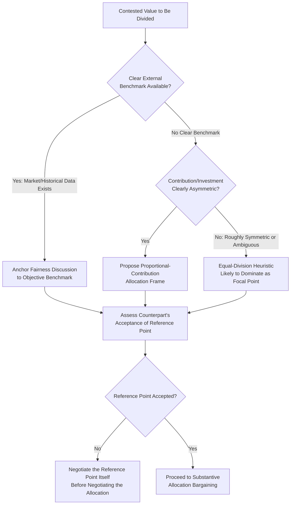

## Fairness Norms and Equity Judgments

### Overview

Fairness norms and equity judgments concern how negotiators and third parties evaluate whether a proposed or actual distribution of negotiated value is just — a psychological and normative dimension distinct from, but deeply interacting with, the purely strategic power and leverage analysis covered in earlier chapters. Perceived fairness affects not only whether a proposal is accepted, but also the durability of the resulting agreement, the health of the ongoing relationship, and the likelihood of future cooperative behavior — making fairness a practically consequential variable even for negotiators motivated purely by self-interested outcomes.

### Theoretical Foundations

**Equity Theory (Adams, 1963)**

J. Stacy Adams's equity theory, originally developed in organizational psychology, proposes that individuals evaluate fairness by comparing their own ratio of outcomes to inputs against a comparison other's ratio:

$$\frac{O_{\text{self}}}{I_{\text{self}}} \; \text{vs.} \; \frac{O_{\text{other}}}{I_{\text{other}}}$$

Where $O$ represents outcomes received and $I$ represents inputs contributed (effort, resources, risk, contribution). Perceived inequity — in either direction, whether one feels under-rewarded or over-rewarded relative to the comparison ratio — generates psychological discomfort that motivates corrective action: renegotiation demands, reduced future cooperation, or relationship exit. In negotiation specifically, this implies that a party's satisfaction with a deal depends not only on the absolute value received, but on the perceived proportionality between what each party contributed and what each party received.

**Distributive, Procedural, and Interactional Justice**

Organizational and social-psychological justice research (notably Thibaut & Walker on procedural justice, and Bies & Moag on interactional justice) distinguishes three dimensions of fairness perception directly applicable to negotiated outcomes:

| Justice Dimension | Focus | Negotiation Application |
| --- | --- | --- |
| Distributive Justice | Fairness of the actual outcome/allocation | Is the final split of value perceived as proportionate and reasonable? |
| Procedural Justice | Fairness of the process used to reach the outcome | Was the negotiation process itself perceived as fair — voice, transparency, consistency? |
| Interactional Justice | Fairness of interpersonal treatment during the process | Was the counterpart treated with respect, honesty, and dignity throughout? |

A key empirical finding across justice research is that **procedural and interactional fairness can substantially moderate reactions to distributive outcomes** — parties who perceive the negotiation process as fair and respectful often accept a less favorable distributive outcome with greater satisfaction and lower likelihood of relationship rupture than parties who receive an objectively similar (or even better) outcome through a process perceived as unfair or disrespectful.

**Behavioral Economics: The Ultimatum Game and Fairness Preferences**

Experimental economics research using the ultimatum game (Güth, Schmittberger & Schwarze, 1982) provides robust evidence that fairness preferences are not merely a philosophical nicety but a measurable behavioral phenomenon: proposers in ultimatum game experiments consistently offer substantially more than a purely self-interested rational-actor model would predict, and responders frequently reject offers perceived as unfairly low even though rejection leaves both parties with nothing — a result replicated extensively across cultures (with meaningful cross-cultural variation in the specific thresholds, per work by Henrich and colleagues), demonstrating that fairness concerns are a genuine, quantifiable input to bargaining behavior rather than a purely rhetorical consideration.

### Common Fairness Reference Points in Negotiation

Since fairness judgments are inherently comparative (per equity theory), negotiators and counterparts typically anchor fairness evaluations to one or more reference points:

| Reference Point | Description |
| --- | --- |
| Equal Division | A 50/50 split of contested value, often used as a focal/default fairness heuristic even absent principled justification for equality specifically |
| Historical Precedent | Terms consistent with prior deals between the same parties or comparable prior transactions |
| Market/Industry Benchmark | Terms consistent with prevailing market rates or industry-standard practice |
| Proportional Contribution | Division proportional to each party's relative investment, risk, or contribution (equity theory's input-ratio comparison) |
| Need-Based Allocation | Division based on relative need rather than contribution or equality (more common in relational/communal contexts than commercial ones) |

[Inference — which reference point a given counterpart will apply is not always predictable in advance and can itself become a point of negotiation; research suggests equal-division heuristics are particularly powerful as a focal point in ambiguous cases lacking a clear alternative benchmark, but this does not mean all parties default to equal division in all contexts]

### Fairness Reference Point Selection and Negotiation Interaction

### Fairness Perception vs. Objective Distribution (svg_diagram)

<svg xmlns="http://www.w3.org/2000/svg" viewBox="0 0 700 360">
<text x="350" y="30" font-family="Arial, sans-serif" font-size="16" font-weight="bold" text-anchor="middle" fill="#1a1a2e">Distributive Outcome vs. Perceived Fairness (svg_diagram)</text>
<rect x="60" y="80" width="280" height="200" rx="8" fill="#4a5b8c" opacity="0.15" stroke="#4a5b8c" stroke-width="1.5" />
<text x="200" y="105" font-family="Arial, sans-serif" font-size="13" font-weight="bold" text-anchor="middle" fill="#4a5b8c">Fair Process + Modest Outcome</text>
<text x="200" y="140" font-family="Arial, sans-serif" font-size="11" text-anchor="middle" fill="#333333">Transparent negotiation,</text>
<text x="200" y="158" font-family="Arial, sans-serif" font-size="11" text-anchor="middle" fill="#333333">respectful treatment,</text>
<text x="200" y="176" font-family="Arial, sans-serif" font-size="11" text-anchor="middle" fill="#333333">clear objective criteria used</text>
<text x="200" y="230" font-family="Arial, sans-serif" font-size="24" font-weight="bold" text-anchor="middle" fill="#3f7a4f">Often HIGH satisfaction</text>
<text x="200" y="255" font-family="Arial, sans-serif" font-size="11" text-anchor="middle" fill="#3f7a4f">despite modest distributive share</text>
<rect x="360" y="80" width="280" height="200" rx="8" fill="#8c4a4a" opacity="0.15" stroke="#8c4a4a" stroke-width="1.5" />
<text x="500" y="105" font-family="Arial, sans-serif" font-size="13" font-weight="bold" text-anchor="middle" fill="#8c4a4a">Unfair Process + Similar Outcome</text>
<text x="500" y="140" font-family="Arial, sans-serif" font-size="11" text-anchor="middle" fill="#333333">Opaque process,</text>
<text x="500" y="158" font-family="Arial, sans-serif" font-size="11" text-anchor="middle" fill="#333333">disrespectful treatment,</text>
<text x="500" y="176" font-family="Arial, sans-serif" font-size="11" text-anchor="middle" fill="#333333">arbitrary criteria imposed</text>
<text x="500" y="230" font-family="Arial, sans-serif" font-size="24" font-weight="bold" text-anchor="middle" fill="#a13f3f">Often LOW satisfaction</text>
<text x="500" y="255" font-family="Arial, sans-serif" font-size="11" text-anchor="middle" fill="#a13f3f">despite comparable distributive share</text>

<text x="350" y="320" font-family="Arial, sans-serif" font-size="11" font-style="italic" text-anchor="middle" fill="`#555555`">Procedural and interactional justice substantially moderate reactions to distributive outcomes</text>

</svg>

### Practical Implications for Negotiators

**1. Investing in Procedural Fairness**

Since procedural justice moderates reactions to distributive outcomes, negotiators benefit from deliberately structuring the negotiation process itself to be perceived as fair: providing the counterpart genuine voice (an opportunity to explain their position and be heard, connecting to *Active Listening and Diagnostic Questioning*), maintaining consistency in how criteria are applied, and being transparent about the reasoning behind proposed terms — independent of the ultimate distributive outcome.

**2. Anchoring to Legitimate Reference Points**

Directly connecting to *Framing and Reframing Proposals* and the legitimacy-based power source (see *Sources and Bases of Negotiation Power*), proactively proposing and justifying a specific fairness reference point (market benchmark, proportional contribution) shapes the fairness discussion on favorable terms before the counterpart anchors to a less favorable one (e.g., unhelpful equal-division default when proportional contribution would favor the proposing party).

**3. Managing Interactional Justice**

Maintaining respectful, dignified treatment throughout the negotiation — independent of distributive or procedural considerations — has an independent effect on satisfaction and relationship durability, meaning interpersonal conduct during a negotiation carries real, measurable stakes beyond simple politeness norms.

**4. Recognizing Fairness as a Constraint on Power Exercise**

As noted under *Managing and Offsetting Power Asymmetries*, high-power parties who ignore fairness perceptions in relationships with future value risk generating resentment, reduced future cooperation, or reputational costs that a purely power-based, fairness-blind analysis would fail to predict — fairness functions as a genuine strategic constraint, not merely an ethical nicety, particularly in repeated-game contexts.

### Common Pitfalls

- **Assuming self-interested rationality fully explains counterpart behavior**: Ignoring documented fairness preferences (per ultimatum game research) and being surprised when a counterpart rejects an objectively advantageous-to-them offer perceived as unfair relative to a salient reference point.
- **Neglecting procedural and interactional dimensions**: Focusing exclusively on optimizing the distributive outcome while ignoring process and treatment, potentially achieving a nominally favorable outcome that nonetheless damages the relationship or triggers post-agreement renegotiation demands.
- **Assuming a universal fairness reference point**: Treating equal division, market benchmarks, or proportional contribution as the objectively "correct" fairness standard, when reference-point selection is itself often contested and culturally variable.
- **Underestimating cross-cultural variation in fairness thresholds**: Ultimatum game research demonstrates meaningful cross-cultural variation in what offers are perceived as acceptably fair (see *Cross-Cultural Communication Pitfalls* for the broader cross-cultural caution), making fairness threshold assumptions risky in international contexts.
- **Treating fairness concerns as purely tactical rhetoric**: Dismissing a counterpart's stated fairness objection as mere negotiating posture, when genuine equity-theory-consistent psychological discomfort may be a real driver of their resistance, requiring substantive rather than purely rhetorical response.

### Integration with Broader Negotiation Frameworks

- **Framing and Reframing Proposals / Principled Negotiation**: Objective-criteria framing directly operationalizes the legitimate-reference-point mechanism for shaping fairness perception.
- **Managing and Offsetting Power Asymmetries**: Fairness norms function as one of the few reliable constraints on high-power party behavior, particularly in reputation-visible or repeated-game contexts.
- **Ethical Frameworks for Bargaining Behavior**: Equity theory and distributive justice provide an empirically-grounded psychological complement to the normative-philosophical fairness analysis developed in that topic.
- **Trust-Building in Repeated Negotiation Contexts**: Interactional and procedural justice are key mechanisms by which single-negotiation fairness perceptions accumulate into longer-term relational trust or resentment.

### Practical Application Framework

1. **Diagnose the counterpart's likely fairness reference point early**, using diagnostic questioning to surface which comparison (market rate, historical precedent, proportional contribution, equal division) they are implicitly applying.
2. **Invest deliberately in procedural fairness**: provide genuine voice, transparency, and consistency in criteria application, recognizing this independently affects satisfaction beyond the distributive outcome.
3. **Maintain interactional justice throughout**, treating respectful conduct as a substantive strategic input rather than incidental courtesy.
4. **Proactively propose and justify a favorable legitimate reference point** before the counterpart anchors to a less favorable default.
5. **Calibrate fairness threshold expectations to cultural and relational context**, avoiding the assumption of a universal fairness standard, particularly in cross-cultural or first-time counterpart relationships.

**Related Topics**

- Ethical Frameworks for Bargaining Behavior
- Framing and Reframing Proposals
- Sources and Bases of Negotiation Power
- Managing and Offsetting Power Asymmetries
- Cross-Cultural Communication Pitfalls
- Trust-Building in Repeated Negotiation Contexts
- Principled Negotiation and Objective Criteria
- Behavioral Game Theory and the Ultimatum Game