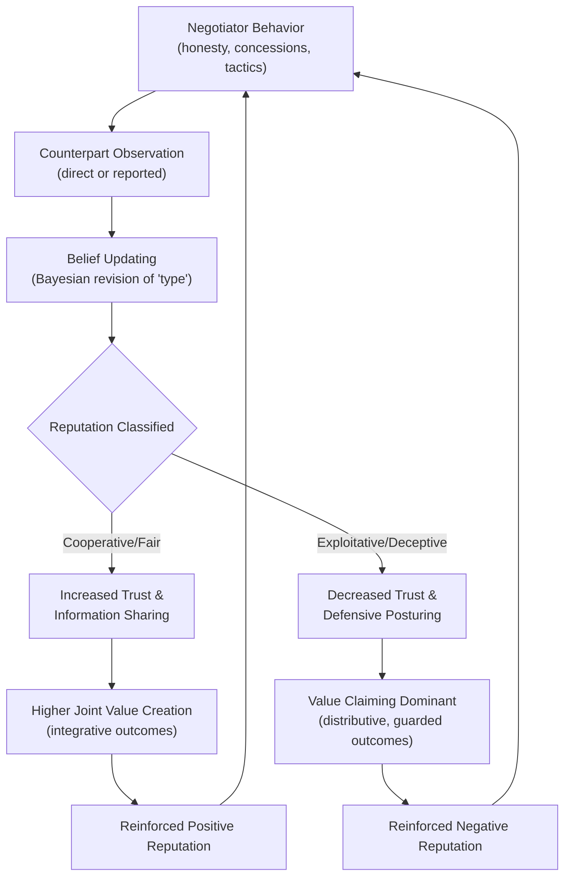

## Reputation Effects Across Repeated Interactions

### Definition and Conceptual Foundation

Reputation effects refer to the ways a negotiator's past conduct, disclosed or observed, shapes counterparts' expectations, strategies, and willingness to cooperate in current and future negotiations. Reputation functions as a compressed信号 (signal) of a negotiator's type: whether they are trustworthy, cooperative, aggressive, deceptive, or fair. In repeated interactions, whether with the same counterpart or within a network where information travels between parties, reputation accumulates as a form of social capital or social liability that persists beyond any single deal.

Reputation is distinct from trust in a specific relational sense: trust is typically dyadic and built through direct experience between two parties, while reputation is often triadic or networked, built through observation, hearsay, and third-party reporting. A negotiator can have a strong reputation with people they have never personally negotiated with.

### Theoretical Underpinnings

**Game-Theoretic Basis**

Reputation effects are formally modeled using repeated game theory. In a one-shot Prisoner's Dilemma, defection is the dominant strategy. However, in an infinitely or indefinitely repeated game, cooperation can become a rational equilibrium strategy due to the "shadow of the future," a concept most associated with Robert Axelrod's iterated Prisoner's Dilemma tournaments. The key mechanism is that a player's current action becomes an input into others' beliefs about future actions.

The Folk Theorem in game theory formalizes this: in repeated games with sufficiently patient players (a high enough discount factor), a wide range of cooperative outcomes can be sustained as Nash equilibria, supported by the threat of future punishment (retaliation, reputation loss) for defection today.

$$V_i = \sum_{t=0}^{\infty} \delta^t \pi_i(a_t)$$

Where $V_i$ is the total discounted payoff for player $i$, $\delta$ is the discount factor (patience, $0 < \delta < 1$), and $\pi_i(a_t)$ is the stage-game payoff at time $t$. A higher $\delta$ (players value future interactions more) makes cooperative, reputation-preserving strategies more sustainable, because the present value of future retaliation or lost opportunities outweighs the short-term gain from defecting now.

**Signaling and Bayesian Updating**

Reputation formation is often modeled through Bayesian games with incomplete information (Harsanyi, Kreps-Wilson framework). Counterparts hold a prior belief about a negotiator's "type" (e.g., cooperative vs. exploitative) and update this belief using Bayes' Rule as new evidence (negotiation behavior) becomes available.

$$P(\text{Type} \mid \text{Observed Behavior}) = \frac{P(\text{Observed Behavior} \mid \text{Type}) \cdot P(\text{Type})}{P(\text{Observed Behavior})}$$

This underlies the "chain-store paradox" (Selten, 1978), where a monopolist facing sequential entrants may fight early entrants (even at short-term loss) purely to build a reputation for toughness that deters later entrants, illustrating how reputational capital can be strategically invested.

### Mechanisms of Reputation Formation

**Direct Experience**

Repeated dyadic interaction between the same two parties, where each party's memory of prior rounds directly informs strategy (tit-for-tat and its variants).

**Network Transmission (Word-of-Mouth)**

Information about a negotiator's conduct spreads through professional networks, industry associations, or social ties. This is central in tightly-knit industries (real estate, diplomacy, mergers & acquisitions, labor relations) where the "small world" effect ensures that unethical tactics eventually surface to future counterparts.

**Institutionalized/Codified Reputation**

Formal rating systems (credit ratings, eBay/Uber-style reputation scores, Better Business Bureau ratings, court records for breach of contract) that quantify and publicize past conduct, reducing reliance on informal word-of-mouth.

**Media and Public Disclosure**

High-profile negotiation failures or breaches (e.g., corporate scandals, contract disputes reported in trade press) that damage reputation at scale, often irreversibly.

### Reputation as a Negotiation Asset (and Liability)

**Key Points**

- Reputation acts as a **credibility multiplier**: a negotiator with a reputation for honesty is more likely to have their claims (about BATNA, reservation price, constraints) believed without costly verification.
- Reputation for toughness can extract better outcomes in single deals but may deter counterparts from initiating future deals altogether, shrinking the total pool of long-run opportunities (a trade-off between distributive gains and relational/reputational costs).
- Reputation for fairness or integrative problem-solving increases counterparts' willingness to share information, which is a prerequisite for value-creating (integrative) negotiation as described in the Mutual Gains Approach (Fisher & Ury; Lax & Sebenius).
- Reputational capital is asymmetric in accumulation and depletion: it is typically built slowly through consistent behavior over many interactions but can be destroyed rapidly by a single salient violation (a pattern consistent with negativity bias in social judgment research).

### The Reputation-Trust-Cooperation Cycle

### Strategic Implications by Negotiation Type

**Repeated Dyadic Negotiations (Same Counterpart)**

The dominant strategic logic mirrors iterated game strategies:

- **Tit-for-Tat (TFT):** Cooperate first, then mirror the counterpart's prior move. Simple, robust, and forgiving; performed well in Axelrod's tournaments due to being "nice, retaliatory, forgiving, and clear."
- **Generous Tit-for-Tat:** Occasionally forgives defection probabilistically to prevent destructive cycles of mutual retaliation caused by noise or misperception.
- **Grim Trigger:** Cooperate until the first defection, then defect permanently. Highly punitive; can sustain cooperation under strong enough discount factors but is unforgiving of error, making it fragile in noisy real-world settings.

**Networked/Reputation-Market Negotiations (Different, Rotating Counterparts)**

Here reputation functions similarly to a public good or, when damaged, a public bad:

- Negotiators must decide how much to invest in reputation-building behaviors (transparency, honoring informal commitments) even with a counterpart they may never see again, because the *network* observes the outcome.
- This is formally related to indirect reciprocity models (Nowak & Sigmund), where cooperation is sustained not because of repeated interaction with the same partner, but because of reputation-based partner selection by others in the network.

### Example

**Example**

A supplier negotiates annual contracts with several different buyers in the same industry. In Year 1, the supplier discovers a manufacturing defect after signing a contract and voluntarily discloses it to the buyer, absorbing a short-term cost to renegotiate terms fairly. Although this is costly in Year 1, the buyer relays this experience within an industry trade association. In Years 2–4, other prospective buyers approach this supplier preferentially, offering better terms and reduced verification/monitoring costs (fewer audits, faster contract cycles), because the supplier's disclosed reputation for honesty lowers their perceived risk. The Year 1 cost functions as an investment in reputational capital with a multi-period return, consistent with the discounted repeated-game logic above.

### Measuring and Signaling Reputation

| Mechanism | Description | Example Context |
| --- | --- | --- |
| Track record disclosure | Explicitly referencing past deals/outcomes | "We honored the original terms in our last three renewals" |
| Third-party reference checks | Counterpart consults mutual contacts before negotiating | Due diligence in M&A |
| Formal rating systems | Quantified past performance made public | Credit ratings, online marketplace seller ratings |
| Costly signaling | Voluntary concessions or transparency with no immediate payoff, to prove type | Open-book cost disclosure in supply contracts |
| Institutional bonding | Third-party guarantees or escrow that substitute for personal reputation | Letters of credit, performance bonds |

### Reputation Under Asymmetric Information: The Signaling Cost Model

Costly signaling theory (Spence, 1973, adapted to negotiation contexts) holds that a signal of good reputation-type is only credible if it is costlier for a "bad type" negotiator to send than for a "good type" negotiator to send. This separates honest signals from cheap talk.

$$C_{bad}(\text{signal}) > C_{good}(\text{signal})$$

Where $C$ denotes the cost of sending a reputational signal (e.g., an open-book pricing disclosure) for each type. If a deceptive negotiator can cheaply mimic a cooperative negotiator's signals, the signal fails to separate types (a pooling equilibrium) and reputation loses informational value. If mimicry is costly enough, a separating equilibrium emerges where only genuinely cooperative negotiators send the costly signal.

### Diagram: Reputation Capital Over Time (svg_diagram)

<svg xmlns="http://www.w3.org/2000/svg" viewBox="0 0 720 380" font-family="Helvetica, Arial, sans-serif">
<text x="360" y="25" font-size="16" font-weight="bold" text-anchor="middle" fill="#1a1a1a">Reputation Capital Over Repeated Interactions (svg_diagram)</text>

<line x1="70" y1="330" x2="680" y2="330" stroke="#333" stroke-width="2" />
<line x1="70" y1="330" x2="70" y2="50" stroke="#333" stroke-width="2" />
<text x="375" y="365" font-size="13" text-anchor="middle" fill="#333">Time / Number of Interactions</text>
<text x="30" y="190" font-size="13" text-anchor="middle" fill="#333" transform="rotate(-90 30 190)">Reputation Capital</text>

<polyline points="70,300 130,285 190,270 250,255 310,235 370,215 430,195 490,175 550,155 610,140 670,125" fill="none" stroke="`#1f7a4c`" stroke-width="3" />

<text x="600" y="115" font-size="12" fill="`#1f7a4c`" font-weight="bold">Consistent cooperative behavior</text>

<polyline points="70,300 130,285 190,270 250,255 300,240 300,240 320,320 380,318 440,314 500,308 560,300 620,292 670,286" fill="none" stroke="`#b3261e`" stroke-width="3" stroke-dasharray="0" />

<circle cx="300" cy="240" r="5" fill="`#b3261e`" />

<text x="308" y="235" font-size="11" fill="`#b3261e`" font-weight="bold">Single major violation</text>

<text x="480" y="335" font-size="11" fill="`#b3261e`">Slow, partial recovery</text>

<rect x="480" y="55" width="14" height="4" fill="#1f7a4c" />
<text x="500" y="60" font-size="11" fill="#1a1a1a">Sustained trust-building</text>
<rect x="480" y="75" width="14" height="4" fill="#b3261e" />
<text x="500" y="80" font-size="11" fill="#1a1a1a">Trust breach &amp; erosion</text>
</svg>

### Boundary Conditions and Limitations

**Key Points**

- Reputation effects are weaker in **anonymous, one-shot markets** with no network transmission of information (e.g., certain online marketplaces without rating systems, or negotiations explicitly structured as final, non-repeatable transactions).
- Reputation signals can be **noisy or manipulated**: strategic reputation-building behaviors (e.g., token generosity in early rounds) may be deployed instrumentally to lower a counterpart's guard before exploiting them later, a pattern sometimes discussed under "reputation banking" or trust exploitation in negotiation ethics literature.
- Cultural context moderates the salience of reputation: high-context, relationship-based cultures (as characterized in cross-cultural negotiation research, e.g., Hofstede's collectivism dimension, and Hall's high-/low-context framework) tend to weight reputation and long-term relational history more heavily than low-context, transaction-focused cultures. [Inference: the precise magnitude of this cultural moderation effect varies across studies and is contingent on industry and institutional context.]
- Legal and institutional substitutes (contracts, courts, arbitration, escrow) can partially substitute for reputation as a cooperation-enforcing mechanism, reducing the marginal importance of informal reputation where formal enforcement is cheap and reliable.

### Practical Strategies for Managing Reputation

**Next Steps**

- **Audit reputational exposure:** Before negotiating, research the counterpart's known history and simultaneously consider what your own known history signals to them.
- **Invest deliberately in costly signals:** When trust is low, use verifiable, costly-to-fake commitments (e.g., written guarantees, staged concessions with verification) rather than cheap talk.
- **Build in early rounds:** In relationships expected to repeat, prioritize demonstrable fairness in early interactions, since early behavior weighs heavily in counterparts' type inference (a primacy effect in Bayesian updating with informative early signals).
- **Plan for repair:** Because reputational damage is asymmetric (harder to repair than to build), have a pre-formed strategy for transparent disclosure and correction if a breach occurs, rather than concealment, which compounds long-term reputational risk if discovered.
- **Recognize network effects:** In industries with dense professional networks, treat every counterpart interaction as a potential public signal, not merely a private, isolated negotiation.

**Related Topics**

- Trust Repair After Violations in Negotiation
- The Chain-Store Paradox and Deterrence Reputation
- Costly Signaling and Cheap Talk in Bargaining
- Tit-for-Tat and Evolution of Cooperation (Axelrod)
- Indirect Reciprocity and Reputation-Based Partner Selection
- Cross-Cultural Variation in Relational vs. Transactional Negotiation Norms
- Institutional Substitutes for Trust: Contracts, Escrow, and Arbitration
- Ethical Boundaries of Strategic Reputation Management