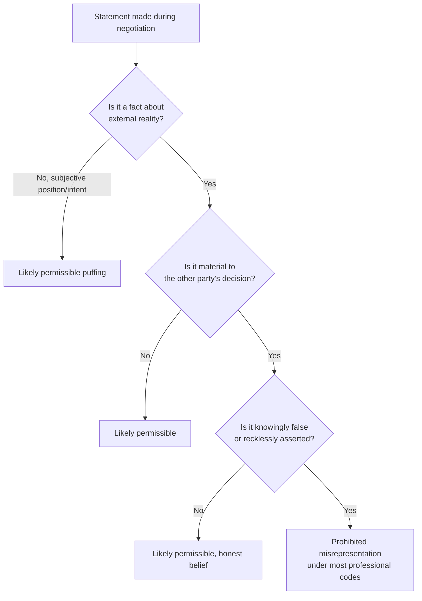

## Professional Codes of Conduct in Negotiation

### Definition and Scope

Professional codes of conduct in negotiation are formalized sets of ethical standards, behavioral expectations, and procedural rules established by professional bodies, industries, or organizations to govern how their members conduct negotiations. These codes distinguish themselves from personal ethics or general negotiation ethics by being institutionally sanctioned, often enforceable through disciplinary mechanisms, and specific to the professional context in which negotiation occurs (legal practice, real estate, labor relations, procurement, diplomacy, mediation).

Unlike broad ethical philosophy applied to negotiation, professional codes typically specify:

- Concrete behavioral prohibitions and requirements
- Disclosure obligations
- Conflict-of-interest management rules
- Standards for representing clients or organizations
- Enforcement mechanisms and consequences for violations

### Historical and Institutional Context

Professional codes emerged as negotiation became embedded in regulated professions. Legal negotiation ethics trace to bar association rules (e.g., the American Bar Association's Model Rules of Professional Conduct). Labor negotiation codes developed alongside collective bargaining law. Real estate and procurement codes emerged from industry self-regulation to preserve market trust. Mediation and ADR (Alternative Dispute Resolution) codes developed more recently as the mediation profession professionalized in the late 20th century, exemplified by bodies like the Association for Conflict Resolution (ACR) and the International Mediation Institute (IMI).

**[Inference]** The proliferation of formal codes across professions correlates with increased litigation risk and reputational stakes tied to negotiation misconduct, though the causal relationship between code adoption and improved negotiation outcomes is not rigorously established in the empirical literature.

### Core Components Common Across Codes

**Truthfulness and Non-Deception**

Most codes distinguish between permissible strategic non-disclosure (e.g., not revealing one's reservation price) and impermissible affirmative misrepresentation of material facts. The ABA Model Rule 4.1, for instance, prohibits knowingly making false statements of material fact or law to a third person during representation.

**Confidentiality**

Codes typically require negotiators to protect client or organizational information disclosed during negotiation preparation, and often extend to protecting information shared by the counterparty during the negotiation itself, particularly in mediated settings.

**Conflict of Interest Management**

Rules requiring disclosure of, or recusal from, negotiations where the negotiator has competing loyalties (representing two parties, personal financial stakes, prior relationships with a counterparty).

**Good Faith Bargaining**

Common in labor law contexts (e.g., the U.S. National Labor Relations Act's "good faith bargaining" requirement), this mandates a sincere intent to reach agreement, prohibiting surface bargaining (going through the motions without genuine intent to settle).

**Authority and Representation Limits**

Requirements that negotiators accurately represent the scope of their authority to bind a principal, avoiding "apparent authority" deception.

**Fair Dealing with Third Parties**

Some codes (particularly in real estate and mediation) impose duties even toward non-clients, requiring basic honesty and fair treatment regardless of representation relationship.

### Comparative Table of Professional Codes

| Domain | Governing Body (Example) | Key Negotiation Provisions | Enforcement Mechanism |
| --- | --- | --- | --- |
| Legal practice | ABA (Model Rules 4.1–4.2) | No false statements of material fact; no contact with represented parties | Bar disciplinary action, disbarment |
| Labor relations | NLRB (US) | Good faith bargaining duty | Unfair labor practice charges |
| Mediation | ACR, IMI | Impartiality, informed consent, confidentiality | Certification revocation, complaint review |
| Real estate | NAR (Realtor Code of Ethics) | Fair dealing, accurate representation, disclosure | Ethics hearings, membership sanctions |
| Procurement/Government contracting | FAR (Federal Acquisition Regulation) | Prohibitions on collusion, bid-rigging, gratuities | Debarment, criminal referral |
| Diplomacy | Vienna Convention norms (soft law) | Good faith treaty negotiation (pacta sunt servanda groundwork) | State-level accountability, reputational cost |

### The Puffing vs. Misrepresentation Distinction

A central technical issue in professional codes is drawing the line between "puffing" (permissible exaggeration of position, value, or willingness to walk away) and prohibited misrepresentation of material fact.

- **Permissible (puffing):** "This is my absolute best offer" (when it is not, but concerns subjective valuation/intent)
- **Impermissible (misrepresentation):** "This property has no structural defects" (when the negotiator knows of a defect)

The ABA's official commentary to Model Rule 4.1 explicitly notes that statements regarding a party's intentions as to an acceptable settlement, or estimates of value, are generally not considered statements of material fact — they fall within accepted negotiation convention.

**[Inference]** This convention functions as an implicit social contract: it presumes counterparties share an understanding that certain categories of statement carry lower reliability, which allows negotiation to function without every statement requiring independent verification.

### Diagrammatic View: Code Application Logic

### Enforcement Mechanisms

Enforcement varies significantly by domain and determines the practical weight a code carries:

1. **Disciplinary/licensing bodies** — bar associations, real estate boards, and medical boards can suspend or revoke licenses, creating high-stakes deterrence.
2. **Contractual/membership sanctions** — trade associations (e.g., NAR) can expel members, which carries reputational and market-access costs without legal license implications.
3. **Statutory enforcement** — labor law good-faith bargaining violations are adjudicated by administrative bodies (e.g., NLRB) with remedial orders.
4. **Soft law/reputational enforcement** — international diplomatic codes lack centralized enforcement and rely on reciprocity, reputation, and diplomatic consequences.

**[Unverified]** The comparative deterrent effectiveness of these four mechanism types has not been rigorously benchmarked across domains in available research; claims about which mechanism produces the highest compliance rates would be speculative without domain-specific empirical study.

### Practical Example: Legal Negotiation Code Application

**Scenario:** An attorney negotiating a settlement knows their client's business is on the verge of bankruptcy, which would make continued litigation impossible. The opposing counsel asks, "Is your client prepared to continue litigating this for years if necessary?"

**Analysis under a professional code (e.g., ABA framework):**

- The attorney is not obligated to volunteer the bankruptcy risk (no affirmative disclosure duty for this category of information).
- The attorney may decline to answer or give an evasive response.
- The attorney may NOT affirmatively state "Yes, my client has unlimited resources to litigate for years" if this is a knowing falsehood about a material fact (financial capacity), since this crosses from strategic silence into misrepresentation.

**Output:** A permissible response preserves negotiating leverage through silence or redirection; an impermissible response fabricates verifiable facts.

### Codes in Cross-Cultural and International Negotiation

Professional codes developed in one legal or cultural tradition do not automatically transfer to cross-border negotiation. Key friction points:

- **Gift-giving norms:** Prohibited as bribery under codes like the U.S. Foreign Corrupt Practices Act (FCPA) or UK Bribery Act, but customary relationship-building in some business cultures — creating compliance risk for multinational negotiators.
- **Disclosure expectations:** Common law systems (adversarial, limited disclosure duties) differ from civil law systems (some impose broader good-faith pre-contractual disclosure duties, e.g., French *culpa in contrahendo* concepts).
- **Authority representation:** Hierarchical negotiation cultures may involve negotiators without final authority as a deliberate tactic, which can conflict with codes requiring accurate representation of authority.

**[Inference]** Multinational organizations often layer an internal corporate code atop varying local professional codes specifically to manage this friction, standardizing conduct above the floor set by local regulation.

### Codes of Conduct in Mediation and ADR

Mediator-specific codes (e.g., the Model Standards of Conduct for Mediators, jointly developed by the American Arbitration Association, ABA, and ACR) impose distinct duties not applicable to advocate-negotiators:

- **Impartiality** — the mediator must not favor either party
- **Informed consent** — parties must understand the process and voluntarily participate
- **Self-determination** — the mediator must not impose outcomes
- **Disclosure of conflicts** — any prior relationship with either party must be disclosed before proceeding

This creates a structurally different ethical position: the negotiator's-code focus is zealous representation within bounds; the mediator's-code focus is neutrality and process integrity.

### Common Violations and Consequences

| Violation Type | Example | Typical Consequence |
| --- | --- | --- |
| Material misrepresentation | Falsifying financial statements during M&A negotiation | Contract rescission, litigation, disbarment (if attorney) |
| Undisclosed conflict of interest | Broker representing both buyer and seller without disclosure | License suspension, civil liability |
| Surface bargaining | Employer negotiating without genuine intent to reach agreement | Unfair labor practice finding, back-pay remedies |
| Contact with represented party | Attorney bypassing opposing counsel to negotiate directly with represented client | Ethics complaint, evidence suppression |
| Bribery/improper inducement | Offering gifts to secure favorable contract terms | Criminal prosecution (FCPA), debarment from government contracts |

### Tensions and Critiques

**Zealous advocacy vs. broader honesty norms:** Legal codes permit substantial strategic behavior in service of client interests, which critics argue creates a lower ethical floor than general moral intuition would suggest is appropriate for professionals.

**Code as minimum floor, not ethical ceiling:** Professional codes establish enforceable minimums; they do not certify that code-compliant behavior is maximally ethical. A negotiator can comply fully with a professional code while still acting in ways critics would characterize as exploitative (e.g., legally permissible high-pressure tactics against unsophisticated counterparties).

**Enforcement inconsistency:** [Inference] Because disciplinary bodies often rely on complaints rather than proactive monitoring, code violations that do not generate a formal complaint from an aggrieved party may go unaddressed regardless of their severity, suggesting actual behavioral constraint may be narrower than the code's formal scope implies.

### Visual: Code Compliance Spectrum (svg_diagram)

<svg xmlns="http://www.w3.org/2000/svg" viewBox="0 0 720 220">
<text x="360" y="24" text-anchor="middle" font-size="16" font-weight="bold" fill="#1a1a1a">Professional Code Compliance Spectrum (svg_diagram)</text>
<line x1="40" y1="120" x2="680" y2="120" stroke="#333" stroke-width="3" />
<circle cx="80" cy="120" r="8" fill="#c0392b" />
<text x="80" y="150" text-anchor="middle" font-size="12" fill="#333">Fraud /</text>
<text x="80" y="165" text-anchor="middle" font-size="12" fill="#333">Criminal</text>
<circle cx="260" cy="120" r="8" fill="#e67e22" />
<text x="260" y="150" text-anchor="middle" font-size="12" fill="#333">Code</text>
<text x="260" y="165" text-anchor="middle" font-size="12" fill="#333">Violation</text>
<circle cx="440" cy="120" r="8" fill="#f1c40f" />
<text x="440" y="150" text-anchor="middle" font-size="12" fill="#333">Code-</text>
<text x="440" y="165" text-anchor="middle" font-size="12" fill="#333">Compliant</text>
<circle cx="600" cy="120" r="8" fill="#27ae60" />
<text x="600" y="150" text-anchor="middle" font-size="12" fill="#333">Ethically</text>
<text x="600" y="165" text-anchor="middle" font-size="12" fill="#333">Exemplary</text>
<text x="360" y="195" text-anchor="middle" font-size="12" fill="#555" font-style="italic">Codes establish enforceable floors, not ethical ceilings</text>
</svg>

### Designing or Evaluating a Code (Practitioner Guidance)

**Key Points**

- Define material fact categories explicitly (financial condition, legal authority, safety/defect information) rather than relying on vague "honesty" language.
- Specify the boundary between strategic silence and affirmative misrepresentation with concrete examples.
- Build in a disclosure mechanism for conflicts of interest before negotiation begins, not retroactively.
- Attach enforcement teeth (licensing consequence, membership consequence) — codes without consequence function as aspirational statements, not behavioral constraints.
- Address cross-jurisdictional gaps explicitly if the negotiator operates internationally.

### Related Topics

- Puffing vs. Fraud: Legal Boundaries in Negotiation
- Good Faith Bargaining Doctrine in Labor Law
- Conflict of Interest Disclosure Frameworks
- Mediator Neutrality and the Model Standards of Conduct
- Cross-Cultural Ethics in International Business Negotiation
- The Foreign Corrupt Practices Act and Negotiation Compliance
- Zealous Advocacy vs. Ethical Negotiation in Legal Practice
- Reputation Systems as Informal Enforcement of Negotiation Ethics