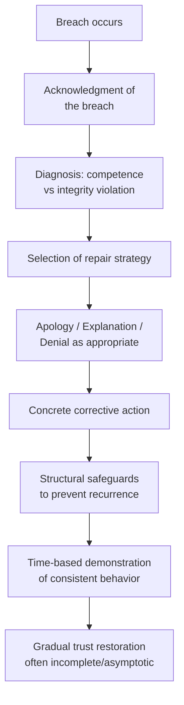

## Rebuilding Trust After a Breach

### Definition and Conceptual Framework

Trust repair refers to the deliberate set of strategies, sequences, and communicative acts by which a party seeks to restore a counterparty's willingness to rely on them following a violation of expectations, commitments, or perceived good faith during negotiation or an ongoing relationship. Trust breach and repair is a distinct subfield within negotiation theory, most extensively developed by researchers including Roy Lewicki, Kurt Dirks, and Peter Kim, who established that trust violations differ meaningfully by type, and that repair strategies must be matched to violation type to be effective.

Trust in negotiation contexts is typically decomposed into two or three components:

- **Competence-based trust:** belief that a party has the ability to perform as promised
- **Integrity-based trust:** belief that a party adheres to accepted principles of honesty and fairness
- **(Sometimes separated) Benevolence-based trust:** belief that a party has genuine goodwill toward the other's interests

**[Inference]** This decomposition matters practically because a breach rooted in competence failure (an honest mistake, missed capability) is generally perceived as more repairable than a breach rooted in integrity failure (a deliberate lie or deception), since integrity violations are diagnostic of character rather than circumstance.

### The Kim, Dirks, and Cooper Framework: Competence vs. Integrity Violations

A foundational finding in this literature is the asymmetric response to apology and denial depending on violation type:

| Violation Type | Effective Response | Ineffective/Counterproductive Response |
| --- | --- | --- |
| Competence-based (e.g., missed a deadline due to error) | Apology (accepting responsibility restores confidence in ability to fix) | Denial (raises doubt about self-awareness/honesty) |
| Integrity-based (e.g., lied about material terms) | Denial, if genuinely not at fault; if guilty, apology has limited repair power | Apology alone (confirms the character flaw, does not undo it) |

This is a widely cited but **[Inference/context-dependent]** finding: subsequent research (e.g., Kim, Ferrin, Cooper, & Dirks) qualified the original result to depend heavily on the presence of clear guilt/innocence evidence, and later work suggests that in ambiguous-guilt integrity violations, apology can still aid repair if paired with concrete corrective action.

### The Trust Repair Process: General Sequence

### Core Components of Effective Trust Repair

**1. Acknowledgment**

Explicit recognition that a violation occurred, without minimization. Vague or hedged acknowledgment ("mistakes were made") is generally perceived as weaker than direct acknowledgment ("I made an error in the calculation that misrepresented our final price").

**2. Explanation/Account-Giving**

Providing context for why the breach occurred. Attribution theory research distinguishes:

- **Excuses:** denying full responsibility while acknowledging the act was wrong ("the error was due to a subordinate's mistake, not my choice")
- **Justifications:** accepting responsibility for the act but reframing its wrongness ("I withheld that information because disclosure would have violated a separate confidentiality obligation")

**3. Apology**

An effective apology in the negotiation trust-repair literature typically contains multiple components (drawing from Lazare's taxonomy of apology and negotiation-specific research):

- Acknowledgment of the specific harm
- Acceptance of responsibility (not just regret that harm occurred)
- Expression of regret/remorse
- Offer of repair or restitution
- Commitment to changed future behavior

An apology missing the responsibility-acceptance component ("I'm sorry you feel that way" or "I'm sorry this happened") is frequently classified as a non-apology and can worsen trust outcomes by signaling insincerity.

**4. Corrective Action / Restitution**

Concrete, verifiable steps that materially address the harm caused — distinguished from purely verbal repair. **[Inference]** Restitution appears to carry more repair weight than verbal apology alone in most empirical trust-repair studies, likely because it is costly to the violator and therefore signals genuine commitment (a costly-signaling mechanism).

**5. Structural Safeguards**

Changes to monitoring, verification, or contractual structure that reduce the counterparty's vulnerability going forward (e.g., adding third-party verification, escrow arrangements, more frequent reporting, penalty clauses for recurrence). These substitute structural assurance for the psychological trust that was damaged, sometimes called "trust surrogate" mechanisms.

**6. Time and Consistency**

Repeated trustworthy behavior over time, since trust judgments update via a Bayesian-like process where isolated statements carry less weight than a track record.

### Illustrative Model: Trust Trajectory After Breach and Repair (svg_diagram)

<svg xmlns="http://www.w3.org/2000/svg" viewBox="0 0 720 300">
<text x="360" y="24" text-anchor="middle" font-size="16" font-weight="bold" fill="#1a1a1a">Trust Trajectory After Breach and Repair (svg_diagram)</text>
<line x1="60" y1="260" x2="680" y2="260" stroke="#333" stroke-width="2" />
<line x1="60" y1="260" x2="60" y2="50" stroke="#333" stroke-width="2" />
<text x="30" y="60" font-size="11" fill="#333">Trust</text>
<text x="620" y="280" font-size="11" fill="#333">Time</text>
<path d="M 60 100 L 220 100 L 240 220 L 280 200 L 340 190 L 420 170 L 500 150 L 600 130 L 660 120" fill="none" stroke="#2980b9" stroke-width="3" />
<circle cx="230" cy="215" r="5" fill="#c0392b" />
<text x="230" y="240" text-anchor="middle" font-size="11" fill="#c0392b">Breach</text>
<circle cx="280" cy="200" r="5" fill="#e67e22" />
<text x="280" y="188" text-anchor="middle" font-size="10" fill="#e67e22">Acknowledgment</text>
<line x1="660" y1="100" x2="680" y2="100" stroke="#95a5a6" stroke-width="1" stroke-dasharray="4" />
<text x="600" y="90" font-size="10" fill="#95a5a6" font-style="italic">Original trust level</text>
</svg>

Note the trajectory typically approaches, but does not always fully reach, the pre-breach baseline — a pattern often described in the literature as trust repair producing an asymptotic recovery rather than complete restoration. **[Inference]** This asymptotic ceiling likely varies by relationship type, breach severity, and the counterparty's own risk tolerance, and is not a fixed universal parameter.

### Negotiation-Specific Tactics for Trust Repair

**Renegotiating Terms with Increased Transparency**

Voluntarily providing more information than contractually required after a breach (e.g., opening books, sharing cost data) as a costly signal of renewed good faith.

**Third-Party Mediation**

Introducing a neutral party to verify claims or facilitate the repair conversation, useful when the breached party's direct statements carry insufficient credibility post-violation.

**Incremental Trust Extension ("Small Steps" Strategy)**

Both parties agree to a series of smaller, lower-stakes commitments before returning to larger-stakes negotiation, allowing trust to be rebuilt incrementally with each kept commitment functioning as evidence.

**Formal Commitment Devices**

Converting previously informal understandings into binding contractual terms, since the injured party may no longer be willing to rely on informal assurances alone.

### Practical Example

**Scenario:** A supplier negotiator promised a client exclusive regional distribution rights, then separately negotiated a competing distribution deal in the same region without disclosure. The client discovers this through a third party.

**Poor repair attempt:**

"I'm sorry if this caused any confusion. The other deal is actually quite limited in scope."

— This minimizes the breach, offers no responsibility acceptance, and reframes rather than acknowledges.

**Stronger repair attempt:**

1. **Acknowledgment:** "I signed a competing distribution agreement in your exclusive region, which directly violates our agreement. This was wrong, and I take full responsibility."
2. **Explanation without excusing:** "I made the decision under revenue pressure, but that does not justify breaching our exclusivity terms."
3. **Restitution:** "I will terminate the competing agreement within 30 days, provide documentation confirming termination, and extend your exclusivity term by 12 months at no additional cost as compensation for the breach period."
4. **Structural safeguard:** "Going forward, I propose quarterly third-party audits of my distribution agreements, shared with you automatically, for the remainder of our contract."

**Output:** This sequence follows the acknowledgment → responsibility → restitution → structural-safeguard pattern associated with stronger trust-repair outcomes in the literature, though **[Unverified]** actual client response would depend on factors (relationship history, alternative supplier availability, client's own risk tolerance) not specified in this hypothetical.

### Barriers to Effective Trust Repair

- **Repeated or pattern violations:** A single breach is more repairable than a demonstrated pattern; patterns shift the counterparty's attribution from situational to dispositional (i.e., "this is who they are" rather than "this was a mistake").
- **High-stakes/irreversible harm:** Breaches causing severe, non-reversible damage (e.g., safety-related deception) face substantially higher repair barriers regardless of the quality of the repair attempt.
- **Power asymmetry:** The party with less power in the relationship may have limited ability to demand or verify meaningful restitution, complicating repair even when the higher-power party is genuinely willing to repair.
- **Public vs. private breach:** Breaches that became public (reputational, third-party knowledge) require repair that addresses both the injured party's private trust and broader stakeholder or market trust simultaneously.

### Key Points

- Match repair strategy to violation type: competence violations generally respond to apology; integrity violations generally require either credible denial (if warranted) or substantial restitution and structural change (if guilty).
- Verbal apology alone rarely fully repairs trust in high-stakes negotiation contexts; corrective action functions as the more credible signal.
- Trust repair should be modeled as a trajectory over time, not a single event; expect a repair "floor" below the pre-breach baseline that may persist even after successful repair efforts.
- Structural safeguards (transparency, third-party verification, formal commitments) serve as substitutes for psychological trust when full restoration is not achievable in the near term.
- Repeated or pattern breaches shift counterparty attributions toward dispositional judgments, sharply raising the repair difficulty.

### Related Topics

- Attribution Theory and Blame Assignment in Negotiation
- The Role of Apology vs. Denial in Integrity Violations (Kim, Dirks, Cooper research stream)
- Costly Signaling as a Trust-Building Mechanism
- Contractual Safeguards as Trust Surrogates
- Reputation Damage and Third-Party Trust Spillover
- Renegotiation After Contract Breach
- Power Asymmetry and Its Effect on Trust Repair Leverage