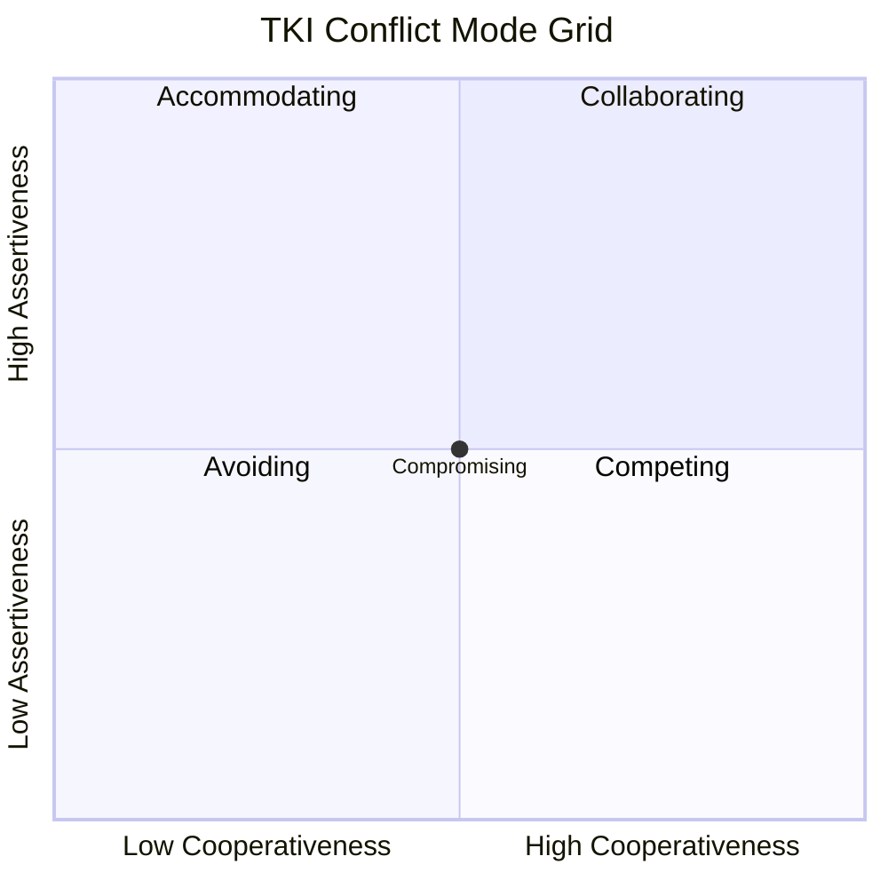

## The Thomas-Kilmann Conflict Mode Instrument

### Definition and Origin

The Thomas-Kilmann Conflict Mode Instrument (TKI) is a psychometric assessment developed by Kenneth W. Thomas and Ralph H. Kilmann in the early 1970s, designed to measure an individual's dispositional tendencies across five distinct conflict-handling modes. It remains one of the most widely used instruments in negotiation and conflict-management training, published commercially by CPP, Inc. (now The Myers-Briggs Company).

The instrument builds on the earlier Blake and Mouton Managerial Grid concept but reframes the underlying dimensions specifically around conflict behavior rather than general management style.

### Theoretical Foundation: The Two-Dimensional Model

The TKI positions conflict-handling behavior along two independent dimensions:

- **Assertiveness:** the extent to which an individual attempts to satisfy their own concerns
- **Cooperativeness:** the extent to which an individual attempts to satisfy the other party's concerns

These two dimensions generate a 2×2-plus-center space yielding five conflict-handling modes, each representing a different combination of assertiveness and cooperativeness levels.

$$\text{Conflict Mode} = f(\text{Assertiveness}, \text{Cooperativeness})$$

### The Five Conflict-Handling Modes

| Mode | Assertiveness | Cooperativeness | Core Orientation |
| --- | --- | --- | --- |
| Competing | High | Low | Win-lose; pursuing own concerns at other's expense |
| Collaborating | High | High | Win-win; seeking a solution fully satisfying both parties |
| Compromising | Moderate | Moderate | Split-the-difference; partial satisfaction for both |
| Avoiding | Low | Low | Withdrawal; neither pursuing own nor other's concerns |
| Accommodating | Low | High | Yielding; satisfying other's concerns at expense of own |

### Diagram: The TKI Grid Model

**Note:** This diagram is rendered as raw text per formatting requirements; Compromising sits at the intersection of both axes at moderate levels, distinct from the four corner modes.

### Detailed Mode Descriptions

**Competing**

A power-oriented mode where an individual pursues personal concerns at the counterparty's expense, using whatever power seems appropriate to win one's position. Appropriate contexts include emergencies requiring quick, decisive action, or situations involving unpopular but necessary decisions (e.g., cost-cutting, enforcing unpopular rules).

**Collaborating**

Involves working with the other party to find a solution that fully satisfies both parties' underlying concerns. Requires exploring an issue to identify the underlying interests (not just stated positions) of both parties. Most time- and effort-intensive mode; appropriate when both sets of concerns are too important to be compromised and when the relationship's long-term health matters.

**Compromising**

Seeks a middle-ground, mutually acceptable solution that partially satisfies both parties, often through splitting differences, exchanging concessions, or seeking a quick middle position. Appropriate when goals are moderately important but not worth the effort of collaboration, or as a fallback when collaboration or competition fail.

**Avoiding**

Involves not pursuing either party's concerns — sidestepping the issue, postponing it, or withdrawing from a threatening situation. Appropriate when an issue is trivial, when more information is needed before acting, or when the potential disruption of confrontation outweighs the benefits of resolution.

**Accommodating**

The opposite of competing — neglecting one's own concerns to satisfy the other party's concerns, an element of self-sacrifice. Appropriate when preserving harmony is more important than the specific issue, when one realizes one is wrong, or when building goodwill/social credit for future issues.

### Instrument Structure and Administration

The TKI assessment consists of 30 forced-choice item pairs. Each pair presents two statements, each representing a different conflict mode, and the respondent selects which statement is more characteristic of their behavior. This ipsative (forced-choice) format is a deliberate design choice.

**[Inference]** The forced-choice format was likely selected specifically to counteract social-desirability bias, since Likert-scale self-ratings across modes could allow respondents to rate themselves highly on all five modes simultaneously, whereas forced-choice comparisons require relative prioritization and produce a profile that sums to a fixed total across the five scales.

Scoring produces a profile across all five modes (not a single "type" classification), typically compared against percentile norms from a reference population, illustrating that most individuals use all five modes to varying degrees depending on context, rather than exhibiting one dominant style exclusively.

### Practical Application Example

**Scenario:** A negotiator profile shows: high Competing (85th percentile), moderate Collaborating (55th percentile), low Accommodating (15th percentile), low Avoiding (20th percentile), moderate Compromising (50th percentile).

**Interpretation:** This individual defaults strongly to assertive, low-cooperative behavior under conflict, which may serve them well in high-stakes distributive negotiations (e.g., final price negotiations with low ongoing-relationship value) but may create friction in integrative negotiations requiring joint problem-solving, or in ongoing relationships where the counterparty's accommodating responses will erode over repeated interactions.

**Coaching application:** A facilitator would typically use this profile not to suggest the individual is "wrong," but to expand behavioral flexibility — helping the negotiator recognize situations calling for Collaborating or Compromising modes where their default Competing response may be counterproductive (e.g., long-term supplier relationships, cross-functional internal negotiations).

### Situational Appropriateness Framework

Thomas and Kilmann's accompanying guidance ties each mode to situational triggers:

**Key Points**

- **Competing** — use during emergencies, on issues vital to organizational welfare where you know you're right, or against people who exploit noncompetitive behavior.
- **Collaborating** — use when both sets of concerns are too important to compromise, to merge insights from people with different perspectives, or to work through hard feelings that have been interfering with a relationship.
- **Compromising** — use when goals are moderately important and not worth the disruption of more assertive modes, when opponents with equal power are committed to mutually exclusive goals, or as a temporary settlement to complex issues.
- **Avoiding** — use when an issue is trivial, when there is no chance of satisfying your concerns, or when the potential damage of confronting a conflict outweighs the benefits of its resolution.
- **Accommodating** — use when you find you are wrong, when the issue is much more important to the other party than to you, or to build social credits for later issues.

### Relationship to Negotiation Strategy Selection

The TKI framework maps closely onto the dual-concern model widely used in negotiation theory (a near-identical structural analog developed independently in the negotiation literature by Pruitt and Rubin), linking conflict-mode disposition to negotiation strategy choice:

| TKI Mode | Negotiation Strategy Analog |
| --- | --- |
| Competing | Distributive/positional bargaining |
| Collaborating | Integrative/interest-based bargaining |
| Compromising | Concession-trading, midpoint settlements |
| Avoiding | Non-engagement, walking away from the table |
| Accommodating | Unilateral concession-making |

**[Inference]** This structural overlap suggests the TKI's practical value in negotiation training lies less in its novelty as a conflict framework and more in providing negotiators with a validated, personalized diagnostic of their own default tendencies, against which situational strategy selection can be deliberately calibrated rather than defaulted to unconsciously.

### Critiques and Limitations

**Trait vs. state ambiguity:** The TKI measures self-reported tendencies, which may not fully predict behavior in specific high-stakes or high-stress negotiation contexts where situational pressures can override typical disposition.

**Cultural validity questions:** [Inference] The instrument's assertiveness/cooperativeness framework was developed and normed primarily in Western (US) organizational contexts; applicability of the same interpretive norms across collectivist cultures, where assertive competing behavior may carry different social meaning and consequence, has not been comprehensively validated in the available public literature and should be treated cautiously.

**No mode is universally superior:** The instrument's design explicitly avoids ranking modes by desirability, but training programs vary in how well they communicate this; some practitioners misapply the tool by treating Collaborating as inherently "best" regardless of context, which the original authors explicitly cautioned against.

**Self-report limitations:** As with any self-report psychometric instrument, results depend on the accuracy of the respondent's self-perception, which may diverge from observed behavior as rated by counterparties or third-party observers.

### Comparison Table: TKI vs. Related Instruments

| Instrument | Focus | Dimensional Structure | Primary Use Context |
| --- | --- | --- | --- |
| Thomas-Kilmann Instrument (TKI) | Conflict-handling modes | Assertiveness × Cooperativeness | Conflict management, negotiation training |
| Rahim Organizational Conflict Inventory (ROCI-II) | Conflict-handling styles | Concern for self × Concern for others (5 styles, similar structure) | Organizational behavior research |
| Dual Concern Model (Pruitt & Rubin) | Negotiation strategy | Concern for own outcomes × Concern for other's outcomes | Negotiation theory (academic framework, not a commercial instrument) |
| DiSC Assessment | General behavioral style | Dominance, Influence, Steadiness, Conscientiousness | General workplace behavioral style, not conflict-specific |

### Next Steps

- **Dual Concern Model in Distributive and Integrative Bargaining**
- **Personality Traits (Big Five) and Negotiation Outcomes**
- **Cultural Dimensions Theory and Conflict Style Variation (Hofstede's framework applied to negotiation)**
- **Behavioral Flexibility Training in Negotiation Coaching**
- **Emotional Intelligence and Conflict Mode Selection**
- **Rahim Organizational Conflict Inventory as a Comparative Framework**