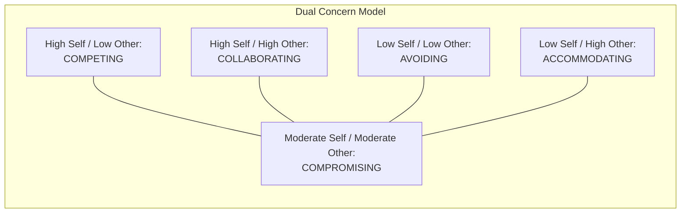

## Competing, Collaborating, Compromising, Avoiding, and Accommodating Styles

### Definition and Theoretical Origin

These five conflict-handling styles constitute the dual-concern model of conflict and negotiation behavior, most commonly associated with the Thomas-Kilmann framework but independently developed and applied within negotiation theory by scholars including Dean Pruitt and Jeffrey Rubin. The model organizes negotiator behavior along two orthogonal dimensions — concern for one's own outcomes (assertiveness) and concern for the other party's outcomes (cooperativeness) — producing five distinguishable behavioral styles.

Because this item overlaps substantially with the TKI's underlying framework, this entry focuses on the styles themselves as general negotiator behavior patterns, independent of any specific commercial assessment instrument, including their manifestation in actual negotiation tactics, outcomes, and strategic tradeoffs.

### The Dual Concern Model

$$\text{Style} = f(\text{Concern for Self}, \text{Concern for Other})$$

| Style | Concern for Self | Concern for Other | Behavioral Signature |
| --- | --- | --- | --- |
| Competing | High | Low | Pressure, positional demands, threats, limited disclosure |
| Collaborating | High | High | Joint problem-solving, interest exploration, information sharing |
| Compromising | Moderate | Moderate | Concession trading, splitting differences, quick middle ground |
| Avoiding | Low | Low | Delay, withdrawal, non-engagement, topic deflection |
| Accommodating | Low | High | Unilateral concessions, relationship prioritization over substance |

### Diagram: Dual Concern Grid

### Style 1: Competing

**Core mechanics:** A distributive orientation in which the negotiator treats the interaction as zero-sum and pursues maximum personal gain, often through anchoring high/low, applying deadline pressure, leveraging BATNA strength, and limiting concessions.

**Tactical manifestations:** Aggressive opening offers, threats to walk away, minimal information disclosure, framing issues as fixed-pie.

**Appropriate contexts:** Single-issue, one-shot transactions with no ongoing relationship value (e.g., a one-time used-car purchase); situations requiring decisive action; when the counterparty is known to exploit cooperative behavior.

**Risks:** Damages long-term relationships; invites retaliation or impasse; can produce suboptimal joint outcomes when integrative potential exists but goes unexplored.

### Style 2: Collaborating

**Core mechanics:** An integrative orientation focused on identifying underlying interests (not stated positions) of both parties to construct value-creating solutions — the foundation of "expanding the pie" before dividing it, central to interest-based bargaining as formalized in Fisher and Ury's *Getting to Yes*.

**Tactical manifestations:** Open-ended questioning to surface interests, joint brainstorming, package deals trading across multiple issues based on differing priorities, transparent information sharing about priorities (though not necessarily reservation prices).

**Appropriate contexts:** Multi-issue negotiations with differing priorities across issues (enabling logrolling); high-value ongoing relationships; complex problems where neither party alone has full information.

**Risks:** Time- and effort-intensive; requires reciprocal good faith — vulnerable to exploitation if the counterparty adopts a competing style and the collaborator over-discloses; not always feasible under severe time constraints.

### Style 3: Compromising

**Core mechanics:** A moderate-effort, moderate-outcome approach that seeks a mutually acceptable middle position, typically through explicit concession exchange (e.g., "split the difference," alternating concessions of roughly equal size).

**Tactical manifestations:** Anchoring near a perceived midpoint, reciprocal concession patterns, use of objective reference points (e.g., market averages) to justify a middle solution.

**Appropriate contexts:** Time pressure prevents full collaborative exploration; parties have roughly equal power and mutually exclusive goals; as a fallback when collaboration stalls or competition risks impasse.

**Risks:** Can leave joint value unrealized if adopted prematurely — that is, before interests are explored, a compromise may split resources that could otherwise have been reallocated for mutual gain (a common critique in the integrative-bargaining literature, sometimes termed settling for a "lose-lose compromise").

### Style 4: Avoiding

**Core mechanics:** Non-engagement with the conflict or negotiation issue, either through active withdrawal, procedural delay, or passive deflection.

**Tactical manifestations:** Postponing discussion of contentious issues, changing the subject, declining to respond to demands, exiting the negotiation (BATNA exercise).

**Appropriate contexts:** The issue is trivial relative to relationship costs of confrontation; more information or preparation is needed before productively engaging; the potential for destructive escalation outweighs the benefit of resolving the issue immediately; a strong BATNA makes walking away genuinely preferable.

**Risks:** Can allow problems to fester or escalate if used to avoid necessary but uncomfortable issues; may be perceived as passive-aggressive or evasive by a counterparty seeking engagement; can forfeit value that would have been available through timely negotiation.

### Style 5: Accommodating

**Core mechanics:** Prioritizing the counterparty's outcomes over one's own, often to preserve or build the relationship, defer to expertise, or invest in future reciprocity.

**Tactical manifestations:** Unprompted concessions, agreeing to unfavorable terms without extracting reciprocal value, explicit relationship-preservation statements ("this matters more to you than to me").

**Appropriate contexts:** The issue is substantially more important to the counterparty than to oneself; the relationship's long-term value outweighs the specific issue's short-term cost; building goodwill or reciprocal credit for future negotiations; recognizing one is in the wrong on the substantive issue.

**Risks:** Repeated accommodation without reciprocity can be exploited by counterparties using competing styles, and can erode the accommodator's credibility as a negotiator, potentially inviting escalating future demands (an outcome sometimes discussed under reciprocity and exploitation dynamics in repeated-game negotiation theory).

### Style Selection as a Contingent, Not Fixed, Choice

**[Inference]** A recurring theme across negotiation pedagogy built on this model is that no single style is optimal across contexts; effective negotiators are characterized less by a single dominant style and more by the ability to diagnose situational demands (stakes, relationship value, time pressure, power balance) and deliberately select the matching style, shifting even within a single negotiation as issues and phases change (e.g., collaborating on interest exploration early, then compromising to close remaining gaps).

### Practical Example: Style Selection Across a Single Negotiation

**Scenario:** A department head is negotiating a joint annual budget and staffing allocation with a peer department head, with whom they will continue working for years.

| Negotiation Phase | Style Applied | Rationale |
| --- | --- | --- |
| Initial data-sharing on both departments' priorities | Collaborating | Uncovering interests (e.g., one department values headcount, the other values discretionary budget) enables logrolling |
| A minor scheduling conflict over shared conference room access | Avoiding | Trivial relative to the main negotiation; not worth spending capital |
| Final gap on total budget split after most issues resolved | Compromising | Remaining gap is small and roughly symmetric; a quick midpoint avoids prolonging low-value conflict |
| A one-time request where the peer needs extra support for a critical launch | Accommodating | Relationship investment; strong reciprocity expectation for future negotiations |
| A rare instance where finance mandates a hard budget ceiling non-negotiable from either side | Competing (toward the mandate, not the peer) | Necessary firmness on a fixed external constraint |

**Output:** This illustrates style selection as a portfolio applied dynamically across issues and phases within one negotiation, rather than a single fixed disposition.

### Empirical and Theoretical Critiques

**Overlap and construct validity concerns:** [Inference] Some organizational behavior researchers have noted that the five-style taxonomy, while pedagogically useful, may oversimplify a more continuous or multidimensional underlying behavioral space; real negotiator behavior often blends elements of multiple styles simultaneously rather than falling cleanly into one category.

**Style as trait vs. situational choice:** Debate exists in the literature over whether these are best understood as stable individual dispositions (as in TKI's psychometric framing) or as situational strategic choices available to any negotiator regardless of disposition — most contemporary negotiation training favors the latter framing, treating the five styles as a repertoire to be consciously deployed rather than fixed personality types.

**Cultural variation in style appropriateness:** [Inference] Cross-cultural negotiation research (e.g., work building on Hofstede's cultural dimensions) suggests that the social acceptability and effectiveness of styles like Competing or Accommodating vary by cultural context — direct competing behavior may be more normalized in some business cultures and considered face-threatening in others — though precise, universally validated mappings remain an active and contested research area rather than settled fact.

### Related Topics

- Dual Concern Model and Its Application to Negotiation Strategy
- Interest-Based Bargaining and the *Getting to Yes* Framework
- Logrolling and Multi-Issue Package Deals
- BATNA and Its Role in Style Selection (Competing vs. Avoiding)
- Reciprocity Dynamics and the Risk of Exploited Accommodation
- Cross-Cultural Variation in Conflict Style Norms
- The Thomas-Kilmann Conflict Mode Instrument as a Psychometric Measure of These Styles