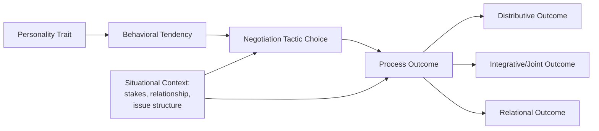

## Personality Traits and Negotiation Outcomes

### Definition and Scope

This topic examines the empirical relationship between stable individual personality dimensions and negotiation processes/outcomes — including claiming value (distributive outcomes), creating value (integrative/joint outcomes), and relational outcomes (counterparty satisfaction, willingness to negotiate again). The dominant organizing framework in contemporary research is the Five-Factor Model (Big Five/OCEAN), though earlier and adjacent literature also examines Machiavellianism, self-monitoring, locus of control, and social value orientation.

### The Big Five Framework Applied to Negotiation

| Trait | Definition | General Association with Negotiation Behavior |
| --- | --- | --- |
| Openness to Experience | Intellectual curiosity, creativity, openness to new approaches | Associated with greater flexibility in exploring integrative/creative solutions |
| Conscientiousness | Organization, discipline, goal-directedness | Associated with thorough preparation, persistence in claiming value |
| Extraversion | Sociability, assertiveness, positive affect | Mixed findings; assertiveness component linked to competitive/distributive behavior |
| Agreeableness | Cooperativeness, trust, empathy | Most consistently studied trait; generally associated with poorer individual distributive outcomes but better joint/relational outcomes |
| Neuroticism (Emotional Stability, inverse) | Tendency toward anxiety, emotional volatility | Associated with reactive, less strategic responses under negotiation pressure |

### Agreeableness: The Most Extensively Studied Trait

Agreeableness has received the most direct empirical attention in negotiation research, largely due to work by researchers including Bruce Barry and Raymond Friedman.

**Key finding [established in negotiation literature]:** Highly agreeable negotiators tend to achieve *individually* worse distributive outcomes in single-issue, zero-sum negotiations — they make larger and more frequent concessions, are less likely to use aggressive anchoring, and are more responsive to counterparty pressure.

**Contextual moderation [Inference from broader literature synthesis]:** This disadvantage appears most pronounced in distributive, single-issue contexts. In integrative, multi-issue negotiations, the relationship weakens or reverses — agreeableness's association with cooperative information exchange and trust-building can support the discovery of integrative trades that a highly disagreeable, purely competitive negotiator might not access, since integrative discovery typically requires some degree of mutual information disclosure.

### Extraversion: Complex and Non-Monotonic Findings

Extraversion presents one of the more theoretically interesting patterns in the literature: unlike agreeableness's relatively consistent (negative-in-distributive-contexts) pattern, extraversion has shown non-linear relationships with negotiation performance in some studies.

**[Inference]** A commonly cited explanation is that highly extraverted negotiators may talk more than they listen, potentially over-disclosing information or dominating the conversational floor in ways that reduce their ability to extract information from the counterparty — meaning extreme extraversion may function similarly to extreme introversion in producing weaker outcomes, with moderate extraversion outperforming both extremes. This curvilinear pattern has been reported in specific studies (e.g., research associated with Adam Grant) but should not be treated as a universally replicated law; **[Unverified]** the robustness of this specific curvilinear finding across diverse negotiation contexts and populations is not conclusively established in the broader literature.

### Openness to Experience and Integrative Outcomes

Openness is theoretically linked to a negotiator's capacity to reframe issues, consider non-obvious tradeoffs, and generate novel options — core mechanics of value creation.

**[Inference]** Negotiators higher in openness may be more willing to depart from anchored, positional thinking and explore interest-based reframing, which plausibly supports better integrative (joint-value) outcomes, though this connection is more theoretically derived from openness's general association with creative problem-solving than from a large, dedicated body of negotiation-specific empirical studies isolating this exact link.

### Conscientiousness: Preparation and Persistence

Conscientiousness's association with negotiation is most directly tied to preparation quality — conscientious negotiators are more likely to research counterparty interests, set clear target/reservation points, and systematically pursue planned concession sequences.

**[Inference]** This trait likely functions less as a direct driver of a particular negotiation style (unlike agreeableness or extraversion) and more as a moderator of how effectively any chosen strategy is executed — a highly conscientious competitive negotiator would be expected to execute distributive tactics more consistently than a low-conscientiousness competitive negotiator, though direct empirical isolation of this moderating role in negotiation-specific studies is more limited than for agreeableness.

### Neuroticism and Emotional Reactivity

Higher neuroticism is associated with greater susceptibility to negotiation-induced stress, which can manifest as premature concessions to escape discomfort, difficulty maintaining a planned strategy under pressure tactics, or escalated emotional reactions to perceived unfair treatment.

**[Inference]** This suggests neuroticism may interact significantly with counterparty tactics — a negotiator high in neuroticism facing an opponent using aggressive anchoring or time pressure may be more likely to concede prematurely than an emotionally stable counterpart facing the identical tactic, though the size of this effect would be expected to vary by individual and by the specific stressor.

### Diagram: Trait-to-Outcome Pathway Model

This pathway model reflects a broader consensus **[Inference]** in personality-and-negotiation research: traits rarely predict outcomes directly, but operate through behavioral tendencies that are further moderated by situational context — meaning the same trait can produce different outcomes depending on whether the negotiation is distributive or integrative, one-shot or repeated, and low- or high-stakes.

### Beyond the Big Five: Additional Constructs

**Machiavellianism** (from the Dark Triad literature): Associated with willingness to use manipulative tactics, deception, and instrumental relationship framing. **[Inference]** Higher-Machiavellianism negotiators may achieve better short-term distributive outcomes in one-shot interactions but face greater relational and reputational costs in repeated-interaction or reputation-sensitive contexts, consistent with general Dark Triad research on short-term versus long-term social strategy tradeoffs.

**Self-Monitoring:** The degree to which individuals regulate their self-presentation based on social cues. High self-monitors are theorized to be more adept at reading counterparty signals and adapting their approach accordingly, which several negotiation researchers (e.g., work building on Snyder's original self-monitoring construct) have linked to more flexible tactical switching between competitive and cooperative modes as the situation demands.

**Locus of Control:** Internal locus of control (believing outcomes result from one's own actions) is associated with more active, persistent negotiation behavior; external locus of control with more passive or fatalistic responses to unfavorable terms.

**Social Value Orientation (SVO):** A distinct but related construct classifying individuals as pro-self, pro-social, or competitive in their baseline orientation toward joint outcomes — closely tied to game-theoretic models of cooperation and frequently used alongside Big Five measures in negotiation experiments.

### Practical Example: Personality-Informed Negotiation Preparation

**Scenario:** A negotiator preparing for a high-stakes, multi-issue vendor contract renewal self-assesses as high in agreeableness and moderate in conscientiousness.

**Application:**

1. **Risk awareness:** Given the agreeableness-linked tendency toward premature or oversized concessions, the negotiator pre-commits in writing to specific reservation points before the session, reducing real-time vulnerability to in-the-moment social pressure to concede.
2. **Leverage strength:** Given agreeableness's association with better integrative outcomes, the negotiator deliberately leans into interest-based exploration early in the negotiation — a context where their disposition is an asset rather than a liability.
3. **Structural safeguard:** The negotiator brings a co-negotiator or explicitly separates the exploration phase (favoring their strength) from the final claiming phase (their acknowledged weak point), potentially delegating final-number commitments to a written proposal process rather than live back-and-forth.

**Output:** This illustrates using trait self-knowledge not to change one's personality, but to structure the negotiation process around known strengths and mitigate known vulnerabilities.

### Methodological Caveats in This Literature

**[Inference]** Several caveats are worth noting for anyone applying this research:

- Much personality-negotiation research is conducted in laboratory/simulation settings (e.g., student samples negotiating scripted scenarios), which raises open questions about generalizability to high-stakes professional negotiations with real financial or career consequences.
- Effect sizes for trait-outcome relationships in this literature are frequently modest, meaning personality is typically one contributing factor among many (situational context, power, information asymmetry, preparation) rather than a dominant predictor of negotiation outcomes.
- Self-report personality measures carry standard psychometric limitations (social desirability bias, limited self-awareness) that apply here as in any personality research domain.

### Key Points

- Agreeableness shows the most consistent (though context-dependent) trait-outcome relationship: a distributive-outcome liability but a potential integrative-outcome and relational asset.
- Extraversion and openness show more complex, sometimes non-linear or less consistently replicated relationships with negotiation performance.
- Trait effects are best understood as operating through behavioral tendencies and being moderated by situational context (distributive vs. integrative, one-shot vs. repeated) rather than as direct, context-independent predictors.
- Personality awareness is most practically useful for structuring one's own negotiation preparation and safeguards, not for assuming fixed, unchangeable outcomes based on trait scores.
- Findings in this domain generally carry modest effect sizes and should be treated as one input among many, not deterministic predictions.

### Related Topics

- The Big Five (Five-Factor Model) Applied to Organizational Behavior
- Social Value Orientation and Game-Theoretic Cooperation
- Machiavellianism and the Dark Triad in Negotiation Tactics
- Self-Monitoring Theory and Tactical Flexibility
- Emotional Regulation Strategies for High-Neuroticism Negotiators
- Distributive vs. Integrative Negotiation: Structural Differences
- Individual Differences in BATNA Formation and Use