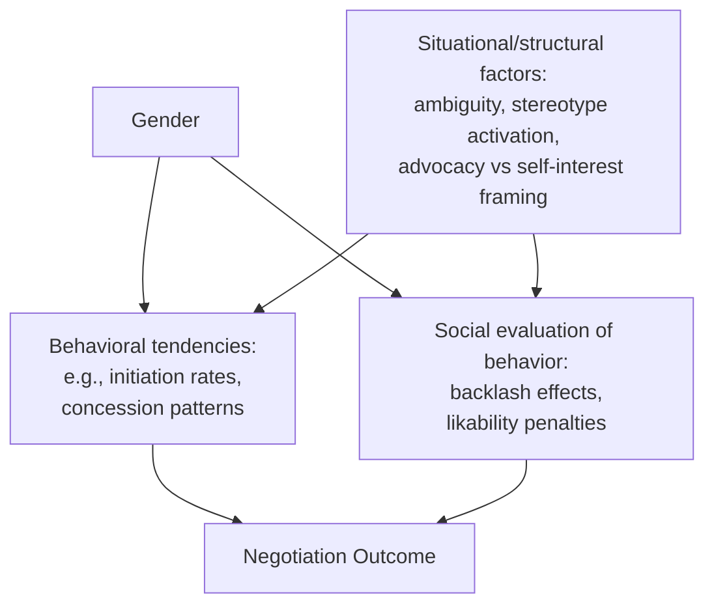

## Gender Dynamics in Negotiation

### Definition and Scope

This topic examines documented patterns in negotiation behavior, outcomes, and social perception associated with gender, as studied within negotiation and organizational behavior research. The field distinguishes between three related but distinct research questions: (1) whether behavioral differences in negotiation exist by gender, (2) whether outcome differences exist by gender, and (3) whether the *social evaluation* of identical negotiating behavior differs by the negotiator's gender. Contemporary research treats these as separable phenomena, since a behavior can be identically performed but differently rewarded or penalized depending on the negotiator's gender — a distinction central to this literature.

### Foundational Distinction: Behavior, Outcome, and Evaluation Effects

### Documented Behavioral Patterns: Initiation and Ask Rates

One of the most cited and replicated findings in this literature, established substantially through research by Linda Babcock and Sara Laschever (*Women Don't Ask*), concerns differences in negotiation initiation rates — the propensity to initiate a negotiation at all (e.g., over salary), as distinct from performance once a negotiation begins.

**Key finding:** Multiple studies find women are, on average, less likely than men to initiate negotiations, particularly for self-interested outcomes like salary or promotion requests, in contexts where negotiation is not clearly signaled as expected or appropriate.

**[Inference/context-dependent]** This gap has been shown in some studies to narrow or disappear when situational ambiguity is reduced — for example, when it is explicitly stated that a number is negotiable, or when a negotiation is framed as advocating for a team/others rather than purely for oneself. This suggests the effect is substantially moderated by situational cues rather than being a fixed, context-independent trait difference.

### The Backlash Effect: Differential Evaluation of Identical Behavior

A distinct and heavily studied phenomenon, most associated with research by Hannah Riley Bowles, Linda Babcock, and colleagues, is the finding that assertive or competitive negotiating behavior can be socially penalized more heavily when performed by women than by men — sometimes termed the "backlash effect" or "social cost of negotiating."

**Mechanism [as described in this research stream]:** Assertiveness and self-advocacy are more consistent with prevailing gender-role expectations of men (agentic traits) than of women (traditionally associated with communal traits in the same stereotype content models). When a woman negotiates assertively, particularly for self-interested outcomes, this can be perceived as a violation of expected communal behavior, leading counterparts to rate her as less likable, less "nice," or more difficult to work with — even when the identical script, performed by a man, is not penalized to the same degree.

**[Inference]** This creates a structurally different strategic calculus: a male negotiator's assertive tactic may carry primarily a distributive tradeoff (aggression vs. relationship strain), while the same tactic for a female negotiator, in this research framing, can carry an additional social/reputational cost layer not symmetrically present for male counterparts — a key reason this literature treats "just negotiate more assertively" as an incomplete prescriptive response to the initiation gap.

### The Advocacy Framing Moderator

A frequently cited finding (associated with Bowles and Babcock's research) is that the backlash effect is substantially reduced or eliminated when a woman negotiates on behalf of someone else (a team, a client, a subordinate) rather than for purely self-interested gain.

**[Inference]** This pattern is theoretically consistent with the stereotype-violation mechanism described above: advocating for others is congruent with communal-role expectations even when the advocacy itself involves assertive tactics, whereas advocating purely for oneself is not — meaning the *purpose framing* of the identical behavior, not the behavior itself, appears to be a key moderating variable in social evaluation outcomes.

### Comparative Table: Common Findings and Their Boundary Conditions

| Finding | General Pattern | Key Moderator/Boundary Condition |
| --- | --- | --- |
| Initiation gap | Women initiate self-interested negotiations less frequently | Narrows when negotiability is explicit; narrows in advocacy-for-others framing |
| Backlash/social cost effect | Assertive women rated less favorably than equally assertive men | Reduced when negotiating on behalf of others; varies by industry/context norms |
| Outcome gap (e.g., salary) | Aggregate outcome differences observed in some studies | [Inference] Likely reflects a combination of initiation-rate differences, structural factors (occupational segregation, prior pay history anchoring), and evaluation effects rather than a single cause |
| Risk of overcorrection | Prescriptive advice telling women to simply "negotiate harder" | Can increase exposure to backlash effects if applied without addressing the evaluation asymmetry itself |

### Structural and Contextual Factors Beyond Individual Behavior

**[Inference]** A significant portion of contemporary research in this area has shifted emphasis from framing outcome gaps as primarily a deficit in individual women's negotiation behavior (a framing some scholars have critiqued as placing undue responsibility on individuals) toward examining structural and contextual factors:

- **Anchoring on prior compensation history:** Pay history-based anchoring can perpetuate historical outcome gaps regardless of negotiation skill in the current interaction, which has motivated policy responses like salary history ban legislation in some jurisdictions.
- **Occupational segregation:** Aggregate gender pay gaps are influenced substantially by which occupations and industries are more heavily represented by each gender, a factor operating upstream of any individual negotiation interaction.
- **Organizational transparency:** Negotiation-outcome gender gaps have been shown in some studies to narrow in organizations with more transparent, structured compensation-setting processes, since ambiguity and case-by-case negotiation create more room for differential outcomes to emerge.

### Practical Example: Designing a Negotiation Skills Program with This Research in Mind

**Scenario:** An organization is designing negotiation skills training and wants to account for the gender-dynamics research described above.

**Poor approach:** A generic program telling all participants to "be more assertive," without addressing evaluation asymmetries — this risks placing female participants who apply the advice at elevated risk of the backlash effect documented in the research, without corresponding organizational safeguards.

**More calibrated approach, incorporating the research:**

1. **Explicit negotiability signaling:** The organization states clearly that compensation and role terms are negotiable for all candidates, reducing the ambiguity shown to widen initiation gaps.
2. **Advocacy framing option:** Training includes guidance on framing self-advocacy requests in terms of team or role contribution value, leveraging the documented reduction in backlash under advocacy framing, without treating this as the *only* acceptable framing.
3. **Evaluator-side training:** Training extends to those *evaluating* negotiators (hiring managers, counterparties) on recognizing and counteracting the backlash-effect bias itself, rather than placing the full corrective burden on negotiators.
4. **Structural transparency:** Pay bands and negotiation ranges are disclosed upfront, reducing the role of individual negotiation-outcome variance (and its documented gender-differential pattern) in final compensation determination.

**Output:** This example illustrates the shift in contemporary practice from purely individual-behavior-focused interventions toward combined individual- and structural-level responses, consistent with the research's finding that behavior, evaluation, and structural context all independently contribute to observed outcome patterns.

### Methodological and Interpretive Caveats

**[Inference]** Several caveats are important when engaging with this literature:

- Many foundational studies use experimental/lab paradigms (scripted negotiation scenarios, MBA student samples) whose generalizability to specific real-world professional contexts is an ongoing empirical question, not a settled matter.
- Effect sizes and even directionality for some findings vary across studies, industries, and cultural contexts; this is an active and evolving research area rather than a fixed, universally agreed-upon set of laws.
- This entry focuses on the primary quantitative negotiation-research literature (economics/organizational-behavior tradition); it does not exhaustively cover related but distinct literatures on broader labor-market gender gaps, which involve additional causal factors beyond negotiation behavior specifically.
- **[Unverified]** The extent to which documented effects (initiation gap, backlash effect) generalize across non-binary gender identities has limited direct study in the foundational literature, which was largely structured around binary male/female comparisons; this is a notable gap in the existing evidence base.

### Key Points

- Distinguish three separable phenomena: behavioral differences (e.g., initiation rates), evaluation differences (backlash effects on identical behavior), and resulting outcome differences — conflating them leads to incomplete prescriptive advice.
- The initiation gap is substantially moderated by situational ambiguity and negotiability signaling, not solely an individual trait difference.
- The backlash effect means identical assertive behavior can be differentially penalized by gender, which complicates simple "negotiate more assertively" prescriptions.
- Advocacy-for-others framing has been shown to reduce backlash effects relative to purely self-interested framing.
- Contemporary practice increasingly combines individual-level negotiation training with structural interventions (transparency, evaluator bias training, salary history bans) rather than relying on individual behavior change alone.

### Related Topics

- The Backlash Effect and Stereotype Content Models (Agentic vs. Communal Traits)
- Salary History Ban Legislation and Anchoring Effects
- Advocacy vs. Self-Interested Framing in Negotiation Requests
- Organizational Pay Transparency and Negotiation Outcome Variance
- Occupational Segregation and Structural Contributors to Pay Gaps
- Cross-Cultural Intersections with Gender Dynamics in Negotiation
- Implicit Bias Training for Negotiation Counterparties and Evaluators