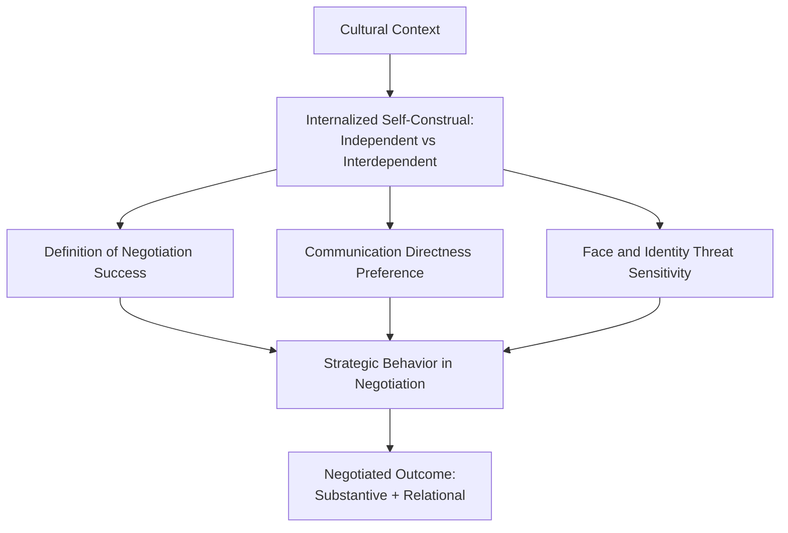

## Cultural Identity and Negotiator Self-Concept

### Definition and Scope

This topic examines how a negotiator's cultural identity — the internalized values, self-construal patterns, and group-membership frameworks derived from cultural context — shapes their fundamental self-concept in ways that influence negotiation cognition, motivation, and behavior. Unlike surface-level cultural etiquette (greeting customs, gift-giving norms), this area addresses deeper psychological structures: how individuals from different cultural backgrounds conceptualize themselves as negotiating agents, what they perceive as the purpose of negotiation, and how identity-based motivations shape strategic choices.

### The Independent vs. Interdependent Self-Construal Framework

The foundational theoretical framework for this topic derives from Hazel Markus and Shinobu Kitayama's self-construal theory, which has been extensively applied to negotiation by researchers including Michele Gelfand, Wendi Adair, and Jeanne Brett.

| Self-Construal Type | Core Orientation | Associated Cultural Context (General Tendency) |
| --- | --- | --- |
| Independent self-construal | Self as a distinct, autonomous entity; identity defined by internal traits, achievements, and personal goals | More commonly associated with individualist cultural contexts (e.g., US, Western Europe, Australia) |
| Interdependent self-construal | Self as fundamentally embedded within relationships and group memberships; identity defined by roles, relationships, and group harmony | More commonly associated with collectivist cultural contexts (e.g., East Asia, many Latin American and African contexts) |

**[Inference]** These associations describe population-level tendencies documented in cross-cultural psychology research, not fixed individual determinism — substantial within-culture variation exists, and treating any individual negotiator as a simple embodiment of their national culture's average tendency risks stereotyping rather than genuine cultural competence.

### How Self-Construal Shapes Negotiation Cognition

**Independent self-construal effects [as documented in this research stream]:**

- Tendency to frame negotiation primarily around individual gain and personal achievement metrics
- Greater comfort with direct, explicit communication of positions and interests
- Self-concept less threatened by direct confrontation over substantive issues, since disagreement over positions is more readily separated from identity
- Tendency to evaluate negotiation success primarily by individual outcome metrics (price achieved, terms secured)

**Interdependent self-construal effects [as documented in this research stream]:**

- Tendency to frame negotiation within a relational and group-context frame, weighing impacts on ongoing relationships and group harmony alongside substantive terms
- Greater use of indirect communication, particularly around refusal or disagreement, to preserve relational harmony and avoid face-threat
- Self-concept more closely tied to relational standing, making direct confrontation more identity-threatening and more likely to be avoided or managed indirectly
- Tendency to evaluate negotiation success by a broader metric including relationship preservation and mutual face-maintenance, not solely substantive terms

### Diagram: Self-Construal to Negotiation Behavior Pathway

### Face Concerns and Identity Protection

Closely tied to self-construal is the concept of "face" (derived substantially from Erving Goffman's sociological work and extensively elaborated in cross-cultural negotiation research by Stella Ting-Toomey's Face-Negotiation Theory) — the socially situated image of self that a negotiator seeks to maintain or enhance.

**Face-Negotiation Theory's core claim:** Individuals with more interdependent self-construals tend to be more concerned with "other-face" (protecting the counterparty's public image) and "mutual-face" (protecting the relationship's shared image), while individuals with more independent self-construals tend to prioritize "self-face" (protecting one's own individual image/reputation).

**Practical implication [Inference]:** A negotiator with strong other-face concern may avoid direct rejection of a counterparty's proposal even when the proposal is entirely unacceptable, instead using indirect signals (vague assent, deferred response, third-party communication) that a negotiator operating primarily from self-face or independent-self frameworks may fail to correctly interpret as refusal — a documented source of cross-cultural negotiation misunderstanding.

### Cultural Identity Salience: A Contextual, Not Fixed, Variable

**[Inference]** An important theoretical refinement in more recent research (building on situational identity-activation theory in social psychology) is that cultural identity's influence on negotiation behavior is not a fixed, always-active trait but can be *primed* or made more or less salient by situational context. A bicultural negotiator (e.g., someone with both individualist and collectivist cultural exposure) may exhibit different self-construal-driven behavior depending on situational cues — language used in the negotiation, the cultural composition of the counterparty team, or explicit cultural framing of the negotiation's purpose.

This has been demonstrated experimentally through cultural priming studies, where exposing bicultural individuals to cultural icons or values associated with one culture shifts their subsequent negotiation behavior toward that culture's typical patterns — suggesting self-construal effects operate partly through activated cognitive frames rather than solely fixed personality-like traits.

### Practical Example: Diagnosing a Cross-Cultural Impasse

**Scenario:** A negotiator from a strongly independent-self-construal background proposes a straightforward price reduction directly, expecting a clear yes/no response. Their counterparty, operating from a strongly interdependent-self-construal background, responds with statements like "this will require further internal discussion" and "we will try our best to consider this," without direct acceptance or refusal.

**Misreading without cultural-identity awareness:** The first negotiator may interpret the response as genuine openness or as evasive stalling, and may escalate pressure tactics (deadlines, ultimatums) to force a direct answer.

**Reading informed by self-construal/face theory:** The response may represent a face-preserving indirect refusal or a genuine need to consult a broader relational/group decision process inconsistent with the independent-self assumption of individual unilateral authority — the ambiguous language may itself be the substantive communication, not a delay tactic.

**Adjusted approach:** Rather than escalating pressure, the first negotiator might explicitly create space for indirect refusal without face loss (e.g., offering a modified proposal framed as easier to bring back to their group) or directly (but respectfully) ask what internal process or stakeholders need to be satisfied — treating the group/relational dimension as a legitimate substantive factor rather than an obstacle to a "real" individual answer.

**Output:** This illustrates how self-construal-aware diagnosis changes the negotiator's interpretation of ambiguous behavior and their strategic response, independent of any specific national-culture checklist.

### Identity Threat and Escalation Dynamics

**[Inference]** A distinct application of self-concept theory to negotiation concerns identity-based escalation: when a negotiator's core self-concept (professional competence, group loyalty, moral identity) becomes implicated in the substantive negotiation issue, disputes can escalate beyond what the substantive stakes alone would predict, because conceding on the issue is experienced as conceding on identity itself.

This connects to broader identity-based conflict theory (relevant to labor disputes, ethnic/political negotiations, and organizational conflicts involving professional identity) and suggests that skilled negotiators benefit from explicitly separating substantive issue concessions from identity-threatening framing — for example, structuring a concession as compliance with external/objective criteria rather than personal capitulation, preserving the conceding party's self-concept even while yielding on substance.

### Table: Self-Concept-Informed Negotiation Adjustments

| Self-Concept Signal Observed | Possible Underlying Dynamic | Adjustment Consideration |
| --- | --- | --- |
| Indirect or vague responses to direct proposals | Interdependent self-construal; other-face or mutual-face preservation | Create indirect-refusal-safe options; avoid forcing binary yes/no under pressure |
| Strong resistance disproportionate to substantive stakes | Identity threat; issue implicates self-concept or group loyalty | Separate substantive terms from identity framing; use objective criteria to depersonalize concessions |
| Emphasis on group/collective consultation before deciding | Interdependent self-construal; group-embedded decision authority | Build realistic timelines for internal consultation; avoid interpreting delay as stalling |
| Comfort with direct disagreement over specific terms | Independent self-construal; self-face primarily engaged | Direct counter-proposals and explicit disagreement are less likely to be relationally damaging |

### Critiques and Limitations

**Risk of essentialism:** [Inference] A significant critique of applying self-construal and face theory in practice is the risk of reductive stereotyping — treating a negotiator's national or cultural background as a deterministic predictor of their self-construal, when substantial individual variation exists within any cultural group, and factors like professional socialization, organizational culture, and individual personality interact with cultural background in ways not captured by broad cultural categories alone.

**Measurement and generalization challenges:** Self-construal is typically measured via self-report scales in laboratory contexts; the ecological validity of translating these measures to predict specific behaviors in high-stakes, real-world professional negotiations involves the same generalization questions present across much of experimental social psychology.

**Globalization and hybridization:** [Inference] Increasing cross-cultural exposure through global business, education, and media may be producing increasingly hybrid or context-switching self-construal patterns in many professional populations, potentially reducing the predictive power of broad national-culture categories over time relative to when foundational studies in this area were conducted — though the extent of this shift is difficult to quantify precisely and remains an open empirical question.

### Key Points

- Self-construal (independent vs. interdependent) is a foundational psychological framework explaining how cultural identity shapes negotiator self-concept, distinct from surface etiquette differences.
- Face-Negotiation Theory extends this framework by distinguishing self-face, other-face, and mutual-face concerns, which vary systematically with self-construal orientation.
- Cultural identity's influence on negotiation behavior can be situationally primed and is not necessarily a fixed, always-equally-active trait, particularly for bicultural or multiculturally exposed individuals.
- Identity threat, where substantive issues become entangled with a negotiator's core self-concept, can drive escalation disproportionate to objective stakes; separating substance from identity framing is a key mitigation technique.
- Applying these frameworks requires care to avoid essentialist stereotyping, since population-level tendencies do not determine any specific individual's behavior.

### Related Topics

- Face-Negotiation Theory (Ting-Toomey) and Cross-Cultural Conflict Styles
- Individualism-Collectivism as a Cultural Dimension (Hofstede, Triandis)
- Identity-Based Conflict and Escalation Dynamics
- Bicultural Identity and Cultural Frame-Switching in Negotiation
- High-Context vs. Low-Context Communication Styles
- Indirect Communication and Refusal Strategies Across Cultures
- Objective Criteria as a Depersonalization Tactic in Concession-Making