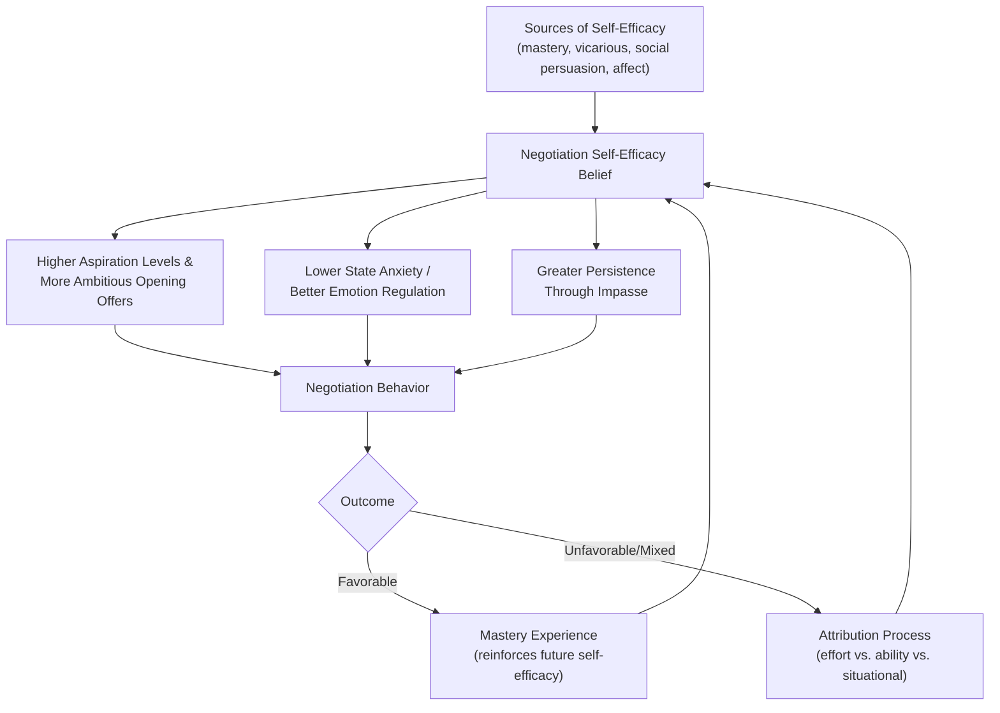

## Self-Efficacy and Confidence at the Table

### Definition and Conceptual Foundation

Self-efficacy, a construct originating in Albert Bandura's social cognitive theory (1977, 1997), refers to an individual's belief in their own capacity to execute the behaviors necessary to produce specific performance attainments. Negotiation self-efficacy specifically denotes a negotiator's confidence in their ability to plan, execute, and adapt negotiation strategies effectively to achieve desired outcomes.

Self-efficacy is distinct from general self-esteem (global self-worth) and from overconfidence (miscalibrated belief exceeding actual ability). It is task-specific and domain-bound: an individual may exhibit high self-efficacy in salary negotiations but low self-efficacy in cross-cultural business negotiations. Confidence "at the table" refers to the situational, in-the-moment expression of this belief during active negotiation, encompassing composure under pressure, willingness to make and resist concessions, and persistence through impasse.

### Theoretical Sources of Self-Efficacy

Bandura identified four primary sources through which self-efficacy beliefs are formed, each directly applicable to negotiation training and preparation:

| Source | Mechanism | Negotiation Application |
| --- | --- | --- |
| Mastery experiences | Direct personal success in prior performance | Successfully closing previous deals; incremental exposure to harder negotiations |
| Vicarious experiences | Observing similar others succeed | Watching mentors or peers negotiate effectively; modeling |
| Verbal/social persuasion | Credible encouragement from others | Coaching, feedback from negotiation trainers, affirmation from colleagues |
| Physiological/affective states | Interpretation of bodily arousal and emotion | Managing anxiety, reframing nervous arousal as readiness rather than threat |

**Key Points**

- Mastery experience is generally regarded as the most powerful source, since direct success provides the most credible evidence of capability.
- Physiological arousal is not inherently negative; how a negotiator *interprets* arousal (as debilitating anxiety versus performance-enhancing activation) significantly shapes resulting self-efficacy and behavior, a distinction supported in stress-appraisal research (Lazarus & Folkman's transactional model of stress).

### Self-Efficacy vs. Related Constructs

$$SE_{negotiation} \neq \text{Self-Esteem}, \quad SE_{negotiation} \neq \text{Dispositional Optimism}, \quad SE_{negotiation} \neq \text{Overconfidence}$$

- **Self-esteem** is a trait-like global evaluation of self-worth, largely independent of any specific task.
- **Dispositional optimism** is a generalized expectancy that good outcomes will occur across domains, not tied to perceived personal capability.
- **Overconfidence** is a *miscalibration* between perceived and actual competence; self-efficacy, when accurate, reflects a *calibrated* belief matched to real skill level. Overconfidence in negotiation is associated with anchoring too aggressively, underestimating the counterpart's BATNA, and failure to update beliefs in light of new information.

### Mechanisms Linking Self-Efficacy to Negotiation Behavior and Outcomes

**Goal-Setting and Aspiration Levels**

Self-efficacy directly influences the ambition of a negotiator's goals and aspiration levels, consistent with Locke and Latham's goal-setting theory. Higher self-efficacy is associated with setting more ambitious opening offers and target points, which in turn correlates with more favorable distributive outcomes, provided the ambition remains within a defensible range.

$$\text{Aspiration Level} = f(\text{Self-Efficacy}, \text{Perceived Task Difficulty}, \text{Outcome Expectancy})$$

**Persistence Through Impasse**

Bandura's framework predicts that individuals with higher self-efficacy exhibit greater persistence when negotiations encounter difficulty or apparent stalemate, rather than prematurely conceding or exiting. Lower self-efficacy negotiators are more prone to escaping the interaction through premature concessions to reduce discomfort.

**Anxiety Regulation and Cognitive Resources**

Negotiation anxiety consumes working memory and cognitive resources that would otherwise be allocated to strategic thinking, active listening, and information processing (consistent with cognitive load theory applications in social performance contexts). Higher self-efficacy is associated with lower state anxiety at the table, freeing cognitive capacity for integrative, information-sensitive negotiation moves rather than purely defensive, script-based reactions.

**Claiming and Assertiveness Behaviors**

Self-efficacious negotiators are more likely to make first offers, ask direct questions about counterpart interests and constraints, and resist unwarranted anchors, since these behaviors carry a perceived risk of social friction that lower-self-efficacy individuals are more motivated to avoid.

### The Self-Efficacy to Outcome Pathway

### The Confidence-Competence Gap and Overconfidence Risk

**Key Points**

- The Dunning-Kruger effect describes a pattern in which individuals with lower actual competence in a domain may exhibit disproportionately high confidence due to limited metacognitive awareness of their own knowledge gaps; conversely, higher-competence individuals sometimes underestimate their relative standing. [Inference: the robustness and precise shape of this effect has been subject to methodological debate in psychometric literature, particularly regarding statistical artifacts in the original measurement approach.]
- In negotiation specifically, excessive confidence unmoored from preparation quality can manifest as insufficient BATNA research, weak anchoring rationale, and poor responsiveness to new information revealed during the exchange (a form of the "curse of knowledge" or fixed-pie bias compounded by unwarranted certainty).
- Calibrated confidence, by contrast, is confidence that tracks genuine preparation, accurate self-assessment of leverage, and realistic estimation of the counterpart's alternatives.

### Individual Differences Moderating Self-Efficacy Effects

**Gender and Social Role Expectations**

A substantial body of negotiation research (e.g., Bowles, Babcock, and colleagues) documents that self-efficacy and assertive negotiation behavior can be moderated by gender-linked social expectations, particularly around distributive, self-advocacy negotiations (such as salary negotiations), where deviation from prescriptive gender norms can carry social backlash costs that differentially affect willingness to negotiate assertively. [Inference: the magnitude and consistency of these effects vary by context, negotiation type (self-advocacy vs. third-party advocacy), and cultural setting, and remain an active area of empirical research.]

**Personality Traits (Big Five Correlates)**

- **Extraversion** is generally associated with greater comfort in assertive, expressive negotiation behavior, which can co-occur with higher situational confidence.
- **Neuroticism** is generally associated with heightened negotiation anxiety, which can suppress self-efficacy expression at the table even when underlying preparation is adequate.
- **Conscientiousness** supports self-efficacy indirectly through more thorough preparation, which constitutes a mastery-adjacent input to confidence.

**Power and Role Position**

Perceived power (whether structural, from BATNA strength, or psychological, from role or status) is empirically linked to increased confidence, more assertive first offers, and reduced perspective-taking, per power-approach theory in social psychology (Keltner, Gruenfeld, and Anderson's approach/inhibition model of power). High power combined with low self-efficacy accuracy can amplify overconfidence risks; high self-efficacy combined with accurate power assessment tends to produce the most consistently favorable outcomes.

### Example

**Example**

Two candidates negotiate a starting salary for similar roles at the same firm. Candidate A has rehearsed the negotiation with a mentor, researched market salary bands, and previously negotiated successfully in an internship offer (a mastery experience). Candidate B has not rehearsed and enters with only a vague sense of market rate. Candidate A opens with a well-anchored, specific figure supported by concrete market data and maintains that figure calmly when the recruiter pushes back, framing the pushback as a normal part of the process rather than a threat. Candidate B, experiencing higher anxiety and lower self-efficacy, both under-anchors and concedes quickly at the first sign of resistance to reduce discomfort. All else equal, Candidate A is likely to secure better terms, illustrating the compounding effect of mastery experience, preparation-based calibration, and lower state anxiety.

### Building Self-Efficacy: Evidence-Based Interventions

**Next Steps**

- **Structured rehearsal and role-play:** Simulated negotiations with feedback function as engineered mastery experiences, particularly effective when difficulty is scaffolded incrementally (easy cases before hard ones).
- **Modeling and mentorship exposure:** Observing skilled negotiators, including via recorded negotiations or case study debriefs, provides vicarious efficacy-building input, especially when the model is perceived as similar to the observer.
- **Structured feedback and coaching:** Specific, credible verbal persuasion (e.g., a coach identifying a concrete skill improvement) is more effective for self-efficacy building than generic encouragement.
- **Reappraisal of physiological arousal:** Reframing pre-negotiation nervousness as "excited readiness" rather than "anxiety" (an "arousal reappraisal" technique studied in performance psychology) can shift the same physiological state toward a more adaptive interpretation.
- **Preparation-based calibration:** Building confidence explicitly on researched BATNA, market data, and interest mapping (rather than generalized bravado) reduces the risk of unwarranted overconfidence while still supporting assertive, ambitious goal-setting.
- **Post-negotiation attribution review:** After each negotiation, explicitly analyzing which outcomes were due to preparation and skill versus situational or counterpart-driven factors supports accurate self-efficacy calibration over time, rather than overgeneralizing from single outcomes.

**Related Topics**

- Anchoring and First-Offer Strategy
- BATNA Development and Its Effect on Perceived Power
- Gender, Social Role Expectations, and Negotiation Assertiveness
- Emotion Regulation and Affect Control at the Bargaining Table
- Power and the Approach/Inhibition Model in Negotiation
- Overconfidence Bias and Debiasing Techniques in Negotiation Preparation
- Big Five Personality Traits and Negotiation Style
- Attribution Theory Applied to Post-Negotiation Debriefing