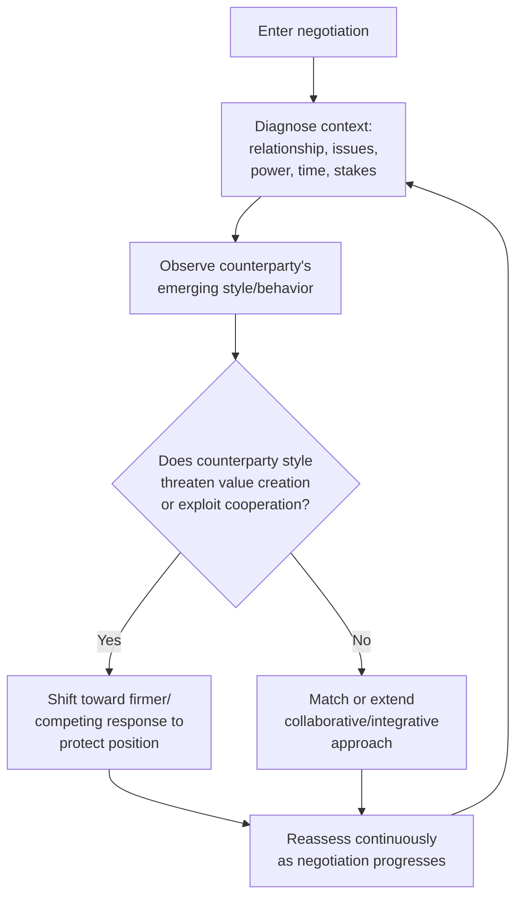

## Adapting Style to Context and Counterpart

### Definition and Scope

Adapting style to context and counterpart refers to the negotiator's capacity to diagnose situational and counterparty-specific variables and deliberately adjust their negotiation approach — including conflict-handling mode, communication style, concession pacing, and tactical emphasis — rather than applying a single fixed style across all negotiations. This capacity is frequently termed "behavioral flexibility" or "tactical flexibility" in the negotiation literature and is treated as a distinct competency from any single style preference itself.

### Theoretical Foundation: Style as Repertoire, Not Fixed Trait

**[Inference]** A recurring theme across negotiation pedagogy, building on frameworks like the Thomas-Kilmann model and the dual-concern model, is that expert negotiators are characterized less by possessing one "correct" dominant style and more by having a broad behavioral repertoire combined with accurate situational diagnosis — the ability to recognize which style or tactic a given moment calls for and to execute it, even when it does not match one's default disposition.

This reframes negotiation style not as a fixed personality output but as a contingent choice, analogous to a contingency-theory approach in leadership research (e.g., situational leadership models), where effectiveness depends on matching approach to context rather than on any single universally superior style.

### Key Contextual Variables Driving Style Adaptation

| Variable | Style Implication |
| --- | --- |
| Relationship duration (one-shot vs. repeated/ongoing) | One-shot transactions tolerate more competing behavior; ongoing relationships favor collaborating/compromising to preserve future value |
| Issue count (single-issue vs. multi-issue) | Single-issue negotiations are structurally more zero-sum, favoring distributive tactics; multi-issue negotiations create integrative potential, favoring collaborating |
| Power balance | Symmetric power often supports compromising; significant power asymmetry can shift the stronger party toward competing and the weaker party toward accommodating or avoiding |
| Time pressure | High time pressure favors faster-resolving styles (compromising, competing); low time pressure allows collaborating's higher information-exchange cost |
| Stakes/importance | High-stakes issues important to both parties favor collaborating investment; low-stakes issues favor avoiding or quick compromising |
| Counterparty's style | Matching, complementing, or strategically countering the counterparty's observed style (detailed below) |

### Diagram: Style Adaptation Decision Process

### Counterparty-Contingent Adaptation: Matching, Reciprocity, and Strategic Response

**Reciprocity-based adaptation:** A substantial body of negotiation and behavioral game theory research (tracing to work on tit-for-tat strategies in repeated games, notably associated with Robert Axelrod's iterated prisoner's dilemma research) supports the general principle that cooperative overtures should generally be met with cooperative responses, and competitive/exploitative behavior should generally be met with firm (not necessarily escalatory) pushback, to avoid signaling exploitability.

**[Inference]** This suggests an adaptive negotiator's default should not be a single fixed conciliatory style regardless of counterparty behavior, since unconditional cooperation in the face of a competing counterparty risks being systematically exploited (a well-documented weakness of purely conciliatory strategies in repeated-game simulations), nor should it be unconditional competing, which forecloses integrative potential when the counterparty is genuinely cooperative.

**Mirroring and rapport-building adaptation:** Distinct from strategic reciprocity, some adaptation operates at a communication-style level — adjusting pace, formality, directness, and communication channel preferences to build rapport, sometimes discussed under general "mirroring" techniques in negotiation and hostage-negotiation-derived training (e.g., work popularized by Chris Voss). **[Unverified]** The degree to which explicit verbal/vocal mirroring techniques produce measurable negotiation outcome improvements, versus their more established role in general rapport-building, is not uniformly settled with strong controlled-study evidence across all training contexts, and specific technique claims from popular negotiation training literature should be treated with more caution than peer-reviewed dual-concern or reciprocity research.

### Cross-Cultural Style Adaptation

Adaptation also extends to cultural context, connecting to broader research on self-construal and communication style (see also: Cultural Identity and Negotiator Self-Concept). A negotiator accustomed to direct, low-context communication styles may need to adapt toward more indirect, relationship-oriented approaches when facing a counterparty from a high-context, interdependent-self-construal background, and vice versa.

**[Inference]** Effective cross-cultural adaptation is generally distinguished in the literature from simple imitation or "code-switching" performance — the goal is typically framed as genuinely understanding the counterparty's decision-making process and face concerns well enough to adjust one's own communication and pacing, rather than superficially mimicking surface behaviors without corresponding substantive understanding.

### Practical Example: Sequential Style Adaptation Within One Negotiation

**Scenario:** A procurement negotiator is renewing a multi-year contract with a long-standing supplier, spanning several issues (price, delivery terms, exclusivity, payment schedule).

| Stage | Observed Context/Counterparty Signal | Adapted Style |
| --- | --- | --- |
| Opening | Supplier opens with an aggressive price increase demand, testing resolve | Firm, competing-leaning response on price to avoid signaling easy exploitability, while explicitly reaffirming interest in continuing the relationship |
| Interest exploration | Supplier reveals underlying concern about payment timing (cash flow), not price per se | Shift to collaborating: propose a trade — faster payment terms in exchange for a smaller price increase, creating joint value neither party initially proposed |
| Minor delivery scheduling detail | Low stakes, easily resolved | Quick compromising to avoid spending negotiation capital on a low-value issue |
| Exclusivity clause disagreement | High stakes for supplier, moderate for buyer, time pressure mounting near deadline | Accommodating on exclusivity (conceding more), since it is disproportionately important to the supplier and buyer has flexibility elsewhere, in exchange for locking in favorable terms on higher-buyer-priority issues |

**Output:** This illustrates adaptive style selection operating dynamically both across negotiation phases and in response to counterparty-revealed information, rather than a single style applied uniformly throughout.

### Barriers to Effective Style Adaptation

**Dispositional anchoring:** Individuals with strong default style preferences (as might be measured by an instrument like the TKI) may find deviation from their default style cognitively effortful, particularly under stress, when default/habitual responses tend to dominate.

**Misdiagnosis of counterparty style:** Adaptation quality depends on accurate real-time diagnosis of the counterparty's actual style and underlying interests; misreading a genuinely collaborative counterparty as competing (or vice versa) can lead to miscalibrated, counterproductive style shifts.

**Overcorrection risk:** [Inference] Negotiators newly trained in flexibility concepts may overcorrect by attempting styles poorly suited to their natural communication patterns or the specific relationship, potentially appearing inconsistent or inauthentic to a counterparty who has an established relationship-based expectation of the negotiator's typical approach.

**Time and cognitive load constraints:** Continuous situational diagnosis and style-switching is more cognitively demanding than applying a single default approach, which can be a genuine constraint in fast-paced, high-volume, or high-stress negotiation contexts.

### Developing Style Adaptation as a Skill

**Key Points**

- Build accurate situational diagnosis skill first: relationship value, issue structure, power balance, and time pressure should be explicitly assessed before or early in a negotiation, not left to intuition alone.
- Develop comfort operating outside one's default/dispositional style through deliberate practice, since habitual response patterns dominate under stress absent trained alternatives.
- Use counterparty behavior as ongoing diagnostic information, adjusting style in response to revealed cooperation or competition signals rather than committing to a single approach for the full negotiation.
- Apply reciprocity principles cautiously: match cooperation with cooperation, but avoid unconditional cooperation that can be exploited by a genuinely competitive counterparty.
- Distinguish genuine adaptive understanding (adjusting substantively to counterparty decision processes and interests) from superficial style mimicry, particularly in cross-cultural contexts.

### Related Topics

- The Thomas-Kilmann Conflict Mode Instrument
- Reciprocity and Tit-for-Tat Strategies in Repeated Negotiation Games
- Cultural Identity and Negotiator Self-Concept
- Behavioral Flexibility Training and Negotiation Coaching
- Diagnosing Counterparty Interests vs. Positions
- Situational Contingency Models in Leadership and Negotiation
- Power Asymmetry and Its Effect on Style Selection