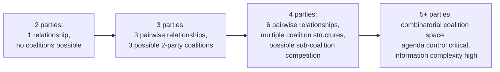

## Complexity and Coordination in Multi-Party Talks

### Definition and Scope

Multi-party negotiation refers to negotiations involving three or more parties (or negotiating entities) with potentially distinct interests, as opposed to the dyadic (two-party) negotiations that form the foundation of most classical negotiation theory. The shift from two to three or more parties introduces qualitatively distinct complexity, not merely an incremental increase in difficulty — a distinction extensively documented by researchers including Jeanne Brett, Leigh Thompson, and Roy Lewicki.

### Why Multi-Party Negotiation Is Structurally Distinct, Not Merely Larger

**[Inference]** The combinatorial nature of coalition possibilities is the central structural driver of multi-party complexity. In a two-party negotiation, there is exactly one possible relationship configuration. With $n$ parties, the number of possible coalition subsets grows as $2^n - 2$ (excluding the empty set and the full grand coalition, or included depending on framing), meaning complexity grows combinatorially rather than linearly as parties are added.

$$\text{Possible coalitions} = 2^n - n - 1 \text{ (non-trivial subsets, excluding singletons and grand coalition)}$$

This combinatorial growth underlies several qualitatively new dynamics absent from dyadic negotiation: coalition formation, agenda control, information asymmetry across multiple relationships simultaneously, and the possibility of side deals invisible to other parties.

### Core Sources of Complexity

| Complexity Source | Description | Absent/Minimal in Dyadic Negotiation |
| --- | --- | --- |
| Coalition formation | Subsets of parties can combine to increase collective leverage against remaining parties | Yes — no coalition possible with only two parties |
| Agenda and process control | Who sets the order of issues, speaking order, and procedural rules can significantly shape outcomes | Present but far less consequential |
| Information asymmetry complexity | Each pair of parties may have different information; a party may know things others don't know it knows | Simpler; only one information relationship exists |
| Sequential vs. simultaneous negotiation | Whether all parties negotiate together or through separate bilateral tracks changes strategic dynamics substantially | Not applicable |
| Social/relational dynamics | Group psychology effects (conformity pressure, groupthink risk, status hierarchies) emerge | Minimal |
| Ratification/coordination costs | Reaching agreement often requires coordinating internal consensus within party coalitions, not just across parties | Not applicable to individual dyadic parties |

### Diagram: Complexity Growth by Number of Parties

### Coalition Formation Dynamics

Coalition theory, with roots in cooperative game theory (notably the Shapley value framework and core solution concepts), provides formal tools for analyzing which coalitions are likely to form and how coalition value might be allocated among members.

**Key concepts:**

- **Coalition value:** The joint outcome a subset of parties can achieve by combining forces, typically greater than the sum of what each could achieve independently (otherwise the coalition offers no incentive to form).
- **Minimum winning coalition principle:** In many multi-party contexts (particularly voting-based or majority-rule contexts), theory predicts a tendency toward the smallest coalition sufficient to prevail, since a minimum winning coalition allows the fewest parties to divide the coalition's gains — a principle originating in political coalition theory (William Riker's size principle).
- **Coalition stability:** A coalition is considered stable if no subset of its members has an incentive to defect and form an alternative coalition offering them a better outcome — connecting to the game-theoretic concept of the "core" of a cooperative game.

**[Inference]** The size principle's predictive power is most robust in contexts with clear, quantifiable payoffs subject to majority-rule division (e.g., legislative coalitions); its applicability weakens in contexts involving qualitative interests, ongoing relationships, or reputational considerations that resist reduction to a divisible payoff, which is common in many real-world business and diplomatic multi-party negotiations.

### Process and Agenda Management

**Sequencing effects:** The order in which issues are addressed can materially affect outcomes — early agreements can create momentum and anchoring effects for subsequent issues, while unresolved early issues can generate impasse risk affecting the entire negotiation.

**Caucusing:** The practice of temporarily breaking a full multi-party session into smaller sub-group or bilateral conversations, often facilitated by a mediator, to explore sensitive issues, test proposals, or manage coalition dynamics without full-group exposure — a technique extensively used in complex mediated multi-party disputes (e.g., labor-management-government tripartite negotiations, environmental multi-stakeholder disputes).

**Single negotiating text procedure:** A process technique (notably used in the Camp David Accords negotiations) where a mediator or drafting party produces a single evolving draft document that all parties react to and amend, rather than each party maintaining separate competing draft positions — designed specifically to reduce the coordination complexity of reconciling multiple simultaneous proposals in multi-party contexts.

### Information Complexity in Multi-Party Settings

**[Inference]** A distinct complexity layer involves the asymmetric distribution of information not just between "the negotiator" and "the counterparty" (as in dyadic framing) but across multiple pairwise and coalition-level relationships simultaneously. A party may possess information relevant to a sub-coalition negotiation that other coalition members do not have, or a party may be uncertain not just about others' interests but about what *other pairs of parties* have already privately discussed — creating higher-order uncertainty (uncertainty about others' information states) that has no direct analog in two-party negotiation.

### Practical Example: A Four-Party Business Negotiation

**Scenario:** Four suppliers are jointly negotiating a shared logistics consortium agreement with a large retail buyer, where the suppliers must first coordinate among themselves before presenting unified terms.

**Complexity manifestations:**

1. **Internal coalition coordination cost:** Before engaging the buyer, the four suppliers must reach internal consensus on shared terms — itself a multi-party negotiation nested within the larger negotiation, requiring resolution of differing individual priorities (e.g., Supplier A prioritizes volume commitments, Supplier B prioritizes payment terms).
2. **Coalition stability risk:** If the buyer offers a more favorable side deal to Supplier C alone, this threatens the stability of the four-supplier coalition, since Supplier C's defection may leave remaining suppliers with reduced collective leverage — illustrating the "core" stability concept in practice.
3. **Agenda control:** Whoever facilitates the joint supplier-buyer session controls whether issues are addressed jointly (favoring transparency and consistent terms) or sequentially with individual suppliers (potentially favoring the buyer's ability to extract more from the group by dividing engagement).
4. **Information asymmetry:** The buyer may have different private information about each supplier's cost structure or alternatives (BATNA), which it can leverage differently against each coalition member, a dynamic with no equivalent when negotiating with a single unified party.

**Output:** This illustrates how multi-party complexity manifests concretely as internal coordination cost, coalition stability risk, and asymmetric information exploitation potential — all structurally distinct from dyadic negotiation dynamics.

### Managing Multi-Party Complexity: Common Structural Responses

**Key Points**

- **Appointing a lead negotiator or spokesperson** for a coalition to reduce coordination friction and present a unified position, at the cost of requiring strong internal trust and mandate clarity.
- **Using a neutral facilitator or mediator** to manage agenda, enforce process rules, and conduct caucusing, particularly valuable as party count increases and unmediated coordination becomes unwieldy.
- **Establishing decision rules in advance** (e.g., consensus requirement vs. majority vote) to avoid later procedural disputes over how agreement will be determined — a frequently overlooked but consequential design choice.
- **Sequencing issues deliberately**, often addressing lower-stakes or higher-agreement-likelihood issues first to build momentum before tackling more contentious items.
- **Limiting simultaneous active sub-negotiations** where possible, since parallel bilateral tracks increase the risk of inconsistent commitments and coordination failures across the full party set.

### Critiques and Open Questions

**[Inference]** Formal cooperative game theory (Shapley value, core solutions) provides elegant mathematical treatment of coalition value division under idealized assumptions (fully known payoffs, rational actors, complete information about coalition values), but real multi-party negotiations often violate these assumptions substantially — payoffs are frequently uncertain or non-quantifiable, actors have bounded rationality, and coalition value itself may be contested rather than commonly known. This means formal coalition theory is most useful as a conceptual lens and partial predictive tool rather than a fully applicable real-world calculation framework, a gap frequently noted in the negotiation-as-practiced literature relative to negotiation-as-formally-modeled.

### Related Topics

- Coalition Formation and the Shapley Value in Cooperative Game Theory
- The Size Principle and Minimum Winning Coalitions
- Mediator Roles in Multi-Party Facilitation and Caucusing
- Single Negotiating Text Procedure (Camp David Accords Case Study)
- Agenda Setting and Process Control in Complex Negotiations
- Coalition Stability and the Core Solution Concept
- Groupthink and Social Dynamics in Multi-Party Decision-Making