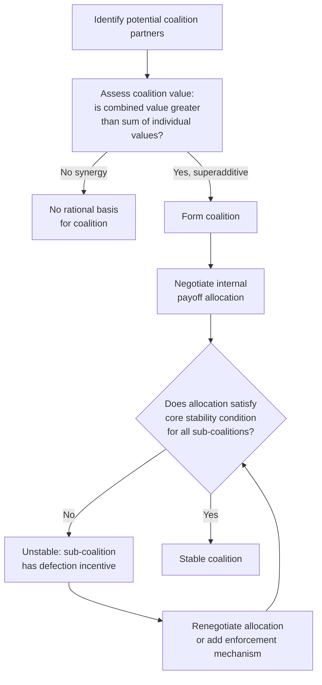

## Coalition Formation and Stability

### Definition and Theoretical Foundation

Coalition formation refers to the process by which a subset of parties in a multi-party negotiation combine forces to pursue shared or compatible interests, typically to increase their collective bargaining leverage relative to non-coalition parties. Coalition stability refers to the conditions under which a formed coalition persists without members defecting to alternative coalitions or independent action. The formal theoretical foundation comes from cooperative game theory, particularly the framework developed by John von Neumann and Oskar Morgenstern and substantially extended by Lloyd Shapley and Martin Shubik, with extensive application to political science (William Riker) and negotiation theory (Jeanne Brett, Ken Kressel).

### The Characteristic Function and Coalition Value

Cooperative game theory formalizes a multi-party negotiation as a set of $n$ players and a characteristic function $v(S)$ assigning a value to every possible coalition $S$ (subset of players), representing the total payoff that coalition can guarantee for itself regardless of what non-members do.

$$v: 2^N \rightarrow \mathbb{R}, \quad v(\emptyset) = 0$$

A coalition is generally considered worth forming if it is **superadditive** — the value of the combined coalition exceeds the sum of what members could achieve separately:

$$v(S \cup T) \geq v(S) + v(T) \quad \text{for disjoint coalitions } S, T$$

**[Inference]** This superadditivity condition is the basic economic rationale for coalition formation in the first place: absent some synergy, efficiency gain, or leverage increase from combining, parties have no incentive to coordinate rather than negotiate independently.

### The Core: A Central Stability Concept

The **core** of a cooperative game is the set of payoff allocations to the grand coalition (all parties) such that no sub-coalition has an incentive to break away and do better on its own. Formally, an allocation $x = (x_1, \ldots, x_n)$ is in the core if:

$$\sum_{i \in S} x_i \geq v(S) \quad \text{for every possible coalition } S$$

**Practical meaning:** If any subset of parties could achieve more by breaking away and forming their own coalition than they are currently receiving under a proposed grand-coalition allocation, that allocation is unstable — the incentivized subset will defect.

**[Inference]** A key limitation frequently noted in the literature is that the core can be empty for many real-world coalition structures, meaning no allocation exists that simultaneously satisfies every possible sub-coalition's incentive constraints — in such cases, formal core-stability analysis predicts persistent instability or the need for external enforcement mechanisms (binding contracts, third-party guarantees) to sustain any agreement at all.

### The Shapley Value: A Fairness-Based Allocation Solution

Distinct from the core (which identifies a *set* of stable allocations without selecting among them), the Shapley value provides a unique, formula-derived allocation based on each player's average marginal contribution across all possible orderings in which the coalition could form.

$$\phi_i(v) = \sum_{S \subseteq N \setminus \{i\}} \frac{|S|!(n-|S|-1)!}{n!} \left[v(S \cup \{i\}) - v(S)\right]$$

This formula averages player $i$'s marginal contribution to every possible coalition it could join, weighted by the probability of each joining order occurring under random sequential formation.

**[Inference]** The Shapley value's appeal in negotiation contexts lies in its axiomatic fairness properties (it uniquely satisfies efficiency, symmetry, additivity, and null-player axioms), making it a principled reference point for coalition payoff division even when it does not always coincide with a core allocation — in some games, the Shapley value can fall outside the core, meaning it is "fair" by its axioms but not necessarily stable against sub-coalition defection.

### Diagram: Coalition Formation and Stability Assessment Process

### The Size Principle and Minimum Winning Coalitions

William Riker's size principle, developed in the context of political coalition theory, predicts that in zero-sum, majority-rule contexts with divisible payoffs, rational actors will tend to form the *smallest* coalition sufficient to win, rather than the largest possible coalition.

**Rationale:** A minimum winning coalition allows the payoff (spoils, influence, resources) to be divided among the fewest possible members, maximizing each member's individual share, whereas an oversized "surplus" coalition dilutes each member's share without adding necessary winning power.

**[Inference]** This principle's applicability is bounded by context: it holds most reliably in fixed-payoff, majority-rule settings (legislative votes, corporate board coalitions on a binary decision) and is a substantially weaker predictor in negotiation contexts involving uncertain future value, ongoing relationships, or qualitative interests where "winning margin" and payoff divisibility are less clearly defined — real-world coalitions (e.g., international alliances, business consortiums) often exceed minimum winning size for risk-reduction, legitimacy, or long-term relationship reasons not captured in the basic size-principle model.

### Coalition Formation Strategies in Practice

**Bandwagon dynamics:** Once a coalition begins to appear likely to succeed, additional parties may be incentivized to join to avoid being excluded from resulting benefits or facing the coalition as an opponent — a self-reinforcing dynamic distinct from the size principle's minimizing logic.

**Divide-and-conquer counter-strategy:** A party facing a potential opposing coalition can attempt to prevent its formation by offering side deals or concessions to peel off individual coalition candidates before they combine, directly targeting coalition instability preemptively — a common defensive tactic in supplier/buyer consortium contexts and political negotiations alike.

**Sequential coalition building:** Rather than attempting to form a full coalition simultaneously, parties often build coalitions incrementally, securing early, easier commitments first to create momentum and make subsequent recruitment easier (a dynamic connected to social proof effects in group decision-making).

### Practical Example: Coalition Stability in a Corporate Context

**Scenario:** Three minority shareholders (A, B, C) are considering forming a voting coalition to influence a corporate board decision, where a majority requires at least two of the three votes combined with their respective share weights.

**Value analysis:**

- $v(A) = v(B) = v(C) = 0$ (individually, none can achieve the desired outcome alone)
- $v(A,B) = 100$ (sufficient combined shares to reach majority)
- $v(A,C) = 100$ (also sufficient)
- $v(B,C) = 60$ (insufficient combined shares — does not reach majority threshold)
- $v(A,B,C) = 100$ (grand coalition also succeeds, but no additional value beyond the minimum winning pairs)

**Analysis:** Under the size principle, minimum winning coalitions (A,B) or (A,C) are predicted over the full grand coalition (A,B,C), since either two-party coalition achieves the same value while dividing it among fewer members. Shareholder A becomes a pivotal player, since A is necessary for either winning coalition to succeed (A,B) or (A,C), while B and C alone cannot succeed — this pivotal position would be reflected in a higher Shapley value allocation to A than to B or C.

**Stability question:** If B and A form a coalition and agree to split the value 50/50, this allocation is vulnerable: C could approach A with an offer of 60/40 in A's favor, since (A,C) also achieves full value, giving A an incentive to defect from the A-B coalition — illustrating a core-instability scenario requiring either a binding agreement mechanism or a self-enforcing allocation that anticipates this competitive dynamic (e.g., A extracting a higher share upfront given known pivotal status).

**Output:** This demonstrates how formal coalition value analysis identifies both the *likely* coalition structure (minimum winning, favoring pivotal players) and the *stability risk* embedded in any specific proposed allocation.

### Table: Coalition Stability Risk Factors

| Risk Factor | Effect on Stability | Mitigation |
| --- | --- | --- |
| Pivotal player asymmetry | Non-pivotal members face constant risk of being outbid by pivotal player's alternative coalition options | Compensate pivotal players proportionally to their structural leverage; consider binding agreements |
| Empty or near-empty core | No allocation satisfies all sub-coalition constraints simultaneously | External enforcement (contracts, third-party guarantees, reputational costs for defection) |
| Asymmetric information about coalition value | Members may not agree on the true value of alternative coalitions, complicating allocation negotiation | Transparent, verifiable valuation methods; neutral facilitation |
| Low cost of defection/side-dealing | Weak penalties for breaking coalition commitments increase defection incentive | Formal contracts, reputational tracking, staged/sequential value realization tied to continued participation |

### Critiques and Practical Limitations

**[Inference]** Formal coalition theory (core, Shapley value, size principle) assumes common knowledge of coalition values, which is frequently unrealistic in real-world negotiations where parties have differing, private, or uncertain estimates of what any given coalition could actually achieve. This means practical coalition-building often relies as much on relationship trust, sequential commitment-building, and negotiated (rather than formula-derived) allocation as on precise value calculation.

**Behavioral deviations from formal predictions:** Empirical studies of coalition behavior have found systematic deviations from pure size-principle predictions — factors like ideological/relational compatibility between coalition members, risk aversion favoring larger "insurance" coalitions, and fairness norms (equal division preferences even when marginal contributions differ) all introduce behavioral considerations beyond the formal game-theoretic optimum.

### Key Points

- Coalition formation is rational only when combined coalition value exceeds the sum of individual values (superadditivity); absent this, no formal incentive to coordinate exists.
- The core identifies which allocations are stable against sub-coalition defection, but can be empty in many real games, implying persistent instability absent external enforcement.
- The Shapley value provides an axiomatically fair allocation based on average marginal contribution, but is not guaranteed to be stable (within the core) in all cases.
- The size principle predicts minimum winning coalitions in fixed-payoff, majority-rule contexts, but is a weaker predictor in negotiation contexts involving uncertain or qualitative value.
- Practical coalition stability often depends as much on enforcement mechanisms, relationship trust, and behavioral fairness norms as on precise formal value calculations.

### Related Topics

- The Shapley Value: Derivation and Axiomatic Properties
- The Core Solution Concept and Empty-Core Games
- The Size Principle in Political Coalition Theory (Riker)
- Divide-and-Conquer Tactics to Prevent Opposing Coalition Formation
- Pivotal Player Analysis and the Banzhaf Power Index
- Complexity and Coordination in Multi-Party Talks
- Enforcement Mechanisms for Coalition Agreements