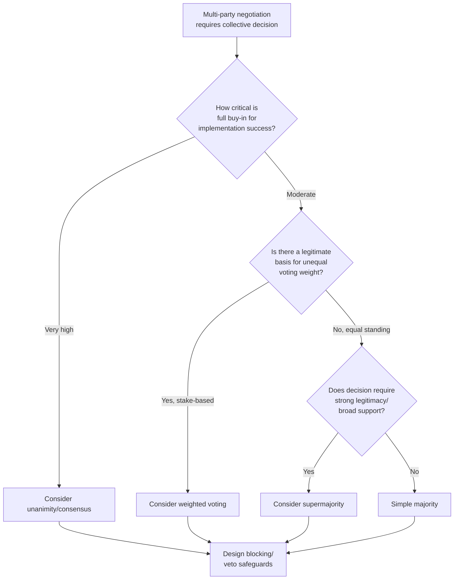

## Voting Rules and Collective Decision Mechanisms

### Definition and Scope

Voting rules and collective decision mechanisms refer to the formal or informal procedures by which multiple parties in a negotiation aggregate individual preferences into a single collective decision. Unlike dyadic negotiation, where agreement requires only bilateral consent, multi-party negotiation frequently requires an explicit decision rule to resolve situations where full unanimous agreement is unlikely or where efficiency demands a defined path to closure. This topic draws heavily on social choice theory, a field formalized by Kenneth Arrow, and its application to negotiated multi-party settings.

### Common Voting Rules in Multi-Party Negotiation

| Decision Rule | Mechanism | Typical Use Context |
| --- | --- | --- |
| Unanimity/Consensus | All parties must agree; any party can block | High-stakes agreements requiring full buy-in (international treaties, partnership agreements) |
| Simple majority | More than half of votes needed to prevail | Corporate boards, legislative bodies, low-to-moderate stakes group decisions |
| Supermajority (e.g., two-thirds) | A higher threshold than simple majority, requiring broader support | Constitutional amendments, major organizational changes requiring stronger legitimacy |
| Weighted voting | Votes are weighted by stake, shareholding, or contribution rather than one-party-one-vote | Corporate shareholder decisions, coalition governments with proportional representation |
| Veto power (for specific parties) | Designated parties can unilaterally block regardless of majority support | UN Security Council permanent members; certain joint-venture governance structures |
| Sequential/staged voting | Decisions made in stages, narrowing options progressively (e.g., elimination voting) | Multi-option selection processes; site selection, candidate selection negotiations |

### Arrow's Impossibility Theorem and Its Implications

Kenneth Arrow's Impossibility Theorem (1951) is a foundational result in social choice theory demonstrating that no voting/preference-aggregation system involving three or more options can simultaneously satisfy all of a small set of seemingly reasonable fairness criteria:

- **Unrestricted domain:** the system should account for all possible individual preference orderings
- **Non-dictatorship:** no single individual's preferences should always determine the outcome
- **Pareto efficiency:** if all individuals prefer option A to B, the collective outcome should reflect that
- **Independence of irrelevant alternatives (IIA):** the relative ranking of two options should not depend on the presence of a third, unrelated option

**Theorem statement (informal):** No preference-aggregation rule can satisfy all four criteria simultaneously when there are three or more options and more than one voter.

**[Inference]** The theorem's practical implication for multi-party negotiation is significant but frequently misunderstood: it does not mean all voting rules are equally flawed or that collective decision-making is impossible, but rather that any specific voting rule chosen necessarily involves an implicit tradeoff among these criteria — meaning the choice of decision rule is not a neutral, purely technical matter but embeds value judgments about which fairness property to prioritize.

### Diagram: Decision Rule Selection Logic

### Unanimity and Consensus-Based Decision-Making

**Mechanics:** Requires agreement from every party; any single party can block the outcome, giving each party effective veto power.

**Strengths:** Maximizes buy-in and implementation commitment, since no party is bound by a decision it explicitly opposed; frequently used where post-agreement cooperation quality matters as much as the decision itself (e.g., international treaties, partnership dissolution agreements).

**Weaknesses:** Vulnerable to strategic holdout behavior, where a single party leverages its veto power to extract disproportionate concessions unrelated to the substantive merits of its position — a dynamic extensively studied under the term "holdout problem," particularly in land assembly and infrastructure negotiation contexts. Can also produce decision paralysis when even one party has strong incentive to prevent any change from the status quo.

**[Inference]** Consensus-based systems often function in practice not as literal unanimous agreement on an unmodified proposal, but as an iterative process of proposal modification until no party has a sufficiently strong objection to block — a distinction sometimes drawn between "consensus" (no strong objection remains) and "unanimity" (active affirmative agreement from all).

### Majority and Supermajority Rules

**Mechanics:** A defined threshold (50%+1, two-thirds, three-quarters) determines when a proposal passes, without requiring universal agreement.

**Strengths:** Avoids holdout problems inherent to unanimity; provides a clear, predictable path to decision closure even amid persistent disagreement.

**Weaknesses:** Can produce outcomes actively opposed by a substantial minority, creating implementation risk if the losing faction's cooperation is needed for the decision to succeed in practice; connects to the size-principle dynamics discussed in coalition theory, since majority rules directly incentivize minimum winning coalition formation.

**[Inference]** The choice between simple majority and supermajority thresholds functions as a deliberate tradeoff between decision efficiency (lower thresholds decide faster) and decision legitimacy/stability (higher thresholds reduce the risk of narrow, contested outcomes but increase holdout leverage as the threshold approaches unanimity) — this tradeoff is why constitutional or foundational decisions often require supermajorities while routine operational decisions typically use simple majority.

### Weighted Voting Systems

**Mechanics:** Votes are allocated proportionally to some measure of stake, contribution, or formal authority (shareholding percentage, financial contribution, population representation) rather than equal per-party allocation.

**Practical example structure:** In a joint venture with three partners holding 50%, 30%, and 20% equity respectively, a simple majority-of-equity rule would allow the 50% partner to prevail alone on any issue not requiring supermajority, while a 30%+20% coalition would be needed to override the 50% partner — directly connecting to the pivotal-player and coalition-value concepts from coalition formation theory.

**Power indices:** Formal measures like the Banzhaf Power Index and Shapley-Shubik Power Index quantify a voter's actual influence in weighted voting systems, which frequently diverges substantially from raw vote-share percentage due to the combinatorial coalition possibilities described in coalition theory — a party holding 34% of votes in a system requiring two-thirds approval, for example, may hold effective veto power disproportionate to its numerical share.

$$\text{Banzhaf Power}_i = \frac{\text{Number of coalitions where } i \text{ is critical (swing) voter}}{\text{Total number of coalitions where any voter is critical}}$$

### Veto Rights and Blocking Minorities

Some multi-party structures grant specific parties unilateral veto power regardless of overall vote count, distinct from the holdout dynamics of full unanimity systems (where any party has veto power) — here, veto power is asymmetrically allocated to designated parties.

**Design rationale:** [Inference] Veto rights are often granted to parties whose ongoing cooperation is deemed essential regardless of numerical representation (e.g., permanent Security Council members reflecting post-WWII geopolitical power distribution, or founding partners in a joint venture retaining veto rights over specific reserved matters like changes to core business purpose) — the underlying logic prioritizes preventing decisions that a critical party would refuse to implement, over pure majoritarian representativeness.

**Practical negotiation implication:** Negotiating the initial allocation of veto rights (which parties get them, and over which categories of decisions) is often a higher-stakes negotiation than any individual subsequent decision made under the resulting structure, since veto allocation determines long-term relative power for the life of the agreement.

### Practical Example: Designing a Decision Rule for a Multi-Stakeholder Board

**Scenario:** Five founding investors are establishing governance rules for a new joint venture, with unequal initial capital contributions (35%, 25%, 20%, 12%, 8%).

**Design considerations and resulting structure:**

1. **Routine operational decisions** (e.g., approving quarterly budgets within existing plan): Simple majority of weighted votes, favoring decision speed for low-stakes recurring matters.
2. **Major strategic decisions** (e.g., entering new markets, taking on significant debt): Supermajority (e.g., 75% of weighted votes) required, ensuring at least the two largest investors plus at least one smaller investor must agree, preventing the two largest alone (35%+25%=60%) from unilaterally controlling major strategic direction.
3. **Fundamental changes** (e.g., altering the venture's core purpose, admitting new major investors): Unanimity required among all five, protecting smaller investors from being structurally diluted or redirected without their consent.
4. **Reserved veto matters** (e.g., related-party transactions involving a specific founder): Individual veto rights granted to any investor with a direct conflict of interest in that specific matter, regardless of overall vote outcome.

**Output:** This layered structure illustrates how real-world multi-party governance design typically does not select a single voting rule uniformly, but tailors decision thresholds to the stakes and reversibility of different decision categories — a pattern consistent with the efficiency/legitimacy tradeoff discussed above.

### Table: Common Voting Rule Vulnerabilities

| Rule | Primary Vulnerability | Illustrative Failure Mode |
| --- | --- | --- |
| Unanimity | Holdout problem | Single party extracts disproportionate concession by threatening to block an otherwise broadly beneficial agreement |
| Simple majority | Minority exclusion / tyranny of majority | Substantial minority faction actively opposed, undermining implementation cooperation |
| Weighted voting | Power concentration misaligned with formal share | Power index reveals near-total effective control by a party with only plurality (not majority) formal share |
| Veto rights | Structural gridlock | Multiple veto-holders with conflicting priorities produce indefinite decision paralysis |
| Supermajority | Excessive status-quo bias | Even broadly supported reforms fail to reach the high threshold, entrenching existing arrangements |

### Critiques and Open Questions

**[Inference]** Arrow's Impossibility Theorem is sometimes over-extended in popular discussion to suggest that "no voting system is fair," which overstates the formal result — the theorem specifically concerns full ordinal preference aggregation satisfying all four stated axioms simultaneously; many practical systems function adequately by explicitly relaxing one criterion (e.g., cardinal utility voting systems, or systems accepting limited dictatorship in narrow veto-matter categories) in exchange for other desirable properties, rather than being rendered meaningless by the theorem.

**Strategic voting and manipulation:** Beyond the abstract impossibility result, practical voting systems in negotiation contexts are vulnerable to strategic (non-sincere) voting, where parties misrepresent true preferences to produce a more favorable aggregate outcome — a distinct concern from Arrow's theorem, more directly connected to the Gibbard-Satterthwaite theorem on strategy-proofness.

### Key Points

- The choice of voting rule is not a neutral technical decision; it embeds an implicit tradeoff among decision efficiency, minority protection, and outcome legitimacy.
- Arrow's Impossibility Theorem establishes that no preference-aggregation system can satisfy all reasonable fairness criteria simultaneously with three or more options, meaning every practical system involves some criterion tradeoff.
- Weighted voting systems can produce effective power distributions (measurable via indices like Banzhaf) that diverge substantially from raw vote-share percentages due to coalition combinatorics.
- Veto rights address a different concern than majority/unanimity thresholds — protecting specific parties' critical interests regardless of overall numerical support — but introduce gridlock risk when multiple veto-holders have conflicting priorities.
- Real-world multi-party governance structures typically layer different decision rules across different decision categories based on stakes and reversibility, rather than applying one uniform rule to all decisions.

### Related Topics

- Arrow's Impossibility Theorem and Social Choice Theory
- The Banzhaf and Shapley-Shubik Power Indices
- The Holdout Problem in Unanimity-Based Negotiation
- Coalition Formation and Stability
- Strategic Voting and the Gibbard-Satterthwaite Theorem
- Governance Design in Joint Ventures and Multi-Stakeholder Organizations
- Veto Rights Allocation as a Meta-Negotiation