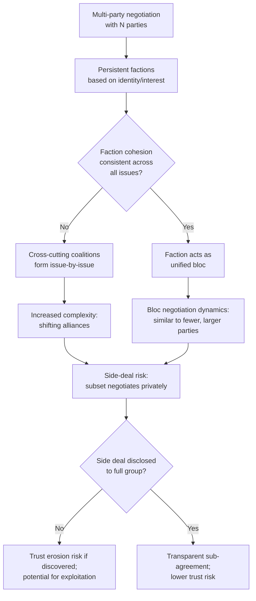

## Managing Competing Factions and Side Deals

### Definition and Scope

Managing competing factions and side deals addresses two closely related multi-party negotiation phenomena: the presence of subgroups (factions) within a larger negotiation who hold divergent interests and may act as informal or formal blocs, and side deals — private, often bilateral agreements made between a subset of parties that are not disclosed to, or are made outside the formal purview of, the full negotiating body. Both phenomena introduce significant complexity beyond formal coalition and voting-rule analysis, since they involve non-transparent or only partially transparent behavior within an ostensibly collective process.

### Factions vs. Formal Coalitions: A Key Distinction

**[Inference]** While closely related to coalition theory, factions are usefully distinguished as more persistent, identity- or interest-based groupings that may exist prior to and independent of any specific negotiation (e.g., a labor union's competing internal factions, ethnic or regional blocs within a multi-party political negotiation, competing departmental interests within an organization), whereas coalitions in the formal game-theoretic sense are often treated as issue-specific and negotiation-specific groupings formed to maximize leverage on a given decision. In practice, factions frequently form the raw material from which specific issue-based coalitions are drawn, but a faction's cohesion may not hold across all issues equally.

### Diagram: Faction and Side-Deal Dynamics in a Multi-Party Negotiation

### Why Side Deals Emerge

**Efficiency rationale:** Bilateral or small-group side conversations can resolve issues more efficiently than full-group discussion, particularly for matters primarily relevant to a subset of parties — this is the same logic underlying legitimate caucusing techniques in mediated multi-party processes.

**Strategic rationale:** A party or coalition may seek a side deal specifically to secure more favorable terms than could be obtained in full view of all parties, exploiting information asymmetry or the absence of competitive pressure from parties not included in the side conversation — this is the more ethically and structurally contested category.

**Trust-based rationale:** Parties with pre-existing trust or relationship history may prefer to resolve shared concerns bilaterally before engaging the broader, less familiar group, reducing perceived risk relative to full-group exposure.

### The Structural Risk Side Deals Pose to Multi-Party Processes

**[Inference]** Side deals create a fundamental tension with the coalition stability concepts discussed in cooperative game theory: an undisclosed side deal functions as an off-the-books coalition, potentially violating the assumed transparency underlying any formal or informal collective decision process. If discovered, this can:

- **Undermine trust** in the full-group process itself, since other parties may reasonably conclude that additional undisclosed side deals exist, increasing suspicion and defensive behavior across all remaining negotiations.
- **Destabilize previously agreed terms**, since parties who accepted an allocation without knowledge of a side deal may have accepted a worse outcome than they would have with full information, creating grounds to reopen or renegotiate.
- **Create a two-tier negotiation structure**, where parties privy to side deals gain systematic informational and strategic advantages over those excluded, potentially violating norms of procedural fairness even where the side deal itself does not violate any explicit rule.

### Legitimate vs. Problematic Side Negotiations: A Distinguishing Framework

| Dimension | Legitimate (e.g., sanctioned caucusing) | Problematic (undisclosed side deal) |
| --- | --- | --- |
| Disclosure | Full group aware that sub-group discussions are occurring, even if specific content is private | Existence of the discussion itself is concealed from non-participants |
| Scope of impact | Limited to issues primarily affecting the sub-group | Affects terms or allocations relevant to the full group's collective agreement |
| Facilitator awareness | Often facilitated or sanctioned by a neutral mediator managing the overall process | Occurs outside any sanctioned process, often specifically to avoid mediator or full-group scrutiny |
| Effect on remaining parties | Neutral or process-efficient; does not systematically disadvantage excluded parties | Frequently structured to extract value at the expense of, or without accounting for, excluded parties |

### Managing Competing Factions: Structural Approaches

**Explicit faction representation:** Rather than treating factions as an informal, unmanaged complication, formal multi-party processes often designate recognized faction representatives with defined negotiating mandates, converting implicit factional dynamics into an explicit, more manageable negotiating structure (analogous to labor-management negotiations where union leadership formally represents a membership faction).

**Cross-cutting issue design:** [Inference] Deliberately structuring the agenda so that issues create different alignment patterns across different factions (rather than every issue reinforcing the same faction lines) can reduce the risk of persistent, hardened bloc conflict, since parties who are adversaries on one issue may be allies on another — a technique connected to broader conflict-resolution theory on cross-cutting cleavages reducing entrenched polarization.

**Transparent caucusing protocols:** Establishing explicit, agreed-upon rules for when and how sub-group discussions (caucuses) may occur — often facilitated by a neutral mediator who may participate in multiple caucuses to carry (with permission) relevant information back to the full group, maintaining process legitimacy while still allowing efficiency gains from smaller-group discussion.

**Full disclosure requirements:** Some formal multi-party negotiation frameworks (e.g., certain international treaty negotiation protocols, formal M&A processes with defined disclosure obligations) impose explicit rules requiring any side agreement affecting the subject matter of the main negotiation to be disclosed to all parties, directly addressing the trust-erosion risk described above through procedural rule rather than relying solely on voluntary transparency.

### Practical Example: Side Deal Risk in a Multi-Party Merger Negotiation

**Scenario:** Four minority shareholder groups are jointly negotiating exit terms with an acquiring company. During the process, the acquirer privately offers one shareholder group a modestly better per-share price in exchange for that group publicly supporting the overall deal terms and not raising objections during the full negotiation.

**Risk analysis:**

1. **Information asymmetry exploitation:** The acquirer gains a strategic advantage by fragmenting what could otherwise be unified shareholder leverage, directly paralleling the divide-and-conquer coalition-prevention tactic discussed in coalition theory.
2. **Trust erosion upon discovery:** If the other three shareholder groups later discover the side deal (e.g., through required securities disclosure), they may reasonably conclude the overall process was not conducted in good faith, potentially triggering legal challenges, renewed negotiation demands, or reputational damage to the acquirer in future dealings.
3. **Fairness and legal exposure:** Depending on jurisdiction, differential treatment of similarly situated shareholders in an acquisition may trigger specific legal disclosure obligations or even substantive fairness requirements (e.g., certain jurisdictions require equal treatment of shareholders in tender offers) — meaning the side deal here is not merely a negotiation-ethics question but potentially a compliance issue.

**Output:** This illustrates how side-deal risk in multi-party negotiation frequently intersects with formal legal/regulatory disclosure requirements, not solely informal trust and process-fairness considerations — a distinction relevant to the "Trust, Ethics, and Fairness" and "Multi-Party Negotiation" chapters both bearing on this scenario.

### Detecting and Responding to Suspected Side Deals

**Key Points**

- **Watch for behavioral anomalies:** A faction or party unexpectedly softening its position without apparent negotiation-internal cause, or declining to object to terms previously identified as unacceptable, can be a signal (though not proof) of an undisclosed side arrangement.
- **Request explicit disclosure commitments upfront:** Establishing an explicit norm or contractual requirement that any side agreements touching the negotiation's subject matter must be disclosed reduces (though does not eliminate) the risk, and provides a clear basis for remedy if violated.
- **Use a neutral mediator with cross-caucus visibility:** A mediator conducting sanctioned caucuses across all factions is better positioned to notice inconsistencies suggesting undisclosed side communication than parties with visibility only into their own interactions.
- **Build in reopening/renegotiation clauses:** Formal agreements can include provisions allowing renegotiation if a material undisclosed side agreement is later discovered, providing a structured remedy path rather than requiring parties to rely solely on litigation or informal recourse.

### Critiques and Nuance

**[Inference]** Not all informal sub-group coordination is ethically or strategically problematic; the caucusing literature in mediation practice explicitly recognizes sanctioned, process-transparent sub-group discussion as a legitimate and often necessary efficiency tool in complex multi-party disputes. The meaningful distinction is not "any side conversation is illegitimate" but rather whether the sub-group activity is conducted within a transparent, sanctioned process framework or specifically structured to conceal information or extract value at other parties' expense — a distinction that can be genuinely ambiguous in practice and is not always cleanly resolved by simple rules.

**Power asymmetry in disclosure enforcement:** [Inference] Disclosure requirements and reopening clauses are only as effective as their enforcement mechanism; parties with greater resources or legal sophistication may be better positioned both to structure side deals that technically comply with disclosure rules while achieving similar practical effect, and to pursue remedies if they are disadvantaged by an undisclosed side deal — meaning formal safeguards do not fully equalize the practical risk exposure across parties with different resource levels.

### Related Topics

- Divide-and-Conquer Tactics and Coalition Prevention
- Caucusing and Mediator Roles in Multi-Party Facilitation
- Coalition Formation and Stability
- Disclosure Obligations in M&A and Securities Negotiation
- Cross-Cutting Cleavages and Conflict De-Escalation Theory
- Trust Repair Mechanisms After Discovered Side Agreements
- Procedural Fairness Norms in Multi-Stakeholder Negotiation