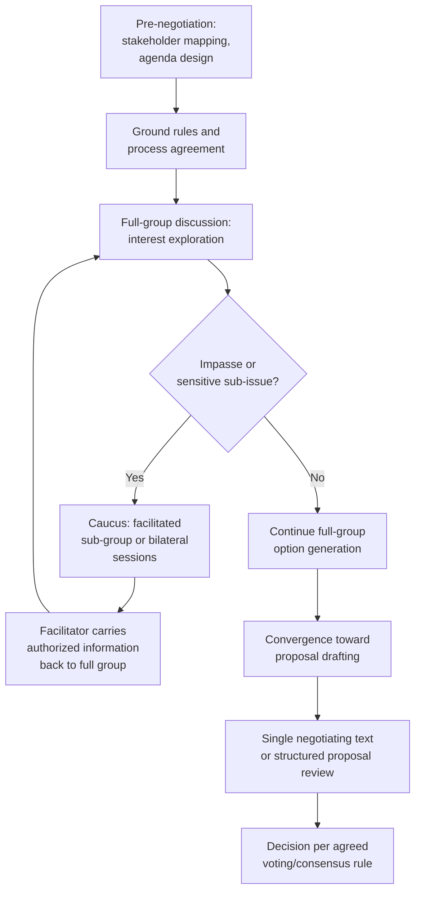

## Facilitation Techniques for Group Negotiation

### Definition and Scope

Facilitation techniques for group negotiation encompass the specific procedural and interpersonal methods used by a neutral or semi-neutral facilitator to manage process, communication, and decision-making in multi-party negotiations. Facilitation is distinguished from mediation in degree rather than kind: facilitators typically focus more heavily on process management (agenda, turn-taking, structured exercises) while mediators often engage more substantively with the content of the dispute, though the terms overlap considerably in practice and many practitioners perform both functions.

### The Facilitator's Core Functions

| Function | Description |
| --- | --- |
| Process design | Structuring the overall sequence: agenda order, session format, decision-rule agreement, timeline |
| Communication management | Ensuring balanced participation, managing dominant or disruptive voices, translating positions into interests |
| Conflict de-escalation | Intervening when discussions become adversarial or personal, redirecting toward substantive issues |
| Information management | Organizing and tracking proposals, areas of agreement/disagreement, and evolving option sets across a complex multi-issue, multi-party discussion |
| Reality-testing | Helping parties assess the practicality of proposals and the consequences of impasse (connecting to BATNA analysis) |
| Legitimacy maintenance | Ensuring the process is perceived as fair by all parties, which is often as important to a durable agreement as the substantive terms themselves |

### Diagram: Facilitator Role in Multi-Party Process Flow

### Structured Process Techniques

**Ground rules establishment:** Before substantive discussion begins, facilitators typically secure explicit agreement on procedural norms — speaking order, confidentiality expectations, how caucusing will be used, and the decision rule that will govern final agreement (connecting directly to the voting-rules topic). **[Inference]** Securing these agreements before substantive positions are stated is generally considered important because parties have less incentive to strategically resist fair process rules before they know how those rules might affect their specific interests, compared to attempting to establish rules mid-negotiation once positions and stakes are clear.

**Stakeholder mapping:** A pre-negotiation facilitator technique involving systematic identification of all relevant parties (including those not present at the table but affected by or capable of influencing the outcome), their interests, relative power, and existing relationships — providing the facilitator with a structural map of likely faction lines and coalition possibilities before the formal process begins.

**Interest-based agenda framing:** Facilitators often work to reframe agenda items from position-based language ("Party A wants X, Party B wants Y") to interest-based or problem-based framing ("how can we address the underlying resource allocation concern shared across parties"), reducing the likelihood that the agenda itself entrenches adversarial framing from the outset.

**Single negotiating text procedure:** As referenced in general multi-party complexity, a facilitator-drafted evolving document that all parties react to and amend serves as a specific structural technique reducing the coordination burden of reconciling multiple simultaneous competing proposals — notably employed in the Camp David Accords negotiation process.

**Fishbowl and structured turn-taking formats:** Techniques for managing participation balance in larger groups, such as fishbowl discussions (a small representative subgroup discusses while others observe, with defined mechanisms for observers to rotate in) or structured round-robin turn-taking, designed to prevent dominant voices or larger factions from monopolizing floor time at the expense of smaller or less assertive parties.

### Caucusing as a Core Facilitation Tool

**Mechanics:** Temporarily separating the full group into smaller sub-group or bilateral sessions, with the facilitator often moving between caucuses (shuttle diplomacy-style) to test proposals, explore sensitive information, or de-escalate tension without the pressure of full-group visibility.

**Confidentiality management:** A critical facilitator skill in caucusing is managing what information is authorized to be shared across caucuses versus what remains confidential to the sub-group that disclosed it — requiring explicit agreement with each party about what the facilitator may or may not communicate elsewhere, directly addressing the side-deal and trust risks discussed in the prior topic by keeping the *facilitator* aware of all sub-group activity even when specific content remains confidential.

**[Inference]** Effective caucusing depends heavily on the facilitator maintaining perceived neutrality across all caucus groups; a facilitator seen as favoring one faction in caucus interactions risks undermining the legitimacy of the entire process, since parties' willingness to disclose sensitive information in caucus depends substantially on trust that the facilitator will not selectively use that information to advantage other parties.

### Managing Power Asymmetry and Participation Balance

**[Inference]** A recurring facilitation challenge in multi-party negotiation is that formal procedural equality (equal speaking time, equal voting weight) does not automatically produce substantive equality of influence, since parties with greater resources, experience, or structural power may dominate discussion or informally shape outcomes even under nominally neutral process rules. Facilitators addressing this often employ:

- **Explicit solicitation of quieter parties' input**, rather than relying solely on open-floor discussion where more assertive parties naturally speak more
- **Pre-session capacity support** for less-resourced parties (e.g., helping a smaller stakeholder group organize its interests and proposals before full-group sessions, to reduce preparation-resource disparities)
- **Transparent proposal tracking** (shared visible documentation of all proposals and their status) to prevent more sophisticated parties from using procedural complexity itself as a source of advantage over less experienced participants

### Practical Example: Facilitating a Multi-Stakeholder Environmental Dispute

**Scenario:** A facilitator is managing a negotiation among a manufacturing company, a local environmental advocacy group, a municipal government, and a residents' association over proposed factory expansion terms.

**Facilitation sequence:**

1. **Stakeholder mapping and pre-session interviews:** The facilitator conducts individual pre-negotiation interviews with each party to understand underlying interests (the company's interest in expansion timeline, the advocacy group's interest in specific emissions standards, the municipality's interest in tax revenue and employment, residents' interest in property values and quality of life) — surfacing that several apparently conflicting positions may share compatible underlying interests.
2. **Ground rules and single negotiating text setup:** The facilitator proposes and secures agreement on a consensus-based decision rule (given the diversity of party types, majority voting was judged likely to produce an outcome one or more parties would refuse to cooperate with in practice) and introduces a single evolving draft agreement document.
3. **Interest-based full-group sessions:** Early sessions focus on jointly identifying evaluation criteria (e.g., agreed emissions monitoring methodology) before specific numeric thresholds are proposed, reducing the risk of early anchoring on contested positions.
4. **Caucusing on sensitive sub-issues:** When residents raise property value concerns they are reluctant to discuss in front of the company directly, the facilitator caucuses separately, later returning to the full group with an anonymized framing of the concern (with residents' authorization) to explore whether a property value protection mechanism could be incorporated.
5. **Convergence and decision:** As the single negotiating text stabilizes with input from all parties, the facilitator moves toward a final consensus-check process, explicitly asking each party whether remaining concerns are sufficient to block agreement or represent residual, tolerable disagreement.

**Output:** This illustrates how facilitation techniques operate as an integrated system (stakeholder mapping, ground rules, interest reframing, caucusing, single-text drafting) rather than isolated tools applied independently.

### Key Points

- Facilitation is primarily a process-management function, distinguished from mediation's often deeper substantive engagement, though the two frequently overlap in practice.
- Establishing ground rules and decision procedures before substantive positions harden reduces strategic resistance to fair process rules.
- Caucusing is a central multi-party facilitation tool but requires careful confidentiality management to avoid replicating the trust risks of undisclosed side deals while still enabling efficient sub-group discussion.
- Formal procedural equality does not guarantee substantive equality of influence; facilitators often need deliberate techniques to address power and resource asymmetries between parties.
- Facilitator-perceived neutrality is a critical, fragile asset — its loss can undermine the legitimacy of the entire multi-party process, particularly the willingness of parties to disclose sensitive information during caucusing.

### Related Topics

- Mediation vs. Facilitation: Scope and Role Distinctions
- Single Negotiating Text Procedure (Camp David Accords Case Study)
- Caucusing and Shuttle Diplomacy Techniques
- Stakeholder Mapping and Pre-Negotiation Analysis
- Power Asymmetry Mitigation in Multi-Stakeholder Processes
- Managing Competing Factions and Side Deals
- Voting Rules and Collective Decision Mechanisms