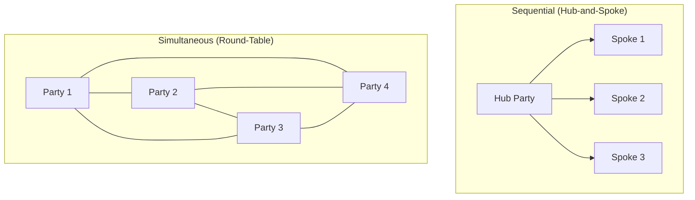

## Sequential Versus Simultaneous Multi-Party Processes

### Definition and Scope

This topic examines a fundamental structural design choice in multi-party negotiation: whether parties negotiate together in a single simultaneous forum (all parties present and engaging concurrently) or through a series of sequential, typically bilateral, negotiations conducted separately with each party or sub-group. This structural choice significantly shapes information flow, coalition dynamics, and the distribution of negotiating leverage, independent of the substantive issues being negotiated.

### Core Structural Comparison

| Dimension | Simultaneous Process | Sequential Process |
| --- | --- | --- |
| Information visibility | All parties observe the same proposals and reactions in real time | Each bilateral negotiation may proceed with limited visibility into other ongoing/completed negotiations |
| Coalition formation opportunity | Higher — parties can directly observe alignment and coordinate in real time | Lower — coordination requires deliberate out-of-session communication between sequential negotiations |
| Control point | Distributed among all present parties | Concentrated in whichever party conducts each sequential negotiation (often a central hub party) |
| Precedent and anchoring effects | Lower, since no single agreement is reached before others begin | Higher — early agreements can anchor terms offered in later sequential negotiations |
| Coordination cost | Higher in-session (managing many simultaneous voices) | Higher out-of-session (aggregating and reconciling separately negotiated terms) |
| Typical use case | Multi-stakeholder disputes, treaty negotiations, joint governance design | Hub-and-spoke commercial negotiations (e.g., a company negotiating separately with multiple suppliers or licensees) |

### The Hub-and-Spoke Structural Pattern

**[Inference]** Sequential multi-party negotiation frequently takes a hub-and-spoke structure, where one central party (the "hub") conducts a series of separate bilateral negotiations with each of several other parties (the "spokes"), who do not directly negotiate with one another. This structure is common in commercial contexts — a company negotiating supply agreements separately with multiple vendors, a franchisor negotiating separately with multiple franchisees, or a platform negotiating separately with multiple content partners.

**Strategic implication of hub position:** The hub party typically possesses significant structural advantages, including superior aggregate information (having visibility into all bilateral negotiations, while each spoke sees only its own), the ability to use terms extracted from one spoke as a reference or pressure point in negotiating with another (sometimes termed "playing parties off each other"), and control over sequencing (choosing which spoke to negotiate with first, potentially to establish favorable anchors for subsequent negotiations).

### Diagram: Hub-and-Spoke vs. Simultaneous Round-Table Structures

### Information Asymmetry Dynamics

**In sequential/hub-and-spoke structures:** The hub party's information advantage grows with each successive negotiation, since it accumulates knowledge of prior spokes' reservation points, priorities, and concession patterns, which it can apply (subject to any confidentiality constraints) in subsequent negotiations. **[Inference]** This creates an inherent incentive structure favoring the hub's preference for sequential over simultaneous processes when the hub anticipates this information-accumulation advantage will outweigh the coordination costs of running multiple separate negotiations — explaining why parties in a structurally advantaged position often resist proposals to consolidate separate bilateral negotiations into a single joint forum.

**In simultaneous structures:** Information is more symmetrically distributed among present parties (though not perfectly so, since private caucusing can still occur within a simultaneous process), which tends to reduce any single party's ability to exploit sequential information accumulation, but can introduce different risks — for example, more visible real-time positioning can trigger stronger face-saving or reputational pressures than would exist in a private bilateral setting.

### Precedent and Anchoring Effects in Sequential Negotiation

**Mechanism:** [Inference] Once a hub party reaches agreement with one spoke, the terms of that agreement — even if formally confidential — often become a reference point (whether disclosed explicitly, inferred by spokes through industry information-sharing, or used strategically by the hub itself, e.g., "other partners have already agreed to X terms") shaping the anchor and concession range for subsequent sequential negotiations.

**Strategic use by the hub:** A hub party may deliberately sequence negotiations to secure an initial favorable agreement with a spoke perceived as having weaker leverage or fewer alternatives, then use that agreement (explicitly or implicitly) as a "market rate" anchor when negotiating with subsequently engaged, potentially stronger-leverage spokes.

**Counter-strategy for spokes:** [Inference] Spokes aware of this dynamic sometimes attempt informal information-sharing with other spokes (despite the hub's structural incentive to prevent this) specifically to counteract the sequential-anchoring advantage — a dynamic that connects directly to the coalition-formation incentives discussed elsewhere in this chapter, since spokes coordinating information or negotiating jointly effectively converts a hub-and-spoke structure into something closer to a simultaneous, unified-coalition negotiation.

### When Parties Prefer Sequential vs. Simultaneous Structures

**[Inference]** Preferences for process structure often track directly with anticipated relative leverage under each structure, rather than reflecting a neutral procedural choice:

- **Hub/dominant parties** often prefer sequential structures, since they preserve the information-accumulation and divide-and-conquer advantages described above, and prevent spokes from coordinating collectively against the hub's interests.
- **Weaker or spoke parties** often prefer simultaneous structures (or at minimum, structured information-sharing across otherwise sequential negotiations), since consolidated bargaining increases their aggregate leverage relative to negotiating individually against a more powerful hub.
- **Neutral facilitators or regulators** in some contexts (e.g., certain antitrust-sensitive multi-supplier negotiations, or labor negotiations involving multiple bargaining units) may impose structural requirements — for example, requiring most-favored-nation clauses that constrain a hub's ability to offer meaningfully different terms across spokes, partially neutralizing the sequential-structure advantage even without converting to a fully simultaneous process.

### Practical Example: Comparing Structures in a Licensing Negotiation

**Scenario:** A technology patent holder is negotiating licensing terms with four potential licensee companies in the same industry.

**Sequential (hub-and-spoke) approach:**

- The patent holder negotiates individually with each licensee, starting with the licensee perceived as least sophisticated or having the fewest alternative technology options.
- Terms secured with the first licensee (e.g., a specific royalty rate) become a reference point the patent holder cites (accurately or selectively) when negotiating with subsequent licensees: "other licensees have agreed to X% royalty."
- Licensees, negotiating in isolation, lack visibility into whether the cited terms are representative or whether more favorable terms might be achievable, reducing their negotiating leverage relative to a scenario with full information.

**Simultaneous approach (alternative structure):**

- The patent holder convenes all four licensees in a joint or transparently coordinated negotiation (or the licensees, learning of each other's involvement, request a joint session).
- All parties observe the same proposed terms, reducing the patent holder's ability to selectively cite non-representative reference points.
- Licensees may recognize shared interest in resisting excessive royalty demands and could explore coordinated (though antitrust considerations may constrain the extent of lawful coordination) negotiating positions — though this also increases the patent holder's coordination burden in reaching agreement with a larger, more complex counterparty group simultaneously.

**Output:** This comparison illustrates why real-world parties frequently have strong, leverage-driven preferences over process structure itself, independent of the substantive licensing terms under discussion — meaning negotiating over *which structure will be used* can itself be a consequential, sometimes contested, preliminary negotiation.

### Legal and Regulatory Considerations

**[Inference]** In certain regulated contexts (particularly involving multiple similarly situated commercial counterparties, such as franchise systems, multi-supplier procurement, or securities transactions), sequential negotiation structures intersect with legal fairness or disclosure requirements — for example, most-favored-nation clauses, franchise disclosure regulations, or securities law requirements for equal treatment of similarly situated parties can constrain a hub party's ability to fully exploit sequential-structure information advantages, effectively importing some simultaneous-structure fairness properties into a formally sequential process.

### Key Points

- Sequential (often hub-and-spoke) and simultaneous (round-table) structures produce materially different information distributions, coalition-formation opportunities, and leverage patterns, independent of substantive negotiation content.
- Hub parties in sequential structures typically accumulate an information advantage across successive negotiations, which can be strategically deployed as anchoring reference points in later negotiations.
- Preferences for process structure frequently align with anticipated relative leverage under each structure — parties expecting to benefit from information asymmetry or divide-and-conquer dynamics tend to prefer sequential structures, while parties seeking to consolidate collective leverage tend to prefer simultaneous or coordinated structures.
- Legal and regulatory mechanisms (most-favored-nation clauses, disclosure requirements) can partially import simultaneous-structure fairness properties into formally sequential negotiation processes.
- The choice of process structure is itself often a consequential, sometimes contested, preliminary negotiation rather than a neutral administrative decision.

### Related Topics

- Hub-and-Spoke Negotiation Structures in Commercial Licensing and Procurement
- Anchoring Effects and Reference Point Manipulation
- Most-Favored-Nation Clauses as a Structural Fairness Mechanism
- Coalition Formation Among Structurally Disadvantaged Spoke Parties
- Divide-and-Conquer Tactics and Coalition Prevention
- Information Asymmetry in Multi-Party Commercial Negotiation
- Antitrust Considerations in Coordinated Counterparty Negotiation