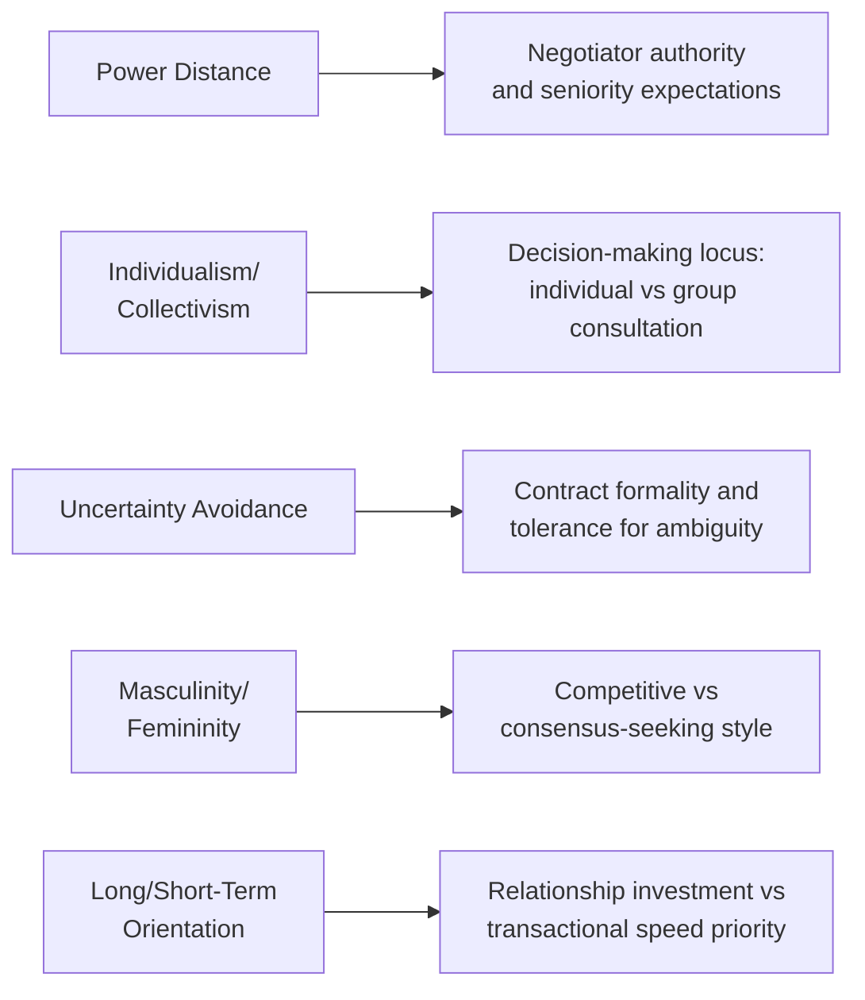

## Cultural Dimensions Frameworks Applied to Negotiation

### Definition and Scope

Cultural dimensions frameworks are systematic models developed primarily within cross-cultural psychology and management research that identify measurable axes along which national or organizational cultures tend to vary. Applied to negotiation, these frameworks provide predictive lenses for anticipating communication style, decision-making pace, risk tolerance, and relationship-versus-task orientation differences that can materially affect cross-border and cross-cultural negotiation dynamics. The most extensively applied frameworks in negotiation research are Geert Hofstede's cultural dimensions theory, Edward Hall's high-context/low-context communication framework, and the GLOBE study's extension of dimensional analysis.

### Hofstede's Cultural Dimensions Theory

Developed originally from a large-scale study of IBM employees across dozens of countries, Hofstede's framework identifies (in its most commonly cited extended form) six dimensions:

| Dimension | Definition | Negotiation Implication |
| --- | --- | --- |
| Power Distance | Degree to which unequal power distribution is accepted within a society | High power-distance cultures may expect negotiation authority concentrated in senior figures; negotiating with a junior counterpart may be perceived as a status signal |
| Individualism vs. Collectivism | Degree to which individuals are integrated into groups vs. expected to be self-reliant | Individualist cultures tend toward individual-authority negotiation and direct self-interest framing; collectivist cultures tend toward group-consultation processes and relationship-embedded framing |
| Uncertainty Avoidance | Degree of societal discomfort with ambiguity and unstructured situations | High uncertainty-avoidance cultures may prefer detailed contracts and formal procedures; low uncertainty-avoidance cultures may be more comfortable with flexible, evolving agreements |
| Masculinity vs. Femininity | Degree of societal emphasis on achievement/assertiveness vs. cooperation/quality of life | Higher "masculinity" scores associated with more competitive negotiation norms; higher "femininity" scores associated with more consensus-seeking norms |
| Long-Term vs. Short-Term Orientation | Degree of societal focus on future rewards vs. immediate results/tradition | Long-term-oriented cultures may prioritize relationship investment over immediate transactional gain; short-term-oriented cultures may prioritize faster, more transactional closure |
| Indulgence vs. Restraint | Degree to which gratification of desires is freely allowed vs. suppressed by social norms | Less directly studied in negotiation-specific literature; theorized to relate to negotiation informality and social interaction style |

**[Inference]** Of these six dimensions, individualism-collectivism and power distance have received substantially more direct empirical attention in negotiation-specific research than the remaining four, likely because they map most directly onto negotiation-relevant constructs already studied independently (self-construal theory for individualism-collectivism; authority and decision-making structure for power distance).

### Diagram: Hofstede Dimensions Mapped to Negotiation Behavior Domains

### Hall's High-Context vs. Low-Context Communication Framework

Distinct from Hofstede's value-oriented dimensions, Edward Hall's framework focuses specifically on communication style, distinguishing cultures by how much meaning is conveyed through explicit verbal content versus implicit contextual cues (relationship history, non-verbal signals, shared understanding).

| Communication Type | Characteristics | Negotiation Implication |
| --- | --- | --- |
| Low-context | Meaning conveyed primarily through explicit, direct verbal statements | Negotiators expect direct statements of position, explicit "yes/no" answers, and written contracts capturing the full agreed understanding |
| High-context | Meaning conveyed substantially through implicit cues, shared context, and relationship history | Negotiators may communicate refusal or disagreement indirectly; written contracts may be viewed as a starting framework rather than the complete, exhaustive agreement |

**[Inference]** This framework connects directly to face-negotiation theory and self-construal research (see Cultural Identity and Negotiator Self-Concept): high-context communication patterns are commonly associated with interdependent self-construal and higher other-face/mutual-face concern, since indirect communication often serves face-preservation functions not required in more directly confrontation-tolerant, low-context communication norms.

### The GLOBE Study: An Extension and Partial Refinement

The Global Leadership and Organizational Behavior Effectiveness (GLOBE) study, led by Robert House and colleagues, extended Hofstede-style dimensional analysis using a larger, more contemporary dataset and distinguishing between a society's *practices* (how things actually are) and *values* (how things are believed they should be) for each dimension — a methodological refinement addressing a criticism that Hofstede's original framework potentially conflated stated values with observed behavior.

**[Inference]** This practices-versus-values distinction has particular relevance for negotiation applications: a negotiator relying on a country's GLOBE-measured *values* score for a dimension like power distance may find actual counterparty *practice* diverges from the values-based prediction, since organizational and negotiation practice can be shaped by specific institutional context (industry norms, company culture, individual counterparty experience) not fully captured by broad societal value averages.

### Comparative Table: Major Cultural Dimensions Frameworks

| Framework | Originator(s) | Core Focus | Key Methodological Feature |
| --- | --- | --- | --- |
| Cultural Dimensions Theory | Geert Hofstede | Societal value orientations (6 dimensions) | Large-scale survey of IBM employees across countries; widely replicated but also widely critiqued for dated sampling |
| High/Low-Context Communication | Edward T. Hall | Communication style and meaning-conveyance | Ethnographic and comparative observation rather than large-scale survey |
| GLOBE Study | Robert House et al. | Extended dimensional analysis distinguishing practices vs. values | Larger, more contemporary sample; explicit practices/values distinction |
| Trompenaars' Seven Dimensions | Fons Trompenaars, Charles Hampden-Turner | Business-context-specific cultural dimensions (e.g., universalism vs. particularism) | Business-management-oriented sampling and framing |

### Practical Application: Using Cultural Dimensions as a Diagnostic, Not a Deterministic Script

**[Inference]** The most significant methodological caveat across this entire literature, frequently emphasized by negotiation scholars applying these frameworks (e.g., Jeanne Brett's work explicitly building on but qualifying Hofstede), is that national cultural dimension scores describe population-level central tendencies, not individual predictions. Any specific counterparty negotiator may diverge substantially from their national culture's average score due to individual personality, professional socialization, organizational culture, or personal cross-cultural experience — meaning these frameworks are best used as a starting hypothesis to inform observation and questions, not as a fixed behavioral script to apply mechanically to any individual counterparty.

### Practical Example: Applying Dimensional Analysis to Negotiation Preparation

**Scenario:** A negotiator is preparing for a negotiation with a counterparty organization from a culture generally scored as high power-distance, high collectivism, and high uncertainty-avoidance relative to the negotiator's own generally low-power-distance, individualist, lower-uncertainty-avoidance cultural background.

**Preparation adjustments informed by dimensional analysis (treated as hypotheses to verify, not certainties):**

1. **Power distance:** Anticipate that the counterparty may expect negotiation with correspondingly senior representation on the negotiator's own side, and that final decisions may require internal escalation to more senior figures not present at the table — build realistic timeline expectations and avoid interpreting escalation requirements as stalling.
2. **Collectivism:** Anticipate that individual counterparty representatives may need to consult with their broader team or organization before committing, and that framing proposals in terms of mutual/group benefit (rather than purely individual gain) may resonate more effectively than an individually-framed pitch.
3. **Uncertainty avoidance:** Anticipate a preference for more detailed, explicit contractual terms and more risk-mitigation structuring (e.g., staged implementation, defined contingencies) than might be expected or requested in the negotiator's home context; prepare more comprehensive documentation than might otherwise seem necessary.

**Verification step:** [Inference] Because these are population-level hypotheses, not individual certainties, an experienced practitioner would treat early negotiation interactions as an opportunity to test these hypotheses against the actual counterparty's observed behavior (e.g., does this specific individual show power-distance-consistent deference patterns, or do they operate with more individual autonomy than the national average would suggest), adjusting subsequent approach based on direct observation rather than continuing to rely solely on the initial dimensional prediction.

### Critiques and Limitations

**Ecological fallacy risk:** Applying population-level national averages to predict individual behavior is a form of ecological fallacy if done without appropriate caution — a well-documented methodological risk explicitly acknowledged by careful practitioners of this research, though frequently overlooked in more simplified popular business-training applications of these frameworks.

**Sampling and temporal limitations:** Hofstede's original data derives from a single multinational company (IBM) surveyed decades ago; critics have questioned both the representativeness of a single-company sample for characterizing entire national cultures and the temporal stability of these measurements as societies change over subsequent decades — a critique the GLOBE study's more contemporary and broader sampling partially, though not completely, addresses.

**Within-country heterogeneity:** [Inference] Large, culturally diverse countries may have substantial internal regional, ethnic, or subcultural variation not captured by a single national-level dimensional score, meaning the framework's resolution may be too coarse for negotiations involving specific regional or subcultural counterparty contexts within a large nation.

**Risk of stereotyping in practice:** As with self-construal theory more broadly, a significant practical risk in applying cultural dimensions frameworks is sliding from population-level statistical tendency into individual-level stereotyping, treating a counterparty as a deterministic representative of their national culture's average score rather than as an individual whose actual behavior may or may not align with that average.

### Key Points

- Hofstede's six dimensions, Hall's high/low-context framework, and the GLOBE study's practices-versus-values refinement are the most influential cultural dimensions frameworks applied to negotiation research.
- Individualism-collectivism and power distance have received the most direct negotiation-specific empirical attention among Hofstede's dimensions.
- These frameworks describe population-level central tendencies and should be treated as starting hypotheses to test through direct observation, not deterministic predictions about any specific individual counterparty.
- The GLOBE study's practices-versus-values distinction addresses a specific limitation of relying solely on stated cultural values, which may diverge from actual organizational or individual practice.
- Practical application carries genuine risk of ecological-fallacy-based stereotyping if population-level scores are applied mechanically rather than as a calibration starting point subject to revision based on direct counterparty interaction.

### Related Topics

- Cultural Identity and Negotiator Self-Concept (Self-Construal Theory)
- Face-Negotiation Theory and High/Low-Context Communication
- The GLOBE Study's Practices-Versus-Values Methodology
- Trompenaars' Seven Dimensions of Culture
- Ecological Fallacy Risk in Cross-Cultural Business Research
- Power Distance and Negotiation Authority Expectations
- Uncertainty Avoidance and Contractual Formality Preferences