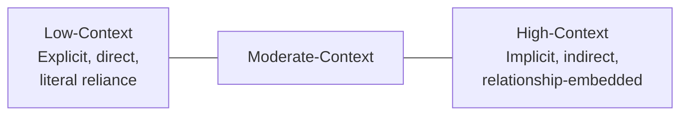

## High-Context Versus Low-Context Communication Styles

### Definition and Origin

High-context and low-context communication is a framework developed by anthropologist Edward T. Hall in his 1976 work *Beyond Culture*, distinguishing cultures by the degree to which communicated meaning relies on explicit verbal content versus implicit contextual factors — shared history, relationship, non-verbal cues, and situational understanding. While originally an anthropological framework rather than a negotiation-specific theory, it has become one of the most extensively applied frameworks in cross-cultural negotiation research, particularly through subsequent integration with face-negotiation theory and self-construal research.

### Core Definitional Distinction

**Low-context communication:** The majority of meaning is carried in the explicit, direct verbal message itself. Listeners are expected to interpret statements largely at face value, with minimal reliance on inferred or contextual meaning. Directness, explicitness, and literal precision are valued communication qualities.

**High-context communication:** A substantial portion of meaning is conveyed through implicit cues — tone, pacing, relationship history, social hierarchy, non-verbal signals, and shared cultural understanding — such that the same explicit words can carry different meanings depending on context, and much of the intended message may not be stated directly at all.

$$\text{Total Meaning} = \text{Explicit Verbal Content} + \text{Contextual/Implicit Signal}$$

**[Inference]** This equation is a simplification for illustrative purposes; Hall's original framework treats context-dependence as a continuous spectrum along which cultures and communication situations vary, rather than a strict binary or a mathematically decomposable quantity — no culture is purely high- or low-context in an absolute sense, and even within a single culture, communication context-dependence varies by relationship type and situation (e.g., communication with close family versus strangers).

### Diagram: The High-Context/Low-Context Spectrum

### Behavioral Manifestations in Negotiation

| Communication Dimension | Low-Context Manifestation | High-Context Manifestation |
| --- | --- | --- |
| Refusal/disagreement | Direct statement: "No, that doesn't work for us" | Indirect signals: extended silence, vague deferral, "we will consider it," changing the subject |
| Contract role | Contract viewed as the complete, exhaustive statement of agreement | Contract may be viewed as a framework; relationship and ongoing understanding fill remaining gaps |
| Negotiation pacing | Faster movement toward explicit terms and closure | Slower pacing, prioritizing relationship-building before substantive terms are directly addressed |
| Silence | Often interpreted as absence of communication, discomfort, or disagreement requiring resolution | Often a meaningful communicative act in itself — may indicate consideration, respect, or subtle disagreement |
| Written vs. verbal communication | High reliance on written documentation as the authoritative record | Greater reliance on verbal, relationship-based understanding; written documents may be treated more flexibly |
| Directness of requests | Explicit statement of what is wanted | Requests often embedded in indirect framing, obligating the listener to infer the actual ask |

### Connection to Face-Negotiation Theory and Self-Construal

**[Inference]** High-context communication norms are theoretically and empirically linked to interdependent self-construal (see Cultural Identity and Negotiator Self-Concept) and to heightened concern for other-face and mutual-face (per Stella Ting-Toomey's Face-Negotiation Theory). Indirect communication in high-context settings frequently serves a specific face-preservation function: an indirect refusal allows the refusing party to avoid direct confrontation that could threaten the counterparty's face, while also protecting the refuser's own face by avoiding an explicit statement that could later prove incorrect or need reversal. Direct, explicit communication in low-context settings, by contrast, is more consistent with independent self-construal's greater tolerance for direct confrontation over substantive positions without necessarily threatening core identity or relationship.

### The Core Cross-Cultural Misreading Risk

**[Inference]** The most consequential practical risk this framework identifies is bidirectional misinterpretation when negotiators from mismatched context orientations interact without awareness of the framework:

- A low-context negotiator may interpret a high-context counterparty's indirect signals (vague deferral, extended consultation requirements, ambiguous responses) as stalling, evasiveness, lack of serious interest, or even dishonesty — when the counterparty may be communicating genuine refusal, need for consultation, or considered response through culturally normal indirect channels.
- A high-context negotiator may interpret a low-context counterparty's direct statements (explicit refusal, blunt disagreement, direct questioning) as rude, aggressive, disrespectful, or face-threatening — when the counterparty intends only straightforward, unremarkable communication of substantive position by their own normative standards.

This bidirectional misreading risk is a frequently cited explanation in the cross-cultural negotiation literature for breakdowns and misunderstandings that are not attributable to substantive disagreement over negotiation terms themselves, but to miscommunication about the underlying communicative act.

### Practical Example: Diagnosing an Ambiguous Response

**Scenario:** A low-context-oriented negotiator proposes specific delivery terms to a high-context-oriented counterparty, who responds: "This is an interesting proposal. We will need to discuss internally and will follow up when we have more clarity."

**Low-context literal interpretation:** The response is taken at face value as a neutral, procedural statement indicating a pending internal review process, with an expectation of follow-up within a reasonable timeframe and no strong signal about the proposal's likely acceptance or rejection.

**High-context-informed interpretation:** The same statement, delivered without any expression of enthusiasm, immediate engagement with specific proposal terms, or concrete next-step commitment, may — depending on additional contextual cues (tone, prior relationship pattern, non-verbal signals if in person) — represent a polite, face-preserving indirect decline, allowing both parties to avoid the face-threat of an explicit rejection.

**Adjusted approach:** Rather than assuming either interpretation is automatically correct, an aware negotiator would look for additional contextual signals (was this response consistent with how this specific counterparty has communicated genuine interest previously? Did the response include any specific engagement with proposal details, which might indicate genuine consideration rather than polite deflection?) and might follow up with a low-pressure, face-preserving option — for example, offering a modified or scaled-back proposal that would be easier for the counterparty to accept without requiring an explicit reversal of an implicit decline, or directly (but respectfully) asking what additional information would help their internal discussion, testing whether genuine engagement exists.

**Output:** This illustrates how high/low-context awareness changes not the substantive proposal, but the negotiator's interpretive process and subsequent communicative strategy in response to ambiguous signals.

### Table: Practical Adaptation Strategies by Orientation

| If You Are Low-Context Negotiating with High-Context Counterparty | If You Are High-Context Negotiating with Low-Context Counterparty |
| --- | --- |
| Invest more time in relationship-building before pushing for explicit commitments | Be prepared for more direct, explicit questioning than may feel comfortable; direct disagreement is not necessarily intended as disrespectful |
| Watch for indirect signals (tone, hesitation, deferral patterns) as potentially meaningful communication, not mere delay | Provide explicit verbal confirmation of positions even when it feels redundant with contextual understanding, since the counterparty may not pick up on implicit cues |
| Create face-preserving options for the counterparty to decline or modify proposals without requiring direct confrontation | Recognize that a counterparty's direct "no" is likely intended as straightforward substantive communication, not a personal or relational rejection |
| Avoid interpreting silence or indirect responses as automatically negative or evasive | Be explicit about contract completeness expectations if a fully exhaustive written agreement is required, since this may not be the automatic assumption |

### Critiques and Limitations

**Binary oversimplification risk:** Hall's framework is often presented in simplified business-training contexts as a strict national-culture binary (e.g., "Japan is high-context, Germany is low-context"), when Hall's original framework treats context-dependence as continuous and situationally variable, and substantial within-culture variation exists based on relationship type, industry norms, and individual communication style.

**[Inference]** Overreliance on national-level high/low-context classification risks the same ecological-fallacy concern documented for Hofstede's dimensions — treating a population-level tendency as a deterministic prediction for any specific individual counterparty, who may communicate quite differently from their national culture's general tendency due to professional training, international exposure, or individual disposition.

**Interaction with other cultural dimensions:** [Inference] High/low-context communication style is theoretically related to, but analytically distinct from, other cultural dimensions like power distance and individualism-collectivism; while these dimensions often correlate in practice (collectivist, high-power-distance cultures often also score as high-context), they are not identical constructs, and a negotiator should not assume that scoring high on one dimension necessarily predicts a specific position on another without direct evidence.

### Key Points

- High-context and low-context communication describe a continuous spectrum of reliance on explicit verbal content versus implicit contextual cues for conveying meaning, not a strict binary.
- The framework is closely linked to face-negotiation theory and self-construal research, since indirect communication in high-context settings frequently serves face-preservation functions.
- The primary practical risk is bidirectional misinterpretation: low-context negotiators may misread high-context indirectness as evasiveness or dishonesty, while high-context negotiators may misread low-context directness as rudeness or aggression.
- Practical adaptation strategies differ depending on which direction the mismatch runs, but both directions benefit from treating ambiguous signals as potentially meaningful rather than defaulting to one's own cultural interpretive default.
- The framework should be applied as a spectrum-based diagnostic tool calibrated through direct observation of a specific counterparty, not as a fixed national-culture binary applied mechanically.

### Related Topics

- Face-Negotiation Theory (Ting-Toomey) and Cultural Identity
- Cultural Dimensions Frameworks Applied to Negotiation (Hofstede, GLOBE)
- Indirect Refusal Strategies and Face-Preservation Techniques
- Cultural Identity and Negotiator Self-Concept (Self-Construal Theory)
- Silence as a Communicative Act in Cross-Cultural Negotiation
- Written Contract Norms Across Cultural Communication Styles
- Ecological Fallacy Risk in Applying Cultural Frameworks