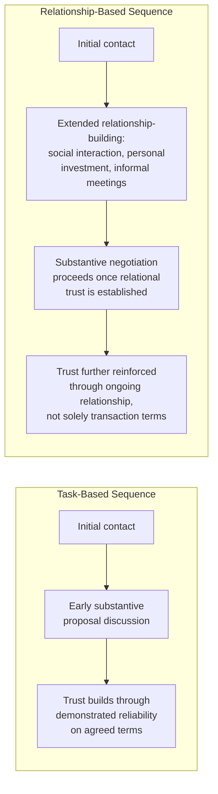

## Cross-Cultural Trust-Building and Rapport

### Definition and Scope

Cross-cultural trust-building and rapport addresses how trust — a foundational prerequisite for effective negotiation across all cultural contexts — is established, signaled, and interpreted differently depending on cultural background, and the practical implications for negotiators operating across cultural boundaries. While trust is a universal negotiation requirement, the specific behaviors, timelines, and signals through which trust is built and recognized vary substantially by cultural context, creating a distinct risk of cross-cultural miscalibration independent of substantive negotiation disagreement.

### Task-Based vs. Relationship-Based Trust Orientations

A foundational distinction in this literature, connected to broader individualism-collectivism and high/low-context frameworks, contrasts two general orientations toward how trust is established in a business or negotiation context:

| Orientation | Trust-Building Basis | Typical Timeline | Common Cultural Association |
| --- | --- | --- | --- |
| Task-based (transactional) trust | Trust developed through demonstrated competence, track record, and reliable performance on specific tasks/agreements | Can develop relatively quickly, often within the negotiation itself | More commonly associated with individualist, low-context cultural contexts |
| Relationship-based (affective) trust | Trust developed through personal relationship investment, social interaction, and demonstrated personal commitment prior to or alongside substantive business discussion | Often requires substantially longer investment, sometimes extending over multiple meetings or years | More commonly associated with collectivist, high-context cultural contexts |

**[Inference]** This distinction should not be read as implying task-based-trust cultures place no value on relationships or that relationship-based-trust cultures place no value on competence — both dimensions matter to some degree in virtually all cultural contexts. The distinction concerns *sequencing and relative emphasis*: whether substantive business discussion can reasonably proceed with limited prior relationship investment (more typical in task-based orientations) or whether relationship investment is treated as a necessary prerequisite before substantive negotiation can proceed productively (more typical in relationship-based orientations).

### Diagram: Divergent Trust-Building Sequences

### The Timeline Mismatch Risk

**[Inference]** A central practical risk this framework identifies is timeline mismatch when negotiators from different trust orientations interact without adjustment: a task-based-oriented negotiator may perceive a relationship-based-oriented counterparty's insistence on extended informal interaction (meals, social conversation, multiple preliminary meetings before substantive terms are addressed) as inefficient, evasive, or even suspicious ("why won't they get to the point?"), while the relationship-based-oriented counterparty may perceive the task-based negotiator's push for rapid substantive engagement as presumptuous, disrespectful, or a signal of insufficient genuine commitment to the relationship ("they only care about the deal, not about us").

This mismatch can independently derail negotiations even when substantive interests are fully compatible, since each party may exit the interaction with a negative overall impression of the other's trustworthiness based on process expectations rather than any substantive disagreement.

### Signals of Trustworthiness: Cultural Variation

**[Inference]** Beyond the broad task/relationship distinction, specific behavioral signals interpreted as trust indicators vary by cultural context in ways that can create additional miscalibration risk:

- **Directness as a trust signal:** In some (often lower-context) cultural contexts, direct, explicit communication — including willingness to openly state disagreement — is itself interpreted as a trust signal (an indication of honesty and lack of hidden agenda). In other (often higher-context) cultural contexts, excessive directness, particularly early in a relationship, may be read as a lack of appropriate social calibration or even as untrustworthy bluntness.
- **Reciprocal disclosure patterns:** Willingness to share personal information, informal social time, or seemingly business-irrelevant conversation may function as a trust-building signal in relationship-based orientations, while a task-based-oriented negotiator might view such exchanges as tangential to the substantive purpose of the meeting.
- **Formality and protocol adherence:** In some cultural contexts, strict adherence to formal protocol, titles, and hierarchical deference is itself a trust signal (demonstrating respect and seriousness), while in others, excessive formality may be read as distant or as an indication of insufficient genuine engagement.
- **Consistency over time vs. immediate rapport:** Some orientations place greater trust-building weight on immediate interpersonal rapport and warmth in initial interactions, while others place greater weight on consistent, reliable behavior demonstrated over a longer track record, being more skeptical of trust based primarily on initial rapport alone.

### Practical Strategies for Cross-Cultural Trust-Building

**Key Points**

- **Invest in pre-negotiation research on counterparty cultural norms**, not to apply a rigid script, but to calibrate initial expectations about likely timeline and process, reducing the risk of premature negative judgment based on mismatched expectations.
- **Allocate additional time for relationship-based-oriented negotiations** rather than assuming a task-based timeline will be adequate — attempting to compress a relationship-based process into a task-based timeline is a frequently cited cause of failed cross-cultural business negotiations.
- **Engage genuinely, not performatively, in relationship-building activities** when working with a relationship-based-oriented counterparty; [Inference] counterparties in these contexts are often attentive to whether relationship investment appears genuine versus perfunctory, and a negotiator perceived as merely going through expected motions without authentic engagement may not receive the trust benefit the activity is intended to build.
- **Communicate process expectations explicitly when timelines are genuinely constrained**, rather than either abandoning necessary relationship investment (risking rapport) or silently proceeding with an incompatible pace expectation (risking mutual frustration) — for example, transparently explaining time constraints while still demonstrating good-faith relationship investment within the available time.
- **Use trusted intermediaries or local partners** where available, since a counterparty's existing trust in a mutually known intermediary can substantially accelerate cross-cultural trust establishment beyond what direct interaction alone could achieve in a compressed timeframe.

### Practical Example: A Cross-Border Joint Venture Negotiation

**Scenario:** A negotiator from a task-based-oriented business culture is initiating joint venture discussions with a potential partner from a relationship-based-oriented business culture, under moderate time pressure from the negotiator's own organization to reach terms within a defined quarter.

**Without cross-cultural trust-building awareness:** The negotiator schedules a single efficient meeting focused on term sheet discussion, is puzzled and somewhat frustrated when the counterparty seems reluctant to engage substantively and instead proposes an extended dinner and several additional preliminary meetings, and may report back to their own organization that the counterparty "seems evasive" or "not serious," potentially recommending discontinuing the discussion.

**With cross-cultural trust-building awareness:** The negotiator anticipates the likely need for relationship investment given the counterparty's cultural context, proactively communicates their own organizational timeline constraints early and transparently (rather than silently imposing an incompatible pace), genuinely engages in the proposed relationship-building activities rather than treating them as an obstacle to substantive discussion, and explicitly asks the counterparty what pace of engagement would allow both relationship development and the needed substantive progress within realistic constraints — potentially identifying a compressed but still relationally adequate path (e.g., a slightly extended but not indefinite timeline, or parallel relationship-building and preliminary substantive discussion rather than strictly sequential).

**Output:** This illustrates how trust-building awareness changes the negotiator's process expectations and communication about constraints, rather than assuming either party's default orientation is simply "correct" and the other must fully adapt.

### Critiques and Limitations

**[Inference]** As with other cultural frameworks discussed in this chapter, the task-based/relationship-based distinction describes population-level tendencies subject to substantial individual, organizational, and industry-specific variation — a specific counterparty's actual trust-building expectations may diverge from broad cultural generalization based on their personal experience, professional training (e.g., extensive international business education), or the specific organizational culture of their employer, independent of national cultural background.

**Risk of one-sided adaptation expectations:** [Inference] A less frequently discussed but structurally important consideration is that cross-cultural trust-building literature can implicitly place adaptation burden primarily on whichever party is framed as the "visitor" or less dominant party in a given business relationship, when in genuinely reciprocal cross-cultural negotiation, mutual adaptation and explicit communication about differing expectations (as illustrated in the practical example above) may produce more durable and equitable trust-building than an assumption that only one party must fully adapt to the other's normative expectations.

### Related Topics

- Task-Based vs. Relationship-Based Trust Orientations in Cross-Cultural Business
- High-Context Versus Low-Context Communication Styles
- Cultural Dimensions Frameworks Applied to Negotiation
- Rebuilding Trust After a Breach
- The Role of Intermediaries in Cross-Border Negotiation
- Individualism-Collectivism and Negotiation Timeline Expectations
- Genuine vs. Performative Relationship Investment in Business Negotiation