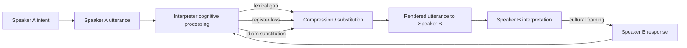

## Language, Translation, and Interpretation Challenges

### Overview

Language mediates every signal exchanged at the negotiation table: offers, concessions, hedges, emotional tone, and legal commitments. When negotiating parties do not share a native language, the negotiation is no longer a two-party information exchange but a three- or four-party system involving translators, interpreters, and the cognitive distortions introduced at each conversion point. This topic covers the structural, linguistic, and strategic problems that arise when negotiation is conducted across languages, and the practical techniques negotiators use to manage them.

### Core Distinctions: Translation vs. Interpretation

**Key Points**

- **Translation** converts written text (contracts, term sheets, correspondence) and permits review, revision, and time-delayed precision checking.
- **Interpretation** converts spoken language in real time and must be produced under time pressure, without the ability to revise once delivered.
- **Consecutive interpretation**: speaker pauses after a segment; interpreter renders it. Slower, but allows note-taking and higher fidelity for complex legal/technical content.
- **Simultaneous interpretation**: interpreter renders speech nearly concurrently, typically via headset equipment. Faster and preserves conversational rhythm, but carries higher risk of compression, omission, and cognitive overload for the interpreter.
- **Whispered interpretation (chuchotage)**: a variant of simultaneous interpretation delivered quietly to one or two listeners without equipment; used in smaller bilateral sessions.

The choice of mode is itself a negotiation-design decision: consecutive interpretation roughly doubles session time but gives both sides a built-in reflection window before responding, which can dampen reactive escalation.

### Sources of Distortion in Cross-Language Negotiation

**Key Points**

- **Lexical non-equivalence**: many negotiation-relevant terms have no direct equivalent across languages. Concepts such as "fairness," "good faith," "best efforts," or "reasonable" carry legal and cultural weight in English common-law contexts that do not map cleanly onto other legal traditions (e.g., civil law systems, which often lack a direct doctrinal equivalent to Anglo-American "good faith" bargaining duties).
- **Pragmatic loss**: interpreters often preserve propositional content (the literal claim) while losing pragmatic content (hedges, politeness markers, indirect refusals). A phrase like "that might be somewhat difficult for us" in Japanese business register often functions as a firm refusal, but a literal rendering into English can sound like an opening for further pressure.
- **Register and formality collapse**: many languages encode social distance and hierarchy through grammatical forms (e.g., Korean speech levels, Japanese keigo, French tu/vous). Interpretation into English, which has comparatively flat formality marking, can erase signals about relative status, deference, or authority that were doing real interactional work.
- **Idiom and metaphor loss**: negotiation talk is saturated with metaphor ("meet in the middle," "walk away," "leave something on the table"). Idioms rarely translate compositionally, and interpreters must substitute functionally equivalent expressions, introducing interpreter judgment into the message.
- **Compression under simultaneous interpretation**: cognitive load forces simultaneous interpreters to compress, generalizing specific numbers, omitting subordinate clauses, or simplifying conditional structures ("if X, then Y, unless Z") into flatter statements. This is a well-documented feature of simultaneous interpreting research, not a failure of individual interpreters.
- **False friends and false cognates**: superficially similar words across languages that carry different meanings (e.g., Spanish "eventualmente" resembles English "eventually" but means "possibly"), producing confident misreadings on both sides.
- **Back-translation drift**: successive translation of a term through a third language, or repeated translation and back-translation during drafting, can shift meaning cumulatively even when each individual step seems accurate.

### The Interpreter as a Third Party in the Negotiation System

**Key Points**

- An interpreter is never a perfectly neutral channel; interpretation necessarily involves selection, compression, and inference, which makes the interpreter a de facto participant in meaning construction.
- **Interpreter allegiance**: an interpreter hired by one side may (consciously or not) soften that side's aggressive statements or sharpen the counterpart's, particularly under simultaneous conditions where split-second lexical choices are unavoidable. [Inference] The direction and magnitude of this effect vary by interpreter training, ethics, and session length, and is difficult to fully eliminate through instruction alone.
- **Shared vs. separate interpreters**: using a single neutral interpreter for both parties promotes a common understanding of what was said, but concentrates risk if that interpreter is imprecise; each side using its own interpreter allows quality control but introduces the possibility that the two sides receive materially different renderings of the same exchange.
- **Interpreter briefing**: providing interpreters with glossaries of technical/legal terms, acronyms, and the negotiation's substantive background significantly improves fidelity, especially for domain-specific negotiations (M&A, technical licensing, diplomatic treaties).
- **Turn-taking cost**: interpretation inserts latency into the conversation, which changes the rhythm of concession-making. Silences that would read as pressure tactics in a same-language negotiation may simply be interpretation lag, and misreading this can trigger unwarranted concessions or unwarranted suspicion.

### Strategic and Legal Risks

**Key Points**

- **Contract language clauses**: cross-border contracts typically specify a governing language version that controls in case of discrepancy (e.g., "the English text shall prevail"). Without this clause, disputes over translation discrepancies in bilingual contracts can become a distinct source of litigation.
- **Ambiguity as strategic tool**: a party may exploit translation ambiguity deliberately, agreeing to language in one tongue that is understood to mean something looser or tighter in translation, then later asserting the more favorable reading. This is a known bad-faith tactic in high-stakes cross-border deals.
- **Terminology drift across drafts**: as a contract is revised iteratively across two language versions, small translation choices can accumulate into substantively different legal texts, especially for defined terms that must stay consistent throughout.
- **Numbers, dates, and units**: date format (DD/MM vs. MM/DD), decimal/thousands separators (1.000 vs. 1,000), and numbering systems can be silently misread across languages/locales, producing costly financial or scheduling errors that have nothing to do with vocabulary at all.
- **Legal system mismatch beneath shared vocabulary**: even when a term translates cleanly, the underlying legal doctrine may differ (e.g., "consideration" as a contract-formation requirement is a common-law concept with no direct civil-law counterpart), so translated contracts must sometimes be substantively redrafted, not merely re-worded.

### Practical Mitigation Techniques

**Key Points**

- **Use professional, vetted interpreters** with subject-matter familiarity rather than ad hoc bilingual staff; negotiation-specific interpreting is a distinct skill from general interpreting.
- **Pre-negotiation glossary building**: jointly agree on key term translations before substantive talks begin, reducing later disputes over what was "really" agreed.
- **Slow down and chunk speech**: shorter, single-clause utterances reduce compression loss under simultaneous interpretation; long compound-conditional sentences are the highest-risk structure to lose fidelity.
- **Confirm understanding through paraphrase**: asking the counterpart's team to restate a key term or condition in their own words (via the interpreter) surfaces silent misunderstandings before they are locked into a commitment.
- **Dual-language document tracking with a designated controlling text**: maintain side-by-side versions and explicitly flag any clause where the two versions could plausibly diverge in meaning.
- **Debrief with your own interpreter after sessions**: interpreters often notice paralinguistic or cultural signals (hesitations, hedges, face-related discomfort) that get flattened in real-time rendering but can be reported afterward.
- **Build in reflection time**: favor consecutive interpretation, or explicit caucus breaks, for the most consequential exchanges (final offers, walk-away statements) even if simultaneous interpretation is used for general discussion.
- **Avoid idioms, sports metaphors, and culturally specific humor** when speaking through an interpreter; these are the highest-loss categories of language and can derail rapport when mistranslated or misunderstood.

### Illustrative Example

**Example**

A U.S. licensing team negotiates a technology transfer agreement with a counterpart in Germany, communicating through simultaneous interpretation. The U.S. side states: "We'd be willing to consider flexibility on the royalty rate if the volume commitments are met, but that's contingent on a lot of moving pieces." Under simultaneous interpretation time pressure, this compound conditional is compressed to: "They may lower the royalty rate if you meet volume targets." The nuance of *contingency on multiple unspecified factors* is lost, and the German team proceeds to draft a term sheet treating the rate reduction as a near-firm commitment tied only to volume. The resulting misalignment surfaces during contract review, requiring a renegotiation round that could have been avoided by (a) shorter, single-clause delivery, (b) a follow-up paraphrase check, or (c) shifting to consecutive interpretation for this specific conditional offer.

### Diagram: Points of Distortion in Interpreted Negotiation

### Related Topics

- Cultural Dimensions Frameworks in Negotiation (Hofstede, Trompenaars)
- High-Context vs. Low-Context Communication Styles
- Nonverbal Communication and Gesture Misreading Across Cultures
- Legal Pluralism and Governing-Law Clauses in Cross-Border Contracts
- Face, Honor, and Indirect Refusal Patterns in Negotiation
- Negotiating Through Intermediaries and Third-Party Brokers
- Diplomatic Protocol and Formal Negotiation Register