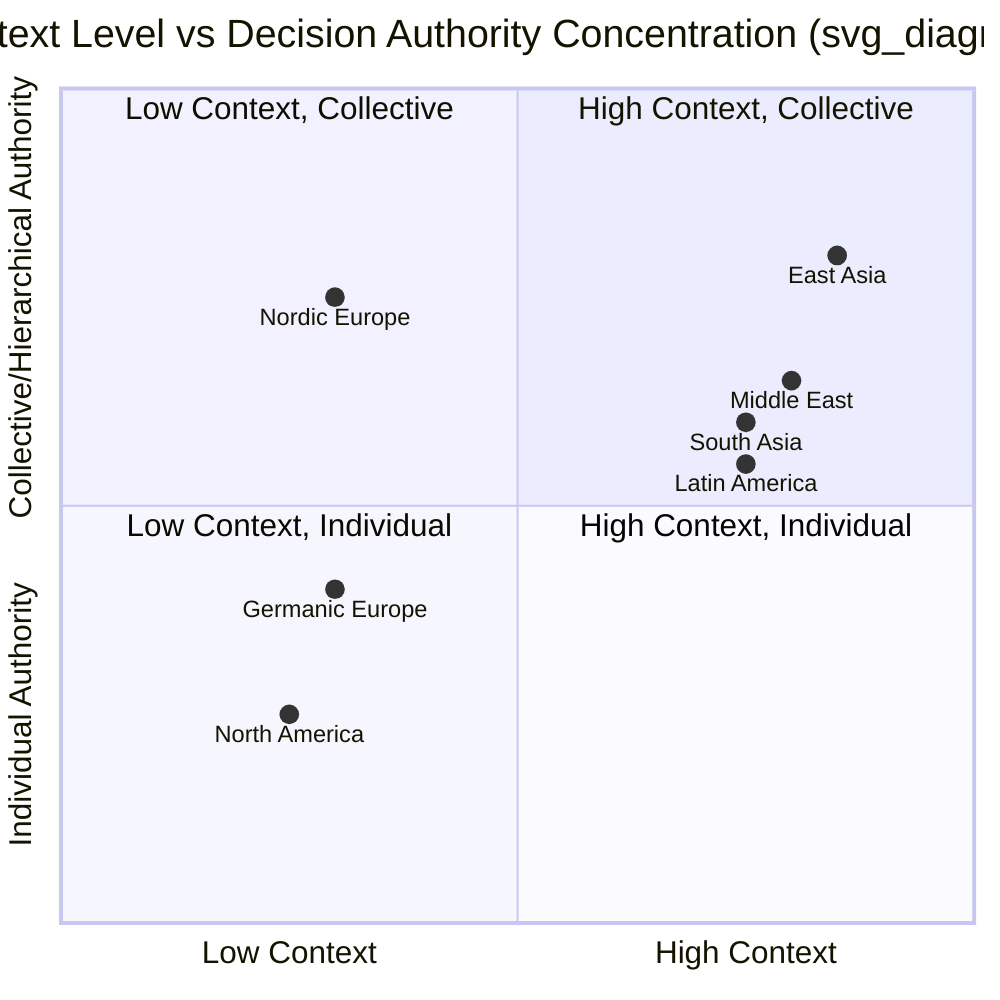

## Comparative Regional Negotiation Styles

### Overview

Regional negotiation style research aggregates patterns in how negotiators from different cultural and institutional backgrounds tend to approach preparation, communication, decision-making, and closing. These patterns are statistical tendencies observed across large samples, not deterministic rules about any individual negotiator, and skilled negotiators treat regional frameworks as hypotheses to test rather than scripts to apply. This item surveys the major comparative frameworks and then profiles commonly studied regional patterns: North American, Western European (with sub-variation), East Asian, South Asian, Middle Eastern, Latin American, and Sub-Saharan African styles, alongside the frameworks used to organize these comparisons.

### Foundational Comparative Frameworks

**Key Points**

- **Hofstede's Cultural Dimensions**: the most widely cited quantitative framework, scoring national cultures on dimensions including Power Distance (acceptance of hierarchical authority), Individualism vs. Collectivism, Uncertainty Avoidance (tolerance for ambiguity), Masculinity vs. Femininity (competitive vs. cooperative value orientation), and Long-Term vs. Short-Term Orientation. Negotiation-relevant predictions: high power-distance cultures concentrate negotiating authority at senior levels and expect deference to rank; high uncertainty-avoidance cultures favor detailed contracts and extensive precedent over open-ended frameworks.
- **Hall's High-Context vs. Low-Context Communication**: low-context cultures (e.g., U.S., Germany, Scandinavia) rely on explicit verbal statements as the primary carrier of meaning; high-context cultures (e.g., Japan, China, many Arab and Latin American cultures) rely heavily on shared background, relationship history, and nonverbal cues, so much of the negotiation's real content is communicated indirectly.
- **Trompenaars and Hampden-Turner's Dimensions**: adds constructs such as Universalism vs. Particularism (rule-based vs. relationship-based fairness), Neutral vs. Affective (emotional display norms), and Specific vs. Diffuse relationships (task-bounded vs. whole-person relationships), which map closely onto negotiation behaviors like whether personal relationships are treated as separable from the deal.
- **GLOBE Study** (House et al.): a large cross-national leadership and culture study that extends Hofstede-style dimensions with more granular measures (e.g., Assertiveness, Performance Orientation, In-Group Collectivism), often used to refine predictions about negotiator assertiveness and team decision structures.
- **Methodological caveat** [Unverified as applied to any individual]: these frameworks describe central tendencies across large national samples. Within-country variation (industry, generation, urban/rural, individual personality, organizational culture) is often as large as or larger than between-country variation, so applying a national score to a specific counterpart is a probabilistic prior, not a determination.

### North American Style (United States, Canada)

**Key Points**

- Tends toward **low-context, explicit communication**: positions, numbers, and objections are typically stated directly.
- **Task-oriented and time-compressed**: relationship-building is often treated as instrumental to closing the deal rather than a prerequisite for it; negotiators may move to substantive bargaining early in the relationship.
- **Contract-centric**: written agreements are treated as the primary binding reference; oral understandings are given comparatively little weight relative to the signed text.
- **Individual decision authority**: negotiators at the table are frequently empowered to make binding commitments without extensive referral to a larger collective, particularly in commercial contexts.
- Preference for **competitive/distributive opening moves** in commercial negotiation, though this varies significantly by industry and negotiation training background.

### Western European Style (with Sub-Regional Variation)

**Key Points**

- Western Europe is not a single style; commonly cited sub-variation includes:
  - **Germanic (Germany, Austria, German-speaking Switzerland)**: high uncertainty avoidance, strong preference for detailed technical preparation, structured agendas, and precision in contractual language; improvisation is often viewed as under-preparation rather than agility.
  - **Nordic (Sweden, Norway, Denmark, Finland)**: comparatively low power distance and consensus-oriented decision-making; negotiating teams may require internal consensus before committing, which can slow response time relative to single-authority negotiators.
  - **French**: often combines an intellectually argumentative style (defending positions through logical/philosophical reasoning) with a more hierarchical internal decision structure than Nordic counterparts.
  - **British**: tends toward understatement and indirect signaling of disagreement (e.g., "that's an interesting idea" as a polite deflection) relative to explicit American directness, despite shared language.
- Common thread: relatively strong reliance on legal/contractual precision as the anchor of the agreement, more than in high-context regions.

### East Asian Style (China, Japan, South Korea)

**Key Points**

- **High-context communication** dominates; direct refusal is often avoided in favor of ambiguity, silence, or a change of subject, and reading these signals correctly is a core competency for counterparts.
- **Relationship-first sequencing**: substantial time is often invested in relationship-building (guanxi in Chinese business culture) before substantive bargaining begins; skipping this phase can be read as disrespect or lack of seriousness.
- **Face (mianzi/체면/面子) preservation** is a structural constraint on the negotiation: public confrontation, direct contradiction, or forcing a counterpart into visible concession can derail talks regardless of the substantive merits, because it imposes a face cost.
- **Hierarchical and collective decision-making**: the person speaking at the table frequently lacks final authority; decisions may require consultation with a broader hierarchy (common in Japanese *ringi* consensus-building processes and Chinese organizational approval chains), producing longer decision latency than Western counterparts may expect.
- **Long-term orientation**: East Asian negotiation research (consistent with Hofstede's Long-Term Orientation dimension) often frames a single negotiation as one episode in an extended relationship, which can make negotiators comparatively more willing to accept short-term suboptimal terms in service of the longer relationship trajectory. [Inference] The strength of this effect varies by sector, generation, and the specific organizations involved.

### South Asian Style (India and Neighboring Countries)

**Key Points**

- Often characterized by **high-context but simultaneously highly verbal and expressive** communication — distinct from the more reserved high-context pattern often described in East Asia.
- **Relationship and hierarchy both matter**: personal rapport is valued, but organizational hierarchy strongly shapes who can make binding commitments.
- **Flexible, iterative bargaining**: prices and terms are frequently treated as starting points for extended back-and-forth adjustment rather than fixed anchors, particularly in commercial and retail contexts; this can be misread by low-context counterparts as instability rather than a normal bargaining convention.
- **Time orientation tends toward polychronicity**: multiple issues or even multiple parallel conversations may be handled concurrently rather than in strict sequence, which can appear disorganized to negotiators from monochronic (single-task, linear-agenda) cultures.

### Middle Eastern Style (Arab Gulf States and Broader MENA Region)

**Key Points**

- **High-context, relationship-centered**: trust-building, hospitality rituals, and personal rapport are often treated as prerequisites to substantive negotiation, not parallel activities.
- **Non-linear time orientation**: negotiations may not proceed on the fixed linear schedule expected by Western counterparts; patience and willingness to revisit topics are often necessary rather than signs of stalling.
- **Strong role of personal trust over contractual formalism** in many contexts: relationships between individuals, not merely between organizations, can carry significant weight in whether commitments are honored.
- **Bargaining as a normalized, expected ritual** in many commercial contexts, distinct from the fixed-price convention common in North American retail/commercial defaults; an initial offer is frequently understood by both sides to be a starting position rather than a final number.
- Considerable internal diversity exists across this broad region (Gulf states, Levant, North Africa), and generalized "Middle Eastern style" descriptions should be treated as coarse regional tendencies rather than uniform national profiles. [Unverified as applied to any single country]

### Latin American Style

**Key Points**

- **High-context and relationship-oriented**, with personal connection (*confianza*, personal trust) often functioning as a prerequisite for serious business discussion.
- **Expressive/affective communication norms**: emotional expressiveness, warmth, and physical proximity in interaction are more normalized than in Northern European or East Asian contexts, and should not automatically be read as loss of composure or negotiating weakness.
- **Hierarchical decision authority**, often concentrated at senior levels, particularly in family-owned or traditionally structured firms.
- **Polychronic time orientation** in many contexts: schedules and meeting times are frequently treated with more flexibility than in North American or Germanic business culture.

### Sub-Saharan African Style (Broad Regional Patterns)

**Key Points**

- Substantial diversity across the region; frequently cited common threads in the negotiation literature include:
  - **Strong emphasis on community and consensus-based decision-making** in many traditional and organizational contexts, reflecting collectivist orientations.
  - **Relationship and trust-building as foundational**, often requiring extended preliminary engagement before substantive terms are discussed.
  - **Respect for age and hierarchical seniority** as a significant factor in who negotiates and how deference is expressed.
- As with the Middle Eastern and Latin American groupings, "Sub-Saharan African style" spans an extremely wide range of national, ethnic, and organizational cultures, and treating it as a single style risks significant oversimplification. [Unverified as applied to any single country or ethnic group]

### Comparative Summary Table

| Dimension | North America | W. Europe (avg.) | East Asia | South Asia | Middle East | Latin America |
| --- | --- | --- | --- | --- | --- | --- |
| Context level | Low | Low–Medium | High | High | High | High |
| Time orientation | Monochronic | Monochronic | Long-term, monochronic | Polychronic | Polychronic | Polychronic |
| Decision authority | Individual | Mixed (consensus in Nordics) | Hierarchical/collective | Hierarchical | Hierarchical | Hierarchical |
| Contract weight | High | High | Medium (relationship matters more) | Medium | Medium–Low | Medium |
| Opening style | Direct | Direct (varies) | Indirect | Expressive/indirect | Indirect | Indirect/expressive |

### Diagram: Positioning Regional Tendencies on Two Core Axes

### Practical Application

**Key Points**

- Use regional frameworks to generate **testable hypotheses before the negotiation** (e.g., "expect indirect refusal signals," "expect the visible counterpart to lack final authority"), then confirm or revise those hypotheses against the specific individuals and organization actually at the table.
- **Avoid stereotype substitution for preparation**: regional data should inform question-asking and observation, not replace direct inquiry into a specific counterpart's actual authority, communication preferences, and constraints.
- **Cross-check via local advisors or experienced intermediaries** when operating in an unfamiliar regional context, since within-country and within-organization variance can be substantial.
- **Adjust process design, not just tactics**: for high-context, hierarchical counterparts, this can mean allocating more calendar time, building in relationship-building phases, and avoiding forcing yes/no answers in public settings.

### Related Topics

- Hofstede's Cultural Dimensions Theory (deep dive)
- High-Context vs. Low-Context Communication Styles
- Face, Honor, and Indirect Refusal Patterns in Negotiation
- Language, Translation, and Interpretation Challenges
- Negotiating Through Intermediaries and Third-Party Brokers
- Guanxi and Relationship-Based Business Networks
- Cross-Cultural Negotiation Training and Simulation Design