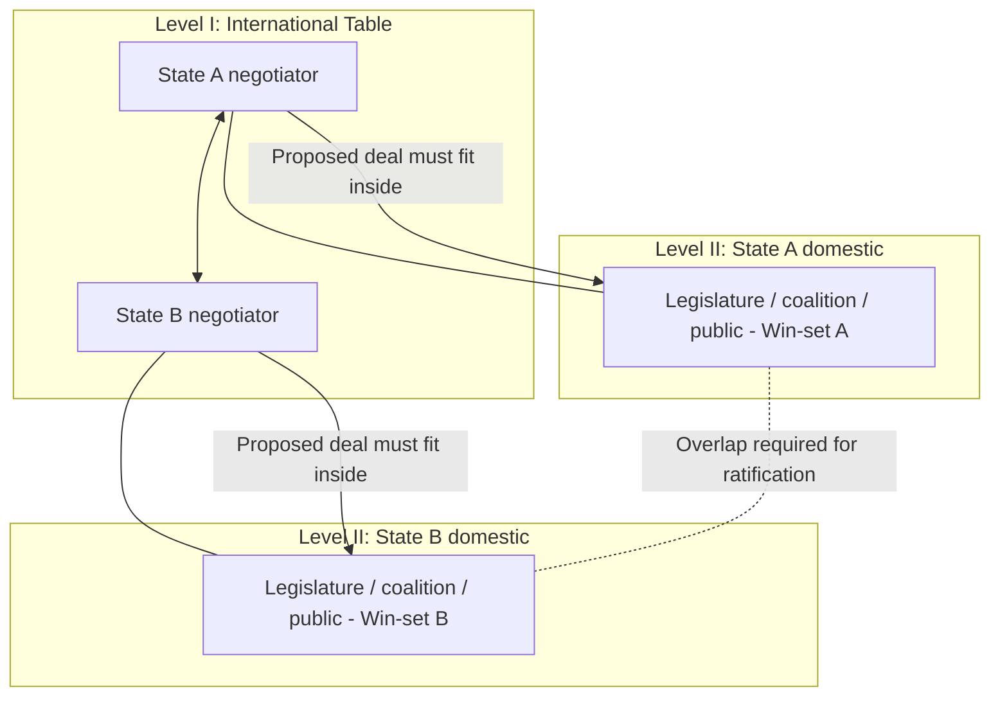

## Diplomatic Protocol and International Bargaining Norms

### Overview

Diplomatic negotiation operates under a distinct set of formal and informal rules that differ from commercial or interpersonal negotiation. Protocol governs the ceremonial and procedural surface of state-to-state interaction (precedence, seating, forms of address, communication channels), while bargaining norms govern the substantive practices through which sovereign or quasi-sovereign actors reach binding or non-binding agreements. Both exist because diplomatic negotiation carries unique constraints absent from most commercial contexts: sovereign equality of parties regardless of power asymmetry, the absence of an external enforcement authority, domestic ratification requirements, and the high symbolic stakes of public positioning.

### Foundations of Diplomatic Protocol

**Key Points**

- **Precedence**: the formal ranking of representatives and states in ceremonial contexts (seating order, speaking order, order of signature), traditionally governed by rules such as order of arrival of ambassadors or alphabetical listing of state names in the working language of the conference, codified in instruments like the **Vienna Convention on Diplomatic Relations (1961)**.
- **Diplomatic immunity and inviolability**: protections granted to diplomatic agents and premises under the Vienna Convention, which indirectly shape negotiation dynamics by ensuring negotiators can speak, travel, and communicate without fear of legal jeopardy in the host state, a precondition for candid bargaining.
- **Credentials and full powers**: a negotiator's authority to bind their state is formally established through instruments such as *letters of credence* (ambassadors) or *full powers* (*plein pouvoir*) documents for treaty negotiation, and counterparts routinely verify these before substantive talks proceed.
- **Forms of address and titulature**: correct use of formal titles (Excellency, Minister, Ambassador) is treated as a baseline signal of respect; errors are often read as either ignorance or deliberate slight, both of which can complicate rapport before substance is even reached.
- **Venue and seating symbolism**: choices such as a round table (used in the Paris Peace Talks to avoid implying hierarchy among parties) or the order of national flags/nameplates are negotiated in advance precisely because they carry substantive signaling value about perceived status and legitimacy.

### Sovereign Equality and Asymmetric Power

**Key Points**

- Diplomatic protocol formally treats all sovereign states as **juridically equal** regardless of relative military, economic, or demographic power, which shapes procedural norms (e.g., one-state-one-vote in UN General Assembly resolutions) even though actual bargaining leverage remains highly asymmetric.
- **Formal equality vs. substantive leverage**: skilled diplomatic negotiators distinguish between the procedural equality protocol grants and the substantive bargaining power that flows from military capability, economic dependency, alliance structures, and issue-specific leverage; protocol norms constrain *how* power is exercised, not *whether* it exists.
- **Face-saving mechanisms for weaker parties**: protocol conventions (equal speaking time, formal courtesies, joint communiqués crediting all parties) allow less powerful states to participate with dignity despite limited substantive leverage, which can be instrumental in securing their cooperation or at least their acquiescence.

### Communication Channels and Track Diplomacy

**Key Points**

- **Track I diplomacy**: official, government-to-government negotiation conducted by accredited representatives with formal authority to commit their states.
- **Track II diplomacy**: unofficial, informal dialogue between influential private individuals (former officials, academics, retired military) that explores options and builds mutual understanding without binding either government, often used to test ideas too politically sensitive for official channels.
- **Track 1.5 diplomacy**: hybrid format mixing official and unofficial participants, often used to maintain deniability while still connecting semi-officially to formal decision-making.
- **Backchannel negotiation**: secret or informal direct communication between principals or trusted intermediaries, bypassing normal bureaucratic channels, historically used in high-stakes situations (e.g., the Cuban Missile Crisis backchannel between Robert Kennedy and Soviet Ambassador Dobrynin) where speed, secrecy, and flexibility outweigh the benefits of formal process.
- **Communiqués and joint statements**: the carefully negotiated wording of post-meeting public statements is itself a substantive negotiation output; ambiguous or deliberately vague language ("constructive discussions were held") is a recognized technique for managing failed or partial agreements without triggering public escalation.

### Substantive Bargaining Norms in Diplomacy

**Key Points**

- **Nothing is agreed until everything is agreed**: a common working principle in multilateral treaty negotiation (e.g., trade rounds, climate accords) in which provisional agreement on individual articles remains contingent on the final overall package, preventing early concessions from being locked in unilaterally.
- **Single undertaking**: a related principle, notably used in WTO negotiating rounds, requiring the entire negotiated package to be accepted or rejected as a whole rather than piecemeal, which changes coalition dynamics relative to issue-by-issue ratification.
- **Constructive ambiguity**: deliberately imprecise treaty or communiqué language that allows each party's domestic audience to interpret the agreement favorably, used to bridge otherwise irreconcilable positions (a widely cited example is the deliberate ambiguity in UN Security Council Resolution 242 (1967) regarding Israeli withdrawal "from territories" rather than "from the territories").
- **Ratification and the two-level game** (Putnam's framework): diplomatic negotiators simultaneously bargain at the international table (Level I) and their domestic political/legislative arena (Level II); an agreement must be acceptable within both "win-sets" simultaneously, meaning a negotiator's flexibility is constrained not only by the counterpart but by what their own legislature, public, or coalition will ratify.
- **Reciprocity and linkage**: diplomatic negotiations frequently link ostensibly separate issues (trade concessions tied to human rights commitments, security guarantees tied to economic aid) as a bargaining mechanism, a technique less common in bounded commercial negotiations.
- **Precedent sensitivity**: diplomatic negotiators are often unusually attentive to the precedent an agreement's language sets for future disputes or other states' claims, sometimes prioritizing precedent-avoidance over the immediate substantive outcome.

### Multilateral Negotiation Structures

**Key Points**

- **Consensus-based decision rules**: many multilateral bodies (UN Security Council procedural matters, WTO, many treaty conferences) operate by consensus rather than majority vote, meaning any single objecting party can block or delay agreement, which incentivizes extensive pre-negotiation coalition-building.
- **Coalition formation**: blocs such as the G77, the European Union's common negotiating position in trade talks, or the Non-Aligned Movement aggregate smaller states' bargaining power; multilateral diplomats often spend more negotiating effort on intra-coalition alignment than on cross-coalition bargaining.
- **Chair/president role**: the presiding officer of a multilateral negotiation (conference president, rotating chair) often exercises significant informal influence through control of agenda sequencing, drafting of compromise texts ("chair's text"), and management of speaking order, despite having no formal vote.
- **Sequencing and framework agreements**: complex diplomatic negotiations are frequently broken into a **framework agreement** (establishing principles) followed by detailed implementing agreements, allowing parties to bank an initial political win while deferring the hardest technical trade-offs.

### Illustrative Example

**Example**

During multilateral climate negotiations, a framework agreement is reached in principle on emissions reduction targets, but two delegations cannot agree on the specific verb describing developed nations' financial commitments: one delegation insists on "shall provide" (binding obligation), the other will only accept "shall aim to provide" (aspirational). The chair proposes constructively ambiguous language — "shall mobilize" — which is specific enough to signal commitment but avoids the binding legal obligation both governments' domestic ratification processes would reject. This allows both delegations to sign a joint communiqué and present the outcome favorably to their respective legislatures, while substantive implementation detail is deferred to a subsequent technical working group under the single-undertaking principle.

### Diagram: The Two-Level Game in Diplomatic Bargaining

### Practical Application

**Key Points**

- Verify counterpart authority (full powers, credentials) before treating any stated position as binding, particularly in multilateral or treaty contexts.
- Treat public communiqué language as a negotiated artifact in its own right, not a mere summary; word choice differences (e.g., "shall" vs. "should," "recognize" vs. "endorse") often carry substantive legal or political weight.
- Map the counterpart's domestic ratification constraints (their Level II win-set) early, since an internationally attractive deal that cannot be ratified domestically is not a viable agreement.
- Use Track II or backchannel options when public positioning constraints make direct official movement politically costly for either side.
- Respect protocol formalities as a low-cost trust-building mechanism, particularly in early-stage relationship building with unfamiliar counterparts.

### Related Topics

- Two-Level Games and Domestic Ratification Constraints (Putnam)
- Multilateral Treaty Negotiation and Consensus Rules
- Track II and Backchannel Diplomacy
- Constructive Ambiguity in Legal and Diplomatic Drafting
- Comparative Regional Negotiation Styles
- Coalition Formation in Multiparty Negotiation
- Crisis Negotiation and Diplomatic Signaling Under Time Pressure