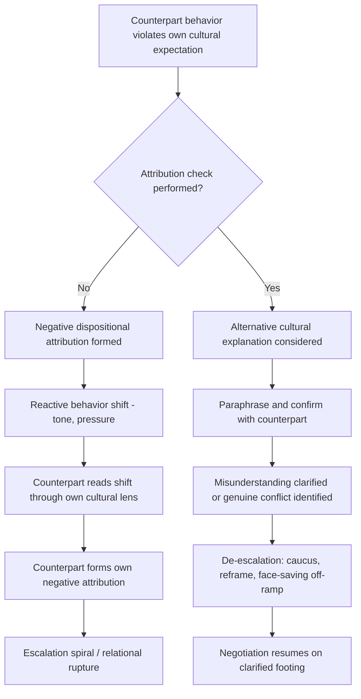

## Managing Cross-Cultural Misunderstanding and Conflict

### Overview

Cross-cultural misunderstanding in negotiation arises when parties interpret the same words, silences, or actions through incompatible cultural frameworks, producing attribution errors that can escalate into conflict even when both sides are acting in good faith. This topic addresses the mechanisms by which such misunderstandings form, the diagnostic skills needed to detect them before they escalate, and structured techniques for de-escalating and repairing cross-cultural negotiation breakdowns once they occur.

### How Cross-Cultural Misunderstanding Forms

**Key Points**

- **Attribution error**: when a counterpart's behavior violates one's own cultural expectations, the default tendency is to attribute it to the counterpart's *character* or *intent* (dishonesty, hostility, incompetence) rather than to *cultural difference in norms*. This is a specific cross-cultural instance of the fundamental attribution error studied broadly in social psychology.
- **Norm mismatch on communication style**: a direct communicator interprets a high-context counterpart's vagueness as evasiveness or bad faith; the high-context counterpart interprets the direct communicator's bluntness as aggression or disrespect. Both readings can be simultaneously wrong about the other's intent.
- **Divergent meaning of silence**: silence functions differently across cultures — as a normal component of respectful deliberation (common in many East Asian negotiation contexts) versus as a signal of disagreement, discomfort, or negotiation leverage (more common in some Western commercial contexts). Misreading which function is operating produces false inferences on both sides.
- **Differing norms around time and commitment**: a negotiator from a polychronic, relationship-first culture treating a stated deadline as flexible may be perceived by a monochronic counterpart as unreliable or disrespectful of the agreement, when the underlying norm structure, not intent, differs.
- **Escalation through mirrored misattribution**: once one party forms a negative attribution ("they are stalling deliberately"), their subsequent behavior (increased pressure, colder tone) is read by the counterpart through their own cultural lens, often confirming *their* negative attribution in turn — a self-reinforcing spiral independent of either side's original intent.
- **Face-threat conflict escalation**: in face-sensitive cultures, an unintentional face threat (public correction, blunt refusal, visible impatience) can trigger a disproportionate relational rupture relative to the apparent size of the triggering event, because the cost incurred is social/relational rather than merely substantive.

### Diagnostic Frameworks for Detecting Misunderstanding Early

**Key Points**

- **Attribution check**: before responding to an apparently problematic counterpart behavior, explicitly generate at least one alternative cultural explanation before defaulting to a negative intent-based explanation ("Is this vagueness a cultural indirectness norm, or an actual refusal?").
- **Paraphrase and confirm loop**: restating the counterpart's position in one's own words and asking for confirmation surfaces silent misunderstanding before it hardens into a dispute; this is especially important when interpretation or translation is involved (see *Language, Translation, and Interpretation Challenges*).
- **Behavioral vs. dispositional framing in internal team debriefs**: negotiation teams should explicitly discourage dispositional labeling of counterparts ("they're being dishonest") in favor of behavioral, culturally contextualized descriptions ("they haven't given a direct yes/no, which may reflect an indirect-refusal norm rather than active deception").
- **Third-party or local advisor consultation**: bringing in a cultural informant, experienced local negotiator, or bicultural team member to sanity-check an emerging negative interpretation before it drives strategy.
- **Tracking escalation triggers**: negotiation teams operating cross-culturally benefit from maintaining a running note of moments where tone or behavior shifted unexpectedly, to distinguish genuine substantive disagreement from a cultural-signal misread.

### De-Escalation Techniques

**Key Points**

- **Explicit meta-communication**: stepping outside the substantive negotiation to discuss the process itself ("I want to check — are we understanding each other's positions correctly?") is a recognized technique for interrupting an escalation spiral without conceding substantive ground.
- **Face-saving off-ramps**: offering a counterpart a way to change position without public loss of face (attributing a shift to "new information" rather than "they were wrong," or handling sensitive concessions in private caucus rather than plenary session) reduces the relational cost of movement in face-sensitive cultures.
- **Reframing from positions to interests**: returning to underlying interests rather than stated positions can defuse conflict that has become entangled with cultural miscommunication, since interests are often less culturally coded than the specific words used to express positions.
- **Caucusing and breaks**: a temporary break from joint session allows each side to privately process an apparent breakdown, consult with translators/advisors, and cool emotional reactivity before further exchange, particularly valuable after an unintended face threat.
- **Third-party mediation**: introducing a neutral, ideally bicultural mediator who can reframe each side's statements in terms legible to the other party's cultural framework, functioning similarly to a skilled interpreter but with an explicit conflict-resolution mandate.
- **Explicit acknowledgment of cultural difference**: directly and respectfully naming that a misunderstanding may be rooted in differing communication norms, rather than assuming shared norms and continuing to talk past each other, can normalize the friction as a solvable coordination problem rather than a moral failing on either side.

### Common Conflict Patterns and Response Strategies

| Misunderstanding pattern | Likely cause | De-escalation response |
| --- | --- | --- |
| Counterpart perceived as "evasive" | High-context indirect refusal norm | Paraphrase-and-confirm; avoid forcing explicit yes/no publicly |
| Counterpart perceived as "aggressive" | Low-context directness norm | Reframe bluntness as information-sharing, not hostility |
| Counterpart perceived as "unreliable" on deadlines | Polychronic time orientation | Clarify deadline flexibility explicitly and in writing early |
| Sudden coldness after a comment | Unintended face threat | Private caucus; face-saving reframe; possible apology channel |
| Stalled progress despite apparent agreement | Lack of visible decision authority at the table | Clarify decision-making structure and hierarchy explicitly |
| Perceived "bad faith" over translated term | Lexical/legal non-equivalence | Joint glossary review; consult neutral bilingual expert |

### Repair After Breakdown

**Key Points**

- **Acknowledge the rupture directly** rather than proceeding as if nothing happened; unaddressed relational damage in high-context, relationship-first cultures tends to persist and resurface rather than dissipate on its own.
- **Separate the relational repair from the substantive issue**: address the relationship harm (e.g., a perceived face threat) as its own agenda item before returning to the substantive point that triggered it, rather than trying to resolve both simultaneously.
- **Use apology conventions appropriate to the counterpart's culture**: the form, formality, and directness of an effective apology vary considerably across cultures; a low-context, brief, direct apology may read as insufficiently sincere in some high-context or hierarchical contexts, where more elaborate acknowledgment or intermediary-facilitated repair may be expected. [Inference] The specific form required varies by culture, organization, and relationship history, and should be confirmed with local expertise rather than assumed.
- **Rebuild through small, low-risk cooperative steps**: after a significant misunderstanding, resuming with lower-stakes, easily agreeable items can rebuild working trust before returning to the contested substantive issue.
- **Document the resolved understanding explicitly**: once a cross-cultural misunderstanding is clarified, confirming the shared understanding in writing (in both languages, if relevant) reduces the risk of the same ambiguity resurfacing later in the negotiation.

### Illustrative Example

**Example**

During a joint venture negotiation, a U.S. executive states directly: "That timeline doesn't work for us; we need it in six weeks, not twelve." The counterpart, from a face-sensitive, high-context business culture, goes silent for the remainder of the session and subsequently becomes difficult to reach. The U.S. team initially attributes this to bad faith or loss of interest. A bicultural advisor identifies that the directness of the timeline rejection, delivered in front of the counterpart's junior colleagues, likely constituted a public face threat rather than signaling substantive disinterest. The U.S. team requests a private, informal follow-up meeting (rather than another plenary session), opens by acknowledging that the prior discussion "may have moved faster than was comfortable," and reintroduces the timeline concern as a shared problem to solve jointly. The counterpart re-engages, and the timeline issue is resolved through a phased compromise.

### Diagram: Escalation Spiral vs. Interrupted De-Escalation Path

### Practical Application

**Key Points**

- Build attribution-checking into team process explicitly (e.g., a standing debrief question: "what's a non-hostile cultural explanation for what just happened?") rather than relying on individual negotiators to self-correct under pressure.
- Invest in bicultural team members or advisors before high-stakes cross-cultural sessions, not only after a breakdown has occurred.
- Treat face-related ruptures as requiring dedicated relational repair steps, distinct from and prior to resuming substantive bargaining.
- Default to private, not public, channels for correcting or challenging a counterpart in cultures with strong face-sensitivity norms.
- Maintain a documented, mutually confirmed understanding of key terms and commitments to reduce recurrence of the same ambiguity later in the negotiation.

### Related Topics

- Comparative Regional Negotiation Styles
- High-Context vs. Low-Context Communication Styles
- Face, Honor, and Indirect Refusal Patterns in Negotiation
- Language, Translation, and Interpretation Challenges
- Mediation and Third-Party Conflict Resolution Techniques
- Trust Repair and Relationship Recovery in Negotiation
- Emotional Regulation and De-Escalation Tactics in Negotiation