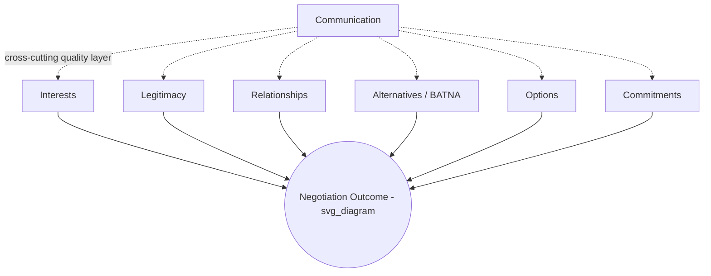

## The Seven Elements Framework

### Overview

The Seven Elements Framework, developed at the Harvard Negotiation Project and formalized in Roger Fisher and Daniel Ertel's *Getting Ready to Negotiate* (1995) as an operationalization of the principled negotiation approach introduced in *Getting to Yes* (Fisher, Ury, and Patton, 1981), decomposes any negotiation into seven analytically distinct components. Rather than prescribing a single sequence of tactics, it provides a diagnostic and preparation structure: negotiators assess and strengthen their position on each of the seven elements independently, then integrate them into a coherent strategy. It remains one of the most widely taught frameworks in negotiation preparation because it separates the substance of what to analyze from the tactics of how to behave at the table.

### The Seven Elements

**Key Points**

1. **Interests** — the underlying needs, concerns, and motivations driving each party's stated positions; the foundational element, since positions are treated as one of potentially many ways to satisfy an interest.
2. **Legitimacy** — external standards, precedents, benchmarks, or criteria that can be used to persuade a counterpart (or oneself) that a proposed outcome is fair, rather than merely favorable to one side.
3. **Relationships** — the working relationship between the parties, both its current state and how the negotiation process itself will affect it going forward.
4. **Alternatives and BATNA** — what each party could do if no agreement is reached, and specifically the *Best Alternative to a Negotiated Agreement*, which sets the walk-away threshold below which no agreement is preferable to reaching one.
5. **Options** — the full range of possible agreements or parts of agreements that could satisfy the parties' combined interests, generated ideally before evaluation or commitment narrows the field.
6. **Commitments** — the specific, realistic, and operational statements of what each party will and will not do, evaluated for clarity, verifiability, and feasibility of implementation.
7. **Communication** — the quality and structure of the exchange of information between parties, including how effectively each side listens, clarifies, and avoids distortion (including cross-cultural and cross-linguistic distortion; see *Language, Translation, and Interpretation Challenges*).

### Interests

**Key Points**

- Interests are distinguished from **positions**: a position is a specific demand ("I want the delivery date moved to March 1"), while the interest is the underlying concern the position is meant to satisfy ("I need inventory in place before our seasonal sales spike").
- Multiple interests typically exist simultaneously for each party (substantive, relationship, process, and identity/psychological interests), and they are not always known even to the party holding them without deliberate reflection.
- **Interest mapping** during preparation involves asking "why" repeatedly behind a stated position to surface the interest(s) it serves, then doing the same for the counterpart's likely positions based on available information.
- Shared or compatible interests, once identified, often reveal integrative ("expand the pie") opportunities that are invisible at the level of positional bargaining.

### Legitimacy

**Key Points**

- Legitimacy criteria function as persuasive anchors: market data, industry standards, prior agreements, legal precedent, expert appraisals, or reciprocity norms ("what would a fair, disinterested third party consider reasonable here?").
- Using external legitimacy standards shifts the negotiation dynamic from "who has more power" to "what does an objective standard suggest," which can reduce positional conflict and defensiveness, particularly across cultural or status differences.
- Effective preparation on this element includes gathering multiple independent legitimacy sources in advance, since a counterpart is more easily persuaded by criteria they did not perceive as unilaterally selected to favor one side.
- Legitimacy also operates internally: negotiators use it to evaluate whether a deal they are being offered is fair, independent of pressure tactics being applied against them.

### Relationships

**Key Points**

- The framework treats relationship quality as a **manageable variable**, not a fixed byproduct of the negotiation's outcome; process choices (how respectfully disagreement is handled, whether commitments are honored) shape the relationship independent of the substantive result.
- A useful diagnostic is separating the "people" from the "problem" (a core principle from *Getting to Yes*): disagreement about substance should be pursued vigorously without that vigor being read as, or converted into, personal or relational attack.
- Relationship investment is calibrated to the expected value of future interaction: a one-time transactional negotiation warrants different relationship investment than an ongoing partnership or repeated-game counterpart relationship.
- Poor relationship management can undermine even a substantively excellent agreement if implementation depends on ongoing goodwill and cooperative interpretation of ambiguous contract terms.

### Alternatives and BATNA

**Key Points**

- **BATNA (Best Alternative to a Negotiated Agreement)**, a term coined in *Getting to Yes*, is the standard against which any proposed agreement should be measured: an agreement is rational to accept only if it is better than one's BATNA, and irrational to accept if it is worse.
- Preparation requires: (1) brainstorming the full range of alternatives to a negotiated deal, (2) evaluating and improving the most promising alternatives, and (3) selecting the best one as the actual BATNA.
- **Reservation price** is derived directly from BATNA in single-issue, value-quantifiable negotiations (e.g., a minimum acceptable sale price equal to the value of the best alternative buyer).
- A strong, credible, and improvable BATNA increases negotiating power independent of any tactic used at the table; conversely, misjudging or overstating one's own BATNA is a common preparation failure that leads to accepting an inferior deal or walking away from a superior one.
- Assessing the **counterpart's BATNA** (even approximately) is equally important for calibrating how much room exists for movement and where their walk-away point likely sits.

### Options

**Key Points**

- Options are the raw material for potential agreements — as many possible packages, trade-offs, or partial solutions as can be generated, ideally before any evaluation or judgment narrows the set (a brainstorming principle explicit in the original *Getting to Yes* text).
- Generating options based on **differing valuations** across issues enables trade-creation: if Party A values issue X more than issue Y, and Party B values Y more than X, an option trading concessions on X for concessions on Y can make both parties better off relative to a single-issue compromise.
- Options should be generated separately from commitment; treating early option generation as tentative and non-binding preserves creative range and reduces defensive positioning during this phase.
- The quality of the option set generated during preparation directly bounds the quality of any agreement reachable at the table — an agreement cannot exceed the best option that was actually identified and proposed.

### Commitments

**Key Points**

- Commitments are evaluated on: **realism** (can the committing party actually deliver it), **operationality** (is it specific and actionable enough to implement, not just aspirational), and **verifiability** (can compliance be checked by the other party).
- Draft commitment language should be tested during preparation for how it would actually function post-agreement, since vague or unverifiable commitments are a common source of later disputes (see also contract-language risks discussed under cross-border negotiation).
- Commitments can be sequenced or staged (e.g., milestone-based release of obligations) to manage risk when trust between parties is still developing.
- A negotiation can produce excellent option content but fail at implementation if the corresponding commitments are not concrete enough to be enforced or relied upon.

### Communication

**Key Points**

- Effective communication in this framework means accurate transmission and reception of information about interests, legitimacy criteria, options, and commitments — distortion at this layer degrades the quality of every other element.
- Active listening, clarifying questions, and paraphrase-confirmation are treated as concrete communication techniques rather than soft skills, since they directly reduce the risk of costly misunderstanding.
- Communication quality is especially vulnerable in cross-cultural, cross-linguistic, or interpreter-mediated negotiations (see *Language, Translation, and Interpretation Challenges*), where the framework's communication element intersects directly with translation and interpretation risk.
- Poor communication can independently sabotage a negotiation with strong underlying interests, legitimate standards, and good options, making it a distinct point of preparation and diagnostic focus rather than an afterthought.

### Using the Framework as an Integrated Preparation Tool

**Key Points**

- The seven elements are **not sequential steps** to execute in order at the table; they are parallel dimensions to strengthen during preparation and to monitor and adjust throughout the live negotiation.
- A common practical application is a **preparation worksheet** with one section per element, completed for one's own side and, to the extent knowable, for the counterpart's side, before entering substantive talks.
- Weakness in any single element can undermine an otherwise strong negotiation position: e.g., excellent options and legitimacy criteria are of limited use if the negotiator's BATNA is weak and known to the counterpart, or if communication breakdowns prevent the well-prepared options from ever being understood.
- The framework is domain-agnostic and is applied across commercial, diplomatic, labor, and interpersonal negotiation contexts; its specific application should still be adapted to the norms of the domain (e.g., legitimacy criteria carry different weight in diplomatic negotiation than in labor arbitration).

### Illustrative Example

**Example**

A software vendor is negotiating a renewal contract with a long-standing enterprise client. Using the framework: **Interests** — the vendor needs predictable multi-year revenue; the client needs cost containment and flexibility to scale down. **Legitimacy** — the vendor references industry-standard pricing benchmarks for comparable SaaS contracts. **Relationship** — both sides value the five-year partnership and want to avoid an adversarial renewal. **BATNA** — the vendor's alternative is a lower-value shorter renewal with a different client segment; the client's alternative is a costly migration to a competitor. **Options** — a tiered pricing structure with a volume-based discount and an opt-out clause after year two is generated as a trade: the vendor gets multi-year revenue certainty, the client gets downside protection. **Commitments** — specific service-level agreements and audit rights are drafted to make the volume commitments verifiable. **Communication** — both sides hold a structured pre-negotiation call to clarify budget constraints and usage forecasts before drafting begins, reducing the risk of the final agreement resting on mistaken assumptions about either side's real position.

### Diagram: The Seven Elements as Interdependent Preparation Dimensions

### Comparison to Related Frameworks

**Key Points**

- The Seven Elements Framework operationalizes the same underlying principled-negotiation philosophy as *Getting to Yes*'s four core principles (separate people from the problem; focus on interests, not positions; generate options for mutual gain; insist on objective criteria) but restructures it into seven discrete, independently assessable preparation categories.
- It is frequently taught alongside, and can be integrated with, other preparation tools such as the **PSA (Party, Substance, Alternatives)** checklist, ZOPA/bargaining-zone analysis (which formalizes the Alternatives/BATNA element quantitatively), and mutual-gains negotiation preparation worksheets.
- Unlike more tactics-focused frameworks (e.g., hardball tactics, competitive bargaining playbooks), the Seven Elements Framework is explicitly diagnostic and preparation-oriented rather than prescriptive about specific moves to make during live bargaining.

### Practical Application

**Key Points**

- Complete a written seven-elements worksheet before any consequential negotiation, including a best-effort assessment of the counterpart's likely position on each element.
- Identify the single weakest element in one's own preparation and prioritize strengthening it (e.g., improving a weak BATNA through parallel outreach to alternative counterparties) before entering talks.
- Use the legitimacy element proactively by bringing multiple independent external standards to the table rather than relying solely on positional assertion.
- Treat commitment drafting as a preparation-stage task, not a last-minute formality, by testing proposed commitment language against real implementation scenarios in advance.

### Related Topics

- BATNA and Reservation Price Analysis
- ZOPA (Zone of Possible Agreement) and Bargaining Range Analysis
- Interest-Based Bargaining and Getting to Yes Principles
- Objective Criteria and Legitimacy Standards in Negotiation
- Option Generation and Integrative Bargaining Techniques
- Negotiation Preparation Worksheets and Checklists
- Multi-Issue Trade-Off and Package Deal Construction