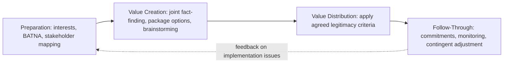

## The Mutual Gains Approach

### Overview

The Mutual Gains Approach (MGA) is a structured, interest-based negotiation methodology developed primarily at the MIT-Harvard Public Disputes Program and articulated systematically by Lawrence Susskind, Sarah McKearnan, and others (notably in Susskind and Cruikshank's *Breaking the Impasse* and later *Breaking Robert's Rules*). It extends the interest-based logic of principled negotiation into a repeatable, phase-based process aimed explicitly at maximizing joint value before dividing it, with particular prominence in multi-party, public-policy, environmental, and complex organizational negotiations where many stakeholders and technical issues are involved simultaneously.

### Core Premise

**Key Points**

- MGA is built on the claim that most negotiations are **not purely zero-sum**: because parties typically value different issues differently, value can often be created (not merely claimed) through joint problem-solving before the parties divide whatever surplus has been generated.
- The approach explicitly separates **value creation** (expanding the total available outcome through trade-offs and joint problem-solving) from **value distribution** (allocating the created value between parties), sequencing creation before division to avoid prematurely truncating the possibility set.
- MGA assumes negotiators can pursue their own interests assertively while simultaneously seeking outcomes that also serve the other party's legitimate interests — framed as a rejection of the false dichotomy between being "hard" (competitive) or "soft" (accommodating) negotiators.
- It is explicitly process-oriented: much of its distinctive content concerns *how* a negotiation (particularly a multi-party one) should be structured and facilitated, not only what substantive stance to take.

### The Four-Phase MGA Process

**Key Points**

1. **Preparation** — each party (and, in facilitated multi-party contexts, a neutral convener) clarifies interests, alternatives, and likely areas of value-creating trade before joint sessions begin.
2. **Value Creation** — parties jointly generate options and explore trade-offs across multiple issues without prematurely committing, explicitly using differences in priorities across issues to construct superior joint packages.
3. **Value Distribution** — once the set of jointly efficient options has been identified, parties negotiate over how the created value is allocated, ideally using previously agreed legitimacy criteria to guide a fair division.
4. **Follow-Through** — implementation planning, commitment-drafting, and mechanisms for monitoring compliance and handling changed circumstances after the agreement is reached, treated as integral to the negotiation rather than a separate downstream administrative task.

### Preparation Phase

**Key Points**

- Each party maps its own interests (substantive, procedural, and relationship-based), estimates the counterpart's likely interests, and assesses its BATNA, closely paralleling the preparation logic of the Seven Elements Framework.
- In multi-party or public-dispute contexts, preparation often includes a **stakeholder assessment** or **conflict assessment**, typically conducted by a neutral third party, to map the full set of interested parties, their interests, and potential coalitions before convening joint sessions.
- Groundwork is laid for **joint fact-finding**: identifying technical or factual disputes (e.g., disagreement over environmental impact data) that can be resolved through agreed neutral expertise rather than adversarial dueling-expert dynamics later in the process.

### Value Creation Phase

**Key Points**

- Techniques emphasized include **package deals across multiple issues** (rather than issue-by-issue sequential bargaining, which tends to convert every issue into a zero-sum contest), **contingent agreements** (terms that adapt automatically to uncertain future conditions, allowing parties with different risk tolerances or different probability estimates to each get favorable terms under their expected scenario), and **brainstorming with an explicit no-commitment rule** to prevent premature evaluation from suppressing creative options.
- **Joint fact-finding** is a hallmark MGA technique: rather than each side commissioning its own experts to produce dueling technical claims, parties jointly select or fund neutral experts and agree in advance on the process for resolving technical uncertainty, reducing a common source of protracted deadlock in technical or scientific disputes.
- A skilled facilitator or mediator (common in MGA's public-dispute applications) manages the value-creation phase to prevent early positional anchoring and to ensure quieter or less powerful stakeholders' interests are surfaced.
- The value-creation phase explicitly resists the temptation to move immediately to compromise ("split the difference") before the full range of joint-value options has been explored, since premature compromise on positions can foreclose superior integrative solutions.

### Value Distribution Phase

**Key Points**

- Distribution is approached using **objective/legitimacy criteria** agreed upon (ideally) before parties know how those criteria will favor one side or another — a technique intended to reduce self-serving bias in criteria selection.
- Common distributive mechanisms discussed in the MGA literature include equal division, proportional allocation based on contribution or need, and precedent-based allocation drawing on comparable prior agreements.
- MGA explicitly acknowledges that value distribution retains a **genuinely distributive, sometimes adversarial character** even after successful joint value creation — the approach does not claim to eliminate all distributive tension, only to ensure it is negotiated over a larger and better-understood pie.
- Sequencing distribution after (not before or during) value creation is treated as important because premature distributive bargaining triggers positional defensiveness that suppresses the information-sharing joint value creation requires.

### Follow-Through Phase

**Key Points**

- MGA treats implementation planning as a core negotiation output, not an afterthought: commitments are drafted for operability and monitored compliance, echoing the "Commitments" element of the Seven Elements Framework.
- **Contingent and adaptive agreement mechanisms** are used to handle situations where full agreement on every implementation detail is not achievable at signing, allowing the agreement to specify a process for resolving future disputes rather than requiring every contingency to be pre-negotiated.
- In multi-party public-dispute contexts, follow-through often includes formal monitoring bodies or periodic joint review sessions, reflecting the higher coordination complexity and lower unilateral enforceability typical of multi-stakeholder agreements relative to bilateral commercial contracts.

### MGA in Multi-Party and Public Dispute Contexts

**Key Points**

- MGA has been particularly influential in **environmental and public-policy dispute resolution** (e.g., siting disputes, natural resource management, regulatory negotiation), where the number of stakeholders, technical complexity, and absence of a single clear counterpart make simple bilateral bargaining frameworks insufficient.
- **Neutral conveners and facilitators** play a larger structural role in MGA-style multi-party processes than in most bilateral commercial negotiation frameworks, managing process design, stakeholder identification, and joint fact-finding logistics.
- **Single-text mediation** (a neutral drafts and iteratively revises a single proposed agreement text based on feedback from all parties, rather than parties exchanging competing draft proposals) is a commonly associated procedural technique in MGA-influenced multi-party processes, historically prominent in the Camp David Accords negotiation process.
- Coalition dynamics among multiple parties with partially overlapping interests require additional preparation beyond the two-party Seven Elements-style analysis, since value-creating trades may need to satisfy more than two parties' interest profiles simultaneously.

### Illustrative Example

**Example**

A regional water authority, an agricultural association, and an environmental advocacy group are negotiating a multi-year water allocation agreement. Rather than immediately bargaining over the total volume each party receives (a zero-sum framing), a neutral facilitator runs a joint fact-finding process to establish an agreed hydrological model of available supply under different rainfall scenarios (resolving a previously disputed technical question). In the value-creation phase, the parties discover that the agricultural association values *predictability* across years more than raw volume, while the environmental group prioritizes *minimum flow guarantees* during specific spawning seasons over total annual volume, and the water authority prioritizes *administrative simplicity*. This allows construction of a contingent, tiered allocation agreement: guaranteed minimum environmental flows during critical periods, a predictable multi-year baseline allocation for agriculture with automatic scaling rules tied to the jointly agreed hydrological model (rather than annual renegotiation), and a single standardized administrative process for the water authority — a package that outperforms any single-issue volume compromise for all three parties.

### Diagram: MGA Four-Phase Process Flow

### Comparison to Related Frameworks

**Key Points**

- MGA shares its interest-based, principled foundation with the Seven Elements Framework and *Getting to Yes*, but is distinguished by its explicit four-phase process structure and its strong emphasis on multi-party and facilitated public-dispute applications.
- Relative to purely distributive or positional bargaining models, MGA's central methodological contribution is the deliberate temporal separation of value creation from value distribution, paired with concrete techniques (joint fact-finding, contingent contracts, single-text mediation) for executing each phase.
- MGA is often taught alongside **integrative bargaining** theory more broadly (which supplies the underlying economic logic for why trades across differently-valued issues can create joint surplus) and **ZOPA/bargaining-zone analysis** (which quantifies the distributive phase once value has been created).

### Practical Application

**Key Points**

- Resist moving directly to distributive bargaining (e.g., "let's just split it") before a genuine value-creation phase has explored multi-issue trade-offs.
- In technically disputed negotiations, propose joint fact-finding with a mutually selected neutral expert before allowing dueling unilateral expert claims to harden positions.
- Agree on distributive legitimacy criteria before parties know precisely how those criteria will affect the final split, to reduce self-serving criteria selection.
- Build implementation and monitoring provisions into the agreement itself, including contingent adjustment mechanisms for foreseeable future uncertainty, rather than treating signing as the negotiation's endpoint.
- In multi-party contexts, invest early in stakeholder mapping and, where appropriate, engage a neutral facilitator to manage process design and single-text drafting.

### Related Topics

- The Seven Elements Framework
- Integrative Bargaining and Value Creation Techniques
- Joint Fact-Finding and Technical Dispute Resolution
- Single-Text Mediation Procedure
- BATNA and Reservation Price Analysis
- Multi-Party Negotiation and Coalition Dynamics
- Contingent Contracts and Adaptive Agreement Design