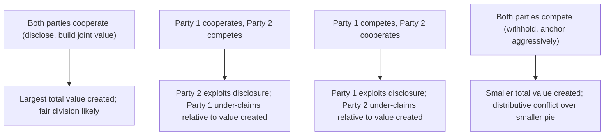

## The Negotiator's Dilemma: Creating Versus Claiming Value

### Overview

The Negotiator's Dilemma, formalized primarily by David Lax and James Sebenius in *The Manager as Negotiator* (1986), describes a structural tension inherent in nearly all negotiations: the behaviors most effective for **creating value** (open information-sharing, honest disclosure of interests and priorities) are largely the opposite of the behaviors most effective for **claiming value** (strategic information withholding, anchoring, competitive pressure). Because negotiators cannot fully separate these two modes within the same interaction, every negotiation involves an underlying strategic tension about how much to cooperate versus how much to compete, independent of the parties' substantive positions on the issues themselves.

### The Core Structural Tension

**Key Points**

- **Value creation** requires parties to reveal enough about their true interests, priorities, and constraints for integrative, mutually beneficial trade-offs to be identified (paralleling the value-creation logic in the Mutual Gains Approach and integrative bargaining more broadly).
- **Value claiming** rewards strategic behavior: overstating the importance of issues one does not actually prioritize (to extract concessions elsewhere), understating one's true reservation price, and using competitive tactics such as anchoring and limited concessions to capture a larger share of whatever value exists.
- The dilemma arises because a negotiator who **discloses honestly to enable value creation** becomes vulnerable to a counterpart who **exploits that disclosure to claim a disproportionate share** of the resulting value — meaning cooperative, information-sharing behavior carries real strategic risk, not merely a hypothetical one.
- This is frequently modeled using **game-theoretic logic similar to the Prisoner's Dilemma**: both parties are structurally better off if both cooperate (share information, create maximum joint value, then divide it reasonably) than if both compete (withhold information, anchor aggressively, achieve a smaller total pie), but each party's individually rational move, absent trust or enforceable commitment, can be to compete regardless of what the other does, since competing protects against exploitation and offers upside if the other cooperates. [Inference] The precise payoff structure and rationality of unilateral competing versus cooperating depend heavily on the specific negotiation's information conditions, repeated-game context, and each side's actual risk tolerance, and should not be treated as a literal, universal Prisoner's Dilemma payoff matrix in every negotiation.

### Why the Dilemma Cannot Be Fully "Solved"

**Key Points**

- Lax and Sebenius argue the tension is **structural, not merely tactical** — it cannot be eliminated by better technique alone, because the very act of creating value (through honest interest disclosure) inherently creates the informational conditions under which value can be claimed unfairly.
- Purely cooperative strategies (full, unconditional disclosure) risk **exploitation** by a counterpart willing to behave competitively; purely competitive strategies (no disclosure, aggressive anchoring) risk **value destruction** through failure to identify available integrative trades, potentially leaving both parties worse off than a more cooperative approach would have achieved.
- Because most negotiators cannot verify in advance whether a counterpart will reciprocate cooperative behavior, negotiators typically operate under **genuine uncertainty about which mode the situation calls for** at any given moment, and skilled negotiators are distinguished partly by their ability to manage this uncertainty adaptively rather than by resolving it definitively.

### Managing the Dilemma in Practice

**Key Points**

- **Conditional and reciprocal disclosure**: rather than fully disclosing interests unconditionally, negotiators can disclose incrementally and reciprocally, matching the counterpart's level of openness and adjusting if the counterpart appears to be exploiting disclosed information (a strategy structurally related to "tit-for-tat" strategies studied in repeated-game theory).
- **Selective and strategic transparency**: sharing information about interests that carries low risk of exploitation (e.g., priorities on issues where interests are likely aligned or where the disclosure primarily helps identify trades rather than reveal a reservation price) while remaining more guarded about information with high exploitation value (e.g., one's actual walk-away point).
- **Building trust incrementally through small cooperative signals**: low-stakes cooperative moves early in a negotiation or relationship can test and build the trust needed to justify more extensive disclosure later, particularly relevant in repeated or relationship-based negotiation contexts.
- **Using neutral third parties or mediators**: a mediator can sometimes receive confidential information from both sides and identify integrative trade opportunities without either party having to disclose sensitive information directly to a self-interested counterpart, partially decoupling value creation from the exploitation risk of direct mutual disclosure.
- **Structuring the negotiation to reduce the payoff to competing**: techniques such as agreeing on objective legitimacy criteria in advance (see the Seven Elements Framework) or committing to joint fact-finding can reduce the strategic advantage available from purely competitive information withholding.
- **Assessing the relationship's repeated-game character**: in long-term or repeated relationships, the shadow of future interactions increases the cost of exploiting a counterpart's disclosure in the current negotiation, shifting the practical calculus toward more cooperative behavior than in one-shot, purely transactional encounters.

### The Dilemma's Relationship to Broader Negotiation Strategy

**Key Points**

- The Negotiator's Dilemma provides the theoretical underpinning for why frameworks like the Mutual Gains Approach explicitly sequence value creation *before* value distribution — attempting to secure the benefits of joint information-sharing before shifting into a more overtly distributive, claiming-oriented phase.
- It also explains a common empirical finding in negotiation research: negotiators who are exclusively trained in either purely cooperative or purely competitive tactics tend to underperform relative to negotiators capable of **shifting between modes** based on read of the situation and the counterpart's demonstrated behavior.
- The dilemma underlies why **reputation** matters significantly in negotiation: a negotiator or organization known for exploiting disclosed information in past negotiations will find future counterparts less willing to disclose, structurally reducing the value-creation potential available to them in subsequent deals — an important consideration for negotiators operating in a given industry or community repeatedly over time.

### Illustrative Example

**Example**

Two companies are negotiating a joint licensing and distribution agreement. Company A privately places very high value on a fast go-to-market timeline and low priority on exclusivity terms; Company B privately places high value on exclusivity and lower priority on speed. If both disclose these priorities honestly, an integrative trade is straightforward: Company A gets an accelerated timeline, Company B gets exclusivity, and both are better off than under a compromise on both dimensions. However, Company A's negotiator, aware that revealing the urgency of the timeline could allow Company B to extract other concessions (claiming value from the disclosed vulnerability), initially withholds this information and instead makes a competitive opening demand on multiple unrelated terms. This slows the process and risks the parties settling for a mediocre single-issue compromise rather than discovering the high-value trade — illustrating the dilemma directly: full disclosure would have unlocked the best joint outcome, but was individually risky, while the resulting caution reduced the value ultimately created.

### Diagram: Payoff Structure of the Negotiator's Dilemma

### Comparison to Related Concepts

**Key Points**

- Directly parallels and provides the game-theoretic foundation for the **value creation vs. value distribution** sequencing found in the Mutual Gains Approach, and for the "generate options before committing" principle in the Seven Elements Framework's Options element.
- Related to but distinct from the general **integrative vs. distributive bargaining** dichotomy: the Negotiator's Dilemma specifically addresses the *strategic risk of information disclosure* within a single negotiation, whereas integrative/distributive bargaining more broadly describes the negotiation's overall issue structure (whether multiple differently-valued issues exist at all).
- Related to **repeated-game and reputation effects** in game theory and to trust-building literature in negotiation, since the practical resolution strategies (conditional disclosure, incremental trust-building) draw directly on repeated-game reasoning.

### Practical Application

**Key Points**

- Before disclosing sensitive interest information, assess the exploitation risk specifically (what could the counterpart do with this information against me) rather than defaulting to either full transparency or full opacity as a blanket policy.
- Use incremental, reciprocal disclosure and monitor whether the counterpart reciprocates; adjust the pace and extent of further disclosure based on observed behavior rather than a fixed pre-committed level of openness.
- Where available, use a neutral mediator or joint fact-finding process to capture value-creation benefits while reducing direct exploitation exposure.
- In repeated or reputational contexts, factor the long-term reputational cost of exploiting a counterpart's disclosure into the short-term calculus of whether to claim aggressively in the current negotiation.
- Recognize that excessive caution (pure value-claiming behavior) carries its own cost: failing to disclose enough to identify integrative trades can leave substantial joint value uncreated and unclaimed by anyone.

### Related Topics

- The Mutual Gains Approach
- Integrative vs. Distributive Bargaining
- Game Theory Applications in Negotiation (Prisoner's Dilemma, Repeated Games)
- Trust Building and Reciprocity Strategies in Negotiation
- Anchoring and Information Control Tactics
- Reputation Effects in Repeated Negotiation
- The Seven Elements Framework