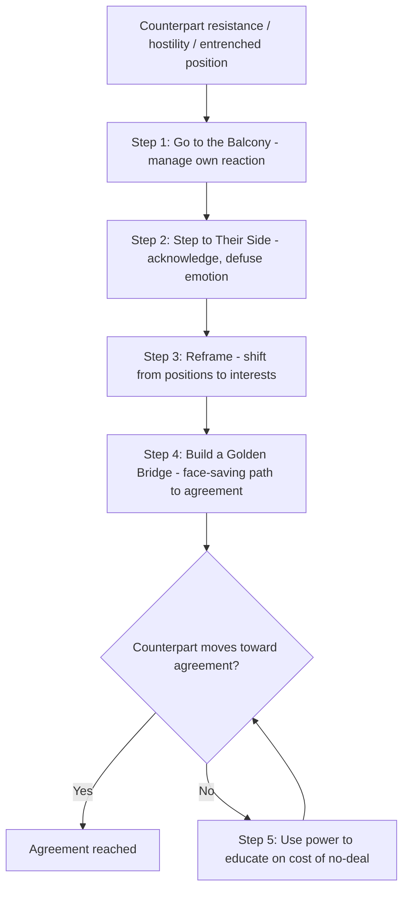

## Getting Past No: Handling Difficult Counterparts

### Overview

*Getting Past No: Negotiating in Difficult Situations* (William Ury, 1991) extends the principled-negotiation approach from *Getting to Yes* to address a distinct problem: what to do when the counterpart is uncooperative, entrenched in positional bargaining, hostile, or otherwise unwilling to engage constructively. Rather than proposing a competing negotiation philosophy, Ury frames the book's central contribution as a **five-step method for breakthrough negotiation**, designed to be used unilaterally by one party even when the counterpart refuses to reciprocate cooperative behavior — directly addressing a practical gap left by frameworks that assume both sides are willing participants in joint problem-solving.

### Core Premise: Breakthrough Negotiation

**Key Points**

- Ury's central claim is that a negotiator does not need the counterpart's cooperation to begin moving a stuck negotiation forward; the five-step method can be executed unilaterally, working *with* the difficult counterpart's resistance rather than trying to overpower it directly.
- The method is built around the metaphor of **not pushing back against resistance, but going around it** — comparable to a martial-arts framing (Ury explicitly draws on aikido) in which the counterpart's own force or position is redirected rather than met with equal and opposite force.
- Difficult counterpart behavior is treated as typically rooted in one of a few underlying drivers: strong emotion (anger, fear, distrust), entrenched position-taking as a face-saving or habitual tactic, dissatisfaction that the deal doesn't meet a perceived interest, or a genuine belief that a competitive/hardball approach is the only viable strategy — and each driver calls for a different unilateral response.

### The Five-Step Breakthrough Method

**Key Points**

1. **Go to the Balcony** — manage one's own reactive emotional response before engaging further, creating psychological distance ("going to the balcony") to observe the negotiation as if from outside rather than reacting impulsively to provocation.
2. **Step to Their Side** — actively defuse the counterpart's negative emotion and resistance by listening, acknowledging their perspective, and agreeing wherever honestly possible, without conceding substantive ground.
3. **Reframe** — redirect the conversation from positions and personal attacks back toward the underlying problem and interests, changing the game the counterpart thinks they are playing without directly confronting or rejecting their stated position.
4. **Build Them a Golden Bridge** — help the counterpart move toward agreement in a way that allows them to save face and feel the outcome (or at least the process of reaching it) was partly their own idea, rather than a capitulation.
5. **Use Power to Educate, Not Escalate** — if the counterpart still resists, use one's BATNA and other sources of power to show the costs of not agreeing, framed as informing the counterpart of reality rather than as a punitive attack intended to defeat them.

### Step 1: Go to the Balcony

**Key Points**

- The purpose is to interrupt the natural human tendency to react to provocation (attack, counter-attack, or capitulate under pressure) by deliberately pausing before responding.
- Practical techniques include naming the tactic being used internally ("this is a pressure tactic, not new information"), taking a physical or temporal pause (requesting a break, counting before responding), and preparing scripted neutral responses in advance for anticipated provocations.
- This step functions as an emotional regulation technique specifically applied to negotiation contexts, allowing the negotiator to respond deliberately rather than reactively to anger, blame, or aggressive tactics.

### Step 2: Step to Their Side

**Key Points**

- Involves active listening and explicit acknowledgment of the counterpart's perspective, feelings, and competence, without necessarily agreeing with their substantive position.
- **Agree without conceding**: finding genuine points of agreement (on facts, on shared goals, on the legitimacy of a concern) that reduce the counterpart's defensiveness while reserving disagreement for the substantive issues that actually require it.
- The underlying mechanism is that acknowledgment reduces the emotional charge driving positional entrenchment, making the counterpart more receptive to subsequent reframing, since much positional rigidity is sustained by unaddressed emotion (feeling unheard, disrespected, or threatened) rather than by the substance of the position itself.

### Step 3: Reframe

**Key Points**

- Reframing redirects attention from **positions and attacks** back to **interests and the problem**, often through a specific reframing technique: asking interest-revealing questions ("why do you need that?", "what would happen if...?", "what makes that fair?") rather than directly rebutting the counterpart's stated position.
- Ury emphasizes treating the counterpart's attacks or hardball tactics as **problems to be solved jointly** rather than as personal assaults to be defended against — reframing "you are being unreasonable" into "how can we solve this problem together."
- Silence is identified as an underused reframing tool: allowing an aggressive or unreasonable statement to sit without immediate rebuttal can prompt the counterpart to reconsider or elaborate, rather than escalating a direct confrontation.

### Step 4: Build Them a Golden Bridge

**Key Points**

- Recognizes that counterparts often resist agreement not purely because the substance is unacceptable, but because **agreeing feels like losing** — a face-saving or psychological barrier distinct from the substantive merits.
- Practical techniques include: involving the counterpart in shaping the final solution (so it is not perceived as being imposed), meeting unaddressed interests that are not yet satisfied, helping the counterpart save face with their own constituents or superiors, and slowing the pace to allow the counterpart time to adjust psychologically to a changing position.
- The "golden bridge" metaphor, attributed to the ancient military strategist Sun Tzu's advice to leave a retreating enemy an escape route, is applied here to negotiation: making it easy, not humiliating, for the counterpart to move from their entrenched position to agreement.

### Step 5: Use Power to Educate, Not Escalate

**Key Points**

- If the counterpart remains unwilling to move after the first four steps, Ury's final step involves using legitimate power (a strong BATNA, external legitimacy standards, or the consequences of non-agreement) to demonstrate the cost of continued impasse — but framed as **education about reality**, not as an attack intended to defeat or humiliate the counterpart.
- Distinguishes this step explicitly from escalatory hardball tactics: the goal is to help the counterpart see that agreement serves their own interests better than the alternative, not to "win" a contest of wills, since a counterpart who feels attacked is more likely to dig in further rather than reconsider.
- This step relies on genuine, credible power (a real, demonstrable BATNA) rather than bluffing, since a bluff that is called can destroy credibility for the remainder of the relationship.

### Addressing the "No" Directly

**Key Points**

- Ury frames different forms of "No" as diagnostic signals rather than simple rejections: a "No" driven by unmet emotional needs calls for Step 2 (Step to Their Side); a "No" driven by a misunderstanding of interests calls for Step 3 (Reframe); a "No" driven by fear of losing face calls for Step 4 (Golden Bridge); and a persistent "No" despite genuine efforts on the prior steps may require Step 5.
- The five steps are explicitly **not strictly linear** in practice — a negotiator may cycle back to an earlier step (e.g., returning to Step 1 to regain composure) if new provocation or emotional escalation occurs mid-process.

### Illustrative Example

**Example**

A vendor's negotiator is told bluntly by a client's procurement lead: "Your price is outrageous, and honestly I think you're trying to take advantage of us." Rather than defending the price immediately (which would likely trigger further entrenchment), the negotiator first internally recognizes this as a pressure tactic and takes a brief pause before responding (**Balcony**). They then acknowledge the client's frustration directly: "I can see budget pressure is a real concern on your end, and I want to understand that better" (**Step to Their Side**), without agreeing that the price is unfair. They then ask a reframing question: "Can you walk me through what budget range would work, and what's driving that constraint?" (**Reframe**), shifting from a debate about whether the price is "fair" in the abstract to a concrete discussion of the client's actual budget interest. This surfaces that the client's real constraint is *this fiscal year's* budget ceiling, not the total contract value — allowing the negotiator to propose a phased payment structure across two fiscal years that preserves the total contract value while fitting the client's stated constraint, letting the client present the compromise internally as a win they helped shape (**Golden Bridge**).

### Diagram: The Five-Step Breakthrough Method

### Comparison to Related Frameworks

**Key Points**

- *Getting Past No* is explicitly positioned as a companion to *Getting to Yes*: where the earlier work assumes a counterpart at least willing to engage in joint problem-solving, this method addresses the case where that willingness must first be cultivated unilaterally.
- Step 1 (Go to the Balcony) parallels emotional-regulation and de-escalation techniques discussed generally in cross-cultural conflict management, but is framed here as a domain-general skill applicable regardless of whether the difficulty stems from cultural misunderstanding, personality, or deliberate hardball tactics.
- Step 5's emphasis on power "to educate, not escalate" distinguishes the method from purely competitive/positional hardball tactics literature, which treats power primarily as a tool for extracting concessions rather than for demonstrating shared reality.

### Practical Application

**Key Points**

- Prepare likely provocations in advance and script a neutral, non-reactive response, rather than relying on in-the-moment composure alone under real pressure.
- Practice acknowledgment language that validates the counterpart's perspective or feelings without conceding the substantive point in dispute.
- When facing a flatly rejected proposal, default first to interest-revealing questions rather than immediate justification or counter-argument.
- Design proposed solutions with the counterpart's face-saving needs explicitly in mind, particularly when the counterpart must justify the outcome to their own constituents, superiors, or public position.
- Verify that any power used in Step 5 is genuine and credible before deploying it, since an empty threat that is exposed can permanently damage negotiating credibility.

### Related Topics

- Getting to Yes and Principled Negotiation Foundations
- Emotional Regulation and De-Escalation Tactics in Negotiation
- Managing Cross-Cultural Misunderstanding and Conflict
- Face-Saving Techniques and Golden Bridge Construction
- BATNA and the Ethical Use of Negotiating Power
- Hardball Tactics and Counter-Tactics in Competitive Negotiation
- Active Listening and Reframing Techniques