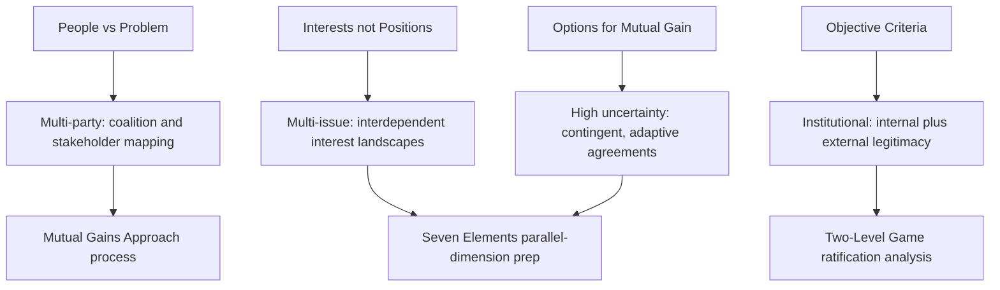

## Principled Negotiation in Complex Environments

### Overview

Principled negotiation, as originally formulated in Fisher, Ury, and Patton's *Getting to Yes*, was developed largely around relatively bounded, two-party, single-round negotiation scenarios. When applied to **complex environments** — negotiations involving many parties, multiple interdependent issues, extended time horizons, high uncertainty, or nested organizational and political structures — the four core principles remain applicable but require substantial extension and adaptation. This item addresses how principled negotiation's foundational logic (interests over positions, options for mutual gain, objective criteria, separating people from the problem) scales, and where it strains, in multi-party, multi-issue, high-uncertainty, and institutionally embedded negotiation contexts.

### The Four Core Principles as a Baseline

**Key Points**

- **Separate the people from the problem**: address relational and emotional dynamics independently from substantive disagreement, so that vigorous debate over substance does not damage or become entangled with the interpersonal relationship.
- **Focus on interests, not positions**: identify the underlying needs driving each stated demand, since apparently incompatible positions frequently mask compatible or even shared interests.
- **Generate options for mutual gain**: invent a wide range of possible agreements before evaluating or committing to any of them, using differences in priorities across issues to create integrative trades.
- **Insist on objective criteria**: resolve disagreements over what is fair using external, legitimate standards rather than a pure contest of will or relative power.
- These four principles were designed as a **general-purpose foundation**, and complex-environment applications extend rather than replace them; the core diagnostic and process logic still applies, but each principle must be operationalized differently at scale.

### Complexity Dimension 1: Multiple Parties

**Key Points**

- With more than two parties, "the people" (Principle 1) becomes a **network of relationships** rather than a single dyad, and "interests" (Principle 2) becomes a landscape of potentially overlapping, competing, and cross-cutting interests across all parties simultaneously, not a simple two-sided comparison.
- **Coalition dynamics** become a first-order strategic concern: parties with partially aligned interests may form blocs to increase collective bargaining power, and coalition formation/dissolution can shift mid-negotiation as issues and proposed options change.
- **Stakeholder mapping** (frequently borrowed from the Mutual Gains Approach's public-dispute methodology) becomes a necessary preparation step distinct from simple two-party interest analysis: identifying all affected or influential parties, their interests, their relative power, and their likely coalition alignments before substantive negotiation begins.
- **Single-text mediation** and **neutral facilitation** become more prominent tools in multi-party contexts, since directly negotiating draft language among many parties tends to be procedurally unwieldy; a neutral drafter iteratively revising one shared text based on feedback from all parties reduces this complexity.
- Objective criteria (Principle 4) must often be established through **joint agreement across all parties** before they can function as genuinely legitimate standards, which is harder to achieve with more parties and more divergent starting assumptions about fairness.

### Complexity Dimension 2: Multiple, Interdependent Issues

**Key Points**

- Generating options for mutual gain (Principle 3) becomes substantially more combinatorially complex as the number of issues grows, since integrative trade-offs depend on identifying which specific issue-pairs each party values differently — a search space that grows rapidly with issue count.
- **Package deals and issue linkage** become central techniques: bundling multiple issues into a single proposed package allows trades that would be impossible if each issue were negotiated to conclusion sequentially and independently (sequential single-issue negotiation tends to convert every issue into a zero-sum contest).
- **Contingent agreements**, in which specific terms adjust automatically based on future conditions, become increasingly valuable as issue interdependency and uncertainty about future states increase, allowing parties with different risk tolerances or probability estimates to each secure favorable terms under their own expected scenario.
- Objective criteria may need to be **issue-specific**: a single fairness standard rarely applies uniformly across a large set of heterogeneous issues, requiring negotiators to identify or construct distinct legitimacy benchmarks for each significant issue category.

### Complexity Dimension 3: High Uncertainty and Long Time Horizons

**Key Points**

- In environments with substantial factual or scientific uncertainty (e.g., environmental, technical, or long-horizon commercial negotiations), disagreement about the underlying facts can masquerade as, or become entangled with, positional disagreement about interests — requiring **joint fact-finding** as an extension of the interest-based approach specifically suited to complex, technically uncertain environments.
- **Adaptive and contingent agreement structures** allow principled negotiation's option-generation and legitimacy principles to function even when neither party can specify with confidence what future conditions will hold, by building pre-agreed adjustment mechanisms into the agreement itself rather than requiring every contingency to be resolved at signing.
- Long time horizons increase the importance of **follow-through and implementation monitoring** as an extension of Principle 3 (options) and Principle 4 (criteria): options generated and criteria agreed upon at signing must remain interpretable and enforceable years into an agreement's life, which requires more deliberate commitment-drafting discipline than short-horizon transactional negotiations.
- Uncertainty also complicates BATNA analysis (a foundational input to principled negotiation, formalized further in the Seven Elements Framework), since alternatives available at signing may change substantially over a long implementation horizon, requiring periodic BATNA reassessment built into the relationship rather than a single point-in-time calculation.

### Complexity Dimension 4: Institutional and Organizational Embedding

**Key Points**

- In negotiations conducted on behalf of organizations, governments, or institutions, the negotiator at the table frequently does not hold unilateral authority to commit, introducing an internal, organizational-level negotiation (aligning internal stakeholders, securing internal ratification) that runs parallel to the external negotiation — directly paralleling the **two-level game** structure discussed in diplomatic negotiation.
- **Separating the people from the problem** (Principle 1) becomes more complex when "the people" includes not only the counterpart's representative but also that representative's internal constituents, whose interests, incentives, and face-saving needs may diverge from the representative's own stated position at the table.
- Objective criteria (Principle 4) frequently must satisfy **both the external counterpart and internal institutional stakeholders** simultaneously — a standard that persuades the external party but cannot be justified internally (or vice versa) will not sustain a durable agreement.
- Institutional negotiations often require formal internal preparation processes (inter-agency coordination, board approval requirements, legal review) that function as an additional, embedded application of principled-negotiation logic within the negotiator's own organization before or during the external negotiation.

### Extensions and Complementary Frameworks for Complex Environments

**Key Points**

- The **Mutual Gains Approach** operationalizes principled negotiation specifically for multi-party, public-dispute contexts, adding structured phases (preparation, value creation, value distribution, follow-through) and techniques (joint fact-finding, single-text mediation, stakeholder assessment) purpose-built for the complexity dimensions above.
- The **Seven Elements Framework** provides a parallel-dimension preparation structure (Interests, Legitimacy, Relationships, Alternatives/BATNA, Options, Commitments, Communication) that scales reasonably well to complex environments by requiring separate, explicit analysis of each element for each significant party or issue cluster, rather than a single undifferentiated preparation pass.
- **Two-level game theory** (from diplomatic negotiation) provides the analytical structure for handling the internal/external negotiation dynamic that arises whenever a negotiator represents a larger institutional or political constituency.
- **Contingent contracting and adaptive agreement design** provide the mechanism for principled negotiation's option-generation and criteria principles to function coherently under high uncertainty and long time horizons, where fixed, fully specified agreements are often infeasible or excessively costly to negotiate up front.

### Illustrative Example

**Example**

A multi-year regional infrastructure negotiation involves a national government agency, a private consortium of construction and financing firms, a coalition of local municipalities, and an environmental oversight body. Positional bargaining over the total budget quickly stalls because each party has internally divergent constituents (the government agency must satisfy legislative appropriators; the consortium must satisfy its own investor syndicate; the municipalities have heterogeneous local interests). A neutral facilitator conducts a stakeholder assessment, identifies that the environmental body's core interest is long-term monitoring authority rather than specific budget allocation, and proposes a single negotiating text that separates budget allocation (addressed through a joint fact-finding process establishing agreed cost benchmarks) from a contingent environmental monitoring framework that scales oversight requirements to actual, measured environmental impact rather than requiring the parties to agree in advance on disputed impact projections. This allows each party's negotiator to secure internal (Level II) ratification separately, since each addresses their own constituents' specific interest without requiring universal agreement on every underlying factual assumption.

### Diagram: Complexity Dimensions Extending the Four Core Principles

### Practical Application

**Key Points**

- Before entering a complex, multi-party negotiation, conduct explicit stakeholder mapping and coalition analysis rather than applying two-party interest analysis to an inherently multi-party problem.
- Use package deals and contingent agreement structures deliberately when facing high issue interdependency or high uncertainty, rather than attempting to resolve every issue and every contingency through sequential, fully specified negotiation.
- Identify each represented party's internal ratification constraints (their Level II win-set) early, since institutional negotiations frequently fail not from external disagreement but from a deal that cannot survive internal approval.
- Where technical or factual uncertainty underlies apparent positional disagreement, propose joint fact-finding rather than allowing dueling unilateral technical claims to harden into positional conflict.
- Select and adapt complementary frameworks (Mutual Gains Approach for public multi-party disputes, Seven Elements for structured preparation, two-level game analysis for institutional negotiations) based on which complexity dimension is most salient in the specific negotiation at hand.

### Related Topics

- Getting to Yes and Principled Negotiation Foundations
- The Mutual Gains Approach
- The Seven Elements Framework
- Two-Level Games and Domestic Ratification Constraints (Putnam)
- Multi-Party Negotiation and Coalition Dynamics
- Joint Fact-Finding and Technical Dispute Resolution
- Contingent Contracts and Adaptive Agreement Design