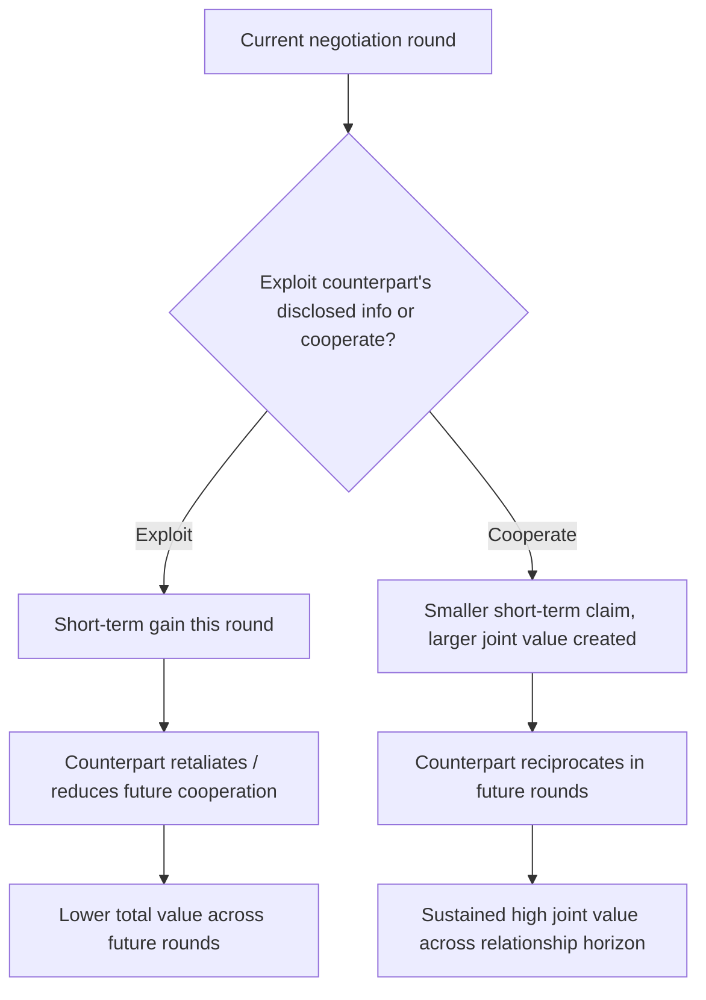

## Frameworks for Repeated and Relational Deals

### Overview

Repeated and relational negotiation frameworks address a distinct class of negotiation problems: situations in which the same parties will negotiate again in the future, or in which the negotiation occurs within an ongoing relationship (a supplier partnership, a joint venture, a long-term employment relationship, an alliance) rather than as a single, self-contained transaction. This changes the negotiation's underlying strategic logic substantially, because the parties' behavior in the current negotiation shapes not only the current outcome but also the terms, trust level, and cooperative potential of every future interaction. This item surveys the game-theoretic foundations of repeated negotiation, relational contracting theory, and the practical frameworks negotiators use to manage trust, reputation, and flexibility across an ongoing relationship.

### Why Repetition Changes Negotiation Strategy

**Key Points**

- **The shadow of the future**: in repeated interactions, each party's current behavior is disciplined by anticipated future consequences — exploiting a counterpart today can trigger retaliation, reduced cooperation, or relationship termination in future rounds, which is largely absent in genuinely one-shot transactions.
- This directly reframes the **Negotiator's Dilemma** (the tension between value-creating disclosure and value-claiming exploitation): repeated-game dynamics reduce the individual incentive to exploit disclosed information, since the reputational and relational cost of exploitation compounds across future interactions rather than being a one-time gain.
- **Game-theoretic foundations**: repeated-game theory (building on the iterated Prisoner's Dilemma literature, notably Robert Axelrod's tournament research in *The Evolution of Cooperation*) demonstrates that simple reciprocal strategies such as **tit-for-tat** (cooperate first, then mirror the counterpart's most recent move) can sustain cooperation across repeated interactions even among self-interested parties, without requiring altruism or enforceable external contracts.
- **Finite vs. indefinite horizon effects**: cooperation is theoretically harder to sustain when both parties know with certainty the relationship will end at a fixed, known point (via backward induction, the final round reduces to a one-shot game, which can unravel cooperation in preceding rounds); relationships with an uncertain or indefinite horizon better sustain the shadow-of-the-future effect that supports cooperative behavior. [Inference] The practical strength of this backward-induction unraveling effect varies with how salient the end date is to the parties and how many other reputational or institutional factors are also at play; it is a theoretical tendency, not a universal empirical rule.

### Relational Contracting Theory

**Key Points**

- **Relational contracts**, a concept developed extensively in law-and-economics and organizational theory (notably by Ian Macneil and later formalized in economic models by Baker, Gibbons, and Murphy), are agreements sustained primarily through the value of the ongoing relationship and the threat of its termination, rather than through formal legal enforceability of every specific term.
- Distinguished from **classical/discrete contracts**, which attempt to specify complete, formally enforceable terms covering all foreseeable contingencies at signing, relational contracts explicitly leave significant terms informal or incompletely specified, relying on the parties' mutual interest in preserving the relationship to govern behavior in situations the formal contract does not clearly address.
- **Self-enforcing range**: relational contract theory formalizes the idea that a relational agreement is sustainable only if the value of continuing the relationship (discounted future gains) exceeds the short-term gain available from reneging on an informal understanding in the current period — meaning relational terms are inherently bounded by how much future value is genuinely at stake.
- Relational contracts are particularly prominent in contexts where **formal contract completeness is prohibitively costly or practically infeasible** — long-term supplier relationships with unpredictable future conditions, joint ventures requiring ongoing flexible coordination, or employment relationships where every future task and expectation cannot be specified in advance.

### Building and Maintaining Trust Across Repeated Deals

**Key Points**

- **Incremental trust-building**: starting with lower-stakes agreements or smaller commitments and expanding scope and stakes as a track record of reliable performance accumulates, reducing the risk exposure of early-stage trust extension.
- **Reciprocal and conditional cooperation**: matching a counterpart's demonstrated level of cooperation (echoing tit-for-tat logic) rather than either unconditional generosity (which risks exploitation) or unconditional suspicion (which forecloses relationship-building), adjusting the level of extended trust based on observed behavior over successive interactions.
- **Reputation as a disciplining mechanism**: in industries or communities where reputational information travels among potential future counterparts (supplier networks, professional communities, repeated deal-making sectors), the reputational cost of exploiting a counterpart extends beyond the immediate relationship, further strengthening the shadow-of-the-future effect even across parties who may not interact again directly.
- **Transparent commitment mechanisms**: publicly observable or third-party-verifiable commitments (industry certifications, audited compliance reports, public track records) can substitute for purely relationship-based trust, particularly useful when a relationship is still new and insufficient history exists to rely on relational trust alone.

### Structuring Agreements for Ongoing Relationships

**Key Points**

- **Framework agreements with periodic renegotiation**: rather than attempting to fully specify a multi-year relationship in a single comprehensive contract, parties establish a framework of core principles and shared objective criteria, with specific terms (pricing, volumes, service levels) renegotiated at agreed intervals as conditions evolve.
- **Contingent and adaptive contract terms**: building automatic adjustment mechanisms (indexed pricing, volume-based tiering, renegotiation triggers tied to specified external events) into the agreement reduces the need for full contract completeness while preserving flexibility as future conditions change, directly paralleling contingent-agreement techniques used in the Mutual Gains Approach and in principled negotiation applied to high-uncertainty environments.
- **Explicit dispute resolution and renegotiation clauses**: relational agreements benefit from pre-agreed processes for handling disagreement or renegotiation requests (escalation procedures, joint review committees, mediation triggers), reducing the risk that an unaddressed dispute damages the broader relationship.
- **Governance structures for ongoing coordination**: particularly in joint ventures and strategic alliances, formal joint steering committees or regular structured review meetings function as an institutionalized channel for the continuous, low-stakes negotiation that ongoing relationships require, rather than treating negotiation as episodic.

### Managing the Tension Between Relationship and Substance

**Key Points**

- Relational negotiation carries a distinct risk: the desire to preserve the relationship can create pressure toward **excessive accommodation**, where a party avoids raising legitimate substantive concerns for fear of damaging the relationship, potentially allowing accumulated dissatisfaction to build up unaddressed.
- Principled negotiation's separation of "people from the problem" is especially important in relational contexts specifically to counteract this risk: legitimate substantive disagreement should be raised and addressed directly, using the relationship's strength as a resource for constructive resolution rather than as a reason to avoid raising the issue at all.
- **Renegotiation as a normal, expected process rather than a relationship failure**: framing periodic renegotiation of specific terms as a built-in feature of a well-structured long-term relationship (rather than as a sign the relationship or original agreement failed) helps prevent legitimate demands for adjustment from being read as bad faith or relationship breakdown.
- Long-term relational partners should periodically reassess their respective BATNAs and bargaining power, since the relative power balance underlying an initial agreement can shift substantially over a multi-year relationship, and outdated assumptions about relative leverage can produce agreements or renegotiation postures poorly calibrated to current reality.

### Illustrative Example

**Example**

A manufacturer and a key component supplier have operated under a five-year supply agreement. Rather than specifying fixed prices for the full term (infeasible given raw-material price volatility), the original agreement establishes a framework with an index-linked pricing formula tied to a published commodity benchmark, an annual joint review meeting to reassess volume forecasts, and an explicit escalation clause for disputes over quality issues. In year three, a raw-material price spike outside the range the index formula anticipated creates a genuine dispute. Because the relationship has an established track record of reciprocal cooperation (the supplier previously absorbed a short-term cost overrun without demanding immediate renegotiation, and the manufacturer subsequently extended the contract term as a reciprocal gesture), both parties treat the dispute as a legitimate renegotiation trigger rather than a relationship-threatening breach, using the pre-agreed joint review process to establish a temporary pricing adjustment rather than resorting to formal contract dispute mechanisms.

### Diagram: Shadow of the Future and Cooperative Equilibrium

### Comparison to Related Frameworks

**Key Points**

- Repeated and relational negotiation frameworks provide the strategic resolution mechanism referenced but not fully developed within the **Negotiator's Dilemma**: the dilemma explains why value-claiming exploitation is individually tempting, and repeated-game/relational-contracting theory explains the conditions under which that temptation is disciplined by future consequences.
- **Two-level game theory** (from diplomatic negotiation) and relational contracting share structural similarities in long-term institutional relationships, since both involve balancing an immediate negotiated outcome against a broader, ongoing set of constraints and future interactions.
- Relative to the **Mutual Gains Approach**'s follow-through phase, relational contracting theory provides the deeper theoretical justification for why implementation planning, contingent terms, and periodic review are not merely good practice but structurally necessary for agreements intended to govern an extended, evolving relationship.

### Practical Application

**Key Points**

- Assess early whether a negotiation is genuinely one-shot or embedded in an actual or likely repeated relationship, since this materially changes the optimal balance between competitive and cooperative tactics.
- Build framework agreements with periodic renegotiation and contingent adjustment mechanisms for long-term relationships, rather than attempting excessive up-front contract completeness in the face of genuine future uncertainty.
- Use incremental, reciprocal trust-building (small commitments first, matching demonstrated cooperation) rather than either unconditional early trust or persistent suspicion.
- Explicitly normalize periodic renegotiation as a structural feature of the relationship, using pre-agreed review processes rather than ad hoc, potentially relationship-damaging disputes.
- Periodically reassess relative BATNA and bargaining power within long-term relationships, since initial power balances often shift materially over a multi-year relationship horizon.

### Related Topics

- The Negotiator's Dilemma: Creating Versus Claiming Value
- Game Theory Applications in Negotiation (Prisoner's Dilemma, Repeated Games)
- Trust Building and Reciprocity Strategies in Negotiation
- Contingent Contracts and Adaptive Agreement Design
- Two-Level Games and Domestic Ratification Constraints (Putnam)
- The Mutual Gains Approach
- Reputation Effects in Repeated Negotiation