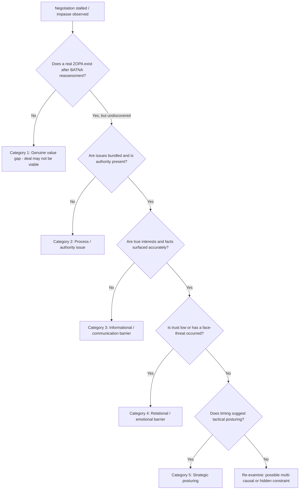

## Diagnosing the Sources of Impasse

### Overview

Negotiation impasse — a state in which parties are unable or unwilling to move toward agreement despite continued engagement — is not a single phenomenon but the surface manifestation of several structurally distinct underlying causes. Effective impasse-breaking depends on accurate diagnosis, since the appropriate intervention differs substantially depending on whether the impasse stems from a genuine lack of overlapping value, poor process design, emotional or relational breakdown, informational asymmetry, authority constraints, or strategic posturing. This item provides a diagnostic framework for distinguishing these sources before selecting a remedy.

### Why Diagnosis Precedes Remedy

**Key Points**

- Applying the wrong intervention to an impasse can worsen it: for example, pushing harder on substantive concessions when the actual blocker is a face-saving or authority constraint can deepen entrenchment rather than resolve it.
- Impasse is frequently **multi-causal**: an apparent single blocking issue often has both a substantive component and a relational, procedural, or authority-related component layered underneath it, and effective diagnosis requires separating these layers rather than treating the presenting issue as the sole cause.
- Distinguishing a **genuine lack of ZOPA** (Zone of Possible Agreement — no mutually acceptable outcome actually exists) from a **failure to find an existing ZOPA** (an overlap exists but has not been discovered or is being obscured by process, communication, or strategic factors) is the single most consequential diagnostic distinction, since only the latter is resolvable through negotiation technique.

### Category 1: Substantive/Value Gaps

**Key Points**

- **True ZOPA absence**: after accurate BATNA and reservation-price analysis on both sides, no overlap exists between what one party is willing to offer and what the other is willing to accept — in this case, no negotiation technique can manufacture an agreement, and the accurate diagnostic conclusion may be that no deal should be reached (or that one or both BATNAs need to be improved outside the negotiation itself).
- **Perceived ZOPA absence due to unexplored issues**: a real overlap may exist across a fuller set of issues than the parties have engaged with, but positional bargaining confined to a single or few issues (often price) obscures it — this is diagnosable by checking whether all potentially tradeable issues have actually been surfaced and valued by both sides.
- **Miscalibrated BATNA or reservation price**: one or both parties may be operating from an inaccurate assessment of their own alternatives (overestimating or underestimating their BATNA), producing an impasse based on a mistaken belief about where the reservation price should sit rather than a genuine value gap.
- Diagnostic technique: independently re-derive both parties' likely BATNA and reservation price using available information, and separately assess whether the full set of negotiable issues has actually been identified, before concluding a substantive gap is genuine and unbridgeable.

### Category 2: Process and Structural Issues

**Key Points**

- **Sequential, single-issue bargaining**: negotiating issues one at a time to resolution, rather than as a package, forces every issue into a zero-sum framing and can create impasse even when cross-issue trades exist that would satisfy both parties.
- **Premature anchoring or positional lock-in**: early, aggressive positional statements can create psychological and reputational commitment to a specific number or term, making subsequent movement costly even when the underlying interests would permit it.
- **Poor agenda or process design**: unclear sequencing of topics, absence of agreed ground rules, or lack of a shared understanding of the negotiation's process can produce confusion-driven impasse distinct from any substantive disagreement.
- **Authority mismatch**: the individual(s) at the table may lack the authority to commit to the terms under discussion, producing an apparent impasse that is actually a structural limitation requiring escalation to a different decision-maker rather than further substantive bargaining at the current table.
- Diagnostic technique: review whether issues have been bundled or sequenced in a way that permits integrative trades, and explicitly verify each party's actual decision-making authority before attributing stalled progress to substantive disagreement.

### Category 3: Informational and Communication Barriers

**Key Points**

- **Undisclosed or undiscovered interests**: positional bargaining can mask underlying interests that, if surfaced, would reveal an integrative trade currently invisible to both sides — a common and highly resolvable source of apparent impasse.
- **Cross-cultural or cross-linguistic distortion**: misinterpretation of tone, indirect refusal signals, or translation/interpretation compression can produce an impasse rooted in miscommunication rather than genuine substantive disagreement (see *Language, Translation, and Interpretation Challenges* and *Managing Cross-Cultural Misunderstanding and Conflict*).
- **Disputed facts or technical uncertainty**: disagreement over underlying factual or technical questions (e.g., a valuation input, a technical feasibility assessment) can present as positional deadlock when the actual disagreement is empirical and potentially resolvable through joint fact-finding rather than further bargaining.
- **Asymmetric information exploitation concerns**: a party may withhold information not because disclosure would be irrelevant, but out of a rational fear that disclosure will be exploited (the Negotiator's Dilemma), producing an impasse driven by strategic caution rather than a genuine absence of overlapping interest.
- Diagnostic technique: assess whether both parties have an accurate and shared understanding of relevant facts, and whether each party's true interests (not just stated positions) have actually been communicated and heard by the other side.

### Category 4: Relational and Emotional Barriers

**Key Points**

- **Face-threat driven entrenchment**: an unintended or perceived public face threat can produce a disproportionate relational rupture that manifests as substantive inflexibility, particularly in face-sensitive cultural or organizational contexts, even when the underlying substantive gap is small.
- **Accumulated distrust**: prior instances of perceived bad faith, missed commitments, or exploitative behavior (by either party, or by the industry/counterpart type more broadly) can create a generalized unwillingness to make the disclosures or concessions needed for progress, independent of the current negotiation's specific substance.
- **Emotional reactivity and escalation spirals**: mutual negative attribution (each side interpreting the other's behavior as hostile or bad-faith) can escalate a manageable substantive disagreement into an entrenched, emotionally charged standoff.
- **Identity and values-based conflict**: some impasses are rooted in perceived threats to identity, values, or principle (rather than tradeable material interests), which are typically far more resistant to standard integrative bargaining techniques and often require distinct approaches (acknowledgment, reframing away from zero-sum value conflict, or accepting that some values-based positions are not subject to trade-off).
- Diagnostic technique: assess the relational history and current emotional tenor of the negotiation separately from the stated substantive positions, and consider whether recent process events (a perceived slight, a broken commitment) correlate temporally with the onset of the impasse.

### Category 5: Strategic and Tactical Posturing

**Key Points**

- **Deliberate hardball tactics**: some apparent impasse is a calculated negotiating tactic (extreme anchoring, feigned walk-away threats, manufactured deadlines) intended to extract concessions, rather than a genuine blocking constraint — distinguishing genuine from tactical impasse is a core diagnostic challenge (see *Recognizing and Responding to Hardball Tactics*).
- **Testing resolve**: a party may maintain an apparently firm position specifically to test whether the counterpart will hold firm or concede, using the impasse itself as an information-gathering device about the counterpart's true reservation price.
- **External constituency signaling**: a negotiator may maintain a public hardline position primarily to satisfy their own internal constituents or superiors (a two-level game dynamic), even if privately more flexible, making the apparent impasse partly a performance for an audience beyond the table.
- Diagnostic technique: assess whether the impasse coincides with typical tactical timing patterns (near an apparent deadline, immediately after an opening offer), and consider whether the counterpart's stated inflexibility is consistent with independently assessed information about their actual BATNA and constraints.

### Diagnostic Process Summary

**Key Points**

- **Step 1 — Rule out a genuine value gap**: independently reassess both parties' BATNA, reservation price, and the full set of negotiable issues.
- **Step 2 — Check process and authority**: verify whether issues are being bundled effectively and whether the parties present have genuine decision-making authority.
- **Step 3 — Check information and communication**: assess whether true interests (not just positions) have been surfaced, whether factual/technical disputes are being conflated with positional disagreement, and whether cross-cultural or translation distortion may be contributing.
- **Step 4 — Check relational and emotional state**: assess trust levels, recent face-threat events, and whether an escalation spiral is underway independent of the substantive merits.
- **Step 5 — Check for strategic posturing**: assess whether the apparent impasse is consistent with tactical timing or an internal-constituency signaling dynamic rather than a genuine constraint.

### Illustrative Example

**Example**

A licensing negotiation appears deadlocked over royalty rate, with both sides repeating fixed positions across several sessions. Applying the diagnostic sequence: BATNA reassessment reveals both parties' actual reservation prices do overlap (ruling out Category 1). Reviewing the process reveals royalty rate has been negotiated in isolation from other terms (a Category 2 process issue). Further inquiry through paraphrase-and-confirm surfaces that the licensor's real priority is minimum guaranteed volume (an undisclosed interest, Category 3), not the headline rate itself. Additionally, a prior missed payment deadline earlier in the relationship has created residual distrust affecting the licensor's overall posture (Category 4). Correctly diagnosing this as a combination of a bundling failure and an undisclosed interest, layered on unresolved relational distrust, points toward a specific remedy: propose a package trade (a lower headline rate in exchange for a higher guaranteed minimum volume) combined with an explicit acknowledgment of the earlier payment issue and a proposed safeguard (staged payment verification) to address the residual trust deficit — rather than continuing to push on the headline rate alone.

### Diagram: Impasse Diagnostic Decision Tree

### Practical Application

**Key Points**

- Treat impasse as a diagnostic problem before a tactical one: resist the urge to immediately apply pressure, concessions, or hardball countermeasures before identifying which category (or combination) is actually driving the stall.
- Independently re-verify BATNA and reservation price assumptions for both sides whenever an impasse persists beyond what the apparent substantive gap would predict.
- Explicitly check for undisclosed interests through paraphrase-and-confirm and targeted interest-revealing questions before concluding that positions are genuinely irreconcilable.
- Separate relational/emotional repair work from substantive bargaining when a face-threat or trust breach is contributing to the impasse, rather than attempting to resolve both simultaneously.
- Maintain awareness that a counterpart's apparent inflexibility may be partly directed at their own internal constituents, which calls for a face-saving remedy rather than a purely substantive one.

### Related Topics

- ZOPA (Zone of Possible Agreement) and Bargaining Range Analysis
- Recognizing and Responding to Hardball Tactics
- Managing Cross-Cultural Misunderstanding and Conflict
- BATNA and Reservation Price Analysis
- Two-Level Games and Domestic Ratification Constraints (Putnam)
- Mediation and Third-Party Conflict Resolution Techniques
- The Negotiator's Dilemma: Creating Versus Claiming Value