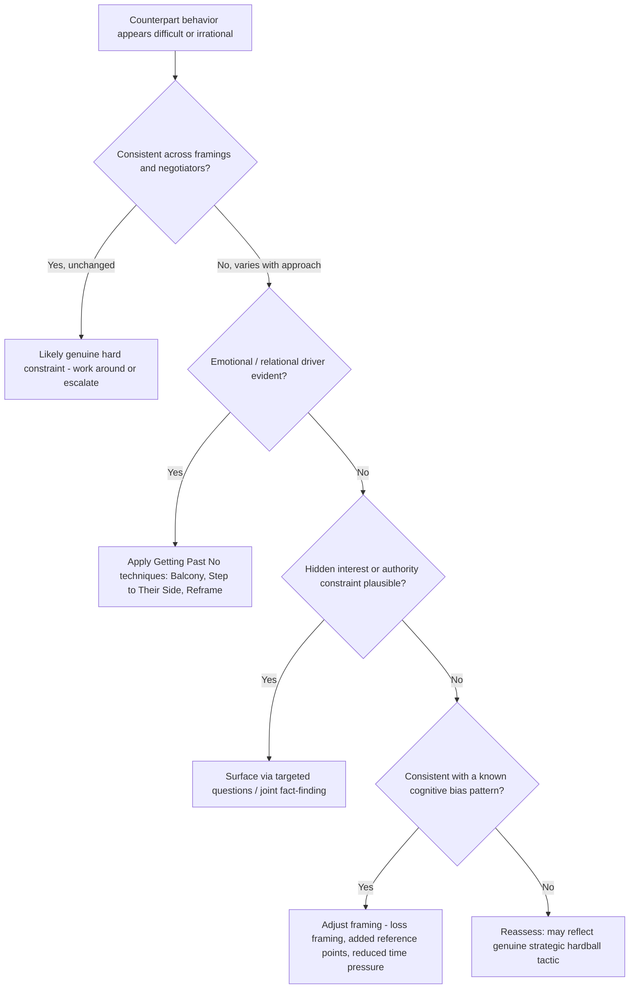

## Negotiating With Difficult or Irrational Counterparts

### Overview

Some negotiation counterparts exhibit behavior that appears difficult, erratic, or inconsistent with rational self-interest as standard negotiation theory models it — extreme positional rigidity, apparent disregard for their own BATNA, personal attacks, or decisions that seem to contradict their own stated interests. This item addresses how to distinguish genuinely non-standard or constrained decision-making from behavior that is strategically rational but difficult to read, and provides frameworks for negotiating effectively across both cases without assuming either irrationality or bad faith by default.

### Distinguishing "Difficult" From "Irrational"

**Key Points**

- **Difficult** behavior (hostility, aggressive tactics, extreme demands, personal attacks) is often strategically rational from the counterpart's perspective, even when uncomfortable to negotiate against — it may reflect a deliberate hardball approach, a cultural communication norm, or a response to perceived provocation, and should not be conflated with irrationality.
- **Apparently irrational** behavior — decisions that seem to contradict the counterpart's own material interests — frequently reflects **bounded rationality** (Herbert Simon's concept describing decision-making constrained by limited information, cognitive capacity, and time, rather than a departure from goal-directed behavior) or an **incomplete model of the counterpart's actual interests and constraints** on the observer's part, rather than genuine irrationality.
- A useful diagnostic default: assume the counterpart is pursuing a coherent goal set that is not yet fully visible, before concluding their behavior is irrational — behavior that looks irrational relative to an assumed interest set is often rational relative to a different, undisclosed or unrecognized interest set (e.g., prioritizing a relationship, an internal political consideration, or a non-monetary value that the observer has not identified).
- Genuine departures from standard rational-actor assumptions do occur and are well documented in behavioral decision research (loss aversion, anchoring effects, overconfidence, sunk-cost effects — see Kahneman and Tversky's prospect theory and related behavioral economics literature), and should be considered as a distinct explanatory category once bounded rationality and hidden-interest explanations have been reasonably ruled out.

### Common Underlying Drivers of "Difficult" Behavior

**Key Points**

- **Positional habit or training**: some counterparts default to hardball, positional tactics not from a considered strategic calculation but from prior training, organizational culture, or habit, meaning the behavior may be more malleable to reframing than it initially appears.
- **Emotional drivers**: anger, fear, distrust, or perceived disrespect can drive entrenched or aggressive behavior that is not calculated to serve the counterpart's material interests but instead reflects an unaddressed emotional state (directly addressed by Ury's "Go to the Balcony" and "Step to Their Side" techniques from *Getting Past No*).
- **Authority and internal constituency pressure**: a counterpart's apparent rigidity may reflect internal pressure from superiors, board members, or political constituents (a two-level game dynamic) rather than the visible negotiator's own preferences or assessment.
- **Cultural or communication-norm differences**: behavior read as "difficult" through one cultural lens (e.g., extended silence, indirect refusal, or highly expressive emotional display) may be a standard communication pattern within the counterpart's own cultural framework (see *Managing Cross-Cultural Misunderstanding and Conflict*).
- **Genuine cognitive biases**: documented biases such as loss aversion (weighing losses more heavily than equivalent gains), the endowment effect (overvaluing what one currently possesses), and escalation of commitment (continuing a losing course of action to justify prior investment) can produce behavior that is internally consistent with a bias-driven decision process but appears irrational against a purely rational-actor benchmark.

### Diagnostic Approach

**Key Points**

- **Behavioral vs. dispositional framing**: describe observed behavior in specific, contextualized terms ("has rejected three consecutive proposals without counter-offering") rather than dispositional labels ("they are irrational" or "they are acting in bad faith"), since dispositional framing forecloses further diagnostic inquiry and biases subsequent interpretation of new information.
- **Generate alternative explanations before defaulting to irrationality**: for any apparently irrational move, explicitly consider bounded-rationality explanations (limited information, time pressure, cognitive overload), hidden-interest explanations (an undisclosed priority the behavior actually serves), and authority-constraint explanations (an internal audience the behavior is directed at) before concluding the behavior reflects a genuine departure from goal-directed reasoning.
- **Consult third parties or local/cultural expertise** when a plausible non-irrational explanation is not apparent, since an outside perspective familiar with the counterpart's context, culture, or organization can often surface an explanation not visible from within the negotiation itself.
- **Test hypotheses through targeted questions** rather than assuming: interest-revealing and clarifying questions (echoing the reframing technique from *Getting Past No*) can directly surface the actual driver behind apparently irrational behavior rather than requiring the negotiator to infer it indirectly.

### Techniques for Negotiating With Difficult Counterparts

**Key Points**

- **Emotional regulation and de-escalation** (Ury's "Go to the Balcony"): manage one's own reactive response to provocation before engaging further, preventing an escalation spiral driven by mutual negative attribution.
- **Acknowledge without conceding** (Ury's "Step to Their Side"): defuse emotional drivers of difficult behavior through genuine acknowledgment of the counterpart's perspective or feelings, without agreeing to their substantive position.
- **Reframe from positions to interests**: redirect attention from a difficult counterpart's stated positions and attacks back toward the underlying problem and interests, reducing the extent to which the interaction is experienced as an adversarial contest.
- **Use objective/legitimacy criteria**: anchoring the discussion in external, agreed-upon standards can reduce the room for purely personality-driven or emotionally reactive positioning by shifting the frame toward what a neutral standard would suggest.
- **Build a face-saving path (Golden Bridge)**: particularly relevant when difficult behavior is driven by a fear of losing face or an internal audience, providing a way for the counterpart to move without appearing to capitulate.
- **Escalate to genuine power carefully and only as a last resort**: where difficult behavior persists despite good-faith diagnostic and de-escalation efforts, demonstrating the real cost of non-agreement (a credible BATNA) can be appropriate, but should be framed as informing the counterpart of consequences rather than as an attack, since punitive framing tends to entrench rather than resolve difficult behavior.

### Techniques for Negotiating With Bounded-Rationality or Bias-Driven Counterparts

**Key Points**

- **Simplify and structure information delivery**: when a counterpart appears constrained by cognitive load or information overload rather than deliberate positioning, breaking complex proposals into smaller, more digestible components can improve their ability to process and respond accurately.
- **Address specific known biases directly where identifiable**: for a counterpart exhibiting apparent loss aversion, framing a proposal in terms of avoided losses rather than equivalent gains can align the proposal's presentation with how the counterpart appears to be evaluating options; for apparent anchoring effects, providing multiple independent reference points can help counteract an overly narrow anchor. [Inference] The effectiveness of these framing adjustments depends on correctly identifying the specific bias at play and on the counterpart's individual susceptibility to the adjustment, and should be treated as a hypothesis to test rather than a guaranteed technique.
- **Provide time and reduce pressure where feasible**: bounded-rationality-driven poor decisions are often exacerbated by time pressure; where the negotiation structure allows, providing additional time for a counterpart to process a complex proposal can improve the quality and stability of their eventual position.
- **Use joint fact-finding for information-driven distortion**: where a counterpart's apparently irrational position rests on inaccurate or incomplete factual understanding, jointly reviewing agreed data sources can correct the informational basis of the position without requiring a direct, potentially face-threatening confrontation over the position itself.

### When to Recognize a Non-Negotiable Constraint

**Key Points**

- Some counterpart behavior reflects a **genuine hard constraint** (a legal requirement, a non-negotiable policy, an authority limit) rather than either difficult tactics or irrationality, and continued negotiation technique aimed at "solving" a hard constraint through better framing or de-escalation will not succeed.
- Diagnostic signal: a hard constraint typically persists consistently across different framings, different negotiators on the same team, and different emotional tenors of the conversation, whereas tactically difficult or bias-driven behavior tends to show more variation depending on how the issue is approached.
- Recognizing a genuine hard constraint calls for a different strategic response: working around the constraint (finding alternative paths that don't require the counterpart to violate it), addressing it at a different level (escalating to someone with authority to grant an exception), or accepting it as a fixed parameter of the deal rather than continuing to apply de-escalation or reframing techniques that assume it is negotiable.

### Illustrative Example

**Example**

A procurement negotiator finds a counterpart unwilling to move off a specific contractual clause despite the negotiator's team offering substantial concessions on price elsewhere, and initially attributes this to irrational stubbornness. Rather than escalating pressure, the negotiator asks a direct clarifying question about the clause's origin. This surfaces that the clause reflects a fixed internal legal-compliance requirement (a genuine hard constraint) rather than a negotiable business preference — the counterpart's negotiator has no authority to waive it regardless of other concessions offered. Recognizing this, the team redirects effort toward finding an alternative contractual mechanism that satisfies the compliance requirement while achieving their own underlying interest through a different clause structure, resolving what had appeared to be an irrational impasse through accurate diagnosis rather than continued pressure or concessions on unrelated terms.

### Diagram: Diagnostic Path for Apparently Irrational or Difficult Behavior

### Practical Application

**Key Points**

- Default to a behavioral, non-dispositional description of difficult behavior in internal team discussions, preserving room for accurate diagnosis rather than premature labeling.
- Use targeted clarifying questions early when behavior appears irrational, rather than assuming either bad faith or genuine irrationality without inquiry.
- Distinguish genuine hard constraints (consistent across framing and negotiator) from tactically difficult or bias-driven positions (which tend to vary with approach) before selecting a remedy.
- Apply *Getting Past No*-style de-escalation and reframing techniques when emotional or relational drivers are identified, and reserve escalation to demonstrated power for cases where good-faith diagnostic efforts have been exhausted.
- Consult culturally or organizationally informed third parties when a plausible non-irrational explanation for difficult behavior is not otherwise apparent.

### Related Topics

- Getting Past No: Handling Difficult Counterparts
- Diagnosing the Sources of Impasse
- Recognizing and Responding to Hardball Tactics
- Behavioral Economics and Cognitive Biases in Negotiation
- Managing Cross-Cultural Misunderstanding and Conflict
- Two-Level Games and Domestic Ratification Constraints (Putnam)
- BATNA and the Ethical Use of Negotiating Power