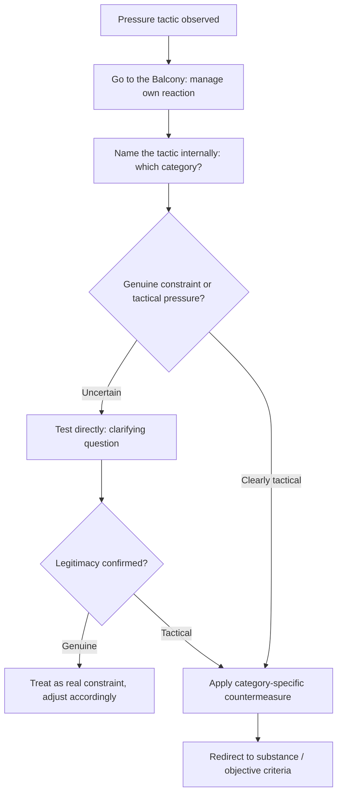

## Countering Manipulative and Hardball Tactics

### Overview

Hardball and manipulative tactics are deliberate techniques used to extract concessions by exploiting psychological pressure, information asymmetry, or procedural leverage rather than through legitimate persuasion or value-based argument. Recognizing these tactics accurately, and countering them without either capitulating or escalating destructively, is a core competency addressed extensively in the principled-negotiation tradition (particularly Fisher and Ury's treatment of "dirty tricks" in *Getting to Yes* and Ury's *Getting Past No*). This item catalogs common tactic categories and the standard countermeasures for each.

### General Principles for Countering Hardball Tactics

**Key Points**

- **Name the tactic explicitly (to yourself, and sometimes aloud)**: recognizing a specific pressure tactic as a named technique ("this is a good-cop/bad-cop tactic," "this is an artificial deadline") reduces its psychological effectiveness by converting an emotional reaction into an analytical observation.
- **Separate the tactic from the substance**: hardball tactics are process moves, not new substantive information; responding to the underlying substantive issue on its merits, rather than reacting to the pressure the tactic creates, prevents the tactic from achieving its intended effect.
- **Address the tactic directly and transparently when appropriate**: openly naming a perceived tactic to the counterpart ("it seems like we're being given an artificial deadline — can we discuss the actual timeline constraints?") can neutralize it without requiring an aggressive counter-tactic, since sunlight often reduces a tactic's effectiveness.
- **Use "Go to the Balcony" before reacting** (from *Getting Past No*): manage one's own emotional and reactive response to pressure before responding, ensuring the response is deliberate rather than driven by the tactic's intended psychological effect.
- **Distinguish tactical from genuine behavior** before countering: applying a countermeasure to a genuine constraint (mistaking a real deadline for a fabricated one, for example) can needlessly damage the relationship or credibility, making accurate diagnosis (see *Diagnosing the Sources of Impasse*) a prerequisite to effective countering.

### Category 1: Extreme Anchoring and Positional Tactics

**Key Points**

- **Extreme opening offers**: an opening position far outside any reasonable range, intended to shift the counterpart's reference point and make a subsequent, still-favorable offer seem reasonable by comparison (exploiting anchoring effects documented in behavioral decision research).
- **Countermeasure**: avoid reacting directly to an extreme anchor as if it were a legitimate starting point; instead, decline to counter-anchor from within the extreme frame, restate one's own independently derived reservation price or objective criteria, and redirect toward legitimate external benchmarks rather than negotiating "distance" from the extreme anchor.
- **Take-it-or-leave-it offers**: a final, non-negotiable-seeming offer designed to compress the counterpart's decision process and discourage counter-proposals.
- **Countermeasure**: test the offer's genuine finality (a bluffed "final offer" often is not truly final) by responding with a substantive counter-question or counter-proposal rather than immediate acceptance or rejection, and rely on independent BATNA assessment (not the tactic's framing) to determine the actual walk-away threshold.

### Category 2: Time and Deadline Pressure

**Key Points**

- **Artificial or manufactured deadlines**: imposing a false sense of urgency ("this offer expires today") to induce hasty concessions before adequate analysis or consultation is possible.
- **Countermeasure**: explicitly test the deadline's legitimacy by asking direct questions about its source and consequences of missing it; where a deadline cannot be verified as genuine, proceed at a pace appropriate to the decision's actual stakes rather than the pace the tactic demands.
- **Escalating time pressure through delay**: deliberately prolonging early-stage discussion to compress the time available for the counterpart's most consequential decisions, or scheduling critical sessions when the counterpart is known to be fatigued or under external time constraints.
- **Countermeasure**: control one's own scheduling and pacing where possible, request additional time explicitly when a decision's stakes warrant it regardless of external pressure, and avoid making consequential commitments in a single time-compressed session if better options exist.

### Category 3: Information Manipulation

**Key Points**

- **Selective disclosure and misleading framing**: presenting true but selectively chosen information to create a misleading overall impression, without technically stating falsehoods.
- **Countermeasure**: independently verify material factual claims through separate sources rather than relying solely on counterpart-provided information, and propose joint fact-finding for disputed technical or factual claims where feasible.
- **False emotional signals**: displaying manufactured anger, disappointment, or enthusiasm strategically to influence the counterpart's assessment of the negotiation's trajectory, distinct from genuine emotional reactions.
- **Countermeasure**: focus responses on the stated substantive content rather than the emotional display, and treat emotional signals as a data point to be weighed alongside, not a substitute for, verifiable substantive information.
- **Nibbling**: introducing small, incremental additional demands after apparent agreement has been reached, exploiting the psychological momentum toward closing the deal (a specific known concession-extraction tactic).
- **Countermeasure**: treat late-stage additional demands as a fresh negotiating point requiring their own justification and reciprocal consideration, rather than a minor addendum to an already-agreed deal, and consider explicitly closing negotiation on all terms simultaneously to reduce nibbling opportunities.

### Category 4: Authority and Structural Tactics

**Key Points**

- **Limited authority ("I need to check with my manager")**: a negotiator claims insufficient authority to agree to terms, using this claim to extract further concessions before "checking" — sometimes genuine (a real two-level game constraint) and sometimes a deliberate tactic to gain a second round of concessions.
- **Countermeasure**: clarify the actual decision-making authority present at the table as early as possible, before substantive concessions are made, and where a limited-authority claim appears tactical, consider requesting that the actual decision-maker participate directly, or making any offer explicitly contingent and reciprocal (matching further movement only in exchange for movement on the other side, regardless of "checking" claims).
- **Good cop / bad cop**: one member of a counterpart team adopts an aggressive, unreasonable posture while another appears more reasonable and sympathetic, aiming to make the "reasonable" counterpart's position seem attractive by contrast and to induce gratitude-driven concessions.
- **Countermeasure**: recognize the pattern explicitly as a structured tactic rather than treating team members as independently authentic; evaluate both team members' actual proposed terms on their substantive merits rather than being influenced by the relative contrast in tone between them.
- **Escalation to a different decision-maker mid-negotiation**: introducing a new negotiator with a harder line late in the process, effectively resetting prior progress and implicitly devaluing concessions already made.
- **Countermeasure**: establish and reference the substantive progress and any explicit agreements already reached, treating them as a floor for continued discussion rather than allowing a personnel change alone to reopen settled terms without new substantive justification.

### Category 5: Personal and Relational Pressure Tactics

**Key Points**

- **Personal attacks and attribution of bad faith**: directly attacking the counterpart's credibility, honesty, or competence to provoke a defensive, off-balance reaction that can lead to poor decision-making or unwanted concessions.
- **Countermeasure**: apply the "separate the people from the problem" principle directly — decline to respond in kind, acknowledge without conceding (per *Getting Past No*), and redirect firmly back to the substantive issue at hand.
- **Manufactured face threats**: publicly challenging or embarrassing a counterpart to provoke a face-driven, potentially poor decision made under social pressure rather than sound judgment.
- **Countermeasure**: where possible, move a face-threatened discussion to a private setting to reduce the social pressure driving a reactive decision, and avoid making binding commitments while under acute face pressure.
- **Guilt or obligation induction**: framing prior concessions or relationship history as creating an obligation for reciprocal concession disproportionate to their actual value.
- **Countermeasure**: evaluate any invoked "obligation" against the actual, objectively assessed value of the prior concession, rather than accepting the counterpart's framing of the debt's size at face value.

### Ethical Considerations in Countering Tactics

**Key Points**

- Effective countering of hardball tactics is generally distinguished in the literature from **retaliatory escalation**: naming and neutralizing a tactic is treated as a legitimate defensive technique, whereas responding with an equally manipulative counter-tactic risks an escalation spiral that degrades the negotiation for both parties (directly paralleling the Negotiator's Dilemma's cooperate/compete tension).
- **Preserving the relationship where future value exists**: in repeated or relational negotiation contexts, countering a hardball tactic transparently and firmly, but without personal attack, is generally more consistent with preserving long-term relationship value than either capitulating or matching the tactic in kind (see *Frameworks for Repeated and Relational Deals*).
- **Recognizing one's own susceptibility**: negotiators should assess their own vulnerability to specific tactic categories in advance (e.g., particular sensitivity to time pressure or face-threat tactics) as part of preparation, since self-awareness of one's own psychological triggers is a prerequisite to executing countermeasures effectively under real pressure.

### Illustrative Example

**Example**

During a contract negotiation, a counterpart states, "This offer is only good until the end of the day, and frankly, if your team can't move faster than this, it makes me question whether you're really serious about this deal." This combines two tactics: an artificial deadline and a mild personal-credibility attack. Rather than reacting defensively or rushing a decision, the negotiator responds: "I want to make sure we get this right rather than fast — can you help me understand what's driving the end-of-day timing specifically?" This directly tests the deadline's legitimacy without accusation, while declining to engage with or be provoked by the credibility challenge, redirecting the conversation back to substantive process. The counterpart, unable to articulate a genuine reason for the specific deadline, extends the timeline, revealing the original deadline was tactical rather than substantive.

### Diagram: Tactic Recognition and Response Sequence

### Comparison to Related Frameworks

**Key Points**

- Countermeasures in this item draw directly on Ury's five-step *Getting Past No* method (particularly Balcony, Step to Their Side, and Reframe) as the general-purpose behavioral toolkit applied to specific tactic categories here.
- Accurate tactic identification depends on the diagnostic discipline covered in *Diagnosing the Sources of Impasse*, since misclassifying a genuine constraint as a manipulative tactic (or vice versa) leads to a mismatched and potentially counterproductive response.
- The ethical distinction between countering and escalating parallels the cooperative/competitive tension formalized in the *Negotiator's Dilemma*, where matching manipulative tactics in kind tends to reduce total value and damage relationship-based future value.

### Practical Application

**Key Points**

- Prepare in advance by identifying the specific hardball tactic categories most likely to be used by a given counterpart or within a given industry, based on prior experience or available intelligence.
- Practice explicit, non-defensive scripted responses for the most common tactics (extreme anchors, artificial deadlines, limited-authority claims) so a composed response is available under real-time pressure.
- Verify claimed constraints (deadlines, authority limits) through direct, non-accusatory questions before either conceding to or confronting the claim.
- Maintain a written or mental record of concessions and agreed terms to resist nibbling and to establish a clear floor if a personnel change attempts to reopen settled issues.
- Distinguish firm, transparent tactic-naming from retaliatory escalation, particularly in relationships where continued future value is at stake.

### Related Topics

- Getting Past No: Handling Difficult Counterparts
- Diagnosing the Sources of Impasse
- Negotiating With Difficult or Irrational Counterparts
- The Negotiator's Dilemma: Creating Versus Claiming Value
- Behavioral Economics and Cognitive Biases in Negotiation
- Frameworks for Repeated and Relational Deals
- BATNA and the Ethical Use of Negotiating Power