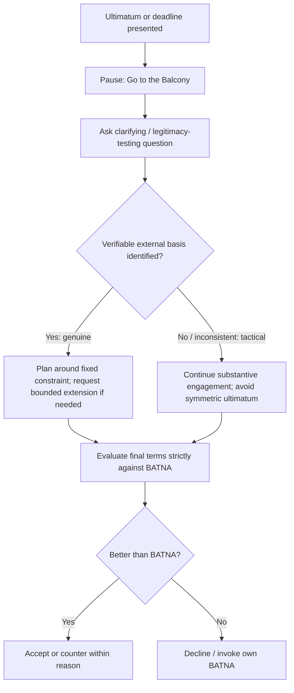

## Managing Ultimatums and Deadlines

### Overview

Ultimatums and deadlines exert a distinctive form of pressure in negotiation: they compress the decision-making timeframe and force a binary or near-binary response, often before a party has had the opportunity to fully evaluate alternatives or consult with stakeholders. This item addresses how to distinguish genuine time constraints and firm ultimatums from tactical ones, how to respond to each category without either capitulating unnecessarily or dismissing a real constraint, and how to structure one's own use of deadlines and ultimatums ethically and effectively when doing so serves a legitimate strategic purpose.

### Distinguishing Genuine From Tactical Time Pressure

**Key Points**

- **Genuine deadlines** are typically anchored to an external, verifiable event or constraint (a regulatory filing date, a fiscal year-end, a competing bid's actual expiration, a contractual notice period) whose consequences are independently confirmable and persist regardless of how the negotiation proceeds.
- **Tactical deadlines** are typically introduced unilaterally by the counterpart, lack independent verification, and often shift or soften under direct questioning — a hallmark diagnostic signal, since a genuinely fixed external deadline does not usually become negotiable simply because it is questioned.
- **Diagnostic questions** for testing a deadline's legitimacy: "What specifically happens if we don't decide by then?", "Is this date set by your organization or by an external factor?", "Would there be any flexibility if we needed a short extension to properly evaluate this?" — the specificity, consistency, and verifiability of the answers help distinguish genuine from tactical deadlines.
- **Mixed cases are common**: a deadline can be genuinely real in origin (a real board meeting date) while still being deployed tactically (implying more inflexibility around it than actually exists), so diagnosis should assess both the deadline's underlying reality and the degree of genuine inflexibility being claimed around it, rather than treating legitimacy as strictly binary.

### The Function and Risk of Ultimatums

**Key Points**

- An **ultimatum** ("agree to X or the deal is off") functions by removing the appearance of further negotiating room, aiming to convert further discussion into a simple accept/reject decision on the ultimatum-giver's terms.
- Ultimatums carry inherent risk for the party issuing them: if the counterpart calls the bluff and the ultimatum-giver was not genuinely willing to walk away, credibility for the remainder of the relationship or negotiation is significantly damaged; if the counterpart accepts a bluffed ultimatum, the issuing party may have left value on the table that further negotiation could have captured.
- Ultimatums also carry **relational cost** independent of their outcome: being presented with an ultimatum can trigger reactive resistance or perceived disrespect, particularly in relationship-sensitive or face-sensitive contexts, sometimes causing a counterpart to reject even a substantively acceptable offer specifically because of how it was delivered (a documented behavioral effect related to reactance and fairness perceptions in negotiation research).
- Because of this dual risk (both undermining future credibility if bluffed and provoking a rejection driven by delivery rather than substance), ultimatums are generally treated in the negotiation literature as a tool for genuine, carefully considered final positions rather than a routine tactic for early or mid-negotiation pressure.

### Responding to a Counterpart's Ultimatum

**Key Points**

- **Do not react immediately with a symmetric ultimatum or acceptance**: an immediate binary response validates the ultimatum's framing; taking a deliberate pause (Ury's "Go to the Balcony") allows for a more considered response.
- **Test the ultimatum's genuineness through a substantive question, not a challenge**: asking a clarifying or interest-revealing question ("Help me understand what's driving that specific requirement") shifts the interaction back toward problem-solving without directly confronting or accepting the ultimatum's binary framing.
- **Reframe rather than accept the binary choice**: propose a modification, a package alternative, or a clarifying condition that responds to the underlying interest the ultimatum is meant to protect, without simply accepting the ultimatum's stated terms wholesale.
- **If the ultimatum appears genuine, evaluate strictly against BATNA**: a credible ultimatum should be assessed the same way any other final offer is assessed — is it better or worse than the walk-away alternative — rather than being evaluated based on how uncomfortable the ultimatum format feels.
- **If the ultimatum appears tactical (bluffed), avoid outright confrontation**: rather than directly calling the bluff (which risks provoking a face-driven, entrenched response if misjudged), continue substantive engagement as though further discussion remains possible, testing the claimed finality indirectly through continued good-faith proposals.

### Managing Genuine Deadlines Constructively

**Key Points**

- **Acknowledge a genuine deadline directly and plan around it**: once a deadline is confirmed as real, treat it as a fixed parameter for process design (sequencing which issues must be resolved by when) rather than a source of ongoing dispute.
- **Front-load the most consequential decisions**: when a real deadline compresses available negotiating time, prioritize resolving the highest-stakes or most complex issues earlier in the available window, reserving simpler issues for late-stage resolution when time pressure is more acute.
- **Request a defined short extension when justified**: rather than treating a deadline as immovable by default, a specific, justified, time-bound extension request (e.g., "we need 48 hours to complete internal review") is often achievable even against a genuinely firm deadline, particularly when it demonstrates serious engagement rather than stalling.
- **Prepare fallback and partial-agreement options in advance**: for negotiations facing a hard, unmovable deadline, prepare a fallback minimal-viable-agreement structure (e.g., a short-term interim agreement covering only the most urgent terms, with remaining issues deferred to a follow-up negotiation) to avoid a forced choice between an unfavorable full agreement and no agreement at all.

### Using Deadlines and Ultimatums Ethically as a Negotiator

**Key Points**

- **Deploy only genuine deadlines and ultimatums**: consistent with the ethical framing in *Getting Past No*'s "use power to educate, not escalate," a deadline or ultimatum should reflect an actual constraint or actual walk-away threshold, not a fabricated pressure tactic, both for ethical reasons and because bluffed ultimatums that are called damage long-term credibility.
- **State the rationale transparently where possible**: explaining the genuine basis for a deadline (rather than simply asserting it) increases the likelihood the counterpart treats it as legitimate rather than tactical, and reduces the relational friction associated with ultimatum delivery.
- **Reserve ultimatums for genuinely final positions**: using an ultimatum only when truly at or near one's reservation price preserves its credibility for the specific situations where it is both accurate and strategically necessary, rather than eroding its future effectiveness through premature or exaggerated use.
- **Consider framing final positions as objective-criteria-based rather than purely willpower-based**: presenting a firm final position as following from agreed objective criteria or a clearly explained constraint (rather than as an arbitrary assertion of will) tends to reduce the reactive resistance and relational cost associated with ultimatum delivery.

### Illustrative Example

**Example**

A supplier tells a buyer, "This price is final — take it or leave it, and I need an answer by 5pm today." The buyer's negotiator, rather than accepting or rejecting immediately, responds: "I want to work with you on this — can you help me understand what's specifically driving the 5pm deadline?" The supplier reveals that a separate customer has expressed interest in the same production slot, creating a real capacity constraint (a genuine, if not fully verifiable, deadline). Rather than treating the price itself as equally non-negotiable, the buyer proposes: "We can commit to the production slot today to address the capacity timing, while leaving 48 hours to finalize a couple of remaining contract terms unrelated to the slot itself." This tests and partially validates the deadline's legitimacy (the production slot commitment) while declining to accept the ultimatum's implied bundling of an urgent capacity decision with unrelated contract terms that do not share the same time constraint.

### Diagram: Ultimatum and Deadline Response Path

### Comparison to Related Frameworks

**Key Points**

- Ultimatum and deadline management draws directly on Ury's *Getting Past No* five-step method, particularly the Balcony (emotional regulation before reacting) and Reframe (shifting from binary positional framing to interest-based problem-solving) steps.
- Diagnosing deadline legitimacy is a specific application of the broader tactic-recognition discipline covered in *Countering Manipulative and Hardball Tactics* and *Diagnosing the Sources of Impasse*.
- Evaluating any ultimatum or deadline-driven offer against one's BATNA directly applies the foundational BATNA discipline from the Seven Elements Framework, underscoring that time pressure should not be allowed to substitute for, or override, an accurate assessment of one's actual alternatives.

### Practical Application

**Key Points**

- Build a standard set of legitimacy-testing questions for deadlines and ultimatums into negotiation preparation, so they are available for immediate, composed use rather than improvised under pressure.
- Avoid making consequential final decisions within the exact timeframe an ultimatum or deadline dictates when a brief, justified extension request is a realistic option.
- Maintain an up-to-date BATNA assessment specifically so that any ultimatum or deadline-driven offer can be evaluated on its substantive merits rather than reactively.
- When issuing deadlines or ultimatums as a negotiator, reserve them for genuine constraints and near-final positions, and provide transparent rationale to maximize perceived legitimacy and minimize relational cost.
- Prepare partial-agreement or interim-agreement fallback structures in advance of any negotiation with a known genuine hard deadline.

### Related Topics

- Countering Manipulative and Hardball Tactics
- Getting Past No: Handling Difficult Counterparts
- Diagnosing the Sources of Impasse
- BATNA and Reservation Price Analysis
- The Negotiator's Dilemma: Creating Versus Claiming Value
- Behavioral Economics and Cognitive Biases in Negotiation
- Contingent Contracts and Adaptive Agreement Design