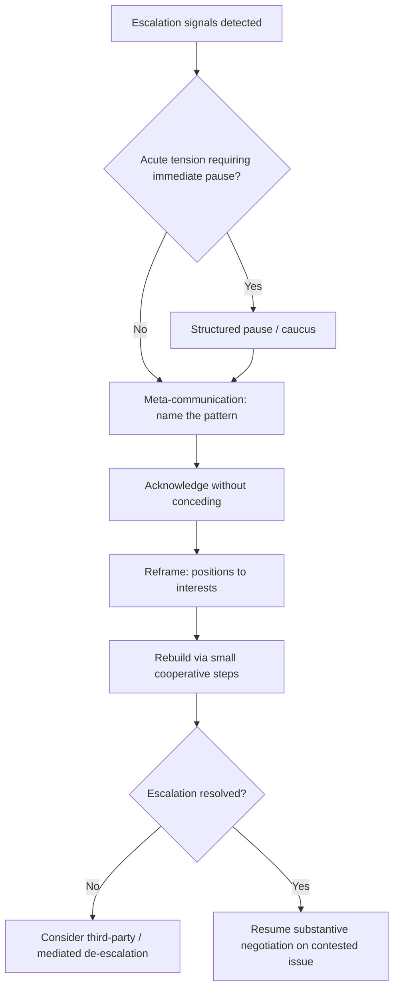

## De-escalation Techniques for Stalled Talks

### Overview

Stalled negotiations frequently arise from an escalation dynamic in which emotional reactivity, mutual negative attribution, or entrenched positional commitment compound faster than the underlying substantive disagreement warrants. De-escalation techniques are process interventions specifically designed to interrupt this dynamic and restore the conditions for productive problem-solving, distinct from the diagnostic work of identifying *why* talks stalled (covered in *Diagnosing the Sources of Impasse*) and distinct from countering deliberate hardball tactics (covered separately). This item catalogs the primary techniques for de-escalating stalled talks once an emotional or relational escalation has been identified as a contributing factor.

### Recognizing When De-Escalation (Rather Than Further Substantive Argument) Is Needed

**Key Points**

- **Signal 1 — Repetition without new information**: both parties restating the same positions with the same arguments across multiple exchanges, with no new substantive content being introduced, often indicates the blockage is no longer primarily substantive.
- **Signal 2 — Rising emotional intensity or personalization**: escalating tone, increased use of absolute language ("always," "never"), or shift from discussing the issue to discussing the other party's character or motives.
- **Signal 3 — Withdrawal or disengagement**: reduced responsiveness, canceled sessions, or communication routed increasingly through intermediaries rather than direct engagement, often reflecting accumulated frustration or a face-related retreat.
- **Signal 4 — Disproportionate reaction to a minor trigger**: a strong negative reaction to an event that seems, from an outside perspective, too small to justify the reaction's intensity — frequently indicative of an underlying face threat or accumulated grievance rather than the triggering event itself.
- Recognizing these signals early allows a shift from continued substantive argument (which tends to reinforce escalation when the underlying blockage is emotional or relational) toward de-escalation technique, before the relational damage compounds further.

### Technique 1: Structured Pauses and Caucusing

**Key Points**

- **Calling a break**: a temporary pause in joint session — even brief — interrupts the momentum of an escalating exchange and allows both parties to reduce physiological and emotional arousal before further engagement.
- **Private caucus**: separating the parties into private sessions (with or without a facilitator or mediator) allows each side to process the interaction, consult with advisors or constituents, and reconsider positions without the social pressure of the joint session.
- **Overnight or multi-day pauses for high-stakes escalation**: for serious ruptures, a longer pause (rescheduling to a following day or week) allows more substantial emotional de-escalation than a short in-session break, and provides time for informal, lower-pressure reflection.
- **Practical framing of the pause**: explicitly framing a requested break as constructive ("let's take a short break so we can come back to this with fresh perspective") rather than as a unilateral withdrawal reduces the risk of the pause itself being read as an escalatory move.

### Technique 2: Explicit Meta-Communication

**Key Points**

- **Naming the process, not just the substance**: stepping outside the substantive disagreement to discuss the negotiation's process directly ("I want to check — it feels like we may be talking past each other; can we clarify what each of us actually needs here?") interrupts escalation without requiring either side to concede substantive ground.
- **Surfacing the escalation pattern directly**: openly and non-accusatorially naming an observed pattern ("it seems like each of our responses has been getting more pointed — I don't think that's helping either of us") can create shared awareness of the dynamic and an implicit mutual incentive to interrupt it.
- **Requesting a explicit process reset**: proposing a specific structural change (a different meeting format, a change in who speaks for each side, a written rather than verbal exchange for a particularly contentious point) can break an entrenched pattern of escalating verbal exchange.

### Technique 3: Acknowledgment Without Concession

**Key Points**

- **Validating the counterpart's perspective or feeling**, directly drawn from Ury's "Step to Their Side" technique, reduces the emotional charge sustaining escalation by addressing the relational/emotional layer separately from the substantive disagreement — acknowledgment does not require agreeing with the counterpart's position.
- **Distinguishing acknowledgment from capitulation** is essential: effective acknowledgment addresses the counterpart's experience ("I can see this has been frustrating") without implicitly or explicitly conceding the underlying substantive point in dispute.
- **Active listening techniques**: reflecting back the counterpart's stated concern in one's own words (paraphrase-and-confirm) demonstrates genuine engagement and frequently reduces the perceived need for the counterpart to escalate further to be heard.

### Technique 4: Reframing Away From Positions and Attacks

**Key Points**

- Redirecting from **positions and personal characterizations** back to **underlying interests and the shared problem** (Ury's "Reframe" step) shifts the interactional frame from adversarial contest back toward joint problem-solving.
- **Interest-revealing questions** ("what would need to be true for this to work for you?", "what's driving that requirement?") redirect energy from restating positions toward generating new, potentially unexplored information.
- **Reframing personal attacks as problems to be solved jointly**: treating an accusatory statement ("you're not negotiating in good faith") as an entry point for a substantive conversation about process concerns, rather than responding defensively or with a counter-accusation.

### Technique 5: Third-Party and Mediated De-Escalation

**Key Points**

- **Neutral mediator or facilitator introduction**: bringing in a third party specifically to manage the de-escalation process can be particularly effective when the parties' own direct communication has become part of the escalation problem itself.
- **Single-text or shuttle mediation**: having a neutral party communicate between the parties (shuttle diplomacy) or draft a single evolving text based on separate input from each side can reduce direct confrontational exchange during the most escalated phase of a stalled negotiation.
- **Bicultural or subject-appropriate mediators for cross-cultural escalation**: where escalation stems partly from cross-cultural misunderstanding, a mediator familiar with both cultural frameworks can reframe each side's statements in terms legible to the other, addressing both the substantive and the cross-cultural communication layers simultaneously.

### Technique 6: Small Cooperative Steps to Rebuild Momentum

**Key Points**

- **Resuming with low-stakes, easily agreeable items**: after a significant stall, deliberately sequencing a return to negotiation through smaller, less contentious issues can rebuild a sense of joint progress and working trust before returning to the issue that triggered the stall.
- **Explicit incremental commitments**: securing small, concrete agreements (even procedural ones, such as agreeing on the next meeting's agenda) can function as evidence that cooperative engagement remains possible, countering an emerging narrative that the negotiation has become fully adversarial.
- **Documenting areas of existing agreement**: explicitly restating and confirming what has already been agreed upon, even amid a stall on remaining issues, can reduce the perceived scope of the disagreement and counter a common cognitive distortion in stalled talks where the full negotiation is experienced as failing rather than partially succeeding.

### Sequencing De-Escalation Techniques

**Key Points**

- A common practical sequence: (1) recognize escalation signals, (2) call a structured pause if tension is acute, (3) use meta-communication to surface the pattern upon resumption, (4) apply acknowledgment without concession to address the emotional layer, (5) reframe back to interests and the shared problem, and (6) rebuild momentum through small cooperative steps before returning to the originally contentious issue.
- Not every stalled negotiation requires all six techniques; the appropriate combination depends on the severity of the escalation (a mild repetitive stall may need only reframing, while a serious relational rupture may require a structural pause and third-party mediation).
- De-escalation techniques address the **emotional and relational layer** of a stall; where diagnosis (see *Diagnosing the Sources of Impasse*) reveals the stall is also substantively driven (a genuine value gap, an authority constraint), de-escalation alone will not resolve the underlying blockage and must be paired with the appropriate substantive or structural remedy.

### Illustrative Example

**Example**

A joint venture negotiation stalls after one party's negotiator states, "It's becoming clear you're not actually interested in a fair deal," prompting a defensive, similarly accusatory response from the other side, and both sides fall into restating identical positions with rising tension across two subsequent sessions (escalation signals 1 and 2). Recognizing the pattern, one negotiator proposes a short break, then upon resuming, opens with meta-communication: "I think our last two sessions have gotten more tense without actually moving the substance forward — can we take a step back?" This is followed by acknowledgment ("I understand the pace of our progress has been frustrating for your team") without conceding the disputed substantive term, and a reframing question ("What specifically would need to change about this term for it to work on your end?"). The team then deliberately confirms two smaller, already-agreed provisions explicitly before returning to the contested issue, rebuilding a sense of joint progress before re-engaging the harder question.

### Diagram: De-Escalation Technique Sequencing

### Comparison to Related Frameworks

**Key Points**

- These techniques operationalize, in a stalled-talks-specific sequence, the general emotional-regulation and reframing tools introduced in *Getting Past No* (Balcony, Step to Their Side, Reframe) and the escalation-spiral analysis discussed in *Managing Cross-Cultural Misunderstanding and Conflict*.
- De-escalation is distinct from, but often a necessary precursor to, the substantive diagnostic work in *Diagnosing the Sources of Impasse*: an escalated emotional state can prevent accurate diagnosis of the underlying substantive blockage, making de-escalation sometimes a prerequisite step rather than an alternative to diagnosis.
- Where a stall is driven by deliberate hardball tactics rather than organic escalation, the appropriate response shifts toward the tactic-specific countermeasures in *Countering Manipulative and Hardball Tactics* rather than pure de-escalation technique, underscoring the importance of accurately distinguishing organic escalation from deliberate tactical stalling.

### Practical Application

**Key Points**

- Train negotiation teams to recognize the specific behavioral signals of escalation (repetition, rising personalization, disengagement, disproportionate reactions) as an explicit trigger for shifting from substantive argument to de-escalation technique.
- Build a default option to call a structured pause into the negotiation's process norms in advance, so that requesting one mid-session does not itself appear as an unusual or escalatory move.
- Practice acknowledgment language that validates a counterpart's experience without conceding substantive ground, since conflating the two is a common failure mode under real-time pressure.
- Maintain and periodically reference a running list of already-agreed terms during a stall, to counter the cognitive distortion that the entire negotiation is failing.
- Consider third-party mediation proactively once internal de-escalation attempts have been tried without success, rather than only as a last resort after significant further relational damage has occurred.

### Related Topics

- Diagnosing the Sources of Impasse
- Getting Past No: Handling Difficult Counterparts
- Countering Manipulative and Hardball Tactics
- Managing Cross-Cultural Misunderstanding and Conflict
- Mediation and Third-Party Conflict Resolution Techniques
- Managing Ultimatums and Deadlines
- Trust Building and Reciprocity Strategies in Negotiation