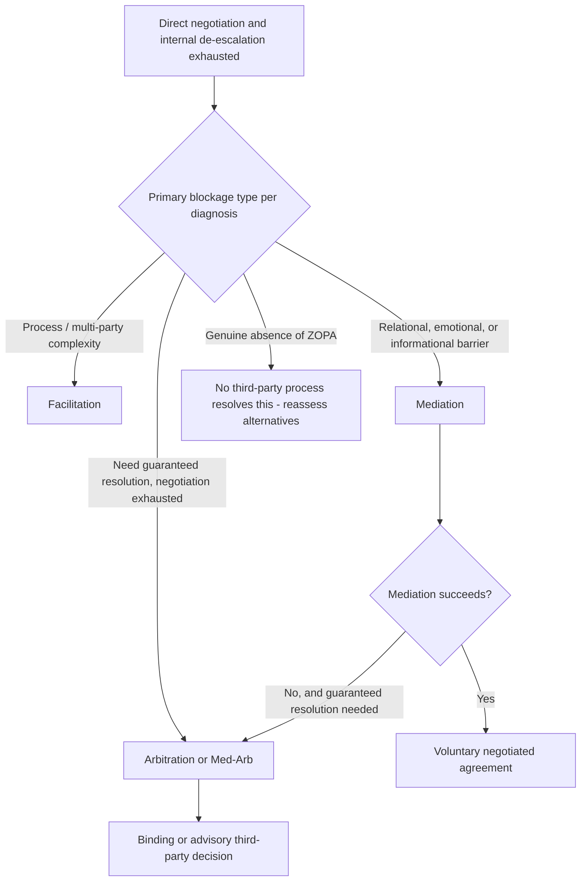

## Using Third-Party Intervention to Break Impasse

### Overview

When internal negotiation efforts — direct de-escalation, reframing, and tactic-countering — fail to resolve a stalled negotiation, introducing a neutral or semi-neutral third party is a well-established structural intervention. Third-party intervention spans a spectrum from minimal facilitation to binding arbitration, each with distinct authority levels, procedural characteristics, and appropriate use cases. This item surveys the major third-party intervention types, the diagnostic considerations for selecting among them, and the practical mechanics of introducing a third party into an already-stalled negotiation.

### The Spectrum of Third-Party Intervention

**Key Points**

- Third-party interventions vary primarily along a single key dimension: **the degree of decision-making authority the third party holds**, ranging from none (facilitation) through influence without binding power (mediation) to full binding authority (arbitration and adjudication).
- **Facilitation**: a neutral party manages the negotiation's process (agenda, turn-taking, structure) without offering substantive opinions on outcomes or proposing specific solutions; used primarily to improve communication quality and manage complex multi-party logistics.
- **Mediation**: a neutral third party actively assists parties in reaching their own voluntary agreement, often including private caucusing, reality-testing of positions, and proposing potential compromise language, but without imposing a binding outcome.
- **Arbitration**: parties submit the dispute to a neutral arbitrator (or panel) who renders a binding (or, in some designs, non-binding/advisory) decision after hearing both sides, resembling a private adjudicative process rather than a facilitated negotiation.
- **Med-Arb**: a hybrid process in which a neutral first attempts mediation, and if unsuccessful, the same (or a different) neutral is empowered to render a binding arbitral decision on any unresolved issues — combining the voluntary, interest-based benefits of mediation with a guaranteed resolution mechanism if mediation fails.

### Facilitation

**Key Points**

- Appropriate primarily for **multi-party negotiations with process complexity** rather than pure substantive deadlock — managing speaking order, ensuring all stakeholders are heard, and structuring complex multi-issue agendas (directly paralleling the Mutual Gains Approach's use of neutral conveners in public-dispute contexts).
- A facilitator's neutrality on substance (as opposed to process) is typically essential to their acceptance by all parties; facilitators who begin proposing substantive solutions risk being perceived as biased or as exceeding their role.
- Facilitation is generally a **lower-intervention, lower-cost option** appropriate when the primary blockage is procedural or communicative rather than a genuine, entrenched substantive or relational impasse.

### Mediation

**Key Points**

- Mediators typically employ techniques including: **private caucusing** (separate confidential meetings with each party to explore underlying interests and flexibility without the social pressure of joint session), **reality-testing** (helping each party realistically assess their own BATNA and the likely consequences of non-agreement), and **single-text or shuttle drafting** (the mediator drafts and iteratively revises proposed agreement language based on separate feedback from each side).
- **Facilitative vs. evaluative mediation styles**: facilitative mediators focus primarily on improving the parties' own communication and problem-solving process without offering opinions on likely outcomes; evaluative mediators may offer assessments of the relative merits of each side's position or likely outcomes if the dispute proceeded to litigation or arbitration, a more directive style appropriate in some but not all contexts.
- **Confidentiality of caucus disclosures**: information shared with a mediator in private caucus is typically treated as confidential unless the disclosing party authorizes its sharing with the other side, which is precisely what allows mediation to sometimes surface interests and flexibility that direct disclosure would risk exposing to exploitation (directly addressing the Negotiator's Dilemma by providing a lower-risk channel for value-creating disclosure).
- Mediation is particularly effective for breaking impasses driven by **relational/emotional barriers**, **informational barriers** (a mediator can identify overlapping interests neither party has directly disclosed to the other), or **face-related entrenchment** (a mediator can propose face-saving reframings that neither party could offer directly without appearing to concede).
- Mediation is generally **less effective for breaking impasses driven by a genuine absence of ZOPA** (no amount of process improvement can create an overlap in value that does not actually exist) or **purely tactical hardball behavior** by a party uninterested in genuine resolution.

### Arbitration

**Key Points**

- Arbitration substitutes a **third-party binding decision** for continued negotiation, appropriate when the parties value certainty of resolution more than control over the substantive outcome, or when negotiation has been genuinely exhausted without productive movement.
- **Binding vs. non-binding arbitration**: binding arbitration produces an enforceable decision the parties have pre-agreed to accept; non-binding (advisory) arbitration provides an authoritative third-party assessment that can inform continued negotiation without requiring the parties to accept it, often used to reality-test entrenched positions.
- **Baseball (final-offer) arbitration**: a specific arbitration design in which each party submits a single final proposed number or term, and the arbitrator must select one of the two submissions in full rather than crafting an intermediate compromise — this design creates a strategic incentive for each party to submit a reasonable, defensible position (since an extreme submission increases the likelihood of the arbitrator selecting the counterpart's more moderate submission), which can itself help de-escalate positional extremity before or during arbitration.
- Arbitration typically **sacrifices some of the flexibility and integrative potential** of a negotiated agreement in exchange for guaranteed resolution, since an arbitrator's binding decision is generally more constrained in scope and creativity than a jointly negotiated, interest-based agreement could be.
- Arbitration clauses are commonly pre-negotiated into contracts specifically as a dispute-resolution mechanism for anticipated future disagreements, distinct from ad hoc arbitration introduced only after a specific negotiation has already stalled.

### Med-Arb and Hybrid Processes

**Key Points**

- **Med-Arb** sequences mediation first, preserving the parties' opportunity to reach their own voluntary, interest-based agreement, while guaranteeing that any issues unresolved through mediation will still receive a binding resolution through arbitration — addressing mediation's core limitation (no guaranteed outcome) without fully sacrificing its interest-based, flexible problem-solving benefits.
- A key design consideration in Med-Arb is **whether the same neutral serves both roles**: using the same individual can create efficiency and continuity but risks compromising the mediation phase's effectiveness, since parties may be less willing to disclose sensitive information in caucus to a mediator who could later use that information in an arbitral role; using different neutrals for each phase avoids this risk at the cost of additional process overhead and loss of continuity.
- **Arb-Med** (the reverse sequence — arbitration decision rendered but sealed, followed by an attempt at mediated agreement, with the sealed arbitral decision applied only if mediation fails) is a less common but sometimes used variant intended to preserve mediation's voluntary character while still providing a known guaranteed fallback.

### Selecting the Appropriate Intervention

**Key Points**

- **Match the intervention to the diagnosed source of impasse** (see *Diagnosing the Sources of Impasse*): process/multi-party complexity generally calls for facilitation; relational, emotional, or informational barriers generally call for mediation; a need for guaranteed resolution despite exhausted negotiation calls for arbitration or Med-Arb; and a genuine absence of ZOPA is not resolvable through any third-party process short of one side improving their actual alternatives.
- **Consider the parties' relative preference for control vs. certainty**: mediation preserves party control over the ultimate outcome (either party can decline to accept a proposed resolution) at the cost of no guaranteed resolution; arbitration guarantees resolution at the cost of ceding outcome control to the neutral.
- **Consider relationship preservation needs**: mediation's voluntary, interest-based character is generally more conducive to preserving an ongoing relationship than arbitration's more adversarial, adjudicative posture, making mediation often preferable in relational or repeated-negotiation contexts (see *Frameworks for Repeated and Relational Deals*) where arbitration might otherwise be procedurally simpler.
- **Consider cost and time constraints**: facilitation and mediation are generally faster and less costly than formal arbitration, though this varies significantly by context, jurisdiction, and the specific process design chosen.

### Practical Mechanics of Introducing a Third Party

**Key Points**

- **Timing**: introducing third-party intervention too early (before direct negotiation has been genuinely attempted) can appear as an unwillingness to engage directly, while waiting too long can allow relational damage or entrenched positions to become significantly harder to address even with skilled intervention.
- **Joint selection of the neutral**: wherever possible, selecting a mediator or arbitrator through mutual agreement (rather than unilateral appointment by one party) is important for establishing the neutral's perceived legitimacy and acceptance by both sides.
- **Clarifying the process and authority in advance**: before beginning, parties should explicitly agree on the intervention type (facilitation, mediation, arbitration, or a hybrid), the scope of issues covered, confidentiality terms (particularly for mediation caucus disclosures), and — for arbitration — whether the outcome will be binding.
- **Managing the framing of the request**: proposing third-party intervention constructively ("I think a neutral perspective could help us find a path forward here") rather than as an implicit accusation of bad faith reduces the risk that the proposal itself is read as an escalatory or adversarial move.

### Illustrative Example

**Example**

A long-standing joint venture negotiation between two companies has stalled for several weeks over a disputed valuation methodology, with each side's internal financial models producing significantly different results and increasing mutual suspicion about the other's good faith. Direct negotiation and internal de-escalation attempts have not resolved the impasse. Rather than proceeding to formal binding arbitration (which would sacrifice the flexibility both parties want to preserve for the broader relationship), the parties jointly select a neutral valuation expert to serve as a mediator, empowered to conduct private caucuses with each side's financial team to understand the specific assumptions driving the divergent models, and to propose a jointly acceptable valuation methodology. Because the disclosures made in caucus remain confidential unless authorized for sharing, each side is willing to reveal the actual sensitivities in their models that they had been reluctant to disclose directly to the counterpart, allowing the mediator to identify a mutually acceptable methodology that neither side could have proposed unilaterally without appearing to concede ground.

### Diagram: Third-Party Intervention Selection Path

### Comparison to Related Frameworks

**Key Points**

- Third-party intervention selection depends directly on the diagnostic categories established in *Diagnosing the Sources of Impasse*; mismatching the intervention type to the actual source of impasse (e.g., pursuing mediation for a genuine ZOPA absence) tends to produce continued deadlock regardless of the neutral's skill.
- Mediation's caucus confidentiality mechanism directly addresses the structural tension described in the *Negotiator's Dilemma*, providing a lower-risk channel for the value-creating disclosure that direct bilateral communication may not safely support.
- The Mutual Gains Approach's use of neutral conveners and single-text mediation in multi-party public disputes represents a specific, well-developed application of the facilitation/mediation intervention types described here, tailored to multi-stakeholder complexity.

### Practical Application

**Key Points**

- Diagnose the specific source of impasse before selecting an intervention type, rather than defaulting to mediation or arbitration reflexively for any stalled negotiation.
- Propose third-party intervention as a constructive, jointly beneficial option rather than as an implicit criticism of the counterpart's negotiating behavior.
- Where relationship preservation is a priority, favor mediation or Med-Arb over pure arbitration when both remain viable options for the specific impasse type.
- Establish confidentiality terms for any caucus-based process explicitly in advance, since the willingness to disclose sensitive information in caucus depends on confirmed confidentiality protections.
- For anticipated future disputes in an ongoing relationship, consider pre-negotiating a dispute-resolution clause (e.g., a Med-Arb process) into the governing agreement itself, rather than negotiating the intervention type only after a specific dispute has already arisen.

### Related Topics

- Diagnosing the Sources of Impasse
- The Mutual Gains Approach
- The Negotiator's Dilemma: Creating Versus Claiming Value
- De-escalation Techniques for Stalled Talks
- Frameworks for Repeated and Relational Deals
- Mediation and Third-Party Conflict Resolution Techniques
- Contingent Contracts and Adaptive Agreement Design