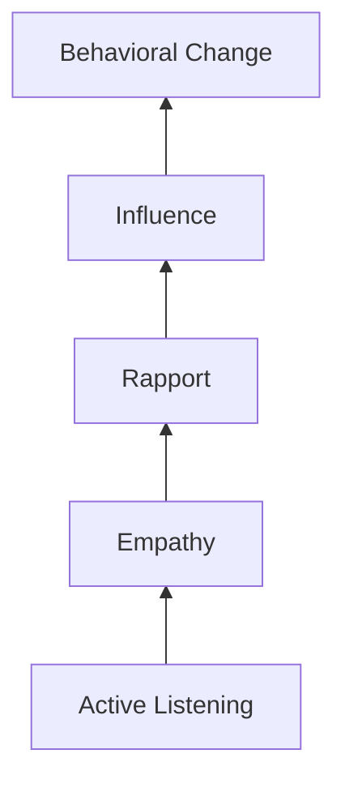

## Principles of Crisis and Hostage Negotiation

### Overview

Crisis and hostage negotiation is a specialized negotiation domain developed primarily within law enforcement contexts (notably formalized by the FBI's Crisis Negotiation Unit) to address situations involving acute danger to life, extreme emotional distress, and severely compressed or entirely absent normal bargaining conditions. Unlike commercial or diplomatic negotiation, the immediate priority is not reaching an optimal substantive agreement but **preserving life and safely de-escalating an acute crisis**, with substantive resolution treated as a secondary and often much later objective. This item covers the foundational principles, communication models, and behavioral frameworks that distinguish crisis negotiation from standard negotiation theory, while noting where its techniques have influenced broader negotiation practice.

### Core Priorities and Objectives

**Key Points**

- **Primary objective: preserve life**, for hostages, bystanders, responding personnel, and the subject in crisis themselves — this priority supersedes all other negotiation objectives, including securing a subject's surrender, obtaining information, or achieving any specific substantive outcome.
- **Time as an ally, not an enemy**: unlike commercial negotiation where delay can be costly, crisis negotiation deliberately extends time wherever safely possible, since extended time allows emotional intensity to decrease, allows the negotiator to build rapport, and allows tactical/operational options to develop without the immediate binary of maintaining status quo or acting.
- **De-escalation before problem-solving**: crisis negotiation explicitly sequences emotional de-escalation as a necessary prerequisite before any substantive problem-solving becomes possible, reflecting the recognition that a subject in acute crisis is often not in a psychological state capable of rational bargaining until emotional intensity has been reduced.
- **The subject's underlying crisis, not stated demands, is usually the primary target of intervention**: many crisis situations are not fundamentally about the stated demands (money, transportation, media attention) but are expressions of an underlying personal, psychological, or relational crisis, and effective negotiation focuses substantially on addressing the underlying crisis state rather than solely on the stated demand.

### The Behavioral Change Stairway Model

**Key Points**

- The **Behavioral Change Stairway Model (BCSM)**, developed by the FBI's Crisis Negotiation Unit, describes a sequential process through which crisis negotiators aim to move a subject toward voluntary behavioral change: **Active Listening → Empathy → Rapport → Influence → Behavioral Change**.
- **Active Listening**: the foundational skill enabling all subsequent stages, involving techniques such as minimal encouragers, paraphrasing, emotion labeling, mirroring, and open-ended questions to demonstrate genuine attention and understanding of the subject's communication.
- **Empathy**: conveying genuine understanding of the subject's emotional state and perspective (distinct from sympathy or agreement with the subject's actions or demands), which the model identifies as the mechanism through which trust begins to form.
- **Rapport**: a working relationship characterized by the subject's willingness to continue engaging and communicating with the negotiator, built cumulatively through sustained active listening and empathy rather than through any single technique.
- **Influence**: only once rapport is established does the negotiator have the standing to meaningfully influence the subject's perspective or decisions; attempts at influence prior to established rapport are generally far less effective and can backfire by increasing resistance.
- **Behavioral Change**: the model's terminal objective — the subject voluntarily changes behavior (releasing hostages, surrendering, stepping back from self-harm) as a result of the trust and influence built through the preceding stages, rather than through coercion.
- The model is explicitly **sequential and foundational**: skipping stages (attempting to influence before rapport is established, or attempting rapport-building without genuine active listening) is identified as a common and significant error, since each stage's effectiveness depends on the prior stage having been genuinely achieved.

### Active Listening Techniques in Crisis Negotiation

**Key Points**

- **Minimal encouragers**: brief verbal cues ("I see," "go on," "mm-hmm") that signal continued attention and encourage the subject to keep communicating without interrupting their narrative flow.
- **Paraphrasing**: restating the subject's message in the negotiator's own words to demonstrate accurate understanding and to give the subject an opportunity to correct any misunderstanding.
- **Emotion labeling**: explicitly naming the emotion the negotiator perceives the subject to be experiencing ("it sounds like you're feeling really cornered right now") — a technique specifically emphasized in crisis negotiation training for its role in helping subjects feel understood and in providing the subject language for their own emotional state.
- **Mirroring**: repeating back the last few words or key phrase of the subject's statement, encouraging further elaboration without directing the conversation, a technique also used more broadly in some commercial negotiation training derived from crisis negotiation practice.
- **Open-ended questions**: questions that invite elaboration rather than yes/no responses, used to gather information about the subject's state and situation while continuing to build engagement.
- **Effective pauses and silence**: allowing silence after a subject's statement rather than immediately filling it, giving the subject space to continue or elaborate rather than prompting a defensive or curtailed response.

### Distinctive Structural Features of Crisis Negotiation

**Key Points**

- **The negotiator is typically not the decision-maker**: in most formal crisis negotiation team structures, the primary negotiator communicates with the subject but does not make tactical or operational decisions unilaterally; a separate command structure (often including a negotiation team leader, tactical commander, and mental health consultant) makes decisions collaboratively, with the negotiator's role focused specifically on communication and relationship-building.
- **Team-based approach**: crisis negotiation is typically conducted by a team rather than an individual, often including a primary negotiator, a secondary negotiator (providing real-time support and monitoring), an intelligence/information coordinator, and a team leader coordinating with tactical and command elements.
- **No unilateral concessions without team coordination**: because the negotiator operates within a broader command structure, individual promises or concessions are generally coordinated with the team and command structure before being offered, rather than negotiated unilaterally as an individual might in commercial contexts.
- **High emotional and physiological stakes for all parties**: crisis negotiation occurs under conditions of acute stress for the subject, hostages, and often the negotiator, requiring specific training in managing one's own physiological and emotional response under sustained high-stakes pressure.

### Managing the Subject's Underlying Crisis State

**Key Points**

- **Assessing the subject's emotional and psychological state** is treated as an ongoing, continuously updated diagnostic task throughout the negotiation, since a subject's state can shift significantly over the course of an extended incident.
- **Instrumental vs. expressive crises**: a distinction commonly drawn in the literature between crises with primarily instrumental objectives (a hostage-taker seeking money, transportation, or a specific concrete outcome) and expressive crises (where the underlying driver is emotional distress, suicidal ideation, or a psychological crisis, and the ostensible "demands," if any, are secondary to the emotional state itself) — this distinction significantly shapes negotiation approach, since expressive crises generally require substantially more emphasis on the Behavioral Change Stairway's earlier stages before any substantive discussion becomes productive.
- **Addressing suicidal ideation directly and carefully within the specialized crisis-negotiation context** is a distinct professional skill requiring specific training beyond general negotiation technique, and situations involving explicit suicidal or self-harm risk require this specialized approach rather than general negotiation methods.
- **Avoiding false promises**: crisis negotiators are trained to avoid making commitments they, or the broader response structure, cannot or will not honor, since a broken promise during a crisis situation can severely and often irreparably damage the trust the entire process depends on.

### Influence Techniques Once Rapport Is Established

**Key Points**

- **Presenting realistic consequences without threat**: helping a subject understand the actual likely outcomes of different choices, framed informationally rather than as a threat or ultimatum, parallels the "use power to educate, not escalate" principle found in *Getting Past No*.
- **Offering face-saving paths toward de-escalation**: helping a subject find a way to change course (surrender, release of hostages) that does not require an experience of total defeat or humiliation, directly paralleling the "Golden Bridge" concept from broader negotiation theory, adapted to the acute crisis context.
- **Incremental behavioral requests**: rather than seeking a single large behavioral change (full surrender) immediately, requesting small, incremental changes (releasing one hostage, allowing a phone call, agreeing to a brief pause) that build momentum and demonstrate the subject's capacity for cooperative behavior.
- **Reinforcing any cooperative behavior immediately and genuinely**: providing clear, immediate positive acknowledgment when a subject takes any step toward de-escalation, reinforcing the behavior pattern the negotiation is attempting to encourage.

### Illustrative Example

**Example**

A crisis negotiator responds to a barricade situation involving a distressed individual who has made vague, non-specific statements suggesting despair rather than any concrete instrumental demand. Rather than immediately probing for demands or attempting to resolve the situation quickly, the negotiator spends an extended period using active listening techniques — minimal encouragers, paraphrasing, and emotion labeling ("it sounds like you're feeling like nobody's been listening to you") — without attempting any direct influence or requesting any behavioral change. Over an extended period, as rapport develops (evidenced by the subject's increasing willingness to share personal context and reduced hostility in tone), the negotiator begins gently introducing small requests (asking the subject to move away from a window, offering water), each of which is met with growing cooperation, eventually leading to a peaceful resolution achieved through incremental trust-building rather than through any single decisive negotiating move.

### Diagram: The Behavioral Change Stairway Model

### Comparison to Broader Negotiation Theory

**Key Points**

- Crisis negotiation's emphasis on sequencing emotional engagement before substantive influence directly parallels, and substantially predates in formalized practice, the emotional-regulation and rapport-building emphasis found in later broader negotiation frameworks such as Ury's *Getting Past No*; several core techniques (active listening, acknowledgment without concession, face-saving paths) appear in both domains, with crisis negotiation representing a more extreme, high-stakes application of similar underlying principles.
- Unlike most negotiation frameworks covered elsewhere in this material, crisis negotiation explicitly **subordinates the substantive outcome to the preservation-of-life objective**, meaning standard negotiation concepts such as BATNA-based value-maximization or integrative trade-off construction are secondary to, and often largely inapplicable within, the acute phase of a crisis incident.
- The team-based, non-unilateral-decision-maker structure of formal crisis negotiation contrasts with most commercial and diplomatic negotiation models, where the negotiator typically holds more direct authority over the specific commitments offered during the interaction.

### Practical Application

**Key Points**

- Recognize that crisis negotiation principles and techniques (active listening, emotion labeling, incremental behavioral requests) generalize usefully to non-crisis high-emotion negotiation contexts, but the overriding life-preservation objective and specialized team structure of formal crisis negotiation are domain-specific and should not be assumed to transfer directly.
- Situations involving genuine risk of self-harm, suicide, or hostage-taking require response by trained crisis negotiation professionals and appropriate emergency services rather than general negotiation technique.
- Where crisis-negotiation-derived techniques (active listening, emotion labeling) are applied in non-crisis high-stakes negotiation, maintain the same sequencing discipline: build genuine rapport before attempting influence, rather than skipping directly to persuasion.
- Avoid making commitments during any high-stakes, high-emotion negotiation that cannot be reliably honored, since the trust-preservation principle central to crisis negotiation applies broadly to any negotiation where credibility, once broken, is difficult to rebuild.

### Related Topics

- Getting Past No: Handling Difficult Counterparts
- Active Listening and Reframing Techniques
- De-escalation Techniques for Stalled Talks
- Emotional Regulation and De-Escalation Tactics in Negotiation
- Managing Cross-Cultural Misunderstanding and Conflict
- Negotiation Team Composition and Role Design
- BATNA and the Ethical Use of Negotiating Power